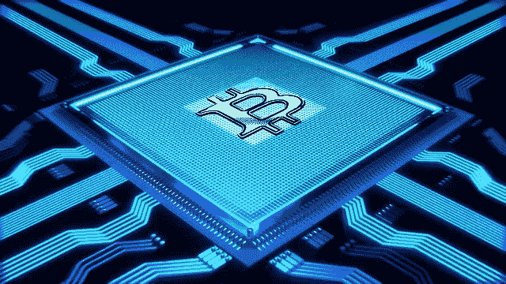

# 什么是加密挖掘；初学者指南

> 原文：<https://medium.com/coinmonks/what-is-crypto-mining-a-guide-for-the-beginner-723e8749f7fa?source=collection_archive---------1----------------------->

Image by [Pete Linforth](https://pixabay.com/users/TheDigitalArtist-202249/?utm_source=link-attribution&utm_medium=referral&utm_campaign=image&utm_content=3369039) from [Pixabay](https://pixabay.com/?utm_source=link-attribution&utm_medium=referral&utm_campaign=image&utm_content=3369039)

挖掘的概念是加密货币存在的核心。换句话说，没有挖掘，加密货币就不可能存在。要理解什么是挖掘以及它所扮演的关键角色，首先需要理解加密货币是如何运作的。

我们需要选择一个用于插图。在这方面，没有比比特币更好的了。它是有史以来第一种加密货币，拥有最大的市值，也是全球使用最多的货币。

比特币是一种数字货币。意思是，它只存在于电脑和其他电子设备中。而且只能通过互联网发送和接收。

现在，加密货币并不是现存的唯一数字货币。事实上，自 70 年代银行和金融机构开始采用计算机管理记录以来，我们已经有了某种形式的数字货币。

如今，在瑞典和大多数其他斯堪的纳维亚国家，使用实物现金(硬币和钞票)结算的交易不超过 20%。与此同时，中国正在成为最大的无现金经济体，因为它大规模采用移动支付方式。

# 交易分类账

像比特币这样的加密货币只是一种特殊的数字货币。有几件事让它们有别于其他数字货币。其中最重要的是如何存储、更新和保护*交易分类账*。

交易分类账是谁在什么时间拥有什么价值的记录。如果您通过银行电汇、PayPal 或任何其他数字支付方式向另一个城市、州或甚至国家的某人汇款，则必须更新一个分类账(或多个分类账)以反映您的交易情况的变化。

您的银行账户余额将被扣除您发送的金额。与此同时，收款人账户中的金额必须增加相同的差额。如果交易发生在同一家银行，那么我们可以假设只对同一分类账进行更新。然而，如果这笔钱必须通过几家银行(或实体)，那么，当然，几个分类账必须更新。

通过商业银行以及集中式在线支付和汇款服务，该分类帐由公司托管、维护和保护。换句话说，银行或在线支付服务必须购买或租赁一台服务器来存放分类账。他们还必须雇用出纳员(人和机器)在用户每次发送、接收、存款或取款时更新分类账。

此外，考虑到涉及的金额，金融机构要花很多钱来保护它们的账簿。根据一项研究，银行和其他金融机构每年在每位员工身上花费高达 3000 美元，以防止他们成为犯罪分子获取交易账簿的漏洞。这相当于摩根大通获得约 7.5 亿美元，美国银行获得 6 亿美元。

这一成本是合理的，因为有许多罪犯会不择手段地访问银行的账本，以便编辑它，并在此过程中奖励自己不应得的钱(也称为黑客行为)。

事实上，有几次他们成功了，银行和其他金融机构[每年损失超过 2000 亿美元](https://www.technologyreview.com/2018/01/23/146077/hackers-stole-172-billion-from-people-in-2017/)。

# 谁托管、更新和保护交易分类账？

比特币等加密货币也有分类账。否则，我们怎么知道谁在什么时间拥有什么价值呢？这些加密货币账簿被称为*区块链*。之所以这么叫，是因为交易是成批记录的，称为块。

与基于菲亚特的数字支付方法不同，加密货币没有银行或公司等中央实体来(1)托管分类账(2)更新分类账以反映新的交易，以及(3)保护它免受可能的黑客攻击。

尽管如此，加密货币分类账是托管的、更新的，并且是充分安全的。事实上，这就是区块链技术的精髓所在。

加密货币分类账由核心支持者社区通过共识托管、维护和保护，他们形成了一个对等网络。这些核心支持者中的每一个都在他们的电脑上保留了一份账本。在比特币的例子中，所有核心支持者每隔十分钟就会同步他们的账簿，以反映新的交易。

将新交易添加到共享账本并同步所有核心支持者保留的副本的过程被称为*挖掘*。参与这一过程的核心支持者和他们的专用计算机都被称为加密矿工。

# 那么挖掘究竟是如何发生的呢？

对等网络上的矿工可以通过许多方式就共享总账的状态达成共识。在比特币的情况下，共识是通过矿工竞争进行计算以找到指导该过程的算法所提供的值来实现的。

比特币使用的这种共识机制被称为*工作证明* (PoW)。本质上，它涉及参与的计算机做一些工作，同时竞争找到算法定义的值。

为了参与竞争，每个*矿工*在大约 10 分钟的时间内接受用户提交的所有交易，并创建一个*块*(一批)。在区块中，矿工还包括一个特殊的交易，在这个交易中，他们给自己分配指定数量的新硬币(稍后将详细介绍)。

然后*散列(计算)*块中事务的数据，以找到指定的值。第一个获得该值的矿工将其交易块标识为分类帐中的下一个块(区块链)。其他所有人都会同步他们的分类帐副本以包含它。这一过程不断重复，每次都有不同的矿工胜出。

# 采矿奖励

获胜者可以保留他们分配给自己的新硬币。这个数量的新硬币被称为采矿奖励，它是 6.25 个比特币——然而，每四年奖励就会减半。事实上，最近一次比特币奖励减半发生在本周。

从 2016 年到本周，一名获胜的矿工每十分钟可以赚 12.5 个比特币。下一次减半将发生在 2024 年。这种减半的过程将持续到不再有奖励时，因为将会有 2100 万个比特币被挖掘出来(这将是 2140 年的某个时候)。到那时，主要矿商的收入将来自用户支付的费用(交易费)。

自 2009 年比特币推出以来，用户一直在支付交易费用，但这是在自愿的基础上。然而，那些附加了费用的人通常在那些没有附加任何费用的人之前将他们的交易包括在下一个块中。尽管如此，最终，提交给网络的每一笔交易都会得到确认。

然而，随着时间的推移，这些费用可能会成为强制性的，因为这将激励矿工保持他们的机器运行，以便账本被托管、维护和保护。需要指出的是，在比特币的例子中，除了激励矿工，采矿奖励还有另一个功能。通过它，新的硬币开始流通。

# 采矿的能源成本

*散列*过程(因为交易数据的计算是已知的)消耗大量能量，并且实际上支付电费是主要的成本项目。事实上，这就是为什么需要通过新铸造硬币的奖励和用户支付的交易费来激励矿商。

这一收入不仅满足了电费的需求，而且还收回了购买和安装硬件的费用。当然，理想情况下，它应该为矿商带来利润。

需要强调的是，比特币开采是能源密集型的，事实上，比特币网络消耗的电量估计相当于瑞士这样的小国消耗的电量。比特币挖矿产生的计算机能力使其网络(一个单元)成为最强大的计算机。

事实上，人们一直担心，特别是比特币开采，会大大增加温室气体排放，从而加剧气候变化问题。

# 随时间的转变

然而，比特币并不总是能源密集型的。随着时间的推移，矿工之间的竞争迫使他们升级到更耗能的硬件。在早期，一个典型的 CPU 桌面足以让一个人参与比特币挖矿并获得可观的报酬。

一些人发现使用图形处理器(GPU)比使用普通台式机更有优势。今天，如果你不使用运算能力非常高的 *ASIC 矿工*，你就没有任何机会获得采矿奖励。

要有更好的机会，你需要积累很多，这可能要花很多钱。一个比特币 ASIC 挖矿机的成本超过 3000 美元。即使有几个，你可能需要加入一个矿池来产生有意义的收入。

# 采矿选项

矿池是一组矿用计算机，在比特币网络中充当一个单元。考虑到一个矿池可以汇集的资源量，它在采矿竞争中获胜的几率非常高。

矿池产生的奖励根据每个成员贡献的计算机能力在成员之间共享。在你投资任何矿池之前，你需要做大量的尽职调查，确定他们的可信度，以及他们如何分享他们的收入。

如果你真的有兴趣加入采矿业，你还有另一个选择，那就是从已经建立采矿业务的公司那里购买采矿能力。这通常被称为虚拟采矿。然而，你应该意识到这是一个有风险的选择。

尤其是因为你很容易被骗。一些实体在网上经常声称他们有一个意图诈骗的采矿业务。他们邀请投资者投入资本分享收益，却不兑现承诺。不幸的是，通常很难证明一个虚拟采矿平台是合法的，还是只是对你付费感兴趣，然后他们带着你的钱消失了。

一个安全得多的选择是挖掘不需要你有大量计算能力的加密货币。这可能是因为他们的协议禁止使用高容量计算机(特别是 ASIC 矿商)，或者他们还处于早期，拥有大量资本的主要参与者还没有开始开采它们。

您还可以挖掘使用不使用工作证明的挖掘协议的加密货币。不消耗能源也不需要投资专门设备的工作证明的最常用替代方法是股份证明(PoS)。

有了这种共识机制，矿工们不需要通过散列数据来寻找价值，而是将他们已经赚到的硬币的一部分放在一个特殊的钱包里。然后，该算法从其中随机选取节点来维护分类帐。

事实上，甚至一些最初设计为使用 PoW 的加密货币现在也在积极考虑转向 PoS。以太坊就是这样一种加密货币。通过名为 Casper 的升级，市值第二大的加密货币预计将在今年晚些时候进行转换。

加密货币开采领域也有新的重大发展。正如我们所看到的，在很大程度上，社区的一些成员提供了托管、维护和保护分类帐所需的资源。麻烦的是，他们可以保留新发行的硬币(以及用户支付的费用)。

但是现在有了像“纠结”这样的协议，IOTA 区块链使用它。有了这个共识协议，每个用户基本上都是矿工。每个在网络上发送交易的人都应该在他们的交易被确认之前首先确认其他人的交易。这就消除了采矿作为商业企业的元素。我们真的不知道这种新的采矿协议将如何改变行业的发展

总之，采矿仍然是大多数加密货币的关键要素。因为除了帮助托管、维护和保护交易分类账，它还是新硬币发行流通的手段。

> [在您的收件箱中直接获得最佳软件交易](https://coincodecap.com/?utm_source=coinmonks)

