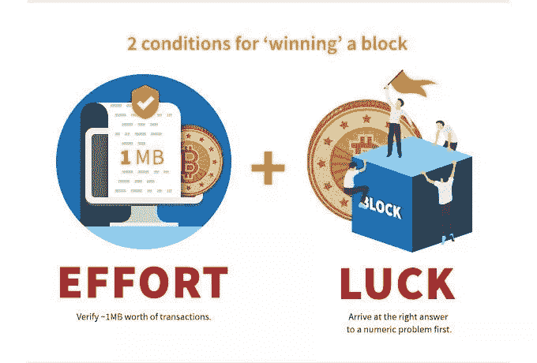

# 什么是加密货币挖掘

> 原文：<https://medium.com/coinmonks/what-is-cryptocurrency-mining-3f8a02fb0887?source=collection_archive---------3----------------------->

## 分解术语“采矿”的组成部分

Source: [btcwires](https://www.btcwires.com/round-the-block/is-bitcoin-mining-profitable-on-a-laptop/)

当我还是一个 7 年级学生的时候，我已经被卷入了加密货币的世界。起初，我认为这简直是一个免费的货币发生器，如果我让我的笔记本电脑像风轮机一样运转加密采矿软件，它就会给我免费的加密货币。

最后，我的笔记本电脑确实产生了密码，然而，非常非常少的密码。

我用笔记本电脑做的事情本质上是“密码挖掘”。

# “采矿”

你可能听说过加密货币[比特币](https://blog.coincodecap.com/a-candid-explanation-of-bitcoin)以及一个与此类加密货币相关的术语“采矿”。

加密货币挖矿，简单来说就是矿工或个人使用自己的设备从事支持区块链网络的“工作”以获得加密货币奖励的过程。

Sketch of a Small P2P network on onenote

如果你不熟悉区块链:它是一个网络分布式记录或分类帐，记录那些与网络相连的人的行动。因此，对于加密货币的区块链网络，区块链将记录网络上个人的交易。你也可以看看我在[之前写的关于区块链结构的文章](https://jerryq0101.medium.com/the-upcoming-blockchain-revolution-5cc0df5434b8)。

在这篇文章中，我将使用比特币作为加密货币的例子来解构挖掘背后的意义。

回到矿工“工作”的话题。为了让矿工获得比特币奖励，矿工必须做的简单“工作”就是验证比特币区块链上的交易。

在验证中，矿工将执行一系列检查，以确保所分配的交易是合法的，并且交易参与者不会试图两次花费相同数量的加密货币。例如，当 Joe 向 Brandon 发送 12 个比特币，而 Brandon 试图向 Tony 发送 7 个比特币和 Max 8 个比特币时，这将被视为欺诈交易，因为 7 + 8 > 12。我刚才给出的情况是“[双重消费问题](https://www.investopedia.com/terms/d/doublespending.asp)”的一个例子:Brandon 试图花同样的比特币两次。

在矿工验证了大约 0-4 兆字节的比特币交易(大约 1500-3000 笔交易)之后，相当于一个区块的最大大小。为了赚取比特币奖励，他们已经完成了较容易的一半工作。然而，验证之前的任务是最复杂的，这使得矿工有资格验证交易。

# 采矿的运气部分

通过第一个解决字符串序列的计算，也称为创建工作证明。对于矿工来说，创建工作证明是计算工作量最大的过程。(我将在下面的后面部分解释为什么它被称为工作证明)

为了理解工作证明算法，您必须首先熟悉区块链的术语“散列”。

网络检测区块链块中篡改的方式是通过它的散列；由块中的信息定义的一长串数字和字符。通过将数据通过哈希函数，如比特币使用的 [SHA-256](https://xorbin.com/tools/sha256-hash-calculator) ，它会生成一个特定于特定输入的序列。也就是说，如果输入数据中有一个字符发生了变化，那么输出散列将会完全改变。另外，hash 是一个可加密但不可解密的结果，因此，它不能用于获取原始数据，而**只是作为一种验证 hash 的输入数据是否相同的方法。**

创建工作证明需要矿工运行哈希算法来“猜测”问题的合适答案。对于比特币区块链网络，矿工必须首先创建一个符合某一组要求的哈希，这被称为“目标哈希”。

猜测目标散列的必要信息驻留在新块的块头中。包含:块版本号、时间戳、前一个块的散列和目标散列。

Sketch of the guessing process on onenote

目标哈希的答案是由**取前一个块的哈希，当前块事务数据，加上一个 0-4，294，967，296 的整数(称为**[**nonce**](https://en.bitcoin.it/wiki/Nonce)**)**生成的，放入哈希算法中。

如果答案满足目标散列的要求，则块被添加到区块链，并且 ***首先*** 验证交易并计算出被添加到块的散列中的随机数的矿工获得比特币奖励。否则，他们会继续寻找有效的随机数。

由于散列算法的随机性，确定满足目标散列的[随机数](https://en.bitcoin.it/wiki/Nonce)需要大量的随机猜测。

Source: [Investopedia](https://www.investopedia.com/tech/how-does-bitcoin-mining-work/)

尽管试图自己找到随机数已经相当困难，**在同一个网络**上还有≥百万的其他个人与你竞争，使得一个个人设备获得比特币奖励的机会类似于赢得彩票。但是，您可以求助于**来提高处理能力或使用多个设备，以便获得更快的哈希速率**(单位包括:KH/s、MH/s、GH/s 等)。

术语散列率可以解释为一个或一组设备猜测数字和验证交易的速度(是计算能力的一种度量)。

# 共识机制

像比特币区块链这样没有权威人物的去中心化 P2P 网络，只能基于不同的共识机制做出决策。共识机制的目的在于挖掘和交易验证。

Source: [Wikipedia](https://en.wikipedia.org/wiki/Peer-to-peer)

共识机制有许多变体，但它们都服务于一个目标:“**核实并确保记录真实可信**”(来源:[亚洲科技](https://www.youtube.com/watch?v=ojxfbN78WFQ))。

有**三个**主要机制:*工作证明，利害关系证明，权限证明*。在本文中，我将重点介绍共识工作方法的证明。

我们已经讨论了采矿，它总结了工作证明模型如何工作:**个人首先必须*创建工作证明*，然后他们*验证 BTC 交易*并确保区块链中的记录是真实的**。然而，让我们深入研究一下在交易验证之前的工作证明的目的。

# 工作证明的历史和目的

1993 年，Cynthia Dward 和 Moni Naor 在一篇论文([关于对抗垃圾邮件的内存绑定函数](http://www.wisdom.weizmann.ac.il/~naor/PAPERS/pvp_abs.html))中提出了工作证明的想法，解释了阻止垃圾邮件的不同方法。这篇论文关注的是通过计算能力发送电子邮件的想法。

例如，如果你想通过电子邮件给我发送一条信息，那么你必须证明你已经花费了，比如说，30 秒的计算能力，仅仅是为了给我发送这条信息。

由于现代计算机的速度很快，在这种情况下，滥发信息/电子邮件/交易成为一个大问题。但是，通过为每一项行动设定“工作价格”来减少垃圾邮件，垃圾邮件就大大减少了。

Door key example for verifying hardwork on onenote

简而言之,“证明者”向“验证者”证明他们在一定的时间间隔内投入了一定的计算能力。

随着时代的发展，比特币的创造者“中本聪”修改了矿工产生数据/随机数的想法，这是困难的部分。网络上的**其他人也很容易验证**它确实满足目标散列，因为他们只需通过 SHA-256 算法输入所需的数据。

通过这种工作证明系统，像区块链这样的区块链系统能够确保安全并建立一个经过验证的共识，因为实际验证区块**的设备将投入巨大的计算能力**来这样做。这给了电视网一个保持公平和诚实的经济理由。

*如何？*
例如，如果欺诈交易发生并获得批准，用户会变得“犹豫不决”，并转向另一种加密货币，**降低价格**。从经济上来说，矿商——生产比特币的人——会因为价格下跌而不高兴。与此同时，只有控制矿工有足够的计算能力来触发欺诈性验证。因此，**矿商的动机转向保护交易，以确保硬币的价格不会下跌**。

# 工作证明机制的缺点

虽然一些最大的加密货币(BTC、瑞士联邦理工学院等)正在使用工作证明，但这并不意味着它是最有效和最安全的系统。

Source: [BBC](https://www.bbc.com/news/technology-48853230)

## 功率消耗

检查工作证明过程**需要大量的处理**，因为计算机只是通过[蛮力](https://www.freecodecamp.org/news/brute-force-algorithms-explained/)猜测所有可能性的正确答案。浪费大量电力和资源。在更大的范围内，想象一下世界各地所有试图“开采”比特币奖励的矿工，如果他们不首先猜测随机数，就会浪费资源，甚至不会对网络做出贡献。

## 违背了分权的理念

由于采矿的巨大电力成本，**矿工们建立了中央采矿场，控制了大部分的区块核查。这几乎使 P2P 去中心化的想法变得无用，因为这意味着只有控制的矿工会同意攻击网络。**

电费也促使矿工聚集在电费更低、利润更高的地方进行开采。**决策“权”集中。**

# 工作证明的替代方案

如上所述，有其他共识机制能够取代 PoW。*股权证明、授权证明、能力证明*。

***利害关系证明*** 通过验证者钱包中的加密货币数量确定交易验证者。

例如，想象一群人购买彩票。买最多票的人将有更大的机会获胜。这类似于赌注证明，就好像你的钱包里有最多的加密货币，你就有最大的机会成为验证者并获得奖励。

***权威证明*** 通过个人的“可信度”决定交易验证者

想象一下，一群人选择几个最值得信赖、信誉最好的人来验证交易的有效性。

***能力证明*** 通过个体对网络记忆空间的贡献来决定验证者。

这种机制允许在网络上的贡献节点之间共享内存空间，因此**贡献设备拥有的内存越多**，它就越有可能成为验证者并获得奖励。

上述这些方法需要的计算工作量明显更少，并且在交易的验证中可以更加节能。

# 摘要

*   采矿行为是验证和生成工作证明的过程
*   生成工作证明允许矿工验证交易
*   生成工作证明是一个数字猜测和[暴力破解](https://www.freecodecamp.org/news/brute-force-algorithms-explained/)的过程
*   工作证明浪费电力，除了工作证明之外，还有其他方式，如利害关系证明、能力证明、权威证明

注:尽管 Proof Work 目前很受欢迎，但我觉得它很快会被其他共识机制所取代，这些机制可以提供更高的效率，同时确保区块链的安全。目前的项目包括股权证明 [Ethereum2](https://ethereum.org/en/eth2/get-involved/) 开发，2020 年 12 月 23 日前可以参与前期开发。

感谢您阅读这篇文章。我是 Jerry，一名 10 年级的学生，对区块链、生物技术和计算机科学充满热情。如果你想进一步联系或给我一些反馈，请随时在 Linkedin 上加我。

## 另外，阅读

*   最好的[密码交易机器人](/coinmonks/crypto-trading-bot-c2ffce8acb2a)
*   [德里比特评论](/coinmonks/deribit-review-options-fees-apis-and-testnet-2ca16c4bbdb2) |选项、费用、API 和 Testnet
*   [FTX 密码交易所评论](/coinmonks/ftx-crypto-exchange-review-53664ac1198f)
*   最好的比特币[硬件钱包](/coinmonks/the-best-cryptocurrency-hardware-wallets-of-2020-e28b1c124069?source=friends_link&sk=324dd9ff8556ab578d71e7ad7658ad7c)
*   [加密复制交易平台](/coinmonks/top-10-crypto-copy-trading-platforms-for-beginners-d0c37c7d698c)
*   最好的[加密税务软件](/coinmonks/best-crypto-tax-tool-for-my-money-72d4b430816b)
*   [最佳加密交易平台](/coinmonks/the-best-crypto-trading-platforms-in-2020-the-definitive-guide-updated-c72f8b874555)
*   最佳[加密贷款平台](/coinmonks/top-5-crypto-lending-platforms-in-2020-that-you-need-to-know-a1b675cec3fa)
*   [莱杰 vs 特雷佐](/coinmonks/ledger-vs-trezor-best-hardware-wallet-to-secure-cryptocurrency-22c7a3fd391e)
*   [bits gap review](/coinmonks/bitsgap-review-a-crypto-trading-bot-that-makes-easy-money-a5d88a336df2)——一个轻松赚钱的加密交易机器人
*   为专业人士设计的加密交易机器人
*   [PrimeXBT 审查](/coinmonks/primexbt-review-88e0815be858) |杠杆交易、费用和交易
*   HaasOnline 评论享受九折优惠
*   Bitmex 的[保证金交易指南](/coinmonks/the-idiots-guide-to-margin-trading-on-bitmex-dbbd7742c6fc?source=friends_link&sk=7bfa99d2a181142510c8442c8ddb0786)
*   [eToro 评论](/coinmonks/etoro-review-78807ddeb33c) |交易股票、密码、交易所交易基金、差价合约和商品
*   [Bitmex 高级保证金交易指南](/coinmonks/bitmex-advanced-margin-trading-guide-2270c195ce25?source=friends_link&sk=1d986cca731f5084b9a2db4a4bc4a7ad)
*   [面向开发人员的最佳加密 API](/coinmonks/best-crypto-apis-for-developers-5efe3a597a9f)
*   [加密套利](/coinmonks/crypto-arbitrage-guide-how-to-make-money-as-a-beginner-62bfe5c868f6)指南:新手如何赚钱
*   顶级[比特币节点](https://blog.coincodecap.com/bitcoin-node-solutions)提供商
*   最佳[加密制图工具](/coinmonks/what-are-the-best-charting-platforms-for-cryptocurrency-trading-85aade584d80)
*   了解比特币的[最佳书籍有哪些？](/coinmonks/what-are-the-best-books-to-learn-bitcoin-409aeb9aff4b)

> [在您的收件箱中直接获得最佳软件交易](https://coincodecap.com?utm_source=coinmonks)

