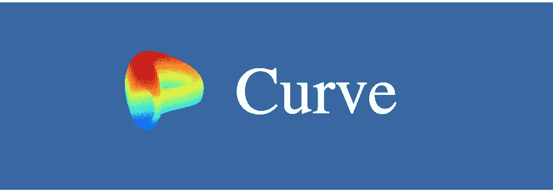
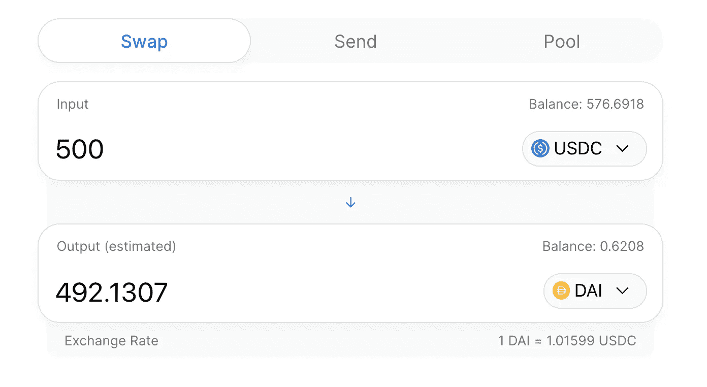
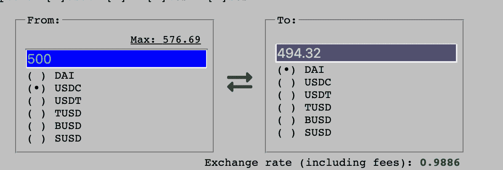
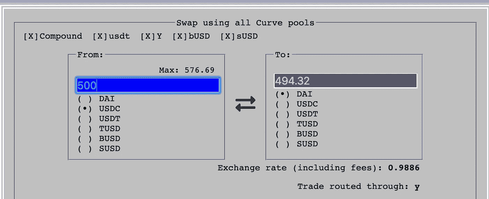

# 什么是曲线金融？

> 原文：<https://medium.com/coinmonks/what-is-curve-finance-18c0b1448f43?source=collection_archive---------0----------------------->

曲线是一个分散的、类似 UniSwap 的稳定积分交换。通过专注于稳定的债券，它能够为交易者提供极低的滑点，流动性提供者享受很少或没有非永久性损失。

Curve 支持戴、、、、和苏丝德，以及对，它可以让你在这些对之间快速有效的交易。当涉及稳定收入或稳定资产时，Curve 的价格通常是行业中最好的。

> [查看 CoinCodeCap 上的曲线](https://coincodecap.com/product/curve-9)

# 为什么不是 Uniswap？

Uniswap 已经存在。我们真的需要另一个代币互换交易吗？

Uniswap’s design makes stablecoin swaps expensive

在 Uniswap 上，令牌对令牌的交易非常昂贵。令牌只能直接与 ETH 交易，因此如果您想用令牌 A 交换令牌 B，Uniswap 将进行两次交易；令牌 A 用于 ETH，然后 ETH 用于令牌 b。这导致交易费用加倍。

对于任何规模的交易，Uniswap 的算法也会出现重大失误。这是因为该算法旨在最大化可用流动性。

The same trade on Curve has better rates

另一方面，使用 Curve，stablecoins 之间可以直接进行交易。你只需支付一套交易费用——目前是 0.04%。Curve 的算法也是为了最小化滑动而设计的。随着交易规模的扩大，这些节省会被放大。

# 如何使用它

只需选择您想要交换的硬币。就这么简单。

Curve 上的主界面实际上在后端使用了多个池，在它们之间选择最佳速率。

**使用 Curve 安全吗？**

Curve 的稳定硬币交换机制和产量积分机制已经过 Bits 跟踪验证。审计报告可以在[这里](https://www.curve.fi/audits/01-ToB.pdf)找到。审计和修复后的代码可以在[这里](https://github.com/curvefi/curve-contract/tree/65365742b4e3b644d61443de6feee49af0d2b095)找到。

我对审计报告的业余解读是，代码有测试套件，代码质量相当好，关注点大部分都得到了解决。我也看到 Curve 主动地[解决](https://blog.synthetix.io/susd-curve-pool-vulnerability-next-steps/) [漏洞](https://blog.curve.fi/vulnerability-disclosure/)。因为在非托管代币掉期交易中的交易是由单笔交易组成的，所以我对使用 Curve.fi 交易稳定的代币没有太多意见。

*请注意，虽然对核心合同进行了审计，但仍可能存在网站钓鱼企图、界面错误或审计后创建或集成的智能合同中的错误。每次交易时，一定要检查你是否在 real curve.fi 或 beta.curve.fi 网站上——最好的方法是把这个网站加入书签，而不是输入或跟随链接。*

虽然在我看来，Curve 对于代币交易来说是相当安全的，但在 Curve 上提供流动性的风险较高。

# 曲线供应流动性—仅针对高级用户

在曲线上交易代币风险相当低。交易由单个交易组成，这是最小的攻击面。然而，供应流动性的风险状况大不相同。

就像把资产留在交易所一样，曲线上的有限合伙人在很长一段时间内为曲线的合约提供流动性。因此，有限合伙人需要彻底了解其中的风险。

对于那些很好地理解和管理其风险的人来说，与 Uniswap 上的供应相比，Curve 对有限合伙人有好处。

*很少到没有的非永久性损失*📈📉

曲线 LP 不仅受益于交易费用，还可以通过与[复合](http://compound.finance)和[学习](/iearn/iearn-finance-from-yields-to-curves-weekly-update-817b54ef21b1)的整合来提高收益率。更好的是，由于 Curve 只交易稳定的货币池，Curve 上的流动性供应很少或没有非永久性损失，这是 Uniswap 有限合伙人的一个主要头痛问题。

什么是无常的失去？Uniswap 的设计要求有限合伙人提供至少一半的 ETH 流动性，这是一种不稳定的资产。如果 ETH 偏离了他们提供流动性的价格，与直接持有 ETH 相比，他们会赔钱。这被称为“非永久性损失”，因为如果价格回到 LP 的进入点，损失就会消失。关于这个效果的更多信息可以在[这里](/@pintail/understanding-uniswap-returns-cc593f3499ef)找到。

然而，由于 Curve 只交易稳定的债券，流动性提供者经历的损失很小，如果有的话。这使得在某些方面曲线供应流动性比 Uniswap 更有吸引力，因为回报是市场中性的。

然而，非永久性损失并不是有限合伙人的唯一风险。

[*DeFi*](https://blog.coincodecap.com/the-ultimate-guide-to-defi-decentralized-finance) *整合风险* ⚔️

DeFi 的最大优势是将不同的“金钱乐高”项目放在一起，可以产生新的、强大的组合。然而，这些整合也增加了风险。用户不仅需要了解他们正在使用的项目的风险，还需要了解与之集成的项目的风险。

曲线就是一个很好的例子。曲线结合[化合物](http://compound.finance)和[学习](http://iearn.finance)提高产量。最近它还有一个 sUSD 集成，允许 sUSD 池 LP 赚取 [SNX](http://synthetix.io) 奖励。

虽然这些集成在财务上对曲线上的有限合伙人有利，但这意味着他们也需要了解和监控这些其他项目的安全问题。yToken 提供者需要监控 [iEarn](/iearn/iearn-finance-from-yields-to-curves-weekly-update-817b54ef21b1) ，cToken 提供者需要了解并监控 [Compound](https://blog.openzeppelin.com/compound-finance-audit-summary/) ，sUSD pool 提供者需要了解并跟上 [Synthetix](https://blog.synthetix.io/tag/audit-report/) 。

*收益率波动*

曲线池的收益率经常波动。随着时间的推移，高收益池会吸引流动性，随着时间的推移，通常会变成中低收益池。

缓解这一问题的一个策略是向所有曲线池提供流动性。这种方法会给出所有资产池的平均收益率。然而，它增加了天然气和滑脱费，以及智能合同的风险。

*气费后利润*

曲线供应流动性的另一个复杂性是计算支付天然气和滑动费用后的利润。

由于 Curve 将流动性分散到多个池中，并且还整合了外部项目，因此提供流动性是一件相对较高的事情。根据所提供的硬币，也可能有明显的滑动。

这意味着追逐收益——改变资产池以追逐高收益——对 Curve 来说不太好。有限合伙人应该做好准备，在足够长的时间内向资金池提供流动性，以使他们的回报超过他们为提供流动性而支付的汽油费和滑点。

出于所有这些原因，提供 on Curve 不适合胆小的人，应该只由完全了解他们所承担的所有风险的高级用户来尝试。

# 曲线——为稳定曲线构建的更好的 Uniswap

Curve 是一个很棒的类似 Uniswap 的自动化分散式交换机，专为稳定的客户设计。它简单而酷的 90 年代风格的界面易于使用，让任何人都可以从稳定点之间的低滑点交易中受益。

对于了解相关风险的高级用户来说，与 Uniswap 相比，Curve 在赚取收益方面也有好处。

*如果你喜欢这个故事，请*👏。

*本文于 2020 年 7 月 29 日更新，以反映曲线 UI 的变化。*

*免责声明:我与曲线没有任何关联。这不是财务建议。*

> 加入 Coinmonks [电报频道](https://t.me/coincodecap)和 [Youtube 频道](https://www.youtube.com/c/coinmonks/videos)获取每日[加密新闻](http://coincodecap.com/)

## 另外，阅读

*   [复制交易](/coinmonks/top-10-crypto-copy-trading-platforms-for-beginners-d0c37c7d698c) | [加密税务软件](/coinmonks/crypto-tax-software-ed4b4810e338)
*   [网格交易](https://coincodecap.com/grid-trading) | [加密硬件钱包](/coinmonks/the-best-cryptocurrency-hardware-wallets-of-2020-e28b1c124069)
*   [密码电报信号](http://Top 4 Telegram Channels for Crypto Traders) | [密码交易机器人](/coinmonks/crypto-trading-bot-c2ffce8acb2a)
*   [Bitsgap 审查](/coinmonks/bitsgap-review-a-crypto-trading-bot-that-makes-easy-money-a5d88a336df2) | [Quadency 审查](/coinmonks/quadency-review-a-crypto-trading-automation-platform-3068eaa374e1) | [Bitbns 审查](/coinmonks/bitbns-review-38256a07e161)
*   [加密复制交易平台](/coinmonks/top-10-crypto-copy-trading-platforms-for-beginners-d0c37c7d698c) | [Coinmama 评论](/coinmonks/coinmama-review-ace5641bde6e)
*   [印度的加密交易所](/coinmonks/bitcoin-exchange-in-india-7f1fe79715c9) | [比特币储蓄账户](/coinmonks/bitcoin-savings-account-e65b13f92451)
*   [最佳加密交易所](/coinmonks/crypto-exchange-dd2f9d6f3769) | [印度最佳加密交易所](/coinmonks/bitcoin-exchange-in-india-7f1fe79715c9)
*   [面向开发人员的最佳加密 API](/coinmonks/best-crypto-apis-for-developers-5efe3a597a9f)
*   最佳[密码借贷平台](/coinmonks/top-5-crypto-lending-platforms-in-2020-that-you-need-to-know-a1b675cec3fa)
*   [杠杆代币](/coinmonks/leveraged-token-3f5257808b22)终极指南