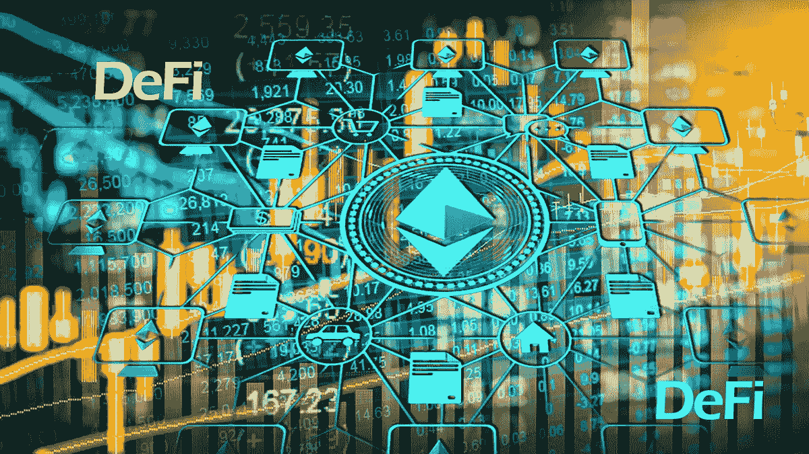

# 什么是去中心化金融？—如何获利！

> 原文：<https://medium.com/coinmonks/what-is-decentralised-finance-defi-how-you-can-profit-74fde9d4bd93?source=collection_archive---------4----------------------->

分散金融，简称 DeFi，是目前最受欢迎的术语之一。去中心化金融应用的趋势最迟在 2020 年引发了一场真正的炒作。但其背后究竟是什么？

DeFi 到底是什么意思？谁可以使用它，DeFi 是如何工作的？为什么对投资者来说有意思？有哪些应用程序，以及如何…