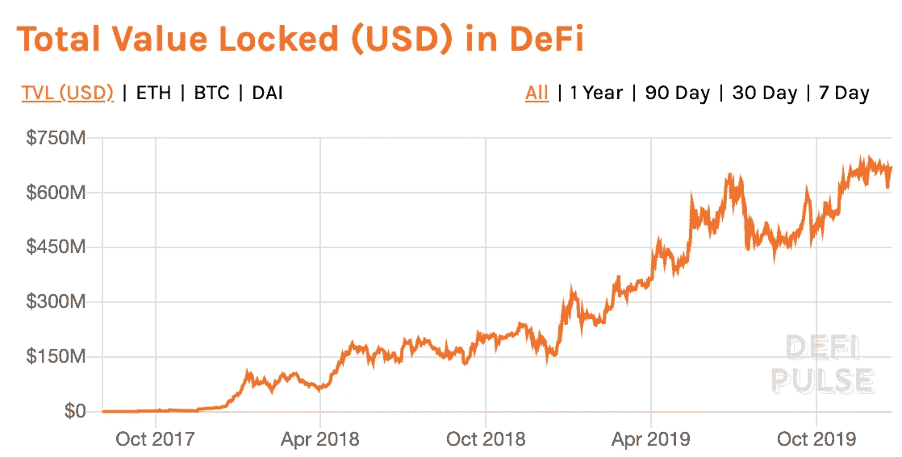
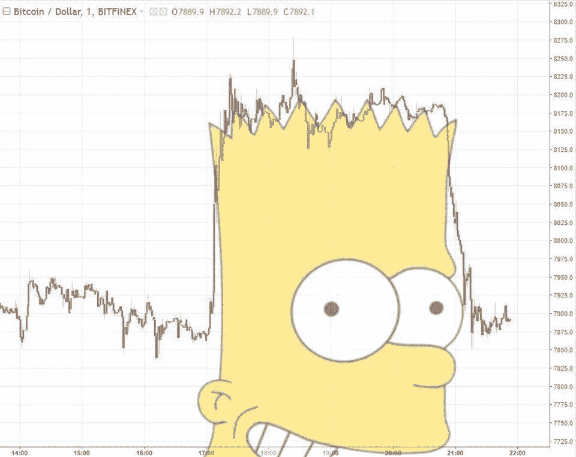
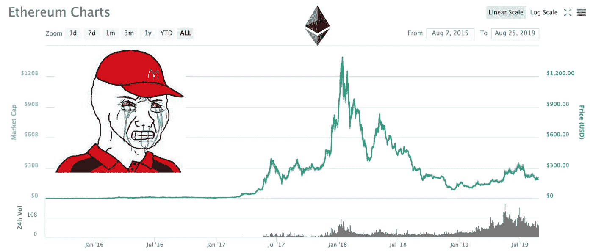
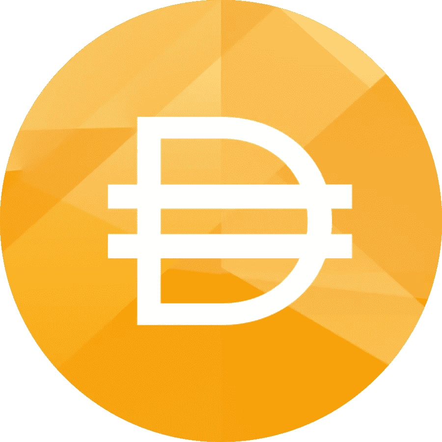
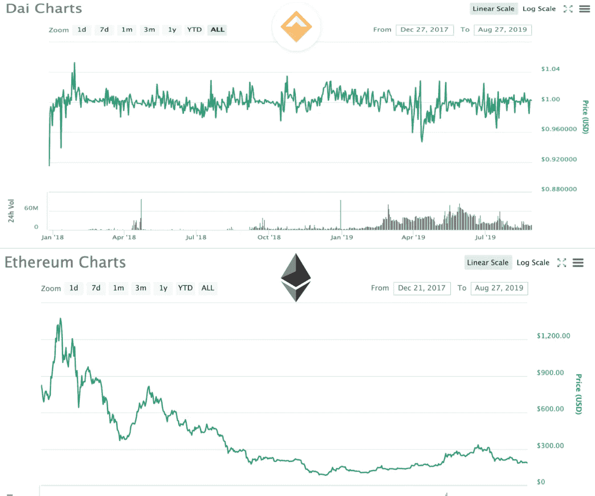
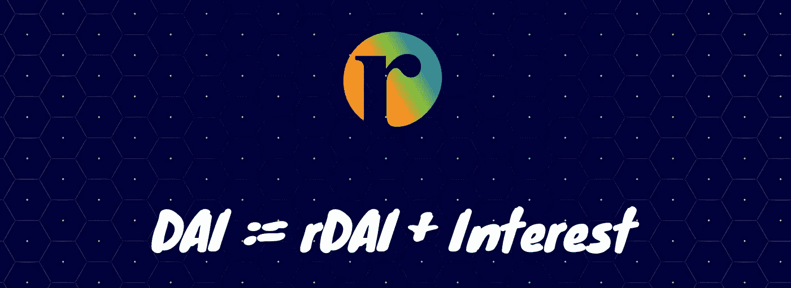
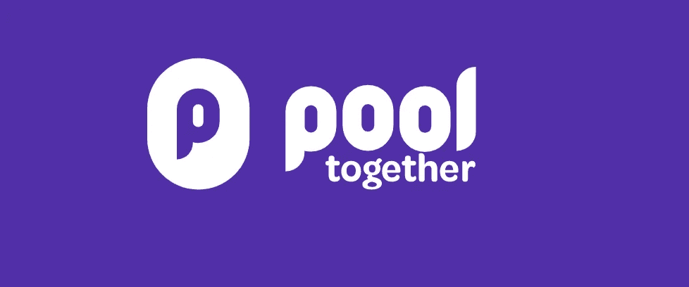

# 什么是 DeFi？

> 原文：<https://medium.com/coinmonks/what-is-defi-2cee0dceeeab?source=collection_archive---------0----------------------->

## *DeFi 简介及其重要性*

DeFi has grown exponentially since 2017 (Source: [DeFi Pulse](http://defipulse.com))

# 更好的银行业务

如果你曾经支付过透支费、电汇费、账户维护费、最低余额处理费或账户冻结费，你就会知道传统银行可能更好。好多了。

DeFi 正是如此。更容易使用，更好的利率，没有愚蠢的费用，没有信任你的钱给第三方，没有限制你可以或不可以用你的钱做什么。去中心化金融应用不仅比常规金融服务更去中心化，而且更好。

> [发现并回顾最佳 DeFi 软件](https://coincodecap.com)

# 怎么花了这么长时间？

但是等等，现在是 2019 年，比特币已经存在 10 年了。我们以前不是有“去中心化财政”吗？比特币不是已经应该让你“成为自己的银行”了吗？？

向巴特问好。虽然从长期来看，比特币是一种很好的分散价值储存手段，但从短期来看，它是一个糟糕的储蓄账户。简直太不稳定了。

比特币本身的功能也很少。你可以拿着它——同时希望它不会下跌——你可以花掉它，但你真的不能用它做很多别的事情。

好的，那么以太坊怎么样？这是一个强大的智能合约平台，非常适合创建分散的应用程序。

但是比比特币波动还要大！任何在过去两年中购买以太坊的人都知道它的价格是不稳定的。

# 戴 DeFi 的基石

一个来自的叫做戴的分散稳定的伙伴已经成为 DeFi 得以存在和发展的基础。它解决了基于加密货币的金融服务的最大问题——波动性。

虽然存在其他稳定币，如 Tether，但戴是第一个在可编程的平台——以太坊上的分散稳定币。150%由以太支持并与美元挂钩，它的存在和支持是完全分散的，源于以太坊区块链。

最重要的是，戴在 2018 年一直保持着非常稳定的状态。即使当支持戴的 ETH 从 1200 多美元跌至 100 美元以下(跌幅超过 92%)时，戴仍保持在 1 美元左右。凭借坚如磐石的稳定性和分散化的设计，戴成为以太坊上运行的 DeFi 经济的基础构件。

# 高息储蓄— DeFi 的首个黑仔应用程序

虽然戴的稳定性令人难以置信，但稳定的组合本身并不令人兴奋。复合金融是 DeFi 的第一个杀手级应用。它利用戴的稳定性创造了一个令人惊叹的新用例——高息储蓄账户，从而获得了巨大的吸引力。

复合金融是一个分散的贷款平台，使用汇集的流动性，而不是使用直接贷款。这个看似很小的变化却产生了巨大的差异，因为它允许复利在借给戴时充当高息储蓄账户。

Bitfinex 等常规贷款平台要求贷款人和借款人就每笔贷款的条款进行谈判，而复利平台上的贷款人只需将钱借给平台，他们就会自动获得利息支付，反之亦然。

戴的利率从今天的 4%到 2019 年夏天的 15%不等。与在普通银行账户存钱相比，在复利上存钱要有利可图得多。

化合物引起了人们极大的兴趣。它如此受欢迎，事实上，其他 Dapps 已经开始整合它。

# 定义可组合性

也许 DeFi 最强大的方面不仅仅是正在构建的很酷的应用程序，而是这些应用程序很容易集成在一起的方式。

正如 Compound 已经使用 DAI 构建了一个很酷的新用例一样，其他项目现在也在使用 Compound 来增强他们自己的应用程序的功能。

rDAI 允许您保存您的 DAI，并生成利息，然后将利息指向您想要的任何地方。你可以把这种兴趣给自己、慈善机构或朋友——这完全取决于你。

rDAI 的设计者不必自己编写所有这些功能，而是能够利用 DAI 和复合金融作为构建模块来创建一个强大的新应用程序，而不必自己重新创建 DAI 和复合金融。

PoolTogether 是这些“资金乐高积木”合作创造新应用的另一个例子。

在后端使用复合，Pooltogether 是一个无损失的彩票。你把你的钱放在池子里，用来购买每周的彩票。在一周结束时，如果你赢了，你会从整个资金池中获得该周的利息。如果你输了——你保留你的票——没有任何损失。

# 更好的财务

DeFi 代表分散金融，但这只是故事的一部分。当我们审视传统金融的替代方案时，很明显，DeFi 不仅更加分散，而且绝对优于当今的任何其他产品。

Tether 是一种稳定的货币，由一个中央实体控制，没有责任或透明度，而 DAI 是完全透明的，每一笔交易和每一个支持它的 ETH 都可以在区块链上看到。

你的银行账户几乎不产生利息，而复合金融给你 4%的利息，同时给你随时提取的自由，想取多少就取多少。

在币安交易加密货币需要创建一个账户、存入资金、下订单并支付取款费，而 UniSwap 让你直接从钱包里用最少的费用下订单。

这不仅仅是分散的金融，这绝对是更好的金融。

**了解更多关于 DeFi 的信息**

*   [这些顶级 DeFi 应用让我们从银行中解脱出来](/coinmonks/these-top-defi-apps-are-freeing-us-from-banks-83f724bc543e)
*   UniSwap 不是你普通的 DEX

*如果你觉得这篇文章有帮助，请*👏，谢谢！也考虑把我的[git coin Grant](https://gitcoin.co/grants/309/danger-zhang-defi-writer)——每一个戴都配！

> [**也读作:**DeFi(分权金融)初学者指南](https://blog.coincodecap.com/a-beginner-guide-to-defi-decentralized-finance/)

> [直接在您的收件箱中获得最佳软件交易](https://coincodecap.com/?utm_source=coinmonks)

