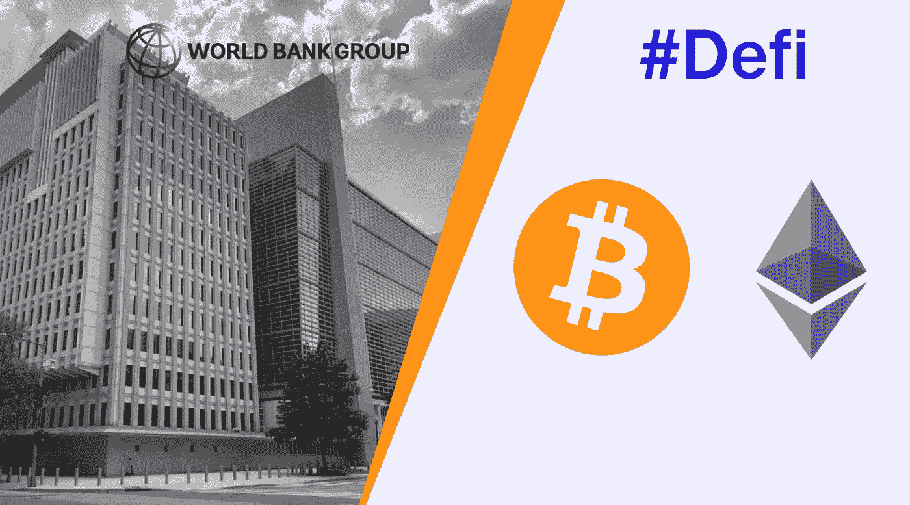

# 什么是 Defi，为什么它很重要？

> 原文：<https://medium.com/coinmonks/what-is-defi-and-why-does-it-matter-679a7492f0b0?source=collection_archive---------10----------------------->

根据联合国的数据，世界上约有 80 亿人，这一数字在未来几年可能会进一步增长，在未来三十年内达到 100 亿大关。比人口预测更令人担忧的是每天生活费不到 1.9 美元的贫困线以下人口数量，或者每年有 6.9 亿人挨饿。

根据世界银行的报告，至少有 17 亿成年人(约占世界人口的 20%)没有银行账户，难怪贫困仍然被视为全球社会和经济发展的最大威胁之一。

贫困的根源无处不在:在战争中，在奴隶制中，在极权主义和至上主义政权中，不管支持它们的意识形态如何。贫困可以在街上，在好莱坞最好的电影里，在戏剧里看到。对于好奇的人和学者来说，这方面的参考书并不缺乏。

然而，很少有人敢说缺乏金融服务是消除贫穷的最大障碍之一。备受争议的哈佛大学历史教授尼亚尔·费格森是个例外。

在《纽约时报》畅销书《金钱的崛起》中，弗格森指出“贫穷不是贪婪的金融家剥削穷人的结果。这更多是因为缺乏金融机构，没有银行，而不是银行的存在。”为了支持他的论点，弗格森继续进行了如下解释:“只有当借款人能够进入高效的信贷网络时，他们才能逃离高利贷的魔爪，只有当储户能够将钱存入可靠的银行时，钱才能从闲散者流向勤劳者，或从富人流向穷人。”

抛开夸张不谈，在任何不公平或有偏见的批评之前，让我们谨慎地将弗格森的话放在上下文中。一个不太遥远的过去已经准备好揭示真相。

银行的声誉是众所周知的，而且远远不是最好的。2008 年金融危机，西方银行经历了大萧条以来最大的倒闭；成千上万的人失去了工作、房子和存款。银行家仍然是亿万富翁，而许多人却陷入了贫困。

另一方面，无法获得金融服务是一个严重问题，损害了选择自由、个人和集体增长。

然而，问题不在于银行的缺失，而在于人们很难进入一个惩罚“不幸者”的体系，让他们提前陷入福利主义，或者在最糟糕的情况下，沦为伪装成团结的奴隶。

然而，银行是经济的重要组成部分。当物物交换是主要的交换媒介时，主要的困难是找到拥有双方都愿意交易的商品和服务的人。这种被称为双重需求巧合的现象产生了一个不公平的经济体系。

例如，如果一方想用豆子交换大衣，只有大衣的主人对豆子感兴趣，交换才会发生。反过来，后者可以为一整季的豆子提供一件衣服。在缺乏计算商品和服务价值的手段的情况下，物物交换体系主宰了几个世纪的经济模式。

随着货币的出现，这个问题被“解决”了，但不是完全解决。在缺乏银行系统的情况下，钱不会进入人们的手中。只有到那时，才有可能给产品分配价值，而贸易变得不那么容易受到市场的不一致的影响，这个市场基本上是建立在这种原始的经济体系之上的。短暂的喘息足以说明这与事实相去甚远。

那些数十亿每天挣着少得可怜的钱的人，没有银行账户的成年人，以及数百万每年被迫挨饿的人，除了仁慈或物物交换之外，不知道任何其他的制度。这就是 Defi 发挥作用的地方。

## **无银行账户，但并非不设防**

Defi，即分散金融，是一套基于区块链技术的新兴金融服务。这些服务类似于银行提供的服务，除了没有一个中央机构作为任何交易的中介。

有了 Defi，可能性是无限的。想象一下传统银行所能提供的一切:贷款、借款、投资、储蓄，再加上获得一系列其他服务和产品的便利，而不需要带着愉快微笑和贪得无厌的渴望从你的收入中分一杯羹的客户经理进行评估。

与银行不同，在银行开户至少需要合理的收入，这阻碍了许多家庭获得金融服务，Defi 应用程序可以通过数字钱包在 PC 或智能手机上访问。有这么简单吗？不幸的是，还没有。

**好消息和坏消息**

虽然世界银行的一项调查表明，11 亿没有银行账户的成年人拥有智能手机，并可以通过数字应用程序使用一些金融服务，但大多数人更喜欢使用现金。

有趣的是，数字银行和金融服务的阻力不在于使用智能手机的能力(尽管这是一个问题)，而在于官僚主义和维持银行账户的高额费用。因此，这些人剥夺了本可以造福他们和子孙后代的储蓄和服务。Defi 可以做得更好，这是好消息。

坏消息是，要使用 Defi 平台，你必须是加密货币、金融和技术方面的专家。在这些平台变得更容易被大众接受之前，只有投资者和密码爱好者才能从这个市场的机会中受益。

Defi 是一种即将成为主流的趋势，是一种减轻贫困和为人们提供尊严的金融创新，是金融的现在和未来，是市场的希望。Defi 是传统银行做梦也想不到的。Defi 就是比特币，以太坊，加密货币，去中心化。

Defi 就是 Defi。

> 加入 Coinmonks [电报频道](https://t.me/coincodecap)和 [Youtube 频道](https://www.youtube.com/c/coinmonks/videos)了解加密交易和投资

## 也阅读

 [## 最佳加密交易所| 2021 年十大加密货币交易所

### 编辑描述

blog.coincodecap.com](https://blog.coincodecap.com/crypto-exchange)  [## 2021 年 10 大最佳加密贷款平台| CoinCodeCap

### 编辑描述

blog.coincodecap.com](https://blog.coincodecap.com/crypto-lending)  [## 2021 年最佳免费加密交易机器人

### 2021 年币安、比特币基地、库币和其他密码交易所的最佳密码交易机器人。四进制，位间隙…

medium.com](/coinmonks/crypto-trading-bot-c2ffce8acb2a)  [## 最佳 4 个加密交易信号电报通道

### 这是乏味的找到正确的加密交易信号提供商。因此，在本文中，我们将讨论最好的…

medium.com](/coinmonks/best-crypto-signals-telegram-5785cdbc4b2b)  [## BlockFi 评论 2021:利弊和利率| CoinCodeCap

### 编辑描述

blog.coincodecap.com](https://blog.coincodecap.com/blockfi-review)  [## 如何在印度购买比特币？2021 年购买比特币的 7 款最佳应用[手机版]

### 如何使用移动应用程序购买比特币印度

medium.com](/coinmonks/buy-bitcoin-in-india-feb50ddfef94)  [## 加密税务软件——五大最佳比特币税务计算器[2021]

### 不管你是刚接触加密还是已经在这个领域呆了一段时间，你都需要交税。

medium.com](/coinmonks/best-crypto-tax-tool-for-my-money-72d4b430816b)  [## 存储比特币的最佳加密硬件钱包[2021] | CoinCodeCap

### 编辑描述

blog.coincodecap.com](https://blog.coincodecap.com/best-hardware-wallet-bitcoin)  [## Pionex 评论 2021 |免费加密交易机器人和交换

### Pionex 是为交易自动化提供工具的后起之秀。Pionex 上提供了 9 个加密交易机器人…

medium.com](/coinmonks/pionex-review-exchange-with-crypto-trading-bot-1e459d0191ea)