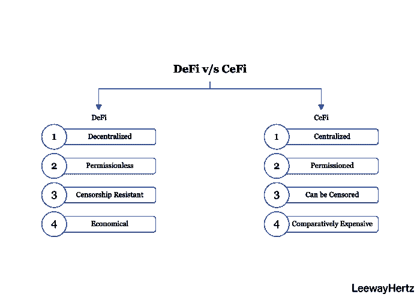

# DeFi 是什么，为什么在炒作？

> 原文：<https://medium.com/coinmonks/what-is-defi-and-why-is-it-in-the-hype-75c2128ce8dd?source=collection_archive---------6----------------------->

Decentralized Finance (DeFi)

随着区块链技术的出现，金融部门的服务取得了显著进步。区块链已经推动了加密货币行业，区块链之上的 Defi 的出现为该行业提供了更多支持。Defi Pulse 在 Defi 协议中锁定的总价值(TVL)目前为 265.7 亿美元。值得注意的是，Defi 在世界范围内越来越受欢迎。仅一年时间就增长了 20 多倍。

[Defi](https://www.leewayhertz.com/decentralized-finance-defi/) 随着越来越受欢迎，已经成为加密领域讨论的热门话题之一。

## **什么是 Defi？**

分散金融简称 Defi。它是一个使用区块链技术开发的金融应用生态系统。它在不允许任何第三方介入的情况下操作交易。它实现了一个点对点的网络，以建立一个分散的环境，每个人都可以自由地连接和管理他们的资产。智能合约是自动执行的，不需要中介监督，为分散融资提供了基础。Defi 旨在提供一个透明、开源、无许可和去中心化的金融环境。

## 【Defi 和 Cefi 有什么区别？

在集中金融(Cefi)中，所有的交易指令都由集中交易所处理。一个中央机构控制资金；用户不拥有任何访问钱包的私钥。分散的和集中的金融都提供借贷和支付服务。两者的区别在于 defi 是一个分散的平台，而 cefi 是一个集中的平台。

在比较 defi 和 cefi 时，安全性是主要关注点。Cefi 是脆弱的，容易出现各种风险，而 defi 提供了一个完全安全的交易平台。Defi 使用名为“工作证明”的功能，确保系统安全可靠。

此外，defi 是一个没有许可的网络，而 cefi 是一个有许可的网络。这意味着，在 cefi 中，一些具体业务只能由中央当局执行，而 defi 没有任何中央授权人员。

比较两个平台的价格，defi 更便宜，因为唯一涉及的成本是网络费用，而 cefi 的多个中介收取高额费用。

## **Defi 系统如何工作？**

分散的金融系统在三个主要部分的帮助下运作:

*   区块链技术
*   分散式应用
*   智能合同

分散的应用程序提供了一个在区块链上执行金融交易的平台。使用智能合约，交易在两个相关方之间执行；不涉及第三方。智能合同旨在消除所有涉及的中介和中央机构。

Defi 平台的开发旨在提供一个自动化、可靠且防篡改的系统。具有这些特征的分散式应用程序以不同的方式自动化了与货币的交互，而不涉及银行或中介。

Defi 生态系统最近引入了一个新的成员，产量农业或流动性采矿。这是一种奖励用户在 DApps 系统中提供流动性的方式。它涉及借贷加密货币并从中赚取利息，这很像传统银行的贷款系统。产量农业的实施有两个主要目标；首先，激励用户提供流动性，并向协议用户公平分配 Defi apps 的治理令牌。

## **Defi 有什么好处？**

*   **透明** 由于区块链网络中的每个交易都被广播到每个节点，因此实现了更高的透明水平。网络中的每个节点都可以验证数据。如此高的透明度为丰富的数据分析提供了空间，并确保每个人都能获得经过验证的访问权限。
*   **不变性** 区块链中的数据是不可更改的。网络中包含交易细节等信息的每个块都使用加密原理和哈希值。
*   **互操作性** 区块链通过连接多样化的区块链系统来实现互操作性，并确保无缝的跨链交易。
*   **去中心化
    分散化为其用户提供了不可信环境的好处，改进了数据协调并减少了弱点。**
*   **自保管** 区块链通过提供对私钥的访问和控制，允许其用户拥有自己的数字资产。

## **结论**

通过区块链技术实施，Defi 真正拥有重塑整个全球金融体系的巨大潜力。随着越来越多的人采用区块链进行交易和开展业务，预计很快就会出现向去中心化治理和决策的重大转变。

> 加入 coin monks[Telegram group](https://t.me/joinchat/EPmjKpNYwRMsBI4p)学习加密交易和投资

## 另外，阅读

*   什么是[闪贷](https://blog.coincodecap.com/what-are-flash-loans-on-ethereum)？
*   最好的[密码交易机器人](/coinmonks/crypto-trading-bot-c2ffce8acb2a) | [网格交易](https://blog.coincodecap.com/grid-trading)
*   [3 商业评论](/coinmonks/3commas-review-an-excellent-crypto-trading-bot-2020-1313a58bec92) | [Pionex 评论](/coinmonks/pionex-review-exchange-with-crypto-trading-bot-1e459d0191ea) | [Coinrule 评论](https://blog.coincodecap.com/coinrule-review-a-perfect-trading-bot)
*   [AAX 交易所评论](/coinmonks/aax-exchange-review-2021-67c5ea09330c) | [德里比特评论](/coinmonks/deribit-review-options-fees-apis-and-testnet-2ca16c4bbdb2) | [FTX 密码交易所评论](/coinmonks/ftx-crypto-exchange-review-53664ac1198f)
*   [n 零审核](/coinmonks/ngrave-zero-review-c465cf8307fc)
*   [Bybit Exchange 审查](/coinmonks/bybit-exchange-review-dbd570019b71) | [Bityard 审查](https://blog.coincodecap.com/bityard-reivew)|[inter tax 审查](https://blog.coincodecap.com/interdax-review)
*   [3Commas vs Cryptohopper](/coinmonks/3commas-vs-pionex-vs-cryptohopper-best-crypto-bot-6a98d2baa203)
*   最好的比特币[硬件钱包](/coinmonks/the-best-cryptocurrency-hardware-wallets-of-2020-e28b1c124069?source=friends_link&sk=324dd9ff8556ab578d71e7ad7658ad7c) | [BitBox02 回顾](/coinmonks/bitbox02-review-your-swiss-bitcoin-hardware-wallet-c36c88fff29)
*   [总账 vs 平均](https://blog.coincodecap.com/ngrave-vs-ledger)
*   [密码拷贝交易平台](/coinmonks/top-10-crypto-copy-trading-platforms-for-beginners-d0c37c7d698c) | [比特码拷贝交易](https://blog.coincodecap.com/bityard-copy-trading)
*   [莱杰 nano s vs x](https://blog.coincodecap.com/ledger-nano-s-vs-x)
*   [Vauld Review](https://blog.coincodecap.com/vauld-review)|[you hodler Review](/coinmonks/youhodler-4-easy-ways-to-make-money-98969b9689f2)|[BlockFi Review](/coinmonks/blockfi-review-53096053c097)
*   最佳[加密税务软件](/coinmonks/best-crypto-tax-tool-for-my-money-72d4b430816b) | [货币追踪点评](/coinmonks/cointracking-review-a-reliable-cryptocurrency-tax-software-5114e3eb5737)
*   最佳[加密贷款平台](/coinmonks/top-5-crypto-lending-platforms-in-2020-that-you-need-to-know-a1b675cec3fa)
*   [Ledger Nano S vs Trezor one vs Trezor T vs Ledger Nano X](https://blog.coincodecap.com/ledger-nano-s-vs-trezor-one-ledger-nano-x-trezor-t)
*   [BlockFi vs 摄氏度](/coinmonks/blockfi-vs-celsius-vs-hodlnaut-8a1cc8c26630) | [Hodlnaut Review](https://blog.coincodecap.com/hodlnaut-review)
*   [Bitsgap 审核](/coinmonks/bitsgap-review-a-crypto-trading-bot-that-makes-easy-money-a5d88a336df2) | [四效审核](/coinmonks/quadency-review-a-crypto-trading-automation-platform-3068eaa374e1)
*   [Ellipal Titan 点评](/coinmonks/ellipal-titan-review-85e9071dd029) | [SecuX Stone 点评](https://blog.coincodecap.com/secux-stone-hardware-wallet-review)
*   [BlockFi 点评](/coinmonks/blockfi-review-53096053c097) |赢取高达 8.6%的加密货币权益
*   [DEX Explorer](https://explorer.bitquery.io/ethereum/dex) 和[区块链 API](https://explorer.bitquery.io/graphql)
*   [加密货币套利](/coinmonks/crypto-arbitrage-guide-how-to-make-money-as-a-beginner-62bfe5c868f6)入门指南:如何赚钱
*   最佳[加密制图工具](/coinmonks/what-are-the-best-charting-platforms-for-cryptocurrency-trading-85aade584d80)
*   了解比特币最值得读的书是什么？

> [直接在收件箱中获得最佳软件交易](/coinmonks/newsletters/coinmonks)

