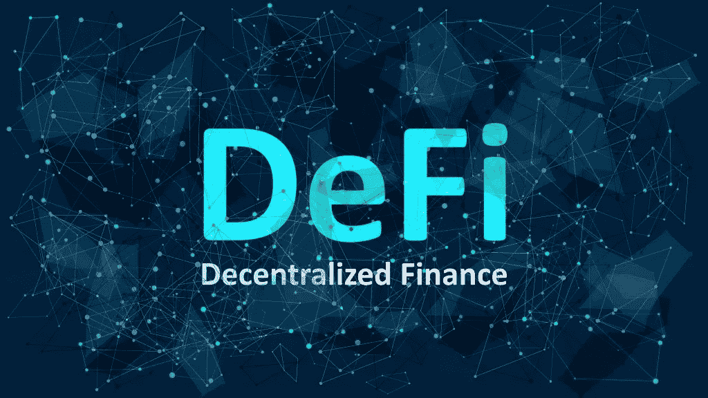

# 什么是 DeFi？

> 原文：<https://medium.com/coinmonks/what-is-defi-f5bf8b501929?source=collection_archive---------0----------------------->

## 分散融资背后的生态系统解释简单

它已经被每个人挂在嘴边有一段时间了，它比之前的任何东西都更好地反映了去中心化的思想。我们谈论的是分散金融，简称 DeFi。分散式贷款平台 MakerDAO 等知名项目就是基于这种想法建立起来的，而且…