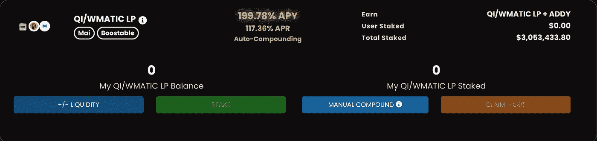

# 什么是 DeFi？Web 3.0 入门&回答您的问题

> 原文：<https://medium.com/coinmonks/what-is-defi-onboarding-for-web-3-0-answering-your-questions-6097d8e6e4b8?source=collection_archive---------4----------------------->

## 让我们来看看什么是 DeFi，为什么要关注它，以及如何使用它。

那么什么是 DeFi？分散金融(或 T2 DeFi T3)是一个用来描述建立在区块链上的金融产品和服务的术语。这些产品和服务**不会因为中央集权而受到限制，市场永远是开放的**。这是由于加密货币和区块链技术的性质。人们利用 DeFi 来创造被动收入，实质上扮演了银行和其他服务的角色，而这些服务通常是由中央集权的公司或组织以及中间人提供的。DeFi 正被用来增加金融自由和重新分配财富。

Screenshot taken from [Ethereum official site](https://ethereum.org/en/defi/)

[Jssevar Tweet](https://twitter.com/jssevar/status/1456284330737737728?s=21)

# 区块链和 DeFi 入门

一旦你从交易所购买了加密货币，你就拥有了它，它被存储在区块链上一个为你创建的数字钱包中，这个钱包有一个特定的公共地址(人们可以看到并向其汇款)，以及一个允许访问它的私钥。然而，集中交易所(CEXs)存储您的私钥，允许访问加密货币。一些人喜欢控制他们的私钥，并将他们的令牌从 CEX 发送到他们的软件/网络钱包中。当兑现成美元和场外交易(将美元发送到银行)时，人们通常将他们的密码放回 CEX 并出售。比特币基地和双子座在美国很受欢迎。

cex 与 DeFi 不兼容，因为您不能将它们插入 dApps(分散式应用程序)中。这就是我们使用网络钱包与 Web 3.0 互动的原因——在 Web 3.0 中可以找到 DeFi。

## 制作您的网络钱包

**网络钱包是人们连接 DeFi 和 Web 3.0 的方式**。我推荐使用 [**元掩码**](https://metamask.io/) ，因为它们是先行者，因此很有可能有 DeFi 站点支持它。要设置它，你下载 MetaMask 浏览器扩展，设置密码以访问扩展，写下并存储您的秘密恢复短语(您的帐户的主访问密钥，不要丢失它！)然后你就基本准备好了。

## 有机会就用硬件钱包

无论谁持有私钥，你拥有的密码总是存储在区块链上。**硬件钱包只是一种从你正在使用的电脑中取出私钥的方式**放到一个需要手动连接电脑和手动确认交易的设备上。

我建议使用 DeFi 的硬件钱包，因为正确设置它需要你从电脑中取出所有可能危及钱包访问的信息。从理论上讲，你可能被黑客或社会工程共享你的私人密钥或恢复短语存储在你的笔记本电脑或网络钱包扩展。**我为你的硬件钱包** **推荐** [**总账。**](http://ledger.refr.cc/kylecollins)

**您可以将您的账户从硬件钱包导入 MetaMask** 。这样你就可以放心使用 DeFi 了。[这里有一个视频](https://youtu.be/x5RBk3thpY4)介绍如何**将您的元掩码帐户迁移到您的分类帐设备**。

## 汽油费

关于汽油费，我想简单说一下。这些是支付给你与之互动的区块链网络的**费用，激励矿工和股东处理和验证网络交易**。这些费用必须支付发送加密或以任何方式与 DeFi 互动。

你需要知道你计划使用的每一个区块链网络的油费是用什么密码支付的。以下内容适用于受欢迎的区块链的燃气费支付:

1.  Arbitrum 使用 ETH
2.  以太坊使用 ETH
3.  多边形使用 MATIC
4.  Avalanche 使用 AVAX
5.  币安利用 BNB
6.  索拉纳使用溶胶
7.  和声用一个

您可以查看您使用的任何区块链网络的历史天然气价格。点击[此处](https://ethereumprice.org/gas/)查看以太坊历史天然气价格。

## 设置 RPC 网络

有区块链作为扩展解决方案(第二层),运行在以太坊主网等主流区块链的旁边。缩放解决方案使 DeFi 成为可能并有利可图，因为以太坊的燃气费现在非常高。**RPC 将让您连接到这些扩展解决方案网络中的一个，以便您可以参与 DeFi 活动，而不必支付太多费用**。RPC 只是将您连接到特定区块链的软件通信协议。

您可以使用 [**链表**](https://chainlist.org/) 轻松连接和设置各种 RPC。这是我推荐的。

你也可以通过点击 MetaMask 顶部的“以太坊主网”来设置 RPC 会有一个下拉菜单，你可以点击，“添加网络。”

以下 RPC 是很好的添加方式，因为在这些网络上有很多值得探索的地方(点击它们以获得更多关于手动设置的信息):

1.  [多边形](https://blog.polygon.technology/polygon-rpc-gateway-will-provide-a-free-high-performance-connection-to-the-polygon-pos-blockchain/)
2.  [仲裁裁决](https://help.uniswap.org/en/articles/5538707-how-to-connect-to-arbitrum)
3.  [雪崩](https://support.avax.network/en/articles/4626956-how-do-i-set-up-metamask-on-avalanche)
4.  [币安智能链](https://docs.binance.org/smart-chain/wallet/metamask.html)

只需填写信息元掩码提示。您需要的是主 RPC URLs，而不是测试网。

**注*** :对于 Solana 和其他一些区块链，你需要使用不同于 MetaMask 的网络钱包服务——这意味着你不能通过 MetaMask 连接到某些 RPC。在区块链的网站上可以找到支持的钱包列表。(也就是说，您可以点击[此处](https://docs.solana.com/wallet-guide/web-wallets)找到 Solana 网络钱包列表。SolFlare 是最受欢迎的产品之一。)

## 桥接

为了使用**性价比高的 DeFi 产品和服务** **你可能会想过渡到以太坊**以外的网络。桥接是跨区块链传输数据/资产的行为。您购买的代币存储在您购买代币的特定区块链网络中。因此，为了使用另一个网络，你必须桥接你的资产。

**以下是我推荐的几座桥梁**(点击查看网址):

1.  [Umbria](https://bridge.umbria.network/bridge/) (以太坊主网到多边形主网的最低费用，如果你桥接以太网——强烈推荐)
2.  [跳交换](https://app.hop.exchange/send?token=USDC&sourceNetwork=polygon&destNetwork=ethereum)(第二层到第二层或第二层到第一层的快速交换)(以太坊主网是第一层)
3.  [虫洞](https://wormholebridge.com/#/transfer)(对索拉纳架桥等人有好处)
4.  [c 桥](https://cbridge.celer.network/#/transfer)(多链)
5.  Arbitrum 官方(如果你打算在 Arbitrum 网络账户上使用 DeFi，而不是包装 ETH [WETH]，你需要首先使用这个来拥有常规 ETH)
6.  [雪崩官方](https://bridge.avax.network/)(官方雪崩桥给你 AVAX 使用，一旦你桥到他们的网络)
7.  [Synapse](https://synapseprotocol.com/?inputCurrency=USDC&outputCurrency=BUSD&outputChain=56) (支持和谐链的多链)

## 发送加密-确保它在正确的网络上

**免责声明** : ***总是检查你发送的是什么加密，以及它在什么网络上。*** 如果你在 Polygon 网络上发送 ETH 说你的比特币基地 ETH 接收者地址，你会失去那个 ETH，因为比特币基地目前不支持 Polygon 网络上的加密。事实上，比特币基地目前只支持以太坊主网上的代币(这将会改变)。**因此，确保你知道你的收款人地址在哪个网络上，用于你卖出和兑现美元的*交易所*。**

如果你想把你在 Polygon 网络上的加密软件换成美元(非斜坡)并使用比特币基地，你首先需要把你的资产连接回以太坊主网**，然后再**把它们送回你在比特币基地的地址。

## 交换

你可以**在你所在的任何网络上用掉期交易套现成稳定的积分**。这样你就可以获利，并且知道你的钱不会波动。稳定的硬币与 1 美元挂钩。戴、、、、米姆和都是很受欢迎的歌星。然后，您可以桥接回您的交易所使用的区块链网络，并将您的稳定币发送回您的银行，以美元卖出。交换通常只是用来交换几乎任何密码到你选择的另一个。一些受欢迎的互换包括:

1.  [以太坊的 Uniswap](https://uniswap.org/)
2.  [多边形的快速切换](https://quickswap.exchange/)
3.  [Sushiswap](https://sushi.com/) 适用于 14 种不同的区块链
4.  以太坊、雪崩、BSC、Arbitrum 和 Fantom 的咒语

点击“进入应用程序”进入并访问 DeFi 产品和服务，或点击顶部的“交换”(在大多数交换网站上)来交换令牌。

## 将令牌导入 Web Wallet

为了查看您的钱包中有多少代币，您需要导入代币地址。

**自动导入代币方法—****将代币添加到您的钱包以供查看的最简单方法是前往您想要查看代币的网络上的兑换处**，然后**单击代币旁边显示的加号按钮**，您通常会前往该处选择您想要兑换的代币。只需点击添加后，并批准它:

**手动导入方法—** 在 MetaMask 底部的“Assets”选项卡下，您应该会看到:

首先，在谷歌上搜索你想查看或购买的[“代币名称”]，然后在它后面输入[“合同地址”]，最后输入你所在的[“区块链网络”]或你想查看的那个。还记得添加自定义 RPC 时的“Block Explorer URL”字段吗？您正在 Google 搜索结果中为您的令牌寻找相同的 url。例如:

该 etherscan.io url 是以太坊主网区块链的 block explorer URL。区块探索者扫描区块链上有用的数据(如合同地址)并显示出来。从这里，点击它并复制右边的“合同”，注意十进制数和令牌符号，在本例中是“最大总供应量”旁边的“MATIC”单击“导入令牌”和“自定义令牌”后，只需填写提示字段

有时，您甚至可以在元掩码中单击导入令牌后搜索您正在寻找的令牌。一些项目的官方合同链接也不一致，或者出现在他们的文档上。

## 小心你连接的网站

在连接到网站之前，我强烈建议你加入网站的 discord，和那里的一些人聊聊天，也读一点他们的 Gitbook 文档(如果他们有，他们应该有)。也检查他们的推特，看看他们是否有合法的追随者。

**有些恶意网站会要求您连接并共享您的私钥和秘密恢复短语**(种子短语)。**请勿分享此信息**。没有合法的人，社区成员，国防部，开发商，管理员，或网站会问这个。

我还建议关闭允许来自不和谐服务器成员的直接消息，并打开安全扫描设置，扫描所有你收到的消息，甚至来自朋友的消息。

你可以使用 https://tokensniffer.com/[这样的网站来扫描合同/代币，以判断它们是骗局的可能性。](https://tokensniffer.com/)

这里有一个针对 Web 3.0 中常见骗局的无骗局指南，这些骗局可能会跨越到 DeFi:

尽管 DeFi onboarding 的学习曲线和潜在的骗局，使用 DeFi 的好处太大了，不容忽视。

# DeFi——如此多的机会，没有阻碍的中间人。赚取银行收取的费用，并控制你的钱。(多边形网络记录)

注*:以下推荐的站点都在[多边形网络](https://wire.insiderfinance.io/the-crypto-oracles-matic-is-a-must-buy-dont-miss-the-next-ethereum-5be42b613867)上，在我看来是 DeFi 的最佳起点。

## 高产农业

产量农业是为代币对提供流动性并从中获得报酬的一种独特方式。通过提供你的钱给人们用来出售 **或购买** **代币**，你本质上是在帮助交易的后端。你**从平台从交易和其他方式中收取的**费用中获得这项服务的报酬。

在产量农业中，100%以上的年利率是很常见的；有了这么高的年利率，你的钱每年至少翻一倍，甚至有网站会自动为你复利。

首先，在 yield farming 网站上点击您想要购买的令牌对的+/-流动性按钮:

Image 1

然后，您添加您配对的每个代币的等值美元金额:

Image 2

(即，如果您添加 1000 个 Qi 代币，您将添加与之配对的任何货币的等值美元金额，在本例中为 338.587 WMATIC。)

一旦您批准了这一点，您就可以结合这两种加密货币来获得您的流动性池令牌(LP 令牌)。它可能会询问您是否要将新令牌地址添加到您的钱包中，以便您可以查看您有多少 LP 令牌。如果没有提示您添加自定义令牌，不要担心，它仍然记录在区块链上，所以只需转到合同，然后单击“赌注”和“全部赌注”你会立即开始被动赚钱(见图 1)。

当你决定离开收益率农场时，只需取消你的 LP 代币，回到添加流动性网站，应该有一个滑块，你可以调整选择你的 LP 代币的百分比来取消配对。你只能在没有配对的情况下出售它们。

推荐平台:[宁折不挠金融](https://adamant.finance/)，[肥牛金融](https://www.beefy.finance/)，[无常金融](https://polygon.impermax.finance/)

我关于坚定的金融的文章可以在这里找到。

## 放款

在 DeFi 中，你可以找到利息为 0%的抵押贷款**，没有到期还款日**，也没有任何需要支付的款项。你可以用你拥有的密码借款而不会失去你的头寸！因此，如果它们的价格上涨，你仍然拥有它，只需还清债务，就可以获得你存入的全部金额。你甚至可以从借款中获得收益——有时在 Mai Finance 中是 30%+4 %!**如果需要，你也可以在**[**Opensea**](https://opensea.io/)**出售你的债务。**在您的个人资料中，您会看到为您的抵押和贷款创建的金库显示为 NFT。

首先，您只需选择要存放的令牌，批准并为其创建保管库。接下来你要投入代币。最后，单击借款选项卡，选择一个合适的借款金额。如果你的抵押品债务比低于要求的数额，你就会被清算(意思是基本上有人买了你的债务)。Mai Finance 实际上只清算了其用户的 50%,这使他们回到了健康的借款比率。因此，如果你被清算，你不会失去所有的抵押品。

Vault creation.

推荐平台:[麦金融](https://www.mai.finance/)(又名齐道)

我关于麦金融的文章可以在这里[找到。](https://wire.insiderfinance.io/the-crypto-oracles-qi-has-potential-to-become-one-of-the-top-altcoins-27f432dc4a6a)

## 杠杆交易

**你可以在 DeFi 中使用杠杆交易，没有任何要求**。有创新的系统使用独特的记号组学给你交易的杠杆。不需要预付保证金，没有可识别的信息或任何要求。这种方式为最热情的交易者打开了大门，激励人们学习市场，更好地投资，提高资本效率。

假设您使用的是 10 倍杠杆。你的多头头寸增加 5%,你的净收益将是你投资额的 50%。如果你做得足够好，你可以获得一些与你的投资相关的重要资本。然而，使用任何数量的杠杆意味着你有一个清算价格。如果你的头寸没有经过深思熟虑，或者你的头寸暴露在市场中的时间太长，价格有可能下跌或上涨到足以清算你的多头或空头头寸。

推荐平台:[增益网](https://gains.trade/)

我关于增益网的文章可以在[这里](https://wire.insiderfinance.io/the-crypto-oracles-an-overlooked-defi-platform-with-insane-potential-to-create-wealth-79259c5349f1)找到。

# 结论

DeFi 是长期困扰金融业的问题的独特解决方案。It 提供了一个生态系统，让个人能够以他们从未想过的方式利用他们的资金。我真的相信每个人都有可能通过 DeFi 致富。毕竟，对所有人来说都是富足的。你的利润不会侵蚀我的利润，而且还有很多资源可以利用。

现在非直觉性存在一些问题。你肯定需要一些技术诀窍来弄清楚如何使用这个新的区块链生态系统。然而，事情将变得更加精简，集成，成本效益和整体更容易使用。在这一点上，每个人都将寻求加入，集体将依靠自己并互相帮助。DeFi 为我们建立了一个高效和有效的资本分配的未来，并最终实现金融和社会赋权。

如果你在寻找更多关于 DeFi 的信息，那么**看看 Finematics 的这个视频** [**这里**](https://youtu.be/H-O3r2YMWJ4)——一个学习所有加密知识的好渠道。请在评论中提出任何关于 DeFi 的问题，我会尽我所能回答所有问题。

感谢您阅读这篇初级读本！如果你认为我应该调查任何与密码相关的事情，那么请通过 Twitter DM ( [@kyledcollins](https://twitter.com/kyledcollins) )告诉我。我总是在寻找好机会。另外，如果您有任何问题，请随时联系我们**。**

*请注意，我写的都不是金融建议——只是我对投资机会的看法。*

电子邮件:kyledanielcollins@gmail.com

> 加入 Coinmonks [电报频道](https://t.me/coincodecap)和 [Youtube 频道](https://www.youtube.com/c/coinmonks/videos)了解加密交易和投资

## 另外，阅读

*   [MoonXBT vs Bybit vs 币安](https://blog.coincodecap.com/bybit-binance-moonxbt) | [Arbitrum:第二层解决方案](https://blog.coincodecap.com/arbitrum)
*   [买 PancakeSwap(蛋糕)](https://blog.coincodecap.com/buy-pancakeswap)|[matrix export Review](https://blog.coincodecap.com/matrixport-review)
*   [最佳免费加密信号](https://blog.coincodecap.com/free-crypto-signals) | [YoBit 评论](/coinmonks/yobit-review-175464162c62) | [Bitbns 评论](/coinmonks/bitbns-review-38256a07e161)
*   [OKEx 回顾](/coinmonks/okex-review-6b369304110f) | [Kucoin 交易机器人](/coinmonks/kucoin-trading-bot-automate-your-trades-8cf0ca2138e0) | [期货交易机器人](/coinmonks/futures-trading-bots-5a282ccee3f5)
*   [AscendEx Staking](https://blog.coincodecap.com/ascendex-staking)|[Bot Ocean Review](https://blog.coincodecap.com/bot-ocean-review)|[最佳比特币钱包](https://blog.coincodecap.com/bitcoin-wallets-india)
*   [霍比审核](https://blog.coincodecap.com/huobi-review) | [OKEx 保证金交易](https://blog.coincodecap.com/okex-margin-trading) | [期货交易](https://blog.coincodecap.com/futures-trading)
*   [比特币基地跑马圈地](https://blog.coincodecap.com/coinbase-staking) | [Hotbit 评论](/coinmonks/hotbit-review-cd5bec41dafb) | [KuCoin 评论](https://blog.coincodecap.com/kucoin-review)
*   [最佳加密交易信号电报](/coinmonks/best-crypto-signals-telegram-5785cdbc4b2b) | [MoonXBT 评论](/coinmonks/moonxbt-review-6e4ab26d037)
*   [Coinswitch 俱吠罗评论](/coinmonks/coinswitch-kuber-review-1a8dc5c7a739) | [电网交易机器人](https://blog.coincodecap.com/grid-trading) | [比特币基地收费](/coinmonks/coinbase-fees-831e77d4f2c5)
*   [Bitget 评论](https://blog.coincodecap.com/bitget-review)|[Gemini vs BlockFi](https://blog.coincodecap.com/gemini-vs-blockfi)|[OKEx 期货交易](https://blog.coincodecap.com/okex-futures-trading)
*   [OKEx vs KuCoin](https://blog.coincodecap.com/okex-kucoin) | [摄氏替代品](https://blog.coincodecap.com/celsius-alternatives) | [如何购买 VeChain](https://blog.coincodecap.com/buy-vechain)
*   [币安期货交易](https://blog.coincodecap.com/binance-futures-trading)|[3 commas vs Mudrex vs eToro](https://blog.coincodecap.com/mudrex-3commas-etoro)
*   [在印度利用加密套利赚取被动收入](https://blog.coincodecap.com/crypto-arbitrage-in-india)