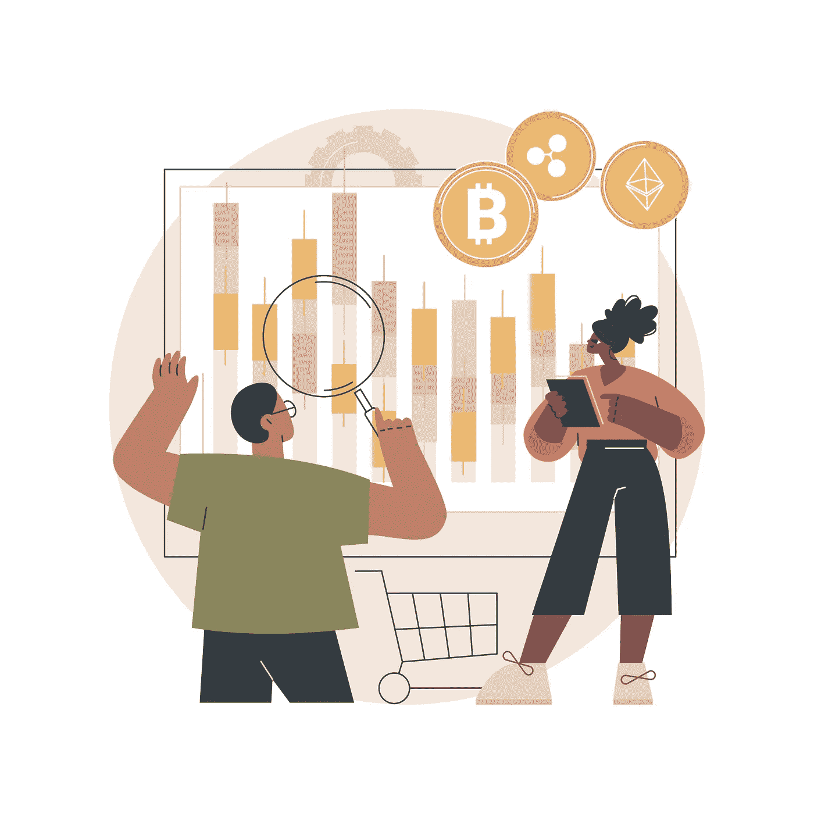
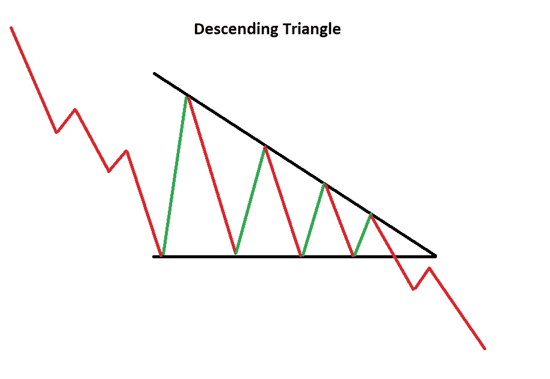

# 什么是三角下降模式交易分析

> 原文：<https://medium.com/coinmonks/what-is-descending-triangel-patterns-trading-analysis-e4ba9f7ad331?source=collection_archive---------12----------------------->

What is Descending Triangel Patterns Trading Analysis

下降三角形是一种熊市形态，通常在整个下降趋势中作为一种延续形态变化。在上升趋势停止时，下降三角形会形成反转形态，但它们通常是延续形态。不管它们在哪里形成，下降三角形是指出分布的看跌图形。

通常情况下，商人会关注 T2 支撑线 T3 下方的走势，因为这表明下跌势头正在形成，崩溃即将来临。一旦崩溃发生，交易者进入快速建仓，积极协助将资产价格压得更低。

你可能已经读过了:“[什么是上升三角形态交易分析](https://cryptoworldfinace.blogspot.com/2021/12/what-is-ascending-triangle-patterns.html)”、“[使用支持和阻力进行交易加密](https://cryptoworldfinace.blogspot.com/2021/12/uses-support-and-resistance-for-trading.html)、“[加密泵和转储方案](https://cryptoworldfinace.blogspot.com/2021/11/crypto-pump-and-dump-schemes.html)。由于其形状，该样本还可以称为直角三角形。两个或更多相同的低点在底部形成一条水平线。两个或两个以上的下降峰构成了一条下降趋势线，当它下降时与水平线汇合。如果每一条线都向右延伸，下降的时尚线应该是一个直角三角形的斜边。如果画一条垂直线从水平线的左边向上延伸，就会形成一个直角三角形。

*   下降三角形是商家做空加速击穿的信号。
*   通过在图表上绘制高点和低点的时尚轨迹，可以发现下降三角形。
*   下降三角形是上升三角形的对应物，上升三角形是通过[技术分析师](https://cryptoworldfinace.blogspot.com/2021/11/technical-analysis-and-read-candlestick.html)使用的完全基于其他风格线的图表样本。

让我们观察样本的每一个字符相位，然后似乎在一个例子。

***趋势*** :为了有资格成为延续模式，必须存在一个挂钩样式。然而，由于下降三角形实际上是一种熊市形态，现代风格的大小和长度现在不像该形态的坚固性那样必要。

***下水平线*** :至少需要两个响应低点才能构成下降水平线。低点不再必须是精确的，但是必须在每一个的实际接近度之内。低点和过度反应之间应该有一定的距离。

***上升下降趋势线*** :至少需要两个响应高点才能构成顶部下降风格线。这些响应高点必须连续降低，并且在高点之间需要有一定的距离。如果更大的最新响应过度等于或大于先前的响应高，则下降三角形不再有效。

***持续时间*** :样本的大小可以从几周到几个月不等，一般样本持续时间为 1-3 个月。

[***卷***](https://cryptoworldfinace.blogspot.com/2021/12/what-is-volume-in-cryptocurrency-trade.html) :随着样本的发展，范围通常会收缩。当拉回粉碎发生时，理想情况下会有一个确认范围的增长。虽然数量肯定是首选，但通常不再是必要的。

[***返回突围***](https://cryptoworldfinace.blogspot.com/2021/12/breakout-and-fakeout-in-cryptocurrency.html) :技术评估的一个简单宗旨就是:损坏的导轨变成阻力，反之亦然。当下降三角形的水平求助线被打破时，就转化为阻力。有时会有一个回到这个新发现的抵抗阶段的过程，这个过程比真正进化的开始要早。

***目标*** :一旦突破发生，通过测量样品的最宽距离并将其从阻力突破中减去来定位费用投影。

> 阅读:[加密货币交易的成交量是多少？](https://cryptoworldfinace.blogspot.com/2021/12/what-is-volume-in-cryptocurrency-trade.html)
> 
> [在您的业务中长期使用加密货币的好处](https://cryptoworldfinace.blogspot.com/2021/11/benefits-of-using-cryptocurrency-in.html)

与对称三角形不同，下降三角形比正确的突破更早有精确的看跌倾向。对称三角形是一个不偏不倚的形态，它依靠即将到来的突破来决定下一步的走势。对于下降三角形，水平线代表防止安全下降到正水平之前的需求。这就好像在这个阶段下了一个大订单，需要几周或几个月的时间来执行，因此阻止了费用的进一步下降。即使利率现在没有下降到这个水平之前，反应高点继续下降。正是这些下降的高点指出了加速的推动张力，并为下降三角形提供了[看跌](https://cryptoworldfinace.blogspot.com/2021/12/bullish-and-bearish.html)偏差。

## **使用下降三角形的局限性**

三角形的困难是错误分解的合理解释。甚至有条件的地方，时尚应变将想要重新绘制，因为电荷运动爆发在相反的过程中——没有图表样本是完美的。如果没有发生崩溃，库存可能会反弹，以重新测试顶部时尚线阻力，而不是进行任何其他交叉下跌，以重新测试下降风格线援助水平。费用触及援助和阻力位的次数越多，图表越可靠。[阅读更多](https://cryptoworldfinace.blogspot.com/2021/12/what-is-descending-triangel-patterns.html)。

> 加入 Coinmonks [电报频道](https://t.me/coincodecap)和 [Youtube 频道](https://www.youtube.com/c/coinmonks/videos)了解加密交易和投资

## 也阅读

 [## 杠杆代币[多头代币]终极指南

### 杠杆化令牌是具有杠杆化风险敞口的 ERC20 令牌，不考虑保证金、要求、管理…

medium.com](/coinmonks/leveraged-token-3f5257808b22)  [## 最佳加密交易所| 2021 年十大加密货币交易所

### 加密货币交易所的加密交易需要了解市场，这可以帮助你获得利润。之前…

blog.coincodecap.com](https://blog.coincodecap.com/crypto-exchange)  [## 2021 年最佳加密交换平台| CoinCodeCap

### 如果我们看看今天的场景，许多加密货币交换平台提供了广泛的功能和深度…

blog.coincodecap.com](https://blog.coincodecap.com/best-swap-platforms)  [## 2021 年最佳加密借贷平台| 6 大比特币借贷平台

### 获得比特币和其他加密货币的最佳贷款利率

medium.com](/coinmonks/top-5-crypto-lending-platforms-in-2020-that-you-need-to-know-a1b675cec3fa)  [## 2021 年最佳免费加密交易机器人

### 2021 年币安、比特币基地、库币和其他密码交易所的最佳密码交易机器人。四进制，位间隙…

medium.com](/coinmonks/crypto-trading-bot-c2ffce8acb2a)  [## 最佳 4 个加密交易信号电报通道

### 这是乏味的找到正确的加密交易信号提供商。因此，在本文中，我们将讨论最好的…

medium.com](/coinmonks/best-crypto-signals-telegram-5785cdbc4b2b)  [## 获取信号、交易机器人和套利

### 在本文中，我们将回顾 Bitsgap，这是一个满足您所有交易需求的一站式加密交易平台。它…

blog.coincodecap.com](https://blog.coincodecap.com/bitsgap-review)  [## 仙境提供了 83，412%的 APY 赌注:仙境是一个骗局吗？CoinCodeCap

### 仙境是雪崩网络的第一个基于时间令牌的分散储备货币协议。一篮子…

blog.coincodecap.com](https://blog.coincodecap.com/wonderland-offers-an-83412-apy-on-staking-is-wonderland-a-scam)  [## 天秤座货币——脸书的加密货币

### 自 2018 年马克·扎克伯格决定致力于改善区块链以来，关于天秤座货币的传言就一直存在…

blog.coincodecap.com](https://blog.coincodecap.com/libra-currency-a-cryptocurrency-by-facebook)