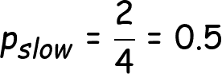

# 什么是熵，为什么信息增益在决策树中很重要？

> 原文：<https://medium.com/coinmonks/what-is-entropy-and-why-information-gain-is-matter-4e85d46d2f01?source=collection_archive---------0----------------------->


> 根据[维基百科](https://en.wikipedia.org/wiki/Entropy_(information_theory))，**熵**指的是无序或不确定性。
> 
> **定义** : **熵**是一堆例子中**杂质**、**无序**或**不确定性**的度量。

## 熵的基本功能是什么？

*熵控制着决策树如何决定* ***拆分*** *数据。它实际上影响了一个* ***决策树*** *如何绘制其边界。*

***熵的方程式:***


Equation of Entropy

# 什么是信息增益，为什么它在决策树中很重要？

> **定义:** **信息增益(IG)** 衡量一个特征给我们多少关于类的“信息”。

## ***为什么要紧？***

*   **信息增益**是**决策树算法**用来构建决策树的主键。
*   **决策树**算法将总是试图最大化**信息增益**。
*   具有最高**信息增益**的**属性**将首先被测试/分割。

***信息增益的方程式:***


Equation of Information gain

## 为了理解熵和信息增益，让我们用一些特征和标签画一个简单的表格。

This example taken from `Udacity` (Introduction to Machine Learning) course

在这个`table`里，

*   `Grade`、`Bumpiness` 和`Speed Limit`是特征，`**Speed**` 是标签。
*   总共四次观察。

***首先，让我们一起来看看*** `**Grade**` ***的功能***

在`Grade`列中有四个值，对应于这些值有四个标签。

让我们将所有标签视为父标签`node`。

```
SSFF => parent node
```

> **那么，这个父节点的熵是多少呢？**

让我们找出答案，

首先，我们需要找出出现在父节点中的示例的*部分。父节点中存在两种类型*(慢速和快速)*的实例，父节点总共包含 4 个实例。*

```
1\. P(slow) => fraction of slow examples in parent node
2\. P(fast) => fraction of fast examples in parent node
```

让我们来看看`P(slow)`，

> p(慢速)=父节点中慢速示例的数量/示例总数



fraction of P(slow) examples

类似地，快速示例`P(fast)`的分数将是，


fraction of P(fast) examples

所以，父节点的**熵**:


entropy of parent node

```
Entropy(parent) = - {0.5 log2(0.5) + 0.5 log2(0.5)}
                = - {-0.5 + (-0.5)}
                = 1 
```

所以父节点的*熵*就是`1`。

> 现在，让我们探索一下**决策树算法**如何基于**信息增益**构建**决策树**

首先让我们检查父节点是否被`Grade`分割。

如果来自`Grade`特征的 ***信息增益*** 大于所有其他特征，则父节点可以被`Grade`分割。

为了找出 `Grade`特征的 ***信息增益，我们需要用`Grade`特征虚拟分裂父节点。***


Virtually split by Grade

现在，我们需要找出这两个子节点的熵。

右侧子节点`(F)`的 ***熵*** 为`0`，*是因为该节点中的所有实例都属于同一个类*。

让我们找出左侧节点`SSF`的 ***熵*** :

在该节点`SSF`中存在两种类型的示例，因此我们需要为该节点分别找出慢速示例 ***和快速示例*** 的分数。

```
P(slow) = 2/3 = 0.667
P(fast) = 1/3 = 0.334
```

所以，

```
Entropy(SSF) **=** - {0.667 log2(0.667) + 0.334 log2(0.334)}
             = - {-0.38 + (-0.52)}
             = 0.9
```

我们也可以通过使用`[scipy](https://docs.scipy.org/doc/scipy/reference/generated/scipy.stats.entropy.html)` 库找出*熵*。

现在我们需要用加权平均找出`Entropy(children)`。

```
Total number of examples in parent node: 4
  "      "    "     "     "   left child node: 3
  "      "    "     "     "   right child node: 1
```

*熵的公式(子带加权平均值)。:*

```
**[Weighted avg]Entropy(children)** = 
(no. of examples in left child node) / (total no. of examples in parent node) * (entropy of left node) 
+ 
(no. of examples in right child node)/ (total no. of examples in parent node) * (entropy of right node)
```


带加权平均值的熵(子代)。is = **0.675**

所以，


Equation of Information gain

```
Information gain(Grade) = 1 - 0.675
                        = 0.325
```

***信息增益*** 来自`Grade`特征`0.325`。

**决策树算法**选择信息增益最高的*来分裂/构建*一棵**决策树。**所以我们需要检查所有的特征以便分割树。

> 来自`Bumpiness`的信息增益


virtually split by Bumpyness

左右子节点的 ***熵*** 相同，因为它们包含相同的类。

***熵(颠簸)*** 和 ***熵(平滑)*** 都等于`1`。

所以， ***【熵(子)】*** 用加权平均。对于`Bumpiness`:

```
[weighted avg.]entropy(children) = 2/4 * 1 + 2/4 * 1
                                 = 1
```

因此，

```
Information gain(Bumpiness) = 1 - 1
                            = 0
```

到现在我们还得到了 ***的信息增益*** :

```
IG(Grade) => 0.325
IG(Bumpiness) => 0
```

> 从`*SpeedLimit*`获得的信息


virtually split by SpeedLimit

左侧子节点的 ***熵*** 将为`0`、*，因为该节点中的所有实例属于同一个类。*

同理，右侧节点的 ***熵*** 为`0`。

于是， ***【熵子】*** 用加权平均。对于`SpeedLimit`:

```
[weighted avg.] entropy(children) = 2/4 *0 + 2/4 *0
                                  = 0
```

于是， ***信息从`SpeedLimit`获得*** :

```
Information gain(SpeedLimit) = 1 - 0
                             = 1
```

## 从所有特性中获得的最终信息:

```
IG(Grade) => 0.325
IG(Bumpiness) => 0
IG(SpeedLimit) => 1
```

> 我们知道，**决策树算法**基于具有最高**信息增益**的特征构建**决策树**

所以，这里我们可以看到`SpeedLimit`拥有最高的 ***信息增益*** *。*因此，该[数据集](https://gist.github.com/78526Nasir/111e6405b7ac0d34823839df42e2fc67)的最终**决策树**将如下所示:


Final Decision Tree

> 加入 Coinmonks [电报频道](https://t.me/coincodecap)和 [Youtube 频道](https://www.youtube.com/c/coinmonks/videos)获取每日[加密新闻](http://coincodecap.com/)

## 另外，阅读

*   [密码电报信号](http://Top 4 Telegram Channels for Crypto Traders) | [密码交易机器人](/coinmonks/crypto-trading-bot-c2ffce8acb2a)
*   [复制交易](/coinmonks/top-10-crypto-copy-trading-platforms-for-beginners-d0c37c7d698c) | [加密税务软件](/coinmonks/crypto-tax-software-ed4b4810e338)
*   [网格交易](https://coincodecap.com/grid-trading) | [加密硬件钱包](/coinmonks/the-best-cryptocurrency-hardware-wallets-of-2020-e28b1c124069)
*   [加密交换](/coinmonks/crypto-exchange-dd2f9d6f3769) | [印度的加密应用](/coinmonks/buy-bitcoin-in-india-feb50ddfef94)