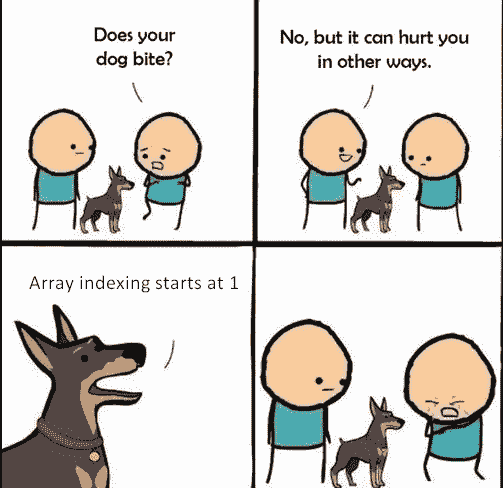
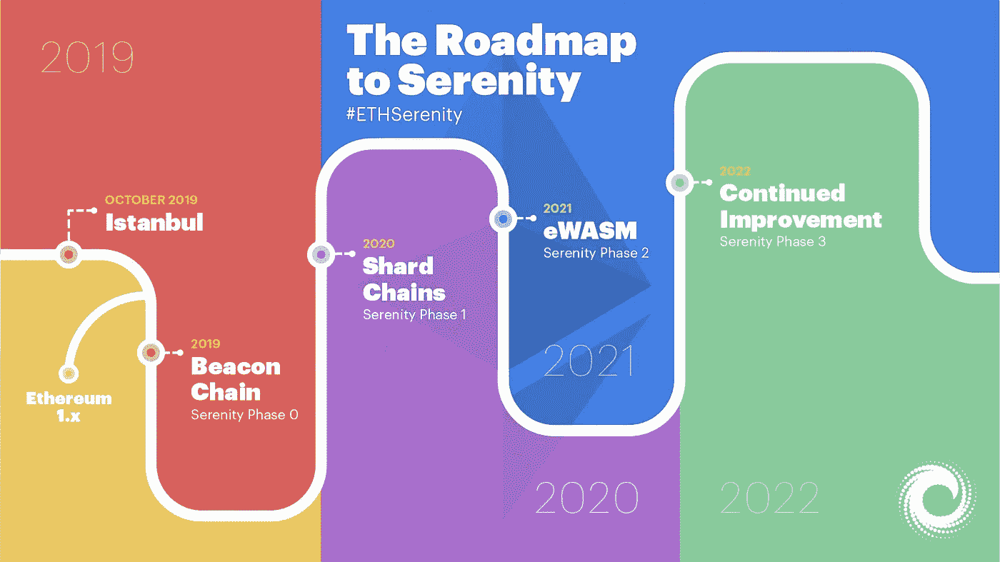
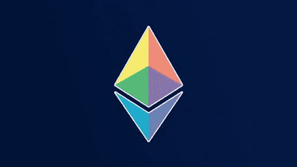

# 什么是 Eth 2.0？以及通往宁静号的路线图。

> 原文：<https://medium.com/coinmonks/what-is-eth-2-0-and-the-roadmap-to-serenity-10820cadf3c4?source=collection_archive---------2----------------------->

# 介绍

对以太坊的批评越来越多，在过去的几年里，有很多批评家说“以太坊太慢了，它有时完全坏掉了。”Vitalik 一直在鼓掌、跳舞，并把他的开发人员召集在一起，想出解决这个问题的最终方案。

# ETH 2.0 的经济变化

我将首先直接进入经济方面，因为我们中的一些人想从以太坊收集被动收入。

将来，一旦 ETH 2.0 发布，你可以通过运行以太坊验证器节点来收集被动以太坊。你可以通过至少锁定 32 ETH 来做到这一点。如果您的 ETH 低于 32，则不允许运行锁定节点。这就是为什么在过去的两年里，每个人都只积累了 32 个 ETH 或更多一点的 ETH，你可以看到含有 32 个 ETH 的钱包在增加。所以有很多人已经做好了迎接这一变化的准备。

您的节点(计算机)需要保持在线，以便投票和参加以太坊评审团。如果它保持离线，就会被扣分。所以，事实上你不仅赚了 ETH 和保持利息，而且你还做了一件非常有价值的工作来保持网络运行。这就是利益证明(POS)机制背后的全部思想。你通过在网络上执行有用的动作来下注。

# 以太坊验证器

截至 2020 年 6 月 8 日，唯一令人难过的是 ETH 2.0 正在测试网络中。你可以在以太坊 Goerli 测试网上免费下注，测试整个过程。

目前，以太坊网络使用工作证明机制来挖掘其网络上的交易块，但一旦我们迁移到 ETH 2.0，矿工评级将开始从工作证明(PoW)放缓至股份证明(PoS)。经济方面将会发生根本性的变化。

> 矿工不会得到奖励，赌注者会得到奖励，人们不会投资视频/图形卡，他们会开始投资以太坊来获得被动收入。

# 那么，这是不是意味着我们应该扔掉我们的以太坊采矿装备？这需要多长时间？

实际上，时间尺度不会像一个 THANOS 快照。

实际上要花很长时间。事实上，它会经历几个阶段。会有三个阶段。

但是作为一名程序员，以太坊团队从零(0)开始。

# 通往宁静的路线图

Roadmap to ETh 2.0 (Serenity)

# 阶段 0:信标链

所以目前发生的事情是，我们正在接近阶段 0。因此，阶段 0 将带来的是信标链。这是这个阶段的主要目标。

现在，从经济学的角度来看，这个阶段非常非常有趣，因为要实现从 ETH 1.x 到 2.0 的转变，你需要这些验证器，需要支撑以太坊。为此，您需要从 ETH 1.x 转换到 ETH 2.0，这将是完全不同的。因为一旦你转换到 ETH 2.0，你将实际上能够转换回来，但你将获得一个特殊的好处，即你将能够下注 ETH 2.0，并开始每天赚取一定的被动收入。

你会得到什么？当然，你会赚更多的 ETH 2.0。所以，这是一种从网络上获得被动收入的方式。

# 第一阶段:分片

现在，进入第一阶段，事情变得非常有趣。

Ethreum Crystal

如果你把以太坊 1.x 看成一个水晶。以太坊的水晶，以太坊 2.0 将会把水晶粉碎成 64 个不同的碎片。

## 你为什么要这么做？

因为 ETH 2.0 shard 现在将具备并行计算的能力。你几乎可以认为它是以太坊的 64 倍，但它实际上将会超出这个数字。碎片将会变得更加强大，并且彼此完全不同。

> 分片在很多数据库中都可以看到。

您可以看到，分片架构在整个数据库领域被广泛采用。但是在区块链网络中，实现起来有点困难。更准确地说，原因是如果每个碎片的操作不同，你将如何在这些碎片之间进行交易？你有什么保证人们不会试图利用这些碎片来复制物品或新硬币？这就是为什么开发人员花了 3 到 4 年的时间想出一个解决方案如此困难的原因。

## 那么第一阶段会发生什么呢？

我们将拥有跨链链接和更强的计算能力。这对开发者来说很困难，因为他们必须选择在哪个碎片上。

与此同时，你不必担心以太坊本身。我们现在所处的主链仍将并行运行。所以，将要发生的一切都将在信标链和交叉碎片中的隔离环境中发生。对于开发人员来说，这更像是一个尝试，试图修复一些东西，不让它们坏掉。它不会影响今天 mainnet 上的主链的运行，所以我们仍然让它们活着。

# 阶段 2:组合和改进

现在，这是所有东西聚集在一起的阶段。这是想法的混合罐。这就是我们所处的主链，工作链的证明将被合并到那些碎片中，并再次成为一个整体。现在以太坊融合在一起，成为以太坊的全部力量。

> 这就像变形金刚聚在一起，形成了一个超级威震天。

迁移并成为威震天说起来容易做起来难。所以现在，关于“是否所有的 ETH 1.0 合同都将迁移到 ETH 2.0”仍然是一个公开的问题，并有待讨论。

# 结论

所以，现在我看到的是，第二阶段将在 2 到 3 年内完成，也许在未来会结束。那时一切都会发生变化，矿工的不确定性也随之而来。因为总的来说，在第 0 阶段和第 1 阶段，开发人员将测试股权证明，看看它是否更安全，或者是否可以像采矿一样。

因此，当事情变得不明朗时，以太坊可能会希望保留一些迁移基础设施，但同时，肯定会有一股巨大的推动力来完全迁移到风险证明。

> 因此，在这里管理期望，我想说的是，它可能需要比开发人员说的更多。

# 我对宁静路线图的看法

当然，这将是直播区块链上最雄心勃勃的项目之一。这将从根本上改变事情的核心，以及网络如何达成共识。以及如何设置基础设施和服务器。

因此，在前进的道路上肯定会有很多小问题，但我肯定很高兴看到所有这些都在向前发展。

> [在您的收件箱中直接获得最佳软件交易](https://coincodecap.com/?utm_source=coinmonks)

