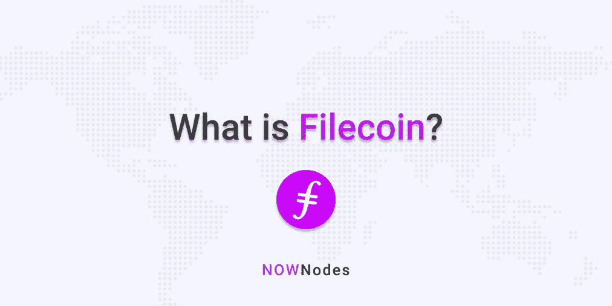

# Filecoin 是什么？—描述性指南

> 原文：<https://medium.com/coinmonks/what-is-filecoin-a-descriptive-guide-fe3ab3a5bbb8?source=collection_archive---------1----------------------->

最初发表于 [NOWNodes 博客](https://nownodes.io/blog/what-is-filecoin-a-descriptive-guide)。

Filecoin 是 Protocol Labs 的子机构，成立于 2014 年。该公司总部位于美国加利福尼亚州的帕洛阿尔托。Filecoin 由 Juan Benet 创建，它既是一种数据存储网络，也是一种基于比特币的电子货币。自推出以来，Filecoin 已经得到了 24 位投资者的支持。迄今为止，它已经筹集了[2.582 亿](https://www.crunchbase.com/organization/filecoin)美元。

Filecoin 的 ICO 是 2017 年密码界讨论最多的事件之一。销售于 2017 年 9 月结束。Filecoin 花了三年多一点的时间才上线。代币于 2020 年 10 月 19 日开始发放。Filecoin 有望创造纪录，成为新区块链最快达到[10 亿美元](https://www.coindesk.com/filecoin-mainnet-now-live)的数字。

# Filecoin 的愿景

Filecoin 的愿景是建立一个去中心化的存储系统，将存储“人类最重要的信息”。当它第一次启动时，创始人 Juan Benet 将其创建为 IPFS 或星际文件系统。

与 AWS 或 Cloudflare 等其他存储提供商不同，Filecoin 旨在使存储服务摆脱集中化的危险。由于区块链网络的分散性，存储在 Filecoin 上的信息是受隐私保护的。文件的所有者是其数据的唯一保管人。没有人能够改变或审查已经存储的数据。同时，可以在需要时检索这些数据。

# 项目的一般描述

Filecoin 相当于一个 P2P 区块链网络。该网络的目的是激励文件在网络上的可靠存储。Filecoin 网络用户设备—存储矿工—用户设备的基本工作流程。让我们试着更详细地理解这个流程。

根据 Filecoin 协议，用户向矿工支付存储文件的费用。一旦矿工收到他们的文件，他们承诺通过 Filecoin 的公共区块链网络存储文件。网络不断验证矿工是否正确存储文件。当需要时，用户再次向矿工付费以检索他们的文件。

区块链有两类利益相关者。一种是想存储他们的文件，另一种是想通过在网络上存储这些文件来赚钱。有趣的是，存储文件的价格并不是由中央权威机构决定的。更确切地说，是公开市场决定了价格。

Filecoin 网络的本地货币表示为 FIL。对于仓储矿工，收入以 FIL 为单位。同样，用户也以 FIL 为单位付费。网络的工作是记录存储矿工和用户之间发生的这些交易。此外，它还记录来自存储挖掘者的证据，以保证他们正确地存储文件。

# Filecoin 对用户的优势

用户通过选择在网络上存储他们的文件在许多方面受益。首先，他们获得了更多的讨价还价的能力。他们可以通过一系列参数来选择矿工，这些参数包括成本、冗余度和速度。因此，定价变得极具竞争性。在同意最合适的矿工之后，用户也有机会验证他们的文件是否被正确存储。

Filecoin 网络的运营优势在于，它可以与网络上的任何矿商讨价还价。它不需要为每个矿工创建单独的 API，因为它发生在任何集中式存储设施中。

# Filecoin 对存储提供商的优势

文件链网络上的存储提供商可以是个人或组织。这些人和组织承担着管理矿工的责任。作为交换，他们获得填充代币。

矿工只不过是一台互联的计算机。计算机必须有备用磁盘空间或具有可用存储容量的专用系统。这些存储空间是专门为 Filecoin 打造的。

Filecoin 网络奖励矿工贡献有用的存储。对于存储提供商来说，回报的形式是获得 Filecoin 用户的整个市场。他们不需要设计单独的 API。有趣的是，他们也不需要为他们的产品做广告。Filecoin 网络代表提供商执行这些功能。

# Filecoin 是如何工作的？

为了在网络内通信，对等体使用安全的信道。他们还使用这些渠道来分发信息、共享数据和发现其他对等点。这些安全的信道在保持消息和块的交换和传输的规则性方面起着关键的作用，即使成千上万的对等体活跃在网络上。

Filecoin 节点也称为 Filecoin 客户端。这些节点或客户端同步并验证每个块中的消息。他们也管理 FIL 钱包。

矿工执行不同类型的交易，每 30 秒追加新区块。存储提供商应该知道运行一个挖掘器需要强大的硬件能力。基本的最低要求包括拥有一个 8 核以上的 CPU、128 GB 的 RAM 和一个强大的 GPU。

Filecoin 网络上有两种交易:存储交易和检索交易。

存储交易是客户和存储矿商之间达成的交易。然而，取回交易是在客户和取回矿工之间达成的。这里要做的一个重要区别是，存储挖掘器和检索挖掘器可能相同，也可能不同。存储交易和检索交易的基本区别在于，后者发生在链外。相关方使用支付渠道来完成交易。

# 硬币令牌组学

Filecoin 的最大供应量是 20 亿代币。流通供应量为 1900 万枚代币。

根据母公司 Protocol Labs 的说法，Filecoin 遵循的模型被称为“数据市场”。五类利益相关者可以交易 FIL 代币。这些利益相关者是客户、矿工、开发者、令牌持有者和生态系统合作伙伴。Filecoin 交易的市场有三种类型:文件存储、文件检索和场内交易。

Filecoin 在 2020 年秋季组织了一场“太空竞赛”。共有 400 名矿工参加了这场“太空竞赛”。测试网络阶段的目标是将 Filecoin 的网络数据容量增加 400 千兆字节。决定向太空竞赛参与者发放 350 万枚国际无舵雪橇联合会代币。

# 最近的发布

在 2017 年 9 月关闭其 ICO 后，Filecoin 花了比平均水平更长的时间推出。在【2020 年 9 月 28 日，该公司宣布它已经启动了主网点火程序。2020 年 10 月 15 日，Filecoin 网络上线。

10 月 15 日分发的代币受制于一个归属时间表。因此，出乎意料的是，流通供应量远远低于 20 亿代币的最大供应量。

在发布后的最初几天，Filecoin 爱好者被要求通过 block explorers 观察它。Filfox 和 Filcan 就是这样的两个区块探索者。这里需要提到的是，这些块管理器显示了关于块高度、挖掘器总数、网络上的顶级挖掘器以及可用存储容量的详细信息。

说到 Filecoin 去中心化应用或 DApps，至少有两个需要提及。第一个是石板。它由 Filecoin 驱动。Slate 是一个文件共享网络，它利用分散存储的概念来收集、组织和链接文件。

另一个是纺织品。Textile 的目标是为开发者提供一个分散的数据库。此外，它还提供基于 IPFS 的存储和内容托管。换句话说，Textile 可以被描述为连接和扩展 Libp2p、IPFS 和 Filecoin 的工具提供商。

# 摘要

尽管多次推迟，Filecoin 的推出还是大受欢迎。它引起了密码社区的极大关注。中国投资者对此特别感兴趣。据报道，他们已经在平台的采矿硬件和原生令牌 FIL 上下了很大的赌注。多家交易所热衷于上市 FIL 代币。预计将有近 3，500 个实体收到 FIL 令牌。

尽管在满足拟议的时间表方面出现了一些小问题，但 Filecoin 被视为从充满争议的 ICO 时代脱颖而出的最精心执行、专业打造的有价值项目之一。

## 另外，阅读

*   最佳加密交易机器人
*   最好的比特币[硬件钱包](/coinmonks/the-best-cryptocurrency-hardware-wallets-of-2020-e28b1c124069?source=friends_link&sk=324dd9ff8556ab578d71e7ad7658ad7c)
*   最好的[加密税务软件](/coinmonks/best-crypto-tax-tool-for-my-money-72d4b430816b)
*   [最佳加密交易平台](/coinmonks/the-best-crypto-trading-platforms-in-2020-the-definitive-guide-updated-c72f8b874555)
*   [unis WAP 最佳钱包](/coinmonks/best-wallets-to-use-uniswap-e91a6385d9e8)
*   最佳[密码借贷平台](/coinmonks/top-5-crypto-lending-platforms-in-2020-that-you-need-to-know-a1b675cec3fa)
*   [block fi vs Celsius](/coinmonks/blockfi-vs-celsius-vs-hodlnaut-8a1cc8c26630)vs Hodlnaut
*   [莱杰 vs 特雷佐](/coinmonks/ledger-vs-trezor-best-hardware-wallet-to-secure-cryptocurrency-22c7a3fd391e)
*   [顶级 DeFi 项目](/coinmonks/defi-future-10-promising-projects-in-the-defi-world-ff2b697ab006)
*   [bits gap review](https://blog.coincodecap.com/bitsgap-review)——一个轻松赚钱的加密交易机器人
*   为专业人士设计的加密交易机器人
*   [3commas Review](https://blog.coincodecap.com/3commas-review-an-excellent-crypto-trading-bot) |一款优秀的密码交易机器人
*   [3Commas vs Cryptohopper](/coinmonks/cryptohopper-vs-3commas-vs-shrimpy-a2c16095b8fe)
*   Bitmex 的[保证金交易指南](/coinmonks/the-idiots-guide-to-margin-trading-on-bitmex-dbbd7742c6fc?source=friends_link&sk=7bfa99d2a181142510c8442c8ddb0786)
*   加密摇摆交易的权威指南
*   [Bitmex 高级保证金交易指南](/coinmonks/bitmex-advanced-margin-trading-guide-2270c195ce25?source=friends_link&sk=1d986cca731f5084b9a2db4a4bc4a7ad)
*   [开发者最佳加密 API](/coinmonks/best-crypto-apis-for-developers-5efe3a597a9f)
*   [加密套利](/coinmonks/crypto-arbitrage-guide-how-to-make-money-as-a-beginner-62bfe5c868f6)指南:新手如何赚钱
*   顶级[比特币节点](https://blog.coincodecap.com/bitcoin-node-solutions)提供商
*   最佳[加密制图工具](/coinmonks/what-are-the-best-charting-platforms-for-cryptocurrency-trading-85aade584d80)
*   了解比特币的[最佳书籍有哪些？](/coinmonks/what-are-the-best-books-to-learn-bitcoin-409aeb9aff4b)

> [直接在您的收件箱中获得最佳软件交易](https://coincodecap.com?utm_source=coinmonks)

