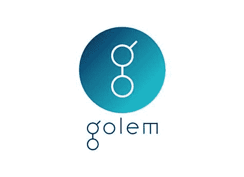

# 什么是假人？

> 原文：<https://medium.com/coinmonks/what-is-golem-32a627b8a544?source=collection_archive---------1----------------------->

假人(GNT)是一个在云中分散管理计算能力的系统。开发者也简单地称它为计算机能力的“Airbnb”。该网络的用户可以将免费的计算能力分配给需要的用户，并为此获得货币 GNT 的报酬。

假人于 2015 年推出，作为在互联网上提供计算能力的分散式服务。从这个意义上说，假人开发商明白…