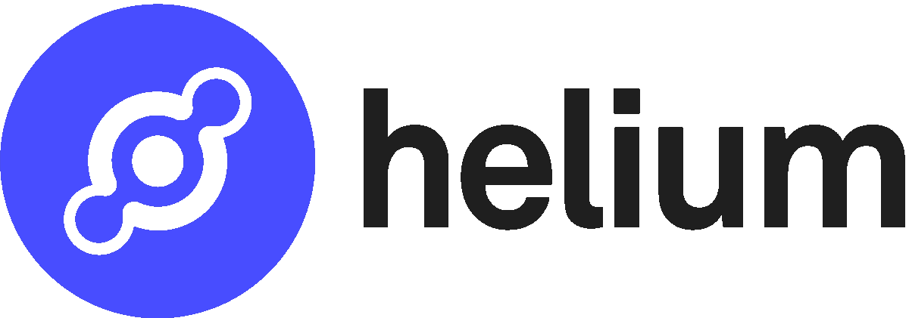

# 氦网是什么？

> 原文：<https://medium.com/coinmonks/what-is-helium-network-fad1dc1e09c2?source=collection_archive---------0----------------------->

## “人民网络”致力于构建全球物联网

氦于 2019 年 7 月推出，是一个远程无线热点的分布式网络。目标是为物联网(IoT)设备创建一个区块链供电的网络，创建他们所谓的“人民网络”。

Source: helium.com

**什么是物联网？**

物联网的理念是拥有一个可以连接任何设备的全球网络。它可以为数量惊人的设备提供许多附加功能。这可以是烤面包机，狗项圈，灯泡，几乎任何你能想到的东西。虽然它的核心意思是任何连接到互联网的设备，但使用它来定义相互“交谈”的设备已经变得越来越流行。

连接到 Google Home 或亚马逊 Alexa 等“中枢”的智能设备就属于这一类。这些产品是物联网设备中最容易识别的。

对于大多数物品是否需要连接到互联网，仍有很多争论。这确实引起了一些隐私问题。然而，有许多产品和人开始接受这个想法，它的受欢迎程度正在稳步上升。

这就是氦的用武之地。该项目旨在创建一个支持物联网设备的全球、可靠、分散的网络。蜂窝网络和公共 WiFi 已经为物联网提供了一些框架，但它们的问题是价格和可用性。

氦已经在农业、环境、宠物护理、资产跟踪等领域建立了合作伙伴关系。随着这个合作网络的发展，这项服务将变得更加强大，能够为许多不同的用户提供服务。看看目前支持的生态系统可以找到[这里](https://www.helium.com/ecosystem)。

## **保修证明**

社区运行的热点充当网络的主干。平均而言，它们的覆盖面积是 WiFi 的 200 多倍。那些提供可靠和诚实的无线覆盖的公司将通过他们新的覆盖证明机制获得 HNT 奖。

热点是通过从 Helium 网站购买合适的矿工来设置的。每一个都经过氦测试，以确保它们在网络上完全正常工作。有几种不同的可以选择，每种都有不同的好处。你可以得到室内或室外矿工，这取决于你想把设备放在哪里。一个矿工的平均价格在 400 美元左右。

奖励会因一些不同的变量而有所不同。最大的一个是你范围内的其他矿工。单个矿工只能发出挑战，不能直接参与覆盖范围的证明。因此，他们仍将赚钱，但速度比其他人慢。[覆盖范围图](https://explorer.helium.com/coverage)提供了一些对潜在收益的额外洞察。

现在，覆盖范围证明是一种专门为氦创造的新型共识机制。PoC 验证热点是否代表其声称的位置。PoC 利用矿工产生的无线电频率来验证他们和其他参与者。网络挑战涉及三个角色:

**挑战者** —这是创建和发布挑战的热点。这大约每 240 个块发生一次。

**发射器**——这是挑战的目标。它发出挑战数据包，并依赖于被附近的其他节点看到。

**见证** —这些热点靠近发射机，确认发射机数据包的有效性。

一个热点在每个时期扮演的角色决定了他们获得多少奖励。这又让我回到之前提到的单身热点赚的少。仅挑战一项就赚了可用奖励的 0.95%左右。反之，见证人最高可赚 21.24%。实际奖励金额也可以根据热点参与 PoC 的程度而变化。

PoC 提供了一种低功耗的方式来赚取一些额外的硬币，同时加强网络。大多数热点仅使用大约 5W 的功率，这已经大大低于消费台式机挖掘硬币的功率。值得注意的是，初期投资意义重大。但在撰写本文时，这枚硬币的价值为 14 美元，如果你在一个好的位置，它可以很快得到回报。

## **最终想法**

如果你处在一个有利的位置，赚钱的潜力会很大。我观察的一些高密度区域显示每天 5 HNT 的奖励，相当于每天 72 美元。所有这些都使它成为未来需要密切关注的项目。

氦的 2021 年路线图为网络提供了许多变化。覆盖范围证明的更改、标记、验证器的添加、钱包的更新以及许多幕后升级都在进行中。你可以在这里看到完整的路线图。我认为 it 的未来是充满希望的，因为物联网的应用越来越广泛。

> 加入 Coinmonks [电报频道](https://t.me/coincodecap)和 [Youtube 频道](https://www.youtube.com/c/coinmonks/videos)获取每日[加密新闻](http://coincodecap.com/)

## 另外，阅读

*   [复制交易](/coinmonks/top-10-crypto-copy-trading-platforms-for-beginners-d0c37c7d698c) | [加密税务软件](/coinmonks/crypto-tax-software-ed4b4810e338)
*   [电网交易](https://coincodecap.com/grid-trading) | [加密硬件钱包](/coinmonks/the-best-cryptocurrency-hardware-wallets-of-2020-e28b1c124069)
*   [最佳加密交易所](/coinmonks/crypto-exchange-dd2f9d6f3769) | [印度最佳加密交易所](/coinmonks/bitcoin-exchange-in-india-7f1fe79715c9)
*   [面向开发人员的最佳加密 API](/coinmonks/best-crypto-apis-for-developers-5efe3a597a9f)
*   [密码电报信号](http://Top 4 Telegram Channels for Crypto Traders) | [密码交易机器人](/coinmonks/crypto-trading-bot-c2ffce8acb2a)
*   最佳[密码借贷平台](/coinmonks/top-5-crypto-lending-platforms-in-2020-that-you-need-to-know-a1b675cec3fa)
*   杠杆代币的终极指南
*   [加密交易的最佳 VPN](https://coincodecap.com/best-vpns-for-crypto-trading)
*   [火币的加密交易信号](https://coincodecap.com/huobi-crypto-trading-signals) | [HitBTC 审查](/coinmonks/hitbtc-review-c5143c5d53c2)
*   [TraderWagon 回顾](https://coincodecap.com/traderwagon-review) | [北海巨妖 vs 双子座 vs BitYard](https://coincodecap.com/kraken-vs-gemini-vs-bityard)
*   [如何在 FTX 交易所交易期货](https://coincodecap.com/ftx-futures-trading)
*   [OKEx vs KuCoin](https://coincodecap.com/okex-kucoin) | [摄氏替代品](https://coincodecap.com/celsius-alternatives) | [如何购买 VeChain](https://coincodecap.com/buy-vechain)
*   [3 commas vs . Pionex vs . crypto hopper](https://coincodecap.com/3commas-vs-pionex-vs-cryptohopper)
*   [如何使用 Cornix 交易机器人](https://coincodecap.com/cornix-trading-bot)
*   [Bitget 回顾](https://coincodecap.com/bitget-review) | [双子座 vs BlockFi](https://coincodecap.com/gemini-vs-blockfi) cmd| [OKEx 期货交易](https://coincodecap.com/okex-futures-trading)
*   [用信用卡购买密码的 10 个最佳地点](https://coincodecap.com/buy-crypto-with-credit-card)