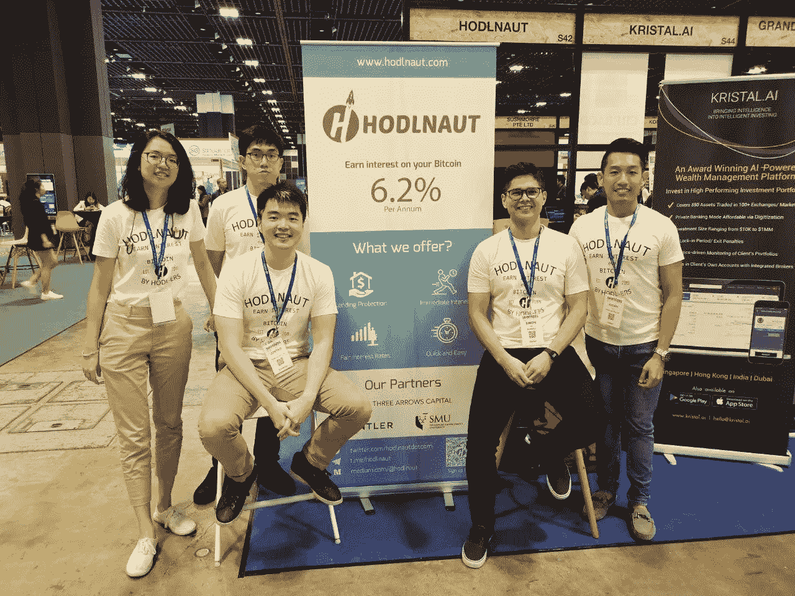
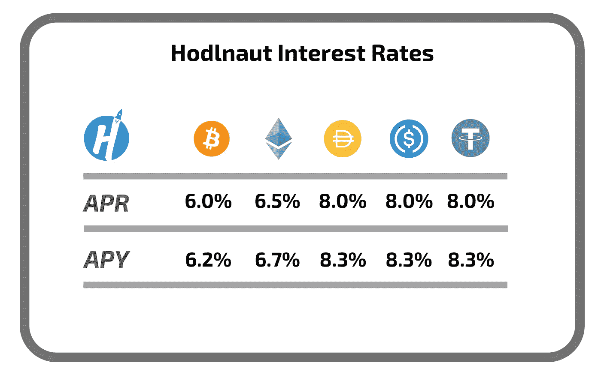

# 《霍德瑙特评论》——天天赚密码(2022)

> 原文：<https://medium.com/coinmonks/what-is-hodlnaut-the-beginners-guide-to-hodl-ing-with-hodlnaut-8e4f2005e28c?source=collection_archive---------1----------------------->

Hodlnaut 是一家总部位于新加坡的金融科技初创公司，为个人投资者和加密爱好者提供金融服务。始于 2019 年 4 月的 Hodlnaut 正在迅速崛起，成为亚洲最有前途的加密贷款平台之一。通过其简单的产品供应和专门的支持， [Hodlnaut](/coinmonks/hodlnaut-review-best-way-to-hodl-is-to-earn-interest-on-your-bitcoin-6658a8c19edf) 的使命是帮助 hodl-ers 轻松获得其数字资产的更多收益。

如果你在加密领域，你可能听说过术语“hodl”。2013 年，一名加密用户将单词“hold”拼错，这是一个俚语，用来描述持有加密货币而不是出售加密货币的行为。密码用户持有他们的密码，希望其价值在未来会升值，这样他们就可以从他们的资产中获得更多。但是，hod ling 并不是产生更多收益的唯一方法，还有其他方法可以从您的数字资产中赚取更多，而且您甚至不必在它上面花一分钱。

> 另外，请阅读我们的[霍德瑙特评论](/coinmonks/hodlnaut-review-best-way-to-hodl-is-to-earn-interest-on-your-bitcoin-6658a8c19edf)

# 霍德瑙特是什么？

由两位比特币狂热分子祝俊涛和西蒙·李(Simon Lee)创立的 Hodlnaut 允许霍德勒人充分利用他们的加密货币。通过该平台，创始人旨在为霍德勒提供一种替代解决方案，让他们能够提高数字资产的生产率。通过将资产以加密贷款的形式借给经过严格审查的保证金交易商，Hodlnaut 能够通过利息账户向用户提供有吸引力的利率。

该项目得到了一些亚洲领先公司的支持，如 Sparrow、新加坡管理大学和 BitGo。此外，霍德诺特是安特尔投资公司的一部分，安特尔投资公司是一家支持早期创业公司的全球风险投资公司。

资质方面， [Hodlnaut](/coinmonks/hodlnaut-review-best-way-to-hodl-is-to-earn-interest-on-your-bitcoin-6658a8c19edf) 是新加坡金融科技协会(新加坡金融管理局认可的资质)认证的金融科技公司。此外，该公司符合所有数字支付令牌许可证的要求，并已提交所有必要的文件，目前正处于新加坡标准支付机构许可证的[审查流程](https://www.mas.gov.sg/regulation/payments/entities-that-have-notified-mas-pursuant-to-the-ps-esp-r)。

Hodlnaut 提供两种主要产品。Hodlnaut 利息账户和[机构贷款](https://www.hodlnaut.com/corporates)，让我们看看每一个产品。

# Hodlnaut 利息账户:从您的加密货币中赚取诱人的利息

霍德瑙特利息账户允许您赚取高达 8.3%的年回报率(APY)。每周一以实物形式赚取和支付利息。目前，该平台支持五种资产类别:比特币(BTC)、以太坊(ETH)、戴(Dai)、美元币(USDC)和系绳(USDT)。霍德瑙特的现行利率范围为 6.2% APY-8.3% APY，具体如下:

用户根据市场需求和前一个月的收入自动获得最佳利率。没有最低存款额，你可以随时取款。通过将你的加密货币存入 [Hodlnaut 利息账户](/coinmonks/hodlnaut-review-best-way-to-hodl-is-to-earn-interest-on-your-bitcoin-6658a8c19edf)，你可以毫无争议地提高资产的生产率。

如果你希望从当前公布的利率中赚取更多， [Hodlnaut](/coinmonks/hodlnaut-review-best-way-to-hodl-is-to-earn-interest-on-your-bitcoin-6658a8c19edf) 向那些用 Hodlnaut 定期贷款存款超过 100 BTC(或等值货币)的人提供更高的利率。该 VIP 计划目前支持的资产和利率如下:BTC 为 **6.7% APY** ， **ETH 为 7.2% APY** ， **USDC 为 10.5%** 。定期存款利率是指示性的，可根据协商进行调整。

# Hodlnaut 机构贷款:使用您的加密货币作为抵押获得信用额度

通过 Hodlnaut，您可以以市场上最低的利率借用数字资产。对于机构客户，Hodlnaut 可以定制贷款，以满足客户的特定业务需求。此外，Hodlnaut 将成为所有贷款的交易对手。

霍德瑙特机构贷款的一些快照:

*   5 万美元起的贷款
*   你可以选择无固定期限或 3 个月以上的固定期限
*   灵活的贷款价值比，25%至 100%
*   没有隐藏费用

您从这些加密贷款中获得的资金可用于分散您的加密投资或满足您的业务需求。因为它们通常根据贷方以更复杂的方式构建，所以条款和条件可能不同。目前，加密贷款只适用于机构和贷款，而不是个人。

# 和霍德瑙特去 HODL 有多安全？

作为中央金融(CeFi)加密借贷平台，Hodlnaut 要求所有用户完成一个[了解你的客户(KYC)](https://blog.hodlnaut.com/what-is-kyc-and-why-important/) 验证过程。这是为了遵守新加坡金融管理局颁布的条例。

在平台安全性方面，它运行在安全的亚马逊网络服务(AWS)云基础设施上，并使用行业级 SSL 加密。此外，[霍德瑙特](/coinmonks/hodlnaut-review-best-way-to-hodl-is-to-earn-interest-on-your-bitcoin-6658a8c19edf)在他们的服务器上加密和匿名尽可能多的数据。所有用户都可以选择并被鼓励为所有帐户交易启用双因素身份验证(2FA ),以确保更高的安全性。该公司采取了安全第一的方法，在霍德瑙特没有热钱包。

# 最后

随着比特币等加密货币的价格迅速上涨，霍德勒和个人投资者对增加资产的需求也越来越大。拥有来自 1000 多名用户的超过 7000 万美元的资产，Hodlnaut 将自己定位为用户可以安全轻松地从其加密货币中产生收益的替代方案之一。在一个小型但专注的团队的支持下，Hodlnaut 准备通过提供具有吸引力和创新性的加密产品来丰富加密货币生态系统。

[今天就注册一个 Hodlnaut 利息账户](https://app.hodlnaut.com/signup)，开始在你的 Join Coinmonks [电报频道](https://t.me/coincodecap)和 [Youtube 频道](https://www.youtube.com/c/coinmonks/videos)上赚取更多收益，了解加密交易和投资

## 另外，阅读

*   [Bookmap 评论](https://coincodecap.com/bookmap-review-2021-best-trading-software) | [美国 5 大最佳加密交易所](https://coincodecap.com/crypto-exchange-usa)
*   最佳加密[硬件钱包](/coinmonks/hardware-wallets-dfa1211730c6) | [Bitbns 评论](/coinmonks/bitbns-review-38256a07e161)
*   [新加坡十大最佳加密交易所](https://coincodecap.com/crypto-exchange-in-singapore) | [购买 AXS](https://coincodecap.com/buy-axs-token)
*   [红狗赌场评论](https://coincodecap.com/red-dog-casino-review) | [Swyftx 评论](https://coincodecap.com/swyftx-review) | [造币厂评论](https://coincodecap.com/coingate-review)
*   [投资印度的最佳密码](https://coincodecap.com/best-crypto-to-invest-in-india-in-2021)|[WazirX P2P](https://coincodecap.com/wazirx-p2p)|[Hi Dollar Review](https://coincodecap.com/hi-dollar-review)
*   [加拿大最佳加密交易机器人](https://coincodecap.com/5-best-crypto-trading-bots-in-canada) | [库币评论](https://coincodecap.com/kucoin-review)
*   [火币加密交易信号](https://coincodecap.com/huobi-crypto-trading-signals) | [HitBTC 审核](/coinmonks/hitbtc-review-c5143c5d53c2)
*   [TraderWagon 回顾](https://coincodecap.com/traderwagon-review) | [北海巨妖 vs 双子星 vs BitYard](https://coincodecap.com/kraken-vs-gemini-vs-bityard)
*   [如何在 FTX 交易所交易期货](https://coincodecap.com/ftx-futures-trading) | [OKEx vs 币安](https://coincodecap.com/okex-vs-binance)
*   [OKEx vs KuCoin](https://coincodecap.com/okex-kucoin) | [摄氏替代品](https://coincodecap.com/celsius-alternatives) | [如何购买 VeChain](https://coincodecap.com/buy-vechain)