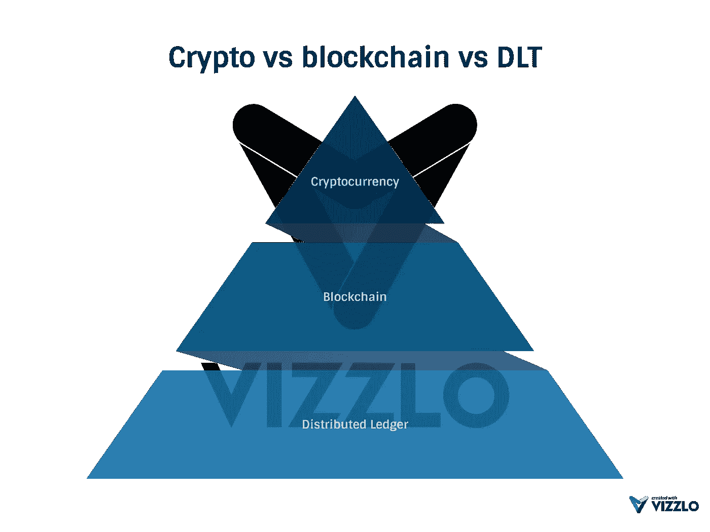
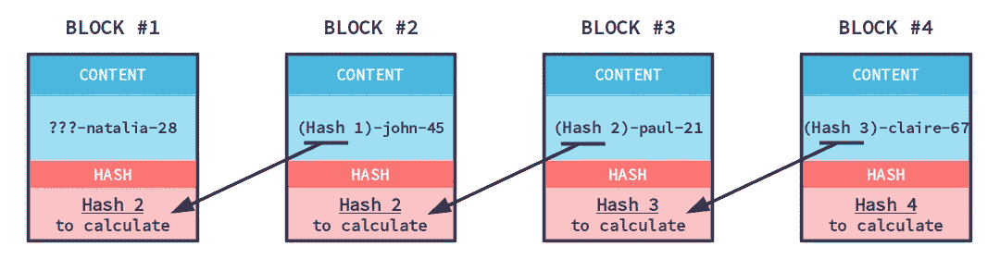

# 什么是 IBM Hyperledger Fabric

> 原文：<https://medium.com/coinmonks/what-is-ibm-hyperledger-fabric-117f7e36c15b?source=collection_archive---------2----------------------->

到目前为止，我们都知道什么是加密货币。在街上随便找一个人解释一下，他很可能会说“互联网货币”之类的话。

请这个人解释什么是区块链。它走得比“比特币就是以此为基础”更远的可能性将会很低。

我听到不同的人对区块链有不同的定义。显然，在这一点上没有真正的共识。当我谷歌“定义区块链”时，它给我

> 区块链
> 
> /ˈblɒktʃeɪn/
> 
> *名词*
> 
> 名词:**区块链**；复数名词:**区块链**；名词:**区块链**；复数名词:**区块链**
> 
> 一种数字分类账，其中以比特币或另一种加密货币进行的交易按时间顺序公开记录。
> 
> “我们实际上可以看看区块链，看看正在发生什么的证据”

我不满意这个定义。“用比特币或另一种加密货币进行的交易”这部分我不同意。区块链不需要加密货币！

不使用加密货币的区块链非常罕见。这就是为什么它经常被视为同一件事。不使用区块链的加密货币据我所知是不存在的。因此，我们可以说每个加密货币都是区块链，但不是每个区块链都是加密货币。

对于分布式账本和区块链，我们也可以这么说。每个区块链都是分布式账本，但不是每个分布式账本都是区块链。

我希望这能澄清一些事情:-)

现在的问题是:什么是分布式账本？

> **分布式分类账**是一个数据库，它在分布于多个地点、机构或地理位置的网络上被一致共享和同步。它允许交易有公共“证人”，从而使网络攻击更加困难。

我可以接受这个定义。分布式分类帐(DLT)是一种分布式数据库。

那么是什么让区块链不同于 DLT 将军呢？
区块链将取决于之前的数据。所以没有数据应该被删除或更新，只有附加的 DLT 没有这个限制。

每次添加新数据时，它永远不会被更改！这意味着您可以跟踪每一次更新/删除，因为它将永远存在。

## 超分类帐结构

Hyperledger 面料是区块链。它没有绑定货币，因此不是加密货币。它旨在为各种企业提供区块链电力。

**这是一个许可系统**。这意味着你有比其他用户能做更多的用户。看一个传统的商业网络。有些人被允许比其他人做得更多。在 Hyperledger Fabric 中也是如此。

它有频道。与其他每个人都可以看到整个区块链的区块链不同，它可以设置为只显示用户有权访问的数据。
想象一个基于 Hyperledger 架构的 ERP 系统。公司 A 可以看到公司 A & B 和公司 A & B 和公司 A & C 之间的所有相关数据，但是公司 B 看不到公司 C 的数据。A & B 和 A & C 之间的链接称为通道。

**它运行 chaincode。**你可以在智能契约(称为 chaincode)中放入任何你想要的业务逻辑。

**它的速度极快**。与其他区块链相比，它的速度非常快(+1000 交易/秒)

Hyperledger fabric 是区块链的一项全面业务。它速度快，灵活性强，有 IBM 做后盾。**如果您想要存储、共享和保护数据。Hyperledger 织物是一条出路。**

> 如果你喜欢这篇文章，请给我一些掌声。我会在未来分享更多的文章，所以不要忘记关注，如果你认为你的朋友会喜欢这篇文章，请随时与他们分享。感谢阅读👐

> [直接在您的收件箱中获得最佳软件交易](https://coincodecap.com/?utm_source=coinmonks)

