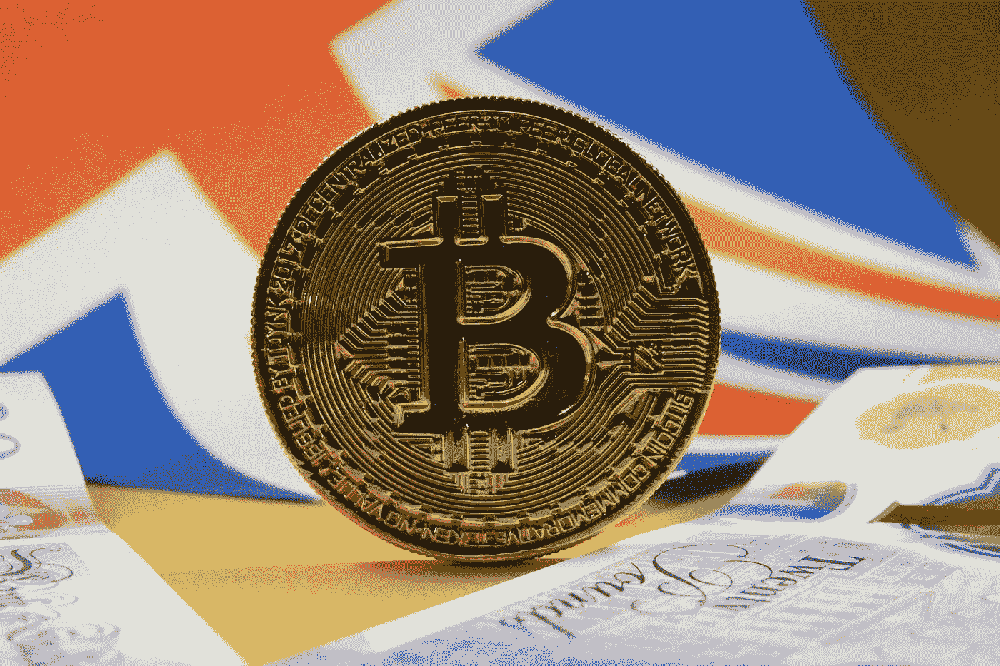

# 什么是首次 Dex 发售或 IDO？IDO 筹款的好处

> 原文：<https://medium.com/coinmonks/what-is-initial-dex-offering-or-ido-the-benefits-of-ido-fundraising-b8f4eb26e058?source=collection_archive---------3----------------------->

Photo by [Ewan Kennedy](https://unsplash.com/@ewankennedy19?utm_source=medium&utm_medium=referral) on [Unsplash](https://unsplash.com?utm_source=medium&utm_medium=referral)

初始 DEX 发售或 IDO 是一种新的筹资模式，提供更好的加密资产流动性，更快，公开和公平的交易。IDO 模式是 ICO、STO、IEO 等筹资模式的继承者。

在我们学习首次发行 Dex 之前，让我们先复习一下通过代币销售筹资的概念。如果一家公司想要筹集资金来制造新产品或扩大业务，它有多种选择。传统的选择是向银行和风投寻求金融贷款或投资。

然而，自从加密货币——比特币和以太坊——取得成功后，更多的公司将其作为通过代币销售筹集资金的工具。在这里，该公司将创建加密令牌并向公众发行，以换取比特币、以太坊、其他主要加密货币和法定货币。这一过程被称为通过代币发行筹资。

代币销售有不同的方法，即首次硬币发售或 ICO、安全代币发售或 s to、首次交易所发售或 IEO，以及最新的方法—首次 Dex 发售或 IDO。

# 什么是首次 Dex 发行(IDO)？

*   IDO 是一种筹资方法，通过分散流动性交易所发行代币。
*   分散流动性交易所是一种加密资产交易所，它依赖于流动性池，交易者可以与流动性池交换令牌。
*   流动性池是成对的加密资产和稳定的硬币。例如，USDT/ETH 是一对流动性组合。交易者可以根据市场情况在加密资产和稳定硬币之间进行互换。由于 stablecoins 的波动性可以忽略不计，它为交易员提供了一个安全的选择，通过相互交换来管理加密令牌和资产的高波动性。
*   因此，分散式流动性交易所使企业能够发行代币，获得即时流动性。

在 IDO 中，代币通过分散流动性交易所发行，如 Uniswap、Bancor 或币安。第一届 IDO 由币安·德克斯主持。根据他们的说法，这种筹资方法使交易者能够获得协议，而不受他人控制。此外，由于 IDO 可以由任何人自行组织，它不承担任何保证或担保，因为发行者控制着活动。

# IDO 和 IEO/ICO/STO 的区别

那么，它与加密领域早期的筹资方式有何不同？

在 ICO 的案例中，这与首次公开募股(IPO)过程相同，发行人管理所有责任。相比之下，在 IEO，这是由一个集中的交换主机完成的。当我们将 IDO 与其他两种方法进行比较时，我们可以看到它基本上是 ICO 和 IEO 的结合。唯一的区别是，IDO 用一个去中心化的交易所(DEX)取代了集中式交易所(CEX)。

在证券代币发行(STO)的情况下，投资合同由证券代币支持。STO 处理提供货币利润的资产。此外，STO 遵守政府法规，而在后者，法规尚未制定。

初始交换提供(IEO)和 IDO 几乎相同；我们甚至可以称伊多为新 IEO。在这两种方法中，组织可以直接将代币交换给个人投资者或交易者。但是在伊多，你不需要像在 IEO 那样支付交易费，因为它是自我组织和分散的。此外，IDO 解决了与 IEO 相关的一些问题，例如，在大多数情况下，发行者不允许在竞争交易所上市代币。发行者还需要支付大量的代币或者支付一大笔钱来将代币上市。而且。发行人无法控制筹资的参数

## 首次发行 Dex 的例子

正如我们已经讨论过的，作为币安的创意，第一个 IDO 是在《渡鸦协议》上。Raven 协议实际上是一种分布式深度学习训练协议，用于提供经济高效、更快的深度神经网络训练。2019 年 6 月 17 日上市，持有 24 小时。总共分配了 3%的代币供应量，每个渡鸦代币的价值上升到 0.00005 BNB。

IDO 的另一个例子是 UMA 协议，这是一个基于以太坊的平台，用于发行和交易合成资产。最近，一个分散的自治组织 MahaDAO 宣布，他们将推出 IDO for MAHA，这是他们的治理标志。据发行者称，这种代币监管着世界上第一种不贬值的加密货币 ARTH。

# IDO 模式有什么好处？

*   **公开公正的募捐**

通常，在代币发行法中，代币一上市，私人投资者就会以较低的价格购买大量代币。他们将这些代币转售给普通大众，从而获得巨额利润。使用 IDO 筹款方法，公司，尤其是初创公司，不需要集中交易所和许可来启动筹款活动。此外，任何人都可以组织或参与 IDO，而不仅仅是私人投资者。

*   **快速交易**

IDO 的另一个好处是令牌可以立即交易。这样，投资者可以在代币发行时快速购买代币，并在 IDO 期间以更高的价格转售。例如，在 UMA 协议筹款期间，最初 0.26 美元的令牌价格立即飙升至 2 美元左右。

*   **即时流动性**

流动性意味着在市场上轻松买卖的能力。或者，简单地说，你能多快拿到你的现金。在 IDO 中，项目的代币获得即时流动性，这有利于代币价格。

# 如何推出 IDO？

根据币安·德克斯的说法，一个 IDO 可以由令牌发行者完全独立地组织。它可以通过项目自身的 It 系统离线进行，也可以通过发行方自身的交易在区块链在线进行。

# IDO 模式有什么问题？

现在是时候看看这种新的筹资模式的问题了。

*   分散交换意味着没有控制机制。这是一个优势如何反过来变成劣势的例子。当谈到筹资时，重要的是对它有一些控制，就像在 ICO、s to 和 IEO 模型中那样。
*   当投资者交换代币时，代币价格可以变化。只有少数投资者能够以挂牌的代币价格购买代币。这就导致了下面这一点。
*   持有大量代币的投资者 Whales 可以操纵代币价格，因为在 IDO 中购买代币没有限制。这会产生一个粘合曲线模型。因此，代币发行者不知道他们通过代币发行活动筹集了多少资金。
*   当代币价格开始波动时，投资者必须立即决定是否投资一个新的掉期上市。假代币在 IDO 上市以获得一些初始流动性的机会增加了。这种流动性地毯的拉力会让投资者损失他们的钱。
*   没有 KYC 整合，这意味着没有关于投资者的有效信息。

领先的加密研究公司 Messari 在他们的 Twitter handle 上表示，初始事件表明 IDO 是初始硬币发行(ICO)的转世，并警告普通投资者通过分析供应时间表和理解人群心态来学习如何“避免被抛弃”。

# IDO 模式的未来如何？

首次公开募股(IDO)方法的引入在一定程度上解决了其前身 ICO、STO 和 IEO 的问题。在分散交易模式下，组织筹款活动不需要获得许可，但它确实能筹集到资金。

然而，与此同时，它留下了漏洞，鲸鱼和骗子可以利用，影响代币发行者的问题，如即时价格波动。

当然，首次公开募股(IDO)是加密筹资的下一步。但是需要做很多工作。将控制机制集成到现有的 IDO 模型中是很重要的。这有助于消除代币价格的波动，直到筹款结束。此外，通过利用 KYC 法规，发行者可以获得对谁购买多少代币的更多控制权。

> 加入 Coinmonks [Telegram group](https://t.me/joinchat/PmKOYQ9NNKZlZGNl) 并了解加密交易和投资

## 另外，阅读

*   最好的[密码交易机器人](/coinmonks/crypto-trading-bot-c2ffce8acb2a) | [电网交易机器人](https://blog.coincodecap.com/grid-trading)
*   [加密复制交易平台](/coinmonks/top-10-crypto-copy-trading-platforms-for-beginners-d0c37c7d698c) | [如何在 WazirX 上购买比特币](/coinmonks/buy-bitcoin-on-wazirx-2d12b7989af1)
*   【Crypto.com 评论】|[|](/coinmonks/crypto-com-review-f143dca1f74c)|[信用交易](/coinmonks/huobi-margin-trading-b3b06cdc1519)
*   [尤霍德勒 vs 科恩洛 vs 霍德诺特](/coinmonks/youhodler-vs-coinloan-vs-hodlnaut-b1050acde55a) | [Cryptohopper vs 哈斯博特](https://blog.coincodecap.com/cryptohopper-vs-haasbot)
*   [杠杆代币](/coinmonks/leveraged-token-3f5257808b22) | [最佳密码交易所](/coinmonks/crypto-exchange-dd2f9d6f3769) | [Paxful 点评](/coinmonks/paxful-review-4daf2354ab70)
*   [如何在印度购买比特币？](/coinmonks/buy-bitcoin-in-india-feb50ddfef94) | [WazirX 评论](/coinmonks/wazirx-review-5c811b074f5b) | [BitMEX 评论](https://blog.coincodecap.com/bitmex-review)
*   [双子座 vs 比特币基地](https://blog.coincodecap.com/gemini-vs-coinbase) | [比特币基地 vs 北海巨妖](https://blog.coincodecap.com/kraken-vs-coinbase) | [硬币罐 vs 硬币点](https://blog.coincodecap.com/coinspot-vs-coinjar)
*   [币安 vs 北海巨妖](https://blog.coincodecap.com/binance-vs-kraken) | [美元成本平均交易机器人](https://blog.coincodecap.com/pionex-dca-bot)
*   [印度比特币交易所](/coinmonks/bitcoin-exchange-in-india-7f1fe79715c9) | [比特币储蓄账户](/coinmonks/bitcoin-savings-account-e65b13f92451)
*   [币安收费](/coinmonks/binance-fees-8588ec17965) | [Botcrypto 审查](/coinmonks/botcrypto-review-2021-build-your-own-trading-bot-coincodecap-6b8332d736c7) | [Hotbit 审查](/coinmonks/hotbit-review-cd5bec41dafb) | [KuCoin 审查](https://blog.coincodecap.com/kucoin-review)
*   [我的密码副本交易经历](/coinmonks/my-experience-with-crypto-copy-trading-d6feb2ce3ac5) | [购买硬币回顾](https://blog.coincodecap.com/buycoins-review)
*   [加密货币储蓄账户](/coinmonks/cryptocurrency-savings-accounts-be3bc0feffbf) | [YoBit 审核](/coinmonks/yobit-review-175464162c62) | [Bitbns 审核](/coinmonks/bitbns-review-38256a07e161)
*   [最佳比特币保证金交易](/coinmonks/bitcoin-margin-trading-exchange-bcbfcbf7b8e3) | [萝莉点评](/coinmonks/lolli-review-e6ddc7895ad8) | [比特币保证金交易](https://blog.coincodecap.com/bityard-margin-trading)
*   [加密保证金交易交易所](/coinmonks/crypto-margin-trading-exchanges-428b1f7ad108) | [赚取比特币](/coinmonks/earn-bitcoin-6e8bd3c592d9) | [Mudrex 投资](https://blog.coincodecap.com/mudrex-invest-review-the-best-way-to-invest-in-crypto)
*   [如何在印度购买以太坊？](https://blog.coincodecap.com/buy-ethereum-in-india) | [如何在币安购买比特币](https://blog.coincodecap.com/buy-bitcoin-binance)
*   [顶级付费加密货币和区块链课程](https://blog.coincodecap.com/blockchain-courses) | [币安评论](/coinmonks/binance-review-ee10d3bf3b6e)
*   [MXC 交易所评论](/coinmonks/mxc-exchange-review-3af0ec1cba8c) | [Pionex vs 币安](https://blog.coincodecap.com/pionex-vs-binance) | [Pionex 套利机器人](https://blog.coincodecap.com/pionex-arbitrage-bot)
*   [在美国如何使用 BitMEX？](https://blog.coincodecap.com/use-bitmex-in-usa) | [BitMEX 回顾](https://blog.coincodecap.com/bitmex-review) | [币安 vs Bittrex](https://blog.coincodecap.com/binance-vs-bittrex)