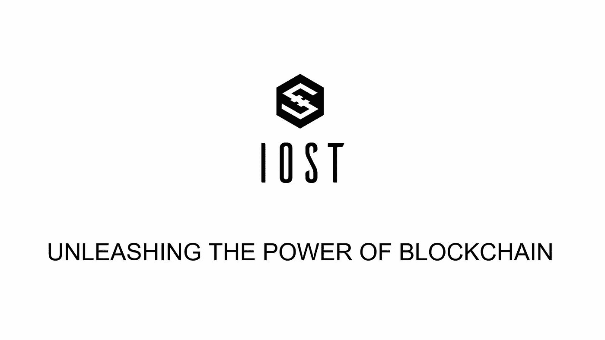

# 什么是 IOST？区块链项目简介

> 原文：<https://medium.com/coinmonks/what-is-iost-introduction-to-the-blockchain-project-d891430f017?source=collection_archive---------0----------------------->

# 什么是 IOST？

据其开发者称，区块链平台 IOST 具有高度可扩展性，并使用自己的共识算法——可信度证明。

分散式应用程序可以在 IOST 上以每秒几千个事务的高速运行。