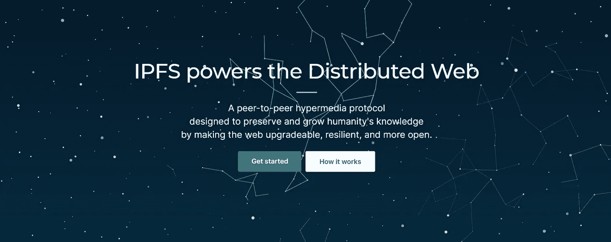

# 什么是 IPFS(星际文件系统)？

> 原文：<https://medium.com/coinmonks/what-is-ipfs-interplanetary-filesystem-7e48f32a7dce?source=collection_archive---------7----------------------->

## 什么是 IPFS？它是如何工作的，为什么在现代区块链建筑中它对保存媒体文件如此重要？

继续关于在 NFTs 中保存和使用元数据的[帖子，让我们更好地理解什么是 IPFS。IPFS，或行星间文件系统，是一个分布式 P2P 协议，允许任何文件…](/coinmonks/how-nft-metadata-works-a65ba7631842)