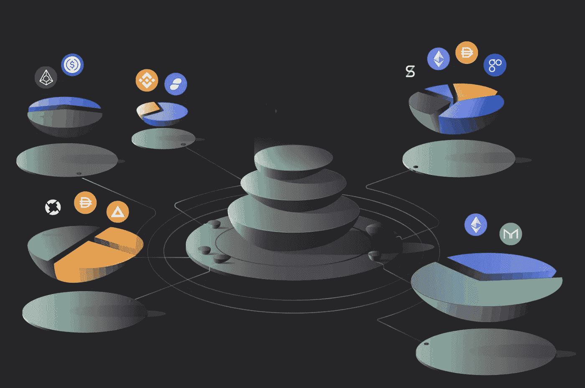

# 什么是流动性挖掘，它是如何工作的？

> 原文：<https://medium.com/coinmonks/what-is-liquidity-mining-and-how-does-it-work-d0ab491e607?source=collection_archive---------0----------------------->

比特币和加密货币再次处于强劲的上升趋势，因此备受关注。其原因也是分散金融(DeFi)领域的快速增长。投资者可以通过加密货币和法定货币以各种方式产生现金流。流动性挖掘是最著名的形式之一。