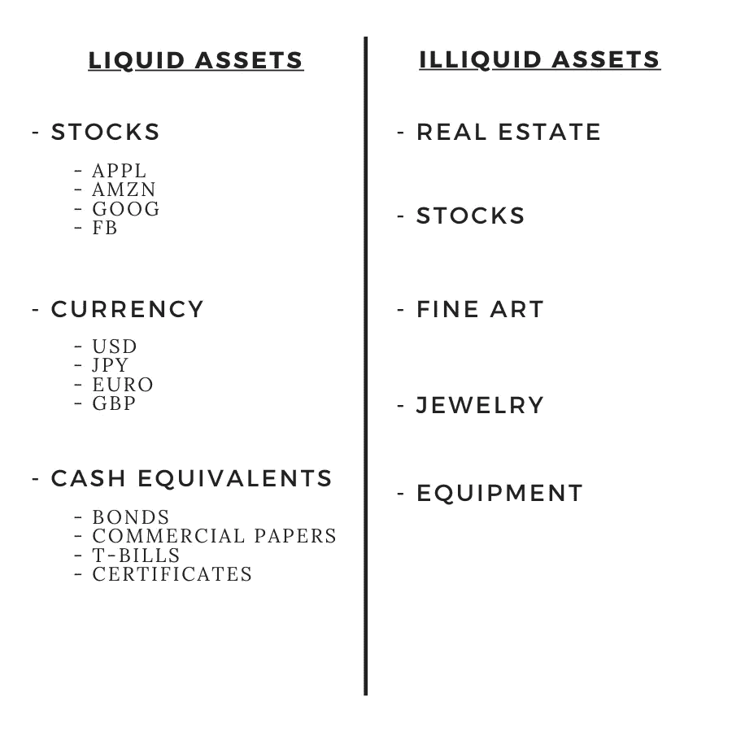
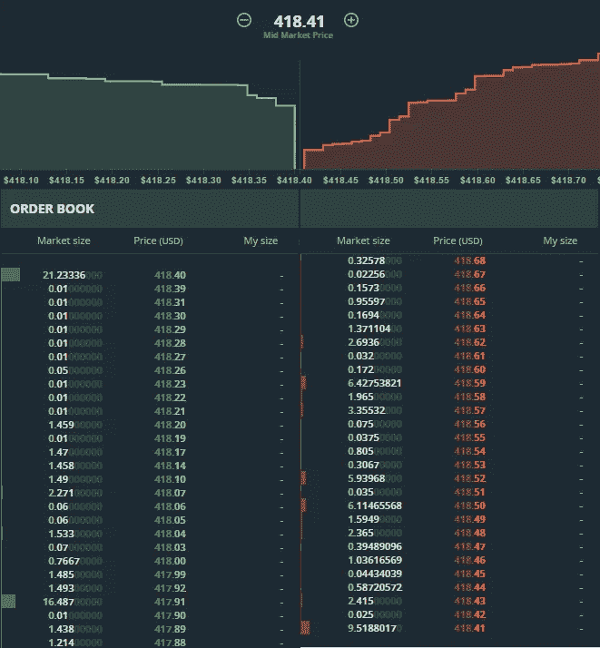

# 什么是流动性&为什么它很重要？

> 原文：<https://medium.com/coinmonks/what-is-liquidity-why-does-it-matter-52bcf3c9e2d2?source=collection_archive---------2----------------------->

流动性是所有金融的基石。这是一个衡量资产交易(头寸进入和退出)的便利性和效率的指标。

流动资产可以快速转换。非流动资产需要很长时间才能转换。

现金可以在几秒钟内变成股票；
房地产需要几个月的时间才能变成现金；试图尽快出售房地产会迫使房地产价格下跌

就开放市场而言，高水平的流动性可能与资产的高水平兴趣和活动相关，而低水平的流动性可能与资产的不稳定兴趣和活动相关。流动性可以通过查看订单簿来确定。

在订单簿中，流动性负责影响市场动态的两个关键因素:
*-价差
-滑点*

**价差**是公开市场买入订单和卖出订单之间的差额。存在流动性的市场提供了很小的价差。这意味着在清算过程中，资产价格的确定性更高。如果市场中的价差很大，那么很少有人愿意参与，价格水平不确定性很低。

滑点是无效市场条件的结果。它是市场退出时的价值损失。每当一个实体想要退出他们的头寸时，他们就以最高的价格卖出他们的头寸，直到他们的全部头寸被卖出。在资产价格缺乏支持的情况下，实体将以低价结算的形式遭受额外损失。

***例题***

保罗有 1000 个 ETH。他以每 ETH 300 美元建仓，总投资额为 300，000 美元(外加费用)。在市场反弹后，ETH 的价格为 400 美元，对保罗的头寸定价为 40 万美元。订单簿有足够的流动性(以买入报价的形式)来吸收保罗卖出的一切。然而，为了一次卖出所有商品，Paul 必须接受可用的报价，订单簿中的购买订单如下:10 个 ETH @ $400 are，40 个 ETH @ $395，150 个 ETH @ $390，250 个 ETH @ $385，400 个 ETH @ $380 和 1，200 个 ETH @ $375。因此，通过一次性出售所有 1，000 个 ETH，他将按如下方式出售:

10 eth-$ 400 = 4000
40 eth-$ 395 = 15800
150 eth-$ 390 = 58500
250 eth-$ 385 = 96250
400 eth-$ 380 = 152000
150 eth-$ 375 = 56250

这意味着他的 40 万美元头寸实际上只能兑换 38.28 万美元；一万七千二百元或减少百分之四点三。

但流动性不仅仅关系到卖方业务；让我们看一个买方的例子；

劳拉有 30 万美元。她想买一些 ETH & ETH 的交易价格是 300 美元。她希望一次性投入全部资金。但是订单大概是这样的:20 个 300 美元，110 个 310，400 美元，315，900 美元，320 美元。因此，每当她去市场购买价值 300，000 美元的 ETH 时，她的输入将类似于以下内容:

20 eth—300 美元= 6000 美元
第 110 eth—310 美元= 34100 美元
第 400 eth—315 美元= 126500 美元
第 418.4375 eth—320 美元= 134900 美元

导致她的 300，000 美元只获得了 948.4375ETH，而不是预期的 1，000 ETH (-少 5.15625% ETH)

这些合并的例子显示-9.45625%的价值在两个方向上都没有实现。

> *流动性是对资产购买/出售(公开市场)需求的直接衡量。*

从加密货币和数字资产行业可以看出流动性的重要性。在任何给定的时间，很少(如果有的话)会出现供需平衡的时刻。

加密货币因其极端的波动性而臭名昭著，24 小时内的价格波动很容易突破 10%(而在传统市场中，即使 3%的波动也被认为是过度的)。通常，加密资产的买卖价差差异很大(5%的价差并不少见)，订单薄，一次只能吸收几千美元(不包括比特币)。由于不确定性，这将主要市场参与者(机构级投资者)拒之门外。

这些问题可以归因于缺乏流动性。几乎所有的资产都集中在少数人手中，流通供应在前 100 个地址中的分配比例高达 90%(是的，有一些项目的分配更加均衡，但是，因为钱包地址并不代表身份多个钱包可以归一个实体所有[进一步放大不确定性])。

大多数顽固的加密用户都是霍德尔，他们购买并长期储存他们的资产在钱包里。在这样做的过程中，他们从市场上转移资产，进一步加剧了流动性危机。

这转化为用户保留、新用户吸引和交易所做市方面的困难。这又意味着被排除在参与之外。

DeFi 或[分散金融](https://blog.coincodecap.com/the-ultimate-guide-to-defi-decentralized-finance)是加密货币行业的一个部门，直接专注于扩大可能性，最关注的领域是流动性供应。

总而言之，吸引和留住市场参与者需要流动性。流动性有助于市场进行稳定的价格发现，并降低参与者的风险。流动性使市场成为可能。

## 另外，阅读

*   最好的[密码交易机器人](/coinmonks/crypto-trading-bot-c2ffce8acb2a)
*   [密码本交易平台](/coinmonks/top-10-crypto-copy-trading-platforms-for-beginners-d0c37c7d698c)
*   最好的[加密税务软件](/coinmonks/best-crypto-tax-tool-for-my-money-72d4b430816b)
*   [最佳加密交易平台](/coinmonks/the-best-crypto-trading-platforms-in-2020-the-definitive-guide-updated-c72f8b874555)
*   最佳[密码借贷平台](/coinmonks/top-5-crypto-lending-platforms-in-2020-that-you-need-to-know-a1b675cec3fa)
*   [最佳区块链分析工具](https://bitquery.io/blog/best-blockchain-analysis-tools-and-software)
*   [加密套利](/coinmonks/crypto-arbitrage-guide-how-to-make-money-as-a-beginner-62bfe5c868f6)指南:新手如何赚钱
*   最佳[加密制图工具](/coinmonks/what-are-the-best-charting-platforms-for-cryptocurrency-trading-85aade584d80)
*   [莱杰 vs 特雷佐](/coinmonks/ledger-vs-trezor-best-hardware-wallet-to-secure-cryptocurrency-22c7a3fd391e)
*   了解比特币的[最佳书籍有哪些？](/coinmonks/what-are-the-best-books-to-learn-bitcoin-409aeb9aff4b)
*   [3 商业评论](/coinmonks/3commas-review-an-excellent-crypto-trading-bot-2020-1313a58bec92)
*   [AAX 交易所评论](/coinmonks/aax-exchange-review-2021-67c5ea09330c) |推荐代码、交易费用、利弊
*   [Deribit 审查](/coinmonks/deribit-review-options-fees-apis-and-testnet-2ca16c4bbdb2) |选项、费用、API 和 Testnet
*   [FTX 密码交易所评论](/coinmonks/ftx-crypto-exchange-review-53664ac1198f)
*   [n 零审核](/coinmonks/ngrave-zero-review-c465cf8307fc)
*   [Bybit 交换审查](/coinmonks/bybit-exchange-review-dbd570019b71)
*   [3Commas vs Cryptohopper](/coinmonks/cryptohopper-vs-3commas-vs-shrimpy-a2c16095b8fe)
*   最好的比特币[硬件钱包](/coinmonks/the-best-cryptocurrency-hardware-wallets-of-2020-e28b1c124069?source=friends_link&sk=324dd9ff8556ab578d71e7ad7658ad7c)
*   最佳 [monero 钱包](https://blog.coincodecap.com/best-monero-wallets)
*   [莱杰 nano s vs x](https://blog.coincodecap.com/ledger-nano-s-vs-x)
*   [bits gap vs 3 commas vs quad ency](https://blog.coincodecap.com/bitsgap-3commas-quadency)
*   [莱杰纳米 S vs 特雷佐 one vs 特雷佐 T vs 莱杰纳米 X](https://blog.coincodecap.com/ledger-nano-s-vs-trezor-one-ledger-nano-x-trezor-t)
*   [block fi vs Celsius](/coinmonks/blockfi-vs-celsius-vs-hodlnaut-8a1cc8c26630)vs Hodlnaut
*   [Bitsgap 评论](/coinmonks/bitsgap-review-a-crypto-trading-bot-that-makes-easy-money-a5d88a336df2)——一个轻松赚钱的加密交易机器人
*   为专业人士设计的加密交易机器人
*   [PrimeXBT 审查](/coinmonks/primexbt-review-88e0815be858) |杠杆交易、费用和交易
*   [埃利帕尔泰坦评论](/coinmonks/ellipal-titan-review-85e9071dd029)
*   [SecuX Stone 评论](https://blog.coincodecap.com/secux-stone-hardware-wallet-review)
*   [BlockFi 评论](/coinmonks/blockfi-review-53096053c097) |从您的密码中赚取高达 8.6%的利息