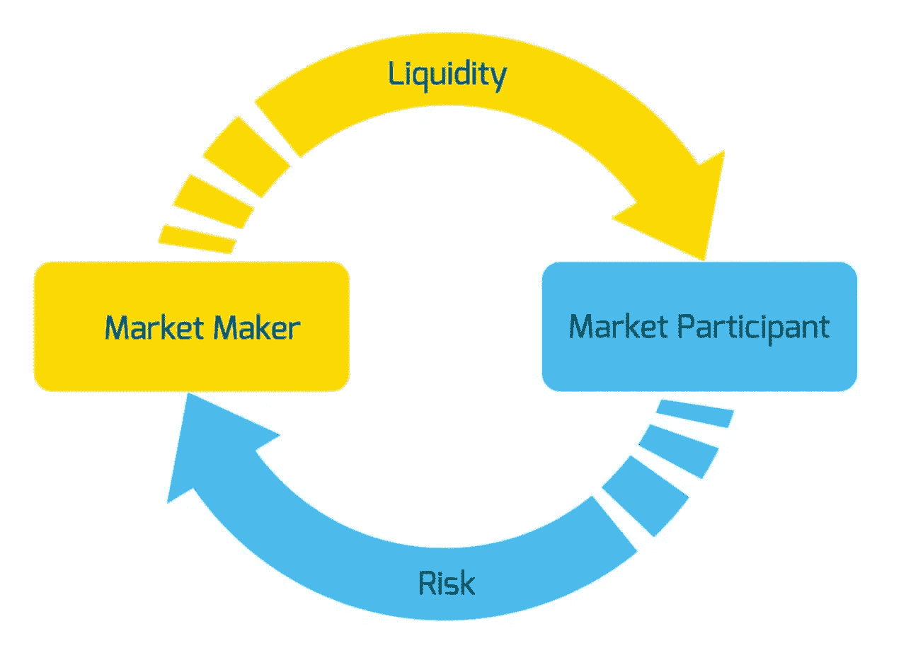

# 什么是做市？

> 原文：<https://medium.com/coinmonks/what-is-market-making-d0cc3cef8b87?source=collection_archive---------6----------------------->

做市是为证券、商品、货币以及最近的加密令牌提供流动性的过程，以确保市场参与者(买方和卖方)能够以公平的价格有效地进行交易。做市商通常是银行和大型金融机构，但较小的独立公司也可以做市。加密货币交易所通过 API 免费提供对其交易引擎的访问，这使得资源有限的初创公司能够提供做市服务。虽然还没有达到传统市场的运营速度，但它们已经开始迎头赶上。

## 做市简史

在被认为是现代证券交易所已知的最早资料中， [de la Vega](https://books.google.de/books?hl=en&lr=&id=16_aDwAAQBAJ&oi=fnd&pg=PT103&dq=Confusion+de+Confusiones&ots=VfKq2udX1F&sig=HTtQmjxFZIb39m-E7i-x8rdO2oE&redir_esc=y#v=onepage&q=Confusion%20de%20Confusiones&f=false) 将新实体和业务描述为:

“这种神秘的交易，既是欧洲最公平、最欺诈的交易，也是世界上最高尚、最无耻的交易，更是世界上最美好、最庸俗的交易。”

荷兰东印度公司是第一家向 T2 公众投资者发行股票的公司，目的是为其不断扩张的商业帝国筹集资金。随着越来越多的公司加入阿姆斯特丹证券交易所，做市商提供流动性从而刺激经济增长的需求变得显而易见。

这些早期的做市商是商人，他们对股票的价值是上升还是下降没有特别的看法。他们的商业模式包括以略高于他们支付的价格出售股票或以略低于他们出售的价格买入股票来获利。正如德拉维加所说:

“他们认为他们的风险和他们的利润一样多；他们喜欢获得一点点，但获得那一点点有[相对的]安全感

他们的买入报价(买价)和卖出报价(卖价)之间的差额被称为价差，正是这种价差驱动了他们的商业模式。

自阿姆斯特丹证券交易所成立以来，世界已经发生了很大的变化，但故事在很大程度上保持不变。公司经常需要资本来为他们的扩张提供资金，投资者总是在寻找获得回报的方法。做市商降低了进入市场的门槛，因为他们确保投资者可以以公平的价格买卖股票。对市场效率的信任让企业(和政府)更容易筹集新资本，做市商无疑在确保市场流动性、透明度和效率方面发挥了作用。

## 加密货币交易所的做市商

在过去的几年里，加密市场变得更加有效。定期出现大量跨交易所套利机会的日子已经一去不复返了。今天，在一个较大的对(例如 BTC/USDT)上操作的加密做市商将最有可能不得不与交易所共处一地，并且将不得不确保到市场移动价格源的快速光纤连接，以便具有竞争力。与一些传统的做市商不同，它们将不得不与基础设施不太发达、实际上往往不可靠的新兴交易所打交道，而且它们需要在从不睡觉的市场中全天候运营。

集中式加密货币交易所采用做市商的服务，方式与传统交易所非常相似。然而，有一种新的交换类型是独特的加密，这就是分散交换(DEX)。这些交易所采用自动做市商算法来促进链上资产之间的交易。一个例子是 Uniswap 定期交易 T2 的交易量，接近比特币基地的交易量。虽然 Uniswap 只允许以太坊网络(ERC20 令牌)上的线对之间的交易，但 [Thorchain](https://thorchain.org) 为多个链提供了便利，并首次实现了以分散方式用本地 ETH 交易本地 BTC。

## 新加密令牌的上市路径

每周有多达 10 个新的加密令牌[推出](https://coinmarketcap.com/new/)。几年前，一个新的令牌项目将在一个集中的交换平台上启动，而现在许多项目首先在一个 DEX 上列出它们的令牌。启动和运行是没有权限的，只需点击几下就可以完成。假设它是一个 ERC20 令牌，项目将简单地成为一个流动性提供者，并将 ETH(或一种稳定的硬币，如戴或)及其新令牌存入流动性池。流动性池的创建者根据这种[分割](https://docs.uniswap.org/protocol/V2/concepts/core-concepts/pools)设定代币的初始价格。

尽管 dex 在过去几年取得了无可置疑的成功，但大部分交易量仍集中在币安和北海巨妖等交易所。因此，大多数严肃的项目都希望在首次在 DEX 上市后在集中交易所上市(例如 [Uniswap](https://uniswap.org) 、 [Sushiswap](https://sushi.com) 或 [Pancakeswap](https://pancakeswap.finance) )。随着代币在多个集中交易所和 dex 上市，寻找不同场所之间套利机会的机器人确保价格受到控制。

在利润率方面，我们专门为集中交易所的代币提供做市服务。我们确保您满足跨多个市场的流动性义务，让您专注于开发和发展您的项目。

要了解更多关于 margin 做市产品的免费演示！

*原发布于*[*https://margin . io*](https://margin.io/blogs/market-making)*。*

> 加入 Coinmonks [电报频道](https://t.me/coincodecap)和 [Youtube 频道](https://www.youtube.com/channel/UCbyDhTbOiKh2iUMKBi4-4Zg)了解加密交易和投资

## 也阅读

 [## 最佳加密交易所| 2021 年十大加密货币交易所

### ICON _ PLACEHOLDEREstimated 预计阅读时间:28 分钟加密货币交易所的加密交易需要知识…

blog.coincodecap.com](https://blog.coincodecap.com/crypto-exchange)  [## 2021 年 10 大最佳加密贷款平台| CoinCodeCap

### 当谈到加密货币贷款时，大量因素等同于良好的收入状况。此外，借款的一部分…

blog.coincodecap.com](https://blog.coincodecap.com/crypto-lending)  [## 2021 年最佳免费加密交易机器人

### 2021 年币安、比特币基地、库币和其他密码交易所的最佳密码交易机器人。四进制，位间隙…

medium.com](/coinmonks/crypto-trading-bot-c2ffce8acb2a)  [## 最佳 4 个加密交易信号电报通道

### 这是乏味的找到正确的加密交易信号提供商。因此，在本文中，我们将讨论最好的…

medium.com](/coinmonks/best-crypto-signals-telegram-5785cdbc4b2b)  [## BlockFi 评论 2021:利弊和利率| CoinCodeCap

### 今天，我们提出了一个全面的 BlockFi 评论，这是一个成立于 2017 年的加密贷款平台，拥有其…

blog.coincodecap.com](https://blog.coincodecap.com/blockfi-review)  [## 如何在印度购买比特币？2021 年购买比特币的 7 款最佳应用[手机版]

### 如何使用移动应用程序购买比特币印度

medium.com](/coinmonks/buy-bitcoin-in-india-feb50ddfef94)  [## 加密税务软件——五大最佳比特币税务计算器[2021]

### 不管你是刚接触加密还是已经在这个领域呆了一段时间，你都需要交税。

medium.com](/coinmonks/best-crypto-tax-tool-for-my-money-72d4b430816b)  [## 存储比特币的最佳加密硬件钱包[2021] | CoinCodeCap

### 保管您的数字资产很容易，但找到正确的存储方式却是一项繁琐的任务。在线钱包有一个风险…

blog.coincodecap.com](https://blog.coincodecap.com/best-hardware-wallet-bitcoin)