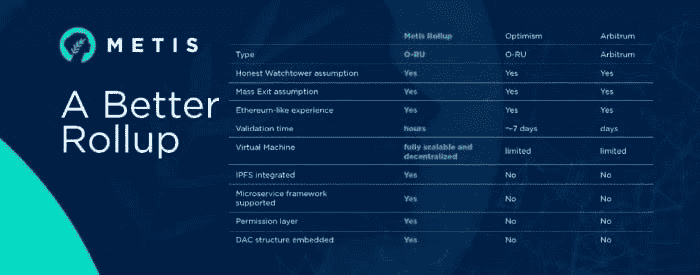

# 什么是 Metis Genesi？

> 原文：<https://medium.com/coinmonks/what-is-metis-genesi-12fd989a5cd5?source=collection_archive---------11----------------------->

## 通过使用乐观汇总来缩放区块链事务

Source: [www.metis.io](http://www.metis.io)

区块链技术给不同的行业带来了很多好处，尤其是金融业，因为它引发了对去中心化、无缝交易以及让任何人都可以使用金融解决方案的需求。

然而，尽管有这些趋势性的好处，区块链仍然有一些缺点。可扩展性是区块链技术所面临的问题之一，因为交易在被验证之前需要经历一系列步骤，这导致了能量和时间的消耗，这对于该技术的用户来说可能是疲劳和低效的。

与 Visa 等一些集中式金融公司相比，可扩展性问题变得更加明显，因为 Visa 通过其 VisaNet 电子支付网络每秒处理约 20，000 笔交易(TPS)。相比之下，比特币每秒只能执行 3–7 次交易(TPS)。

与内存池中排队的事务数量相比，这相对较低。面临的其他一些问题包括高昂的交易费用。随着事务被阻塞在内存池中，验证和处理这些事务的成本(汽油费)往往会增加。它还促进了前台运行，因为用户试图通过各种方式更快地验证他们的交易。

为此，需要选择更好的方案来增强可扩展性，因此需要第 2 层区块链解决方案。

## 什么是第 2 层扩展解决方案？

第 2 层扩展解决方案是区块链解决方案，旨在提高可扩展性，同时保留分散式安全区块链的原始理念。有几个第 2 层扩展解决方案，包括零知识总结(ZK 总结)，乐观总结，血浆，侧链，国家渠道和支付渠道，validium 和聚合器。

在所有深奥的第 2 层扩展解决方案中，Metis 选择建立在乐观的汇总之上。

## **什么是乐观汇总？**

乐观汇总是第 2 层扩展解决方案，它在第 1 层之外以更廉价、更可扩展的方式执行事务，并将事务中的数据发布到第 1 层。这确保了大量智能合约的运行不会使网络过载和增加负担，同时仍然给网络提供与以太坊主链相同的安全级别。

乐观汇总主要基于所有交易都有效的假设，并且仅当通过防欺诈检测到质询时才需要计算。

乐观汇总的一个显著优点是它们是 EVM 和可靠性兼容的，因此使它们能够处理以太坊第 1 层上完成的任何事情。许多项目，如 Optimistic、Arbitrium、Cartesi 和 Metis，都采用了 Optimistic Rollups，因为它支持复杂智能合同和简单支付的执行，从而增强了分散融资的可扩展性，这是区块链的主要目标。

在采用乐观总结的其他项目中，Metis 在启动" Metis Genesi "时采取了实现其愿景的重要步骤。

## **什么是 Metis Genesi？**

梅蒂斯已经决定加入乐观主义者联盟，在这个联盟中，仲裁和乐观主义已经统治了一段时间。首先，Metis 将推出其 Mainnet 和一只 1 亿美元的基金。这只 1 亿美元的基金是一项战略，旨在增加实现乐观累积项目的机会，也被描述为一家分散的自治公司，将支持加入生态系统的项目。

在一份新闻稿中，梅蒂斯向[透露，Genesi 将被分配到加密领域的一系列高潜力项目中，包括游戏、DeFi 和 DAOs。](https://thedefiant.io/metis-latest-optimistic-rollup/)

为了实现 Genesi 的愿景，一个由 Metis 及其投资者(目前包括 Master Ventures 和数字金融集团)组成的委员会将负责分配。

1 亿美元的资金使 Metis 成为其他第 2 层扩展解决方案项目的焦点，这些项目计划利用乐观汇总技术，因为其他项目尚未部署资金来启动他们解决方案的活动。

Metis 旨在为充满活力的区块链项目建立一个大型、稳健和多样化的生态系统，为最具潜力的项目提供技术、营销和融资机会。

Metis 开始时是乐观主义的一个硬分叉，现在已经决定跟进它最初的大部分架构，尽管乐观主义已经决定对它的计划进行重大改变。Metis 一直致力于提供最大的可扩展性，同时不放弃分散化，因为它是区块链的核心。

[Metis' Andromeda](https://metisdao.medium.com/metis-to-launch-andromeda-honoring-our-commitment-to-decentralization-fa2d03394398) 即将推出的是一个包含创新功能的整体结构，以确保可扩展性和分散性保持在其峰值。新项目具有多虚拟机、EVM 等价、Metis explorer、Metis bridge、peer nodes、Polis、DAC staking 和 Mining 以及许多其他令人敬畏的功能。

## **结论**

区块链技术相对较新，随着越来越多的行业采用它，它也在不断发展。Metis 就是这样一家利用区块链技术的力量为人类需求提供解决方案的公司。

> 加入 Coinmonks [电报频道](https://t.me/coincodecap)和 [Youtube 频道](https://www.youtube.com/c/coinmonks/videos)了解加密交易和投资

## 也阅读

 [## 杠杆代币[多头代币]终极指南

### 杠杆化令牌是具有杠杆化风险敞口的 ERC20 令牌，不考虑保证金、要求、管理…

medium.com](/coinmonks/leveraged-token-3f5257808b22)  [## 最佳加密交易所| 2021 年十大加密货币交易所

### 编辑描述

blog.coincodecap.com](https://blog.coincodecap.com/crypto-exchange)  [## 2021 年最佳加密借贷平台| 6 大比特币借贷平台

### 获得比特币和其他加密货币的最佳贷款利率

medium.com](/coinmonks/top-5-crypto-lending-platforms-in-2020-that-you-need-to-know-a1b675cec3fa)  [## 2021 年最佳免费加密交易机器人

### 2021 年币安、比特币基地、库币和其他密码交易所的最佳密码交易机器人。四进制，位间隙…

medium.com](/coinmonks/crypto-trading-bot-c2ffce8acb2a)  [## 最佳 4 个加密交易信号电报通道

### 这是乏味的找到正确的加密交易信号提供商。因此，在本文中，我们将讨论最好的…

medium.com](/coinmonks/best-crypto-signals-telegram-5785cdbc4b2b)  [## 5 个最佳社交交易平台[2021] | CoinCodeCap

### 编辑描述

blog.coincodecap.com](https://blog.coincodecap.com/best-social-trading-platforms)