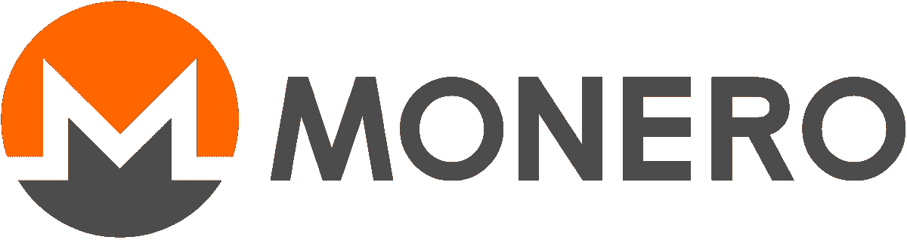

# 什么是 Monero？区块链上的匿名

> 原文：<https://medium.com/coinmonks/what-is-monero-anonymity-on-the-blockchain-c45f23a6dd6e?source=collection_archive---------4----------------------->

## 加密货币中的隐私之王。Monero 为用户提供完全匿名，并保护他们的信息。

Monero Logo

Monero，XMR，拥有人们认为比特币拥有的安全级别。这到底意味着什么？当有人第一次接触比特币时，他们通常会认为比特币具有完全的隐私性和安全性。这并不是说比特币或其他区块链不安全。由于它们的分散性，它们比互联网上的大多数东西都要安全得多。

比特币的风险并不存在于网络运行的方式中。发送和接收地址都是公开的，交易也是如此。乍一看，你很难追踪这些地址到真实世界的身份。但这并非不可能。这就是 Monero 想要解决的问题。

## **一言以蔽之的 Monero**

*   Monero 于 2014 年推出，基于 CryptoNote 协议。
*   它利用环签名来混淆公共分类帐上的发送者和交易量数据。
*   工作验证算法 RandomX 非常抗 ASIC，支持 CPU 和 GPU 挖掘。
*   由于其极端的隐私措施，该项目已经看到了一些关于硬币潜在非法使用的争议。

## **莫内罗背后的故事**

Bytecoin 成立于 2012 年，试图解决这些安全问题。它很好地实现了这个目的。该团队创造了 CryptoNote 技术。使用环签名和秘密地址，CryptoNote 能够创建绝对匿名。有一段时间，它也是为数不多的可以在消费电脑而不是 ASIC 上轻易找到的硬币之一。

凭借这些创新，Bytecoin 成为了区块链安全的先锋。然而，当发现 82%的供应量已被预先开采时，这种情况就停止了。这引发了一些危险信号。一个加密项目所期望的透明性根本不存在。

结果，在项目如何继续的问题上出现了很大的分歧，出现了一个硬分叉。Bytecoin 在 Monero 的历史中非常重要，因为正是这个 hardfork 创建了这个项目。它直接基于 CryptoNote 协议。这次分叉发生在 2014 年 4 月，标志着 Monero 向公众公平推出。

## **莫内罗如何工作**

使用 Monero 时，交易的执行方式与大多数其他区块链不同。像比特币一样，透明的区块链让所有信息都可以在公共账本上轻易获得。这包括发送和接收地址和交易金额。虽然这确实使网络很容易跟踪哪些已经花掉了，哪些没有花掉，但这对用户隐私没有帮助。

Monero 使用一种称为环签名的群组签名方法。当用户想要发送一些硬币时，他们的钱包会选择半随机的过去交易来混淆数据。它对这些以前的交易所做的是，它将把它们的公钥与真正的交易混合在一起，作为一种诱饵。网络有可能确定哪一个是真实的交易，但是在其他情况下，它们是无法彼此区分的。截至 2018 年，所有交易的签名中都使用了 11 个诱饵。

为了防止恶意活动，如试图花费相同的输出两次，网络采用关键图像。它们来源于实际支出的产出，因此是真实交易所特有的。没有办法确定这个键属于哪个输出，只是需要检查这个键以前是否被使用过。通过这种方式，在验证有效性的过程中不会放弃任何实际的交易数据。

## **采矿 Monero**

由于 Monero 是工作证明，链的安全和分散由矿工提供。之前它使用了密码夜算法。然而，自 2019 年 11 月以来，它使用 RandomX PoW 算法。这个算法是由社区成员专门为 Monero 开发的。

它的一个独特之处是，它更依赖于 CPU 而不是 GPU，就像许多其他 PoW 币一样。它的开发也考虑到了 ASIC 的阻力，因此在这里挖掘特定的硬件并不太有用。消费级硬件通常能够挖掘 Monero，尽管结果会因 CPU 和超频而异。即使它非常集中于 CPU，GPU 挖掘也可以通过正确的工具来实现。

Monero 上的阻塞时间约为两分钟，目前没有最大阻塞大小。作为一种确保开采 Monero 始终有激励的方式，区块奖励永远不会达到零。主排放曲线将持续到 2022 年 5 月左右，届时将开采出 1813.2 万枚硬币。之后，它将进入尾部曲线，允许每块奖励 0.6 XMR，这相当于不到 1%的通胀率随着时间的推移而下降。

更多关于莫内罗矿业的信息请点击[这里](https://www.getmonero.org/get-started/mining/)。

## **新闻中的莫内罗**

2018 年，[美国消费者新闻与商业频道估计](https://www.cnbc.com/2018/06/07/1-point-1b-in-cryptocurrency-was-stolen-this-year-and-it-was-easy-to-do.html)Monero 参与了 44%的加密相关勒索软件攻击。暗网上的大多数主要市场都允许在交易中使用 Monero，尽管比特币仍然是使用最多的。

据推测，攻击者从赎金中获得的大部分比特币已被交易为 Monero，以进一步掩盖他们的踪迹。尽管交易所对非法使用 Monero 没有明确的责任，但对协会名誉受损的担心足以阻止一些上市。这甚至导致一些交易所在硬币上市后将其退市。

话虽如此，许多交易所确实允许 Monero 交易。在撰写本文时，币安、火币国际和北海巨妖是比特币的前三大交易所。

## **结束一切**

虽然对匿名和隐私的需求经常与非法活动联系在一起，但这不应该。每个人都有隐私权，尤其是涉及到金钱交易的时候。出于这些目的，Monero 是目前最受欢迎的隐私硬币。

在 T2，接受 Monero 支付各种不同服务和商品的商家有一长串。此外，与比特币相反，该项目实际上比大多数情况下更经常被用作货币。

尽管监管机构可能会努力，但 Monero 不会很快消失，互联网上的隐私需求也不会消失。

> 加入 [Coinmonks 电报频道](https://t.me/coincodecap)，了解加密交易和投资

## 另外，阅读

*   [什么是融资融券交易](https://blog.coincodecap.com/margin-trading) | [成本平均法](https://blog.coincodecap.com/dca)
*   [BigONE 交易所评论](/coinmonks/bigone-exchange-review-64705d85a1d4) | [电网交易机器人](https://blog.coincodecap.com/grid-trading)
*   [3 商业评论](/coinmonks/3commas-review-an-excellent-crypto-trading-bot-2020-1313a58bec92) | [Pionex 评论](/coinmonks/pionex-review-exchange-with-crypto-trading-bot-1e459d0191ea) | [Coinrule 评论](/coinmonks/coinrule-review-2021-a-beginner-friendly-crypto-trading-bot-daf0504848ba)
*   [莱杰 vs n 格拉夫](/coinmonks/ledger-vs-ngrave-zero-7e40f0c1d694) | [莱杰纳诺 s vs x](/coinmonks/ledger-nano-s-vs-x-battery-hardware-price-storage-59a6663fe3b0) | [币安评论](/coinmonks/binance-review-ee10d3bf3b6e)
*   [Bybit 交易所评论](/coinmonks/bybit-exchange-review-dbd570019b71) | [Bityard 评论](/coinmonks/bityard-review-7d104239be35) | [CoinSpot 评论](https://blog.coincodecap.com/coinspot-review)
*   [3 commas vs crypto hopper](/coinmonks/3commas-vs-pionex-vs-cryptohopper-best-crypto-bot-6a98d2baa203)|[赚取加密利息](/coinmonks/earn-crypto-interest-b10b810fdda3)
*   最好的比特币[硬件钱包](/coinmonks/the-best-cryptocurrency-hardware-wallets-of-2020-e28b1c124069?source=friends_link&sk=324dd9ff8556ab578d71e7ad7658ad7c) | [BitBox02 回顾](/coinmonks/bitbox02-review-your-swiss-bitcoin-hardware-wallet-c36c88fff29)
*   [block fi vs Celsius](/coinmonks/blockfi-vs-celsius-vs-hodlnaut-8a1cc8c26630)|[Hodlnaut 审核](/coinmonks/hodlnaut-review-best-way-to-hodl-is-to-earn-interest-on-your-bitcoin-6658a8c19edf) | [KuCoin 审核](https://blog.coincodecap.com/kucoin-review)
*   [Bitsgap 审查](/coinmonks/bitsgap-review-a-crypto-trading-bot-that-makes-easy-money-a5d88a336df2) | [Quadency 审查](/coinmonks/quadency-review-a-crypto-trading-automation-platform-3068eaa374e1) | [Bitbns 审查](/coinmonks/bitbns-review-38256a07e161)
*   [加密复制交易平台](/coinmonks/top-10-crypto-copy-trading-platforms-for-beginners-d0c37c7d698c) | [Coinmama 评论](/coinmonks/coinmama-review-ace5641bde6e)