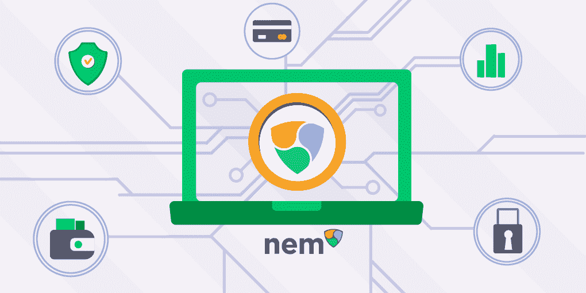
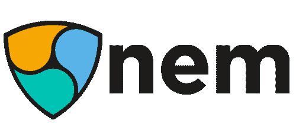
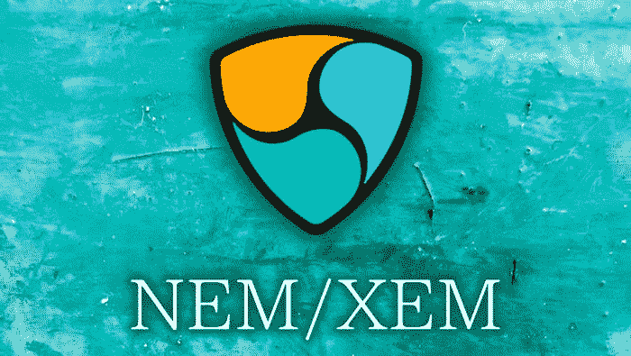
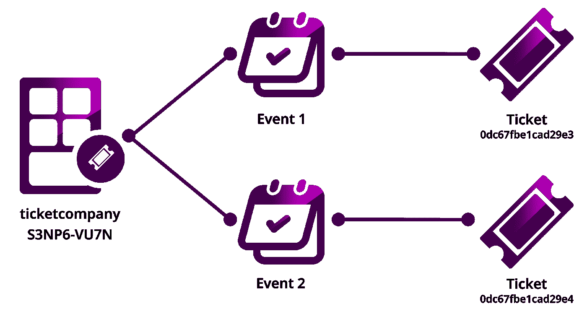
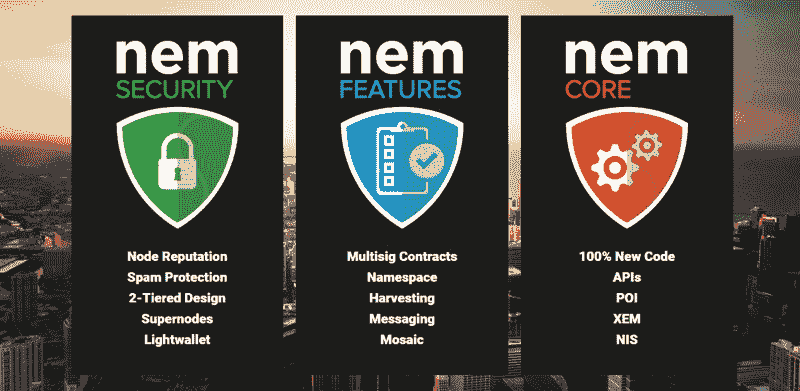

# 什么是 NEM 硬币，你如何从中获利？

> 原文：<https://medium.com/coinmonks/what-is-nem-coin-and-how-can-you-profit-from-it-a38f195282aa?source=collection_archive---------5----------------------->

早在 2014 年，一个想法在加密领域非常流行:创建一个比特币的区块链替代品，开发者可以在那里建立自己的数字资产，这个网络的本地加密货币将推动其上的交易。许多项目只是修改区块链的代码，而其他项目则在创造新的东西。以太坊就是这样出现的。

Bitcointalk 论坛的另一群爱好者用 Javascript 创建了他们自己的平台。这就是 2015 年推出的 NEM (Nem 经济运动)——一个为企业和个人提供便利的价值转移的区块链生态系统。NEM 是基于分权、团结和金融自由的理念。

NEM 支持轻松传输任何数字资产，如令牌、合同或文件。它的区块链可以将数据从一个内部企业网络发送到另一个，这使得它在企业中很受欢迎。XEM 令牌为网络供电。用户可以从 NEM 的收获中获利——获得区块验证的奖励。这是可能的，因为 NEM 利用了重要性共识算法的证明，该算法不仅考虑了你的股份大小，还考虑了你在网络中的活动。

让我们看看这一切是如何工作的。

# 什么是 NEM？

NEM 打算建立一个更先进、更高效的分布式生态系统。它自称为智能资产区块链——一个代表有形现实世界资产和无形所有权的代币网络，你可以买卖这些代币。

NEM 于 2014 年由 Bitcointalk 论坛用户 Jaguar0625、BloodyRookie 和 gimre 创建。如今，它由位于新加坡的 NEM.io 基金会运营。NEM 创建了他们自己的代码库:首先，该项目被认为是 DApp 平台 NXT 的分支，但后来，开发人员决定从头开始编写 NEM。如今，NEM 在 Coinmarketcap 的榜单上排名第 67 位，而 NXT 则徘徊在第 800 位。

# NEM 的智能资产系统是如何运作的？

NEM 网络中的智能资产是现实世界资产或无形所有权的数字表示，人们可以购买、出售或交换。这可以是一辆汽车，像比特币这样的虚拟商品，或者一份股权。NEM 为开发人员提供了用名称空间和马赛克来配置智能资产交换的工具。

[马赛克](https://docs.symbolplatform.com/concepts/mosaic.html)是与所谓的名称空间相关联的数字资产。一个[名称空间](https://docs.symbolplatform.com/concepts/namespace.html)是一个文本字符串，指向 NEM 区块链的一个账户地址。把名称空间想象成互联网上的域名，把 mosaic 想象成位于那里的文件。还有子名称空间，允许将名称空间分成更具体的子组。命名空间的创建或更新花费 100 XEM。

该系统允许以人类可读的方式表示数字资产和地址。使用名称空间和马赛克，开发人员可以以多种方式创建模式和组织资产。

一个票务公司为不同事件(子命名空间)组织其资产(门票)的例子。

# 什么是 XEM 硬币？

XEM 硬币为 NEM 区块链供电。它支付网络交易费用，并用于确定网络治理决策。XEM 在 NEM 生态系统中用于价值转移和支付，将 NEM 的使用案例扩展到运输跟踪、忠诚度奖励积分、加密信息、防伪等。那些验证交易(收获)的人在 XEM 获得奖励。

# NEM 研究的是什么共识算法？什么是重要性的证明？

为了理解 PoI，让我们看看更传统的共识算法的缺点。在工作证明上，节点在计算能力上竞争；做了许多不必要工作，这使得电源变得笨重且能效低。此外，竞争是由那些有更多钱购买昂贵硬件的人赢得的，这使得价值分布不均匀，并产生集中化风险。

利害关系证明更节能，但也有同样的缺点:它给了那些拥有更多密码的人太多块验证的优先权，更富有的用户变得更富有。PoS 只会刺激硬币的囤积，而不会刺激它们的使用。

在《NEM 的重要性证明》中，你的股份大小以及你发送代币的频率和对象都被考虑在内——这是推动网络发展的因素。每个用户都有一个重要性分数，这个分数决定了他们验证一个块的机会。PoI 通过奖励普通用户来增强他们的能力——这就是所谓的收获。

# 如何从 XEM 获利？

把收割想象成在比特币中采矿，但不需要复杂的硬件。你验证交易，反过来得到回报。

任何拥有至少 10，000 XEM 的人都有资格收获。这些代币需要“既得”，这意味着它们已经在你的钱包里呆了一段时间:你每天储存的+10%的 XEM 被视为既得。

[收割](https://docs.nem.io/en/gen-info/how-local-delegated-harvesting-works)有本地**和代理**两种模式。

**当地**一家走内定。您的计算机必须打开才能运行 NIS (NEM 基础架构服务器)。这是一个 NEM 节点，您的私钥将在此转移以签署交易。NIS 节点运行着整个 NEM 区块链:它们为灯和移动钱包提供燃料，这是需要与区块链同步的第三方应用。

**委托收割**在远程 NIS 上执行。你可以选择任何 NEM 节点，而不用担心丢失你的硬币。它是这样工作的:你把你的重要性分数委托给另一个没有 XEM 的账户。您还将您的私钥发送到该节点，因为该节点需要它来签署事务。该节点只包含你的重要性分数，而不是你的 XEM:所以你的令牌是安全的。奖励会发送到您的 NEM 钱包中。对于委托采集，您的计算机不必全天候运行。

要开始收割，请参见 [NEM 博客](https://blog.nem.io/how-to-use-delegated-harvesting/)中的说明。注意网站上的[说明](https://docs.nem.io/en/nanowallet/delegated-harvesting)建议安装[现在不运行的 NEX 纳米钱包。使用](/@nanowallet_io/important-announcement-nanowallet-io-will-cease-operations-in-the-close-future-27352a11644d)[NEM 官方钱包](https://nemplatform.com/wallets/)。

# [超级节点程序](https://nemplatform.com/supernode-program/)

Supernode 是一个高性能的区块链节点，至少有 300 万 XEM，确保 NEM 网络的平稳运行。任何拥有[先进技术特征](https://nemplatform.com/supernode-program/)的人都可以从本地计算机或云托管服务器上运行超级节点。超级节点的带宽、计算能力、ping 和响应能力每天测试 4 次。

# 我在哪里买 XEM？

购买 XEM，如果你想投资这枚硬币，或者你想通过收获获得被动收入。如果你已经在币安、火币网或 OKEx 上有账户，你可以很容易地在那里买到你的硬币。然而，把你的硬币储存在集中交易所被认为是不完全安全的，因为你没有自己的私人钥匙。而且，如果你想收获，无论如何你都要把你的 XEM 从交易所转移到钱包里。

为了避免这些风险并控制您的加密钱包中的 XEM，请使用 [ChangeNOW](https://changenow.io/?from=btc&to=xem) 即时交换服务。我们平均在 5 分钟内交换您的硬币，不要求您的电子邮件或私人钥匙，并允许用 200+其他资产购买 NEM。

# 我应该把 XEM 存放在哪里？

存放 XEM 硬币的最佳地点取决于你打算如何使用它们。如果你想收获 XEM，从 NEM 生态系统中获得最大收益，请使用 NEM 官方钱包。如果你想安全地储存 XEM 作为一种投资手段，选择 Trezor。如果你想让你的 XEM 总是在手边，并能够很容易地交换其他硬币，下载原子或免费的。

# [NEM 桌面钱包](https://nemplatform.com/wallets/#desktop)

这是该团队设计的 NEM 官方钱包。虽然它的界面简单，NEM 桌面钱包提供了与 NEM 网络交互的大量功能。在这里，你可以收获 XEM 硬币，利用资产交换，查看 NEM 硬币新闻。您还可以创建镶嵌、管理名称空间、创建投票以及向其他用户发送消息。

NEM 桌面钱包存储在您的设备上的私人密钥:团队没有访问它们。多用户和多签名帐户创建是可能的。

几年前，NEM 桌面钱包取代了 NEM 纳米钱包。如今，它可以在 Windows、macOS 和 Linux 上使用。

# [NEM 手机钱包](https://nemplatform.com/wallets/#mobile)

这是 NEM 官方钱包的手机版。和桌面版一样，这里的界面相当简洁，但是主要功能都保留了下来。NEM 手机钱包支持安卓和 iOS 系统。

# [原子钱包](https://atomicwallet.io/)

原子是一个钱包，可用于桌面和移动，允许存储超过 500 个加密资产。如果你想一次管理所有投资组合，选择原子。在这里，你可以在钱包里互相交换硬币，用信用卡购买新的，在线查看 NEM 图表，查看你的交易历史，等等。没有 KYC 或注册需要开始。

# [Trezor 钱包](https://trezor.io/)

Trezor 是一个硬件钱包，可以离线存储您的 XEM:这确保了最高级别的安全性。它是一个 USB 设备，你可以用 USB 连接到你的电脑，或者用蓝牙连接到你的手机。要移动您的硬币，您必须连接您的 Trezor，这使钱包更方便地存储您的硬币，而不是主动移动它们。Trezor 中可以存储超过 1000 种加密资产。

# [免费通道](https://freewallet.org/xem-wallet)

Freewallet 是一个软件多资产，用于存储 NEM 和许多其他密码。它适用于 Android、iOS 和 Web。要开始使用钱包，你需要使用你的脸书、Gmail 帐户、手机号码或电子邮件登录。你可以在这里兑换硬币，用法币购买，并在网上查询它们的汇率。Freewallet 允许您在几个级别上定制对资金的保护，包括对设备丢失的保护。2FA、pin 码和指纹支持是可能的。

# 结果

在 7 年多的时间里，NEM 展示了其建设区块链生态系统方法的可持续性。世界各地的许多公司利用 NEM，其简单而有利可图的收获模式吸引了许多渴望获得被动收入的用户。

我们希望这本 NEM 指南对你全面而有用。如果你想更多地了解 NEM，请随意阅读他们的[文档](https://docs.nem.io/en)，关注他们的[推特](https://twitter.com/NEMofficial)。

> 加入 [Coinmonks 电报频道](https://t.me/coincodecap)，了解加密交易和投资

## 另外，阅读

*   [什么是融资融券交易](https://blog.coincodecap.com/margin-trading) | [成本平均法](https://blog.coincodecap.com/dca)
*   [BigONE 交易所评论](/coinmonks/bigone-exchange-review-64705d85a1d4) | [电网交易机器人](https://blog.coincodecap.com/grid-trading)
*   [3 商业评论](/coinmonks/3commas-review-an-excellent-crypto-trading-bot-2020-1313a58bec92) | [Pionex 评论](/coinmonks/pionex-review-exchange-with-crypto-trading-bot-1e459d0191ea) | [Coinrule 评论](/coinmonks/coinrule-review-2021-a-beginner-friendly-crypto-trading-bot-daf0504848ba)
*   [莱杰 vs n 格拉夫](/coinmonks/ledger-vs-ngrave-zero-7e40f0c1d694) | [莱杰纳诺 s vs x](/coinmonks/ledger-nano-s-vs-x-battery-hardware-price-storage-59a6663fe3b0) | [币安评论](/coinmonks/binance-review-ee10d3bf3b6e)
*   [Bybit Exchange 审查](/coinmonks/bybit-exchange-review-dbd570019b71) | [Bityard 审查](/coinmonks/bityard-review-7d104239be35) | [CoinSpot 审查](https://blog.coincodecap.com/coinspot-review)
*   [3 commas vs Cryptohopper](/coinmonks/3commas-vs-pionex-vs-cryptohopper-best-crypto-bot-6a98d2baa203)|[赚取加密利息](/coinmonks/earn-crypto-interest-b10b810fdda3)
*   最好的比特币[硬件钱包](/coinmonks/the-best-cryptocurrency-hardware-wallets-of-2020-e28b1c124069?source=friends_link&sk=324dd9ff8556ab578d71e7ad7658ad7c) | [BitBox02 回顾](/coinmonks/bitbox02-review-your-swiss-bitcoin-hardware-wallet-c36c88fff29)
*   [block fi vs Celsius](/coinmonks/blockfi-vs-celsius-vs-hodlnaut-8a1cc8c26630)|[Hodlnaut 审核](/coinmonks/hodlnaut-review-best-way-to-hodl-is-to-earn-interest-on-your-bitcoin-6658a8c19edf) | [KuCoin 审核](https://blog.coincodecap.com/kucoin-review)
*   [Bitsgap 审查](/coinmonks/bitsgap-review-a-crypto-trading-bot-that-makes-easy-money-a5d88a336df2) | [Quadency 审查](/coinmonks/quadency-review-a-crypto-trading-automation-platform-3068eaa374e1) | [Bitbns 审查](/coinmonks/bitbns-review-38256a07e161)
*   [加密复制交易平台](/coinmonks/top-10-crypto-copy-trading-platforms-for-beginners-d0c37c7d698c) | [Coinmama 评论](/coinmonks/coinmama-review-ace5641bde6e)
*   [印度的加密交易所](/coinmonks/bitcoin-exchange-in-india-7f1fe79715c9) | [比特币储蓄账户](/coinmonks/bitcoin-savings-account-e65b13f92451)
*   [CoinDCX 评论](/coinmonks/coindcx-review-8444db3621a2) | [加密保证金交易交易所](https://blog.coincodecap.com/crypto-margin-trading-exchanges)
*   [CoinLoan 审核](/coinmonks/coinloan-review-18128b9badc4) | [YouHodler 审核](/coinmonks/youhodler-4-easy-ways-to-make-money-98969b9689f2) | [BlockFi 审核](/coinmonks/blockfi-review-53096053c097)
*   最好的[加密税务软件](/coinmonks/best-crypto-tax-tool-for-my-money-72d4b430816b) | [硬币追踪评论](/coinmonks/cointracking-review-a-reliable-cryptocurrency-tax-software-5114e3eb5737)