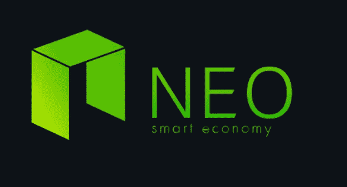

# NEO 是什么？

> 原文：<https://medium.com/coinmonks/what-is-neo-a988a1aae24?source=collection_archive---------6----------------------->

Neo 是 NEO 网络的本地货币。Neo 原名 Antshares，由大和埃里克·张于 2014 年创立。它的更名发生在 2017 年，在 2017 年更名后，Neo 项目的使命变成了创建一个“智能经济”，利用智能合同有效地分配数字资源。

自更名为 NEO 以来，Neo 在 2018 年 1 月达到了迄今为止的最高价格，为 196.85 美元。