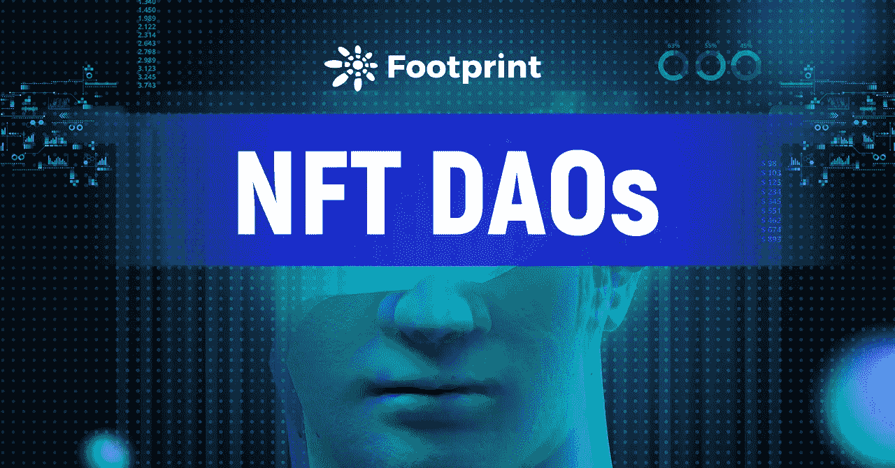

# 什么是 NFT 道斯？

> 原文：<https://medium.com/coinmonks/what-is-nft-daos-e5a4f7721764?source=collection_archive---------5----------------------->

今年，加密领域见证了许多创新。从 DeFi prosper 到 NFT 之夏，出现了无数的项目和运动。

[Footprint Analytics: NFT Volume & Number of Holders](https://www.footprint.network/guest/dashboard/nft-fp-9bc821fc-ea88-4154-a24d-822c30b035d9?channel=u-DBc983#secret=DC277797A293348735928F5C7DB0CE6F)

NFT 的疯狂已经在世界各地爆发，并导致它的地位不稳定和价格过高。因此，一种新的针对小投资者的 NFT 控股和治理形式被创造出来，这就是所谓的 NFT 道斯。

## 什么是 NFT 道斯？

顾名思义，道是与道的结合。

NFT 代表“不可替代的令牌”，是区块链上具有唯一识别码和元数据的加密资产。这些作品的价格有些高得离谱。随着价值数百万的艺术收藏品被作为数字资产出售，许多名人开始涉足这一领域，这逐渐成为一种独特的时尚品味的象征。

然而，一些小投资者也想持有一些昂贵的 NFT 艺术品，因此出现了许多合作社区。刀来了。

道，也称为分散自治组织，是由编码为计算机程序的规则表示的组织，它是透明的，由组织成员控制，但不受中央权力的影响。

道解决了与他人共享 NFT 时的信任问题，减少了协作过程。DAO 是一个旨在实现自动化和去中心化的组织。虽然 Dao 远非完美，但它试图弥补传统协作的一些缺陷，同时实现大规模的人类协作。随着社区的发展，许多传统的组织正在转向 DAO。

## **现在有没有 NFT 道的做法？**

1.  党岛:主权个人时代的先声

PartyDAO 成立的目的是在没有许可的情况下向特定的 NFT 群体集资。

它始于丹尼斯·纳扎罗夫的一条推特，如下所示。随着这个想法在网上传播，阿尼什·阿格尼霍特里创造了一个 MVP，部署了它，并赢得了科林和萨米尔·NFT 的拍卖。忠于互联网——项目的本土根基。PartyDAO 有两个主要任务。PartyBid 为 NFTs 上的集体投标，PartyDAO 本身为一个持久的组织。

Source: [Twitter](https://twitter.com/Iiterature/status/1383238473767813125?ref_src=twsrc%5Etfw%7Ctwcamp%5Etweetembed%7Ctwterm%5E1383238473767813125%7Ctwgr%5E%7Ctwcon%5Es1_c10&ref_url=https%3A%2F%2Fd.mirror.xyz%2FFLqkPA3iN4x-p97UhfhWwaCx8rBmVo-1yttY20oaob4)

PartyDAO 可以将小投资者聚集在一起，获取市场上更多优质资产的升值潜力。它没有资产数额的限制，而其他 NFT 道有一些门槛。PartyDAO 背后的价值是让 NFT 的未来属于每一个人。

2.SquiggleDAO:NFT 生态系统的支持者

Source: [globalcoinresearch](https://globalcoinresearch.com/2021/08/25/chromie-squiggles-the-on-chain-generative-art-movement/)

Chromie Squiggle 是一个生殖艺术项目，它的持有者创造了 SquiggleDAO，试图让它繁荣起来。

SquiggleDAO 致力于支持生成性 NFT 艺术的发展和文化相关性，这是一种整体或部分由自治系统创建的艺术。

SquiggleDAO 的成员包括艺术收藏家、艺术家和以技术为中心的梦想家，他们喜欢数字艺术，并相信权力分散。他们相信艺术是人类表达的最重要的方面之一，一个有更多艺术的世界是一个更好的世界。

3.Aped 道:NFT 兴趣俱乐部

Source: [Coingecko](https://www.coingecko.com/en/nft/ape-dao-remix)

猿人道由 49 只无聊的猿人和一个被分成 1，000，000 个尖角代币的雌性隐朋克开始。短短四天内收集了 70 个 ETH，APED DAO 无疑获得了巨大的成功。

APE DAO 使社区成为了一个 APE 兴趣俱乐部，现在这个俱乐部是私有的，APED 代币已经卖完了。

APED DAO 由其社区管理，并使用 NIFTEX 创建的 APED 令牌来做出决策。猿刀已经成为猿 NFT 兴趣俱乐部。目前，APED DAO 拥有超过 230 名成员，证明了无聊的 Ape 游艇生态系统中一些最罕见的 NFT 已经大大民主化，表明将互联网陌生人团结在一个旗帜下以有效实现统一目标是多么容易。

## **对道未来的思考**

DeFi 为更加分散的未来铺平了道路。对于艺术内容的创作、所有权和管理来说，和道是两把钥匙。

大多数社区比单一实体拥有更多的资源，能够汇集知识、资产和思想。多亏了区块链技术，现在有可能以分散化组织的形式将 Dao 与更多的领域结合起来，从而使分散化的过程更快。

> 加入 Coinmonks [电报频道](https://t.me/coincodecap)和 [Youtube 频道](https://www.youtube.com/c/coinmonks/videos)了解加密交易和投资

## 另外，阅读

*   [ProfitFarmers 回顾](https://blog.coincodecap.com/profitfarmers-review) | [如何使用 Cornix 交易机器人](https://blog.coincodecap.com/cornix-trading-bot)
*   [MXC 交易所评论](/coinmonks/mxc-exchange-review-3af0ec1cba8c) | [Pionex vs 币安](https://blog.coincodecap.com/pionex-vs-binance) | [Pionex 套利机器人](https://blog.coincodecap.com/pionex-arbitrage-bot)
*   [我的加密副本交易经历](/coinmonks/my-experience-with-crypto-copy-trading-d6feb2ce3ac5) | [比特币基地评论](/coinmonks/coinbase-review-6ef4e0f56064)
*   [CoinFLEX 评论](https://blog.coincodecap.com/coinflex-review) | [AEX 交易所评论](https://blog.coincodecap.com/aex-exchange-review) | [UPbit 评论](https://blog.coincodecap.com/upbit-review)
*   [AscendEx 保证金交易](https://blog.coincodecap.com/ascendex-margin-trading) | [Bitfinex 赌注](https://blog.coincodecap.com/bitfinex-staking) | [bitFlyer 评论](https://blog.coincodecap.com/bitflyer-review)
*   [麻雀交换评论](https://blog.coincodecap.com/sparrow-exchange-review) | [纳什交换评论](https://blog.coincodecap.com/nash-exchange-review)
*   [支持卡审核](https://blog.coincodecap.com/uphold-card-review) | [信任钱包 vs 元掩码](https://blog.coincodecap.com/trust-wallet-vs-metamask)
*   [Exness 点评](https://blog.coincodecap.com/exness-review)|[moon xbt Vs bit get Vs Bingbon](https://blog.coincodecap.com/bingbon-vs-bitget-vs-moonxbt)
*   [如何开始通过加密贷款赚取被动收入](https://blog.coincodecap.com/passive-income-crypto-lending)
*   [加密货币储蓄账户](/coinmonks/cryptocurrency-savings-accounts-be3bc0feffbf) | [加密交易机器人](https://blog.coincodecap.com/best-crypto-trading-bots)
*   [BigONE 交易所评论](/coinmonks/bigone-exchange-review-64705d85a1d4) | [CEX。IO 审查](https://blog.coincodecap.com/cex-io-review) | [交换区审查](/coinmonks/swapzone-review-crypto-exchange-data-aggregator-e0ad78e55ed7)