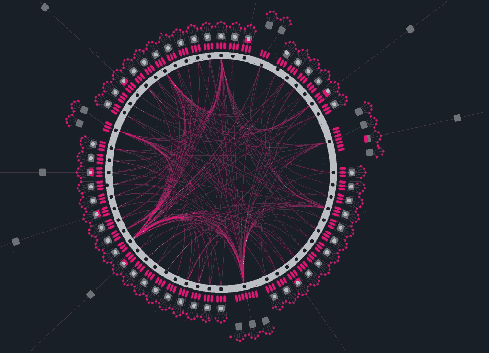
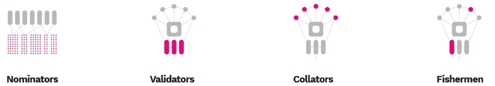

# 什么是波尔卡多，它是如何工作的

> 原文：<https://medium.com/coinmonks/what-is-polkadot-and-how-it-works-9791366d515c?source=collection_archive---------5----------------------->

在分析完[上一篇](/@guazzogianmarco/scalability-and-interoperability-what-are-cryptos-real-problems-b333bcc65d1d)中与加密货币和[区块链](https://blog.coincodecap.com/what-is-blockchain-a-simple-guide-for-dummies)板块相关的问题后，是时候深入细节，了解一下**目前解决互操作性和可扩展性**问题的最佳项目是什么了。在过去的一段时间里，这个协议已经做了很多关于自己的谈论，达到了前 10 名的资本，并为其投资者创造了丰厚的回报。

我们显然是在谈论 Polkadot，一个允许以安全、可靠和可扩展的方式转移不同类型资产的平台。在谈论这项技术及其工作原理之前，澄清谁是这个项目背后的参与者是正确的，因为围绕这个区块链的巨大兴趣由此产生。Polkadot 是 Web3 基金会的旗舰项目，该基金会是一家瑞士基金会，旨在促进功能齐全、用户友好的分散式网络的运行。由该领域的一些主要人物创建，围绕该项目，我们找到了以太坊的联合创始人兼首席技术官 Gavin Wood 以及 Web3 基金会的技术总监 Peter Czaban。

因此，Polkadot 并不是加密领域众多新项目中的一个，但它是一个旨在解决密码学中最大问题之一的协议，即可扩展性。**Polkadot 团队提出的解决方案是创建可以相互通信的并行链**，以免阻塞单个块链。这些链被称为 Parachain，并且具有彼此不同的特征:事务的计算被分布在各种 para chain 中，允许大量事务被非常快速地处理。

**Polkadot 最有趣的特性之一是能够在公共、开放和免授权的区块链上传输任何类型的数据，也可以通过授权在私有(或 DLT)区块链上传输任何类型的数据**。因此，这使得开发从 DLT 获取数据并在公共区块链上使用它们的应用成为可能，这些应用能够证明数据的确定性，而不是数据本身。

该协议的实际运作并不简单，因为它由几个点组成，每个点在这个“机器”的运作中都有一个基本的作用。在操作层面上，Polkadot 由 3 个基本部分组成:

*   **中继链**:Polkadot 的心脏，负责网络的安全、同意和跨链互操作，
*   **Parachain** :任何类型的区块链，可以拥有自己的令牌，并针对特定用例优化其功能，
*   **网桥**:允许 Parachains 与以太坊、比特币等外部网络连接和通信的真实网桥。

要完全理解 Polkadot，另一个非常重要的点是**共识算法**，它是为了管理协议必须处理的大量数据而建立的。这里也有不同类型的“节点”，每个节点都有特定的任务:

*   **提名者**:通过选择验证者和标记圆点来保护中继链。
*   **验证者**:通过标记点来保护中继链，验证来自校对者的证据，并与其他验证者一起参与共识。
*   **整理器**:保存用户事务的片段，并向验证器提供证据。
*   **钓鱼者**:他们监控网络，并通过验证器报告不正确的行为。

**因此，Polkadot 在参与网络**的区块链世界中扮演担保人的角色，允许交易安全、跨链、高稳定性地进行。

Polkadot 除了具有复杂的一致性算法和乍看起来并不简单的操作之外，还具有令牌，可用于标记和协议的安全性。最近， **DOT tokens 的市值已经进入了前 10 名**，再次显示了人们对这个项目的兴趣。

## 另外，阅读

*   最好的[密码交易机器人](/coinmonks/crypto-trading-bot-c2ffce8acb2a)
*   [密码本交易平台](/coinmonks/top-10-crypto-copy-trading-platforms-for-beginners-d0c37c7d698c)
*   最好的[加密税务软件](/coinmonks/best-crypto-tax-tool-for-my-money-72d4b430816b)
*   [最佳加密交易平台](/coinmonks/the-best-crypto-trading-platforms-in-2020-the-definitive-guide-updated-c72f8b874555)
*   最佳[加密借贷平台](/coinmonks/top-5-crypto-lending-platforms-in-2020-that-you-need-to-know-a1b675cec3fa)
*   [最佳区块链分析工具](https://bitquery.io/blog/best-blockchain-analysis-tools-and-software)
*   [加密套利](/coinmonks/crypto-arbitrage-guide-how-to-make-money-as-a-beginner-62bfe5c868f6)指南:新手如何赚钱
*   最佳[加密制图工具](/coinmonks/what-are-the-best-charting-platforms-for-cryptocurrency-trading-85aade584d80)
*   [莱杰 vs 特雷佐](/coinmonks/ledger-vs-trezor-best-hardware-wallet-to-secure-cryptocurrency-22c7a3fd391e)
*   了解比特币的[最佳书籍有哪些？](/coinmonks/what-are-the-best-books-to-learn-bitcoin-409aeb9aff4b)
*   [3 商业评论](/coinmonks/3commas-review-an-excellent-crypto-trading-bot-2020-1313a58bec92)
*   [AAX 交易所审核](/coinmonks/aax-exchange-review-2021-67c5ea09330c) |推荐代码、交易费用、利弊
*   [Deribit 审查](/coinmonks/deribit-review-options-fees-apis-and-testnet-2ca16c4bbdb2) |选项、费用、API 和 Testnet
*   [FTX 密码交易所评论](/coinmonks/ftx-crypto-exchange-review-53664ac1198f)
*   [n 零审核](/coinmonks/ngrave-zero-review-c465cf8307fc)
*   [Bybit 交换审查](/coinmonks/bybit-exchange-review-dbd570019b71)
*   [3Commas vs Cryptohopper](/coinmonks/cryptohopper-vs-3commas-vs-shrimpy-a2c16095b8fe)
*   最好的比特币[硬件钱包](/coinmonks/the-best-cryptocurrency-hardware-wallets-of-2020-e28b1c124069?source=friends_link&sk=324dd9ff8556ab578d71e7ad7658ad7c)
*   最佳 [monero 钱包](https://blog.coincodecap.com/best-monero-wallets)
*   [莱杰纳米 s vs x](https://blog.coincodecap.com/ledger-nano-s-vs-x)
*   [bits gap vs 3 commas vs quad ency](https://blog.coincodecap.com/bitsgap-3commas-quadency)
*   [莱杰纳米 S vs 特雷佐 one vs 特雷佐 T vs 莱杰纳米 X](https://blog.coincodecap.com/ledger-nano-s-vs-trezor-one-ledger-nano-x-trezor-t)
*   [block fi vs Celsius](/coinmonks/blockfi-vs-celsius-vs-hodlnaut-8a1cc8c26630)vs Hodlnaut
*   Bitsgap 评论——一个轻松赚钱的加密交易机器人
*   为专业人士设计的加密交易机器人
*   [PrimeXBT 审查](/coinmonks/primexbt-review-88e0815be858) |杠杆交易、费用和交易
*   [埃利帕尔泰坦评论](/coinmonks/ellipal-titan-review-85e9071dd029)
*   [赛克斯·斯通评论](https://blog.coincodecap.com/secux-stone-hardware-wallet-review)
*   [BlockFi 审查](/coinmonks/blockfi-review-53096053c097) |赚取高达 8.6%的加密利息