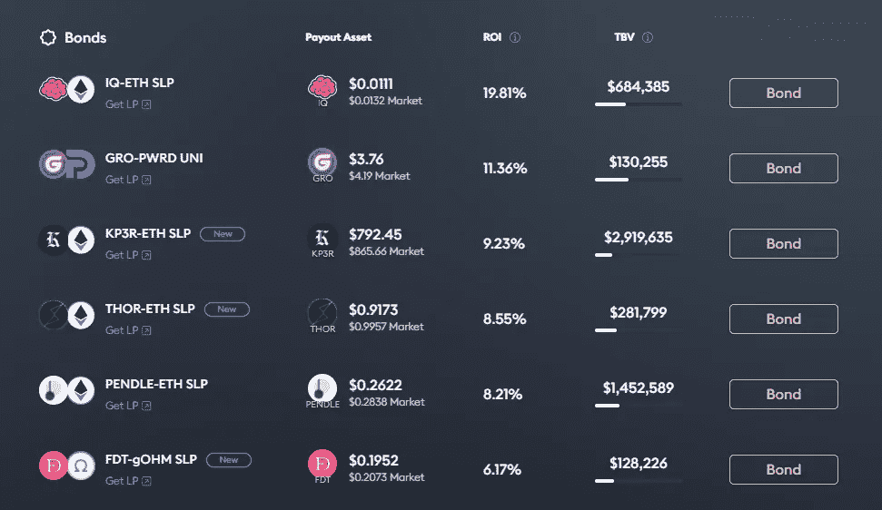

# 什么是协议自有流动性？奥林巴斯道开发的模型入门

> 原文：<https://medium.com/coinmonks/what-is-protocol-owned-liquidity-a-primer-on-the-model-developed-by-olympus-dao-55368f200d66?source=collection_archive---------0----------------------->

## *介绍在分散式交易所为代币提供流动性的新方法*

[Image credit](https://unsplash.com/photos/BCJ5TRULhNo)

D 自 2020 年以来，被称为 DeFi 的非中心化金融出现了爆炸式增长，带来了颠覆传统金融的潜力。

特别是，分散式交易所(dex)的兴起(最著名的是 Uniswap)带来了关键的创新，使得利用自动做市商(AMM)、流动性池和流动性提供者，在没有集中的中介的情况下促进交易。

然而，这些创新并非没有缺点。也就是说，唯利是图的流动性问题困扰着协议，他们经常需要用大量的奖励来激励流动性提供者提供流动性以使他们的令牌能够交易。

在这种背景下，一种向 dex 上的代币提供流动性的新形式以协议拥有流动性的形式出现。由 Olympus DAO 开发的这一模型不仅承诺解决雇佣军的流动性问题，而且还承诺在此过程中创造一种储备货币。

> 加入 Coinmonks [电报频道](https://t.me/coincodecap)和 [Youtube 频道](https://www.youtube.com/c/coinmonks/videos)了解加密交易和投资

# **总结**

协议自有流动性是 Olympus DAO 首创的一种新方法，为分散式交易所的代币提供流动性。协议所有流动性模型不是依靠向市场提供激励来为流动性池提供流动性，而是利用“绑定”机制。绑定本质上涉及协议以折扣向购买者出售他们的令牌，作为交换，购买者将提供另一个令牌(例如，DAI)，其形成协议库的一部分。然后，财政部可以直接向 dex 提供流动性(赚取交易费)，并可以进行投资以产生回报。

协议拥有的流动性是对雇佣军资本问题的一种创新解决方案，其中协议参与所谓的“逐底竞赛”,以提供越来越高的激励来吸引流动性提供商，反过来通过大量发行代币来稀释协议的价值。

协议自有流动性可能是 DeFi 格局的一个持续特征，协议利用协议自有流动性模型和传统流动性池的混合进行 dex 交易。

# **背景:自动做市商、流动性池和流动性提供者**

自动市场标记是 dex 功能中不可或缺的组成部分。与通过订单簿匹配买家和卖家的集中式交易相反，dex 中的买家和卖家通过智能合约(又名 AMM)进行交易。智能合约持有履行订单的令牌，价格由算法决定(通常订单量越大，价格影响越大)。让我们通过一个简单的例子来说明这一点。

**Source:** [**Uniswap**](https://docs.uniswap.org/protocol/V2/concepts/core-concepts/pools)

在上图中，我们假设令牌 A 是 ETH，令牌 B 是 OHM (Olympus DAO 的治理令牌)。如果交易者 A 想要购买 1 欧姆的代币，他们将出售 10 欧姆的代币(注意，在 dex 上，代币与其他代币交易，而不是与法定货币交易)。

然而，当交易者 A 提交购买 1 欧姆代币的订单时，他们实际上并没有与另一个交易者进行交易(在集中交易中就是这种情况)。相反，他们正在与 AMM 交易，后者储备了 100 ETH 和 10 OHM 以促进交易。这些储备被称为流动性池。

然而，这回避了一个问题，外汇储备首先是如何进入流动性池的？输入流动性提供者。

流动性提供者是一对代币的持有者，他们同意将这些代币“锁定”在流动性池中。在上图中，流动性提供者向流动性池提供了 10 ETH 和 1 OHM，作为回报，获得了流动性池份额(代表他们各自对池的所有权)。

流动性提供者被鼓励通过以下方式将其代币锁定在流动性池中:

1.  收取交易者为每笔交易支付的交易费的一部分(上图中为 0.03%)
2.  协议提供自己的令牌作为奖励

吸引和留住流动性提供商对于在 dex 上上市的代币至关重要，因为当流动性池中没有足够的代币来吸收交易时，dex 上的低流动性会导致代币价值的巨大价格波动。

# **问题:佣兵的流动性**

协议在吸引流动性到其令牌的流动性池和保持流动性方面面临巨大困难。这有两个原因:

1.  单靠交易费往往不足以激励流动性提供者锁定流动性，导致协议不得不提供自己的代币作为奖励
2.  流动性提供者可以很容易地将流动性转移到不同的流动性池

这样做的最终结果是，协议可能不得不参与所谓的“竞争到底”,以提供越来越多的它们自己的令牌作为奖励，以便为它们的令牌流动性池吸引和保留流动性提供者。否则，流动性提供者(如雇佣军)会将他们的流动性转移到其他流动性池，在那里他们可以获得更高的回报。这可能导致协议不得不发行大量代币作为奖励，这稀释了现有持有人的权益，并可能给价格带来下行压力(特别是如果流动性提供商立即在市场上出售奖励代币)。

# **解决方案:协议自有流动性**

雇佣军流动性问题的一个潜在解决方案是协议拥有流动性，这是由 Olympus DAO 首创的一种模式。协议自有流动性绕过了对外部流动性提供者的需求，而是由协议本身向他们自己的 dex 交易对提供流动性。实现这一点的关键创新是“粘合过程”。

**粘合过程**

简而言之，绑定过程涉及协议本身出售其自己的令牌(例如 OHM)以从购买者处换取另一令牌(例如 ETH 或 DAI)或流动性池令牌(例如 OHM/ETH)。通过协议以低于当前市场价格的折扣(通常为 5-10%)出售代币，激励买方购买债券(而不是在市场上购买代币)，该折扣在一段时间内(通常不到一周)授予，以防止即时套利机会。

绑定过程的最终结果是协议最终在其金库中持有大量有价值的令牌。这一过程可以被认为类似于储备银行(即协议)如何出售他们国家的货币(由他们控制)从市场上购买外币，从而将这些外币储存在他们的国库中。

**协议如何处理国库中的代币？**

利用从绑定过程接收的令牌，协议如下利用这些令牌:

1.  在收取交易费用的过程中，在 dex 上为其自己的令牌向流动性池提供流动性(例如，Olympus DAO 将充当流动性提供者，并向 Uniswap 上的 ETH-OHM 对提供 ETH 和 OHM)
2.  投资代币以赚取回报(例如，借出代币，投资于协议项目)

**创造储备货币**

协议拥有流动性模型的一个副产品是，因为协议现在在其金库中持有有价值的代币，所以协议现在可以被视为由资产“支持”。这在理论上可以为令牌创建价格下限(例如，如果财政部拥有 10 亿美元的 ETH，则协议的最低市值应为 10 亿美元)，并允许财政部通过在市场上购买其令牌来“捍卫”其令牌的价格(推高价格)。

应谨慎看待这一论点，因为该协议仍将在 dex 上向其令牌的流动性池提供流动性。如果持续出售他们的代币，这将耗尽国库的储备资产(因为协议将贡献交易对中更多的储备资产)，从而降低价格下限。这可能导致一个负反馈循环，卖出会降低底价，鼓励进一步卖出。然而，请注意，协议可以决定从其流动性对中提取流动性，但这将在本质上破坏协议拥有的流动性模型的基础。

Olympus DAO(以及其他 forks)已经部分实施了降低这种风险的措施，通过提供大额赌注 APYs(通常大于 1000%)来减少出售的动机(利用博弈论中经典的囚徒困境论点)。这种 APY 诱惑是否能长期持续还有待观察，这表明协议需要向参与者提出明确的价值主张，以保持对代币作为储备货币的信心。

但是，请注意，协议仍然可以利用协议拥有的流动性模型，而不打算创建储备货币。

**流动性即服务(LaaS)**

也许奥林巴斯 DAO 更持久的遗产是通过奥林巴斯 Pro 平台推出的 LaaS 概念。这使得协议能够轻松利用协议拥有的流动性模型。

[Extract](https://pro.olympusdao.finance/#/bond) of bonds listed on Olympus Pro’s marketplace

该平台充当债券市场，用户可以从列出的协议中购买债券(向 Olympus DAO 支付交易费)。

诸如此类的市场应该会减少债券发行中的摩擦，在协议和资本提供者之间提供有价值的匹配服务，这应该会继续推动这种模式在 DeFi 中的采用。

# **协议自有流动性模式的优势**

*   部分解决了雇佣军资本问题，协议在理论上支付较低的成本(以打折代币的形式)来保持流动性
*   协议将他们自己的交易对的交易费用保存在 dex 中
*   国库资产可以为协议创造收入
*   假设国库有足够的规模，交易对应该能够吸收较高的交易，而价格影响较小

# **协议自有流动性模型的缺点**

*   依靠对市场价格的折扣来激励用户购买债券。这一领域的更多竞争可能导致更高的折扣，这将进一步稀释现有的持有者
*   使用这种模式创造储备货币的协议的系统风险，持续出售的机会侵蚀了“价格底线”，并产生了负反馈循环

# **最终想法**

协议拥有的流动性模型是对雇佣军资本问题的创新解决方案，并且作为一种流动性模型可能会越来越受欢迎。这在一定程度上是由 Olympus Pro(以及其他竞争平台)的出现推动的，它创造了一个市场来帮助其他协议进行绑定。未来，DeFi 协议可能会混合使用协议自有流动性和传统流动性池。

然而，应该注意协议的一些承诺，这些承诺试图仅通过绑定过程将值引入协议，进而试图创建储备货币。从长期来看，这些协议有丧失信心的风险(特别是如果协议没有提供明确的价值主张)，导致持续的抛售，耗尽国库的价值。

> 加入 Coinmonks [电报频道](https://t.me/coincodecap)和 [Youtube 频道](https://www.youtube.com/c/coinmonks/videos)了解加密交易和投资

## 另外，阅读

*   [Godex.io 审核](/coinmonks/godex-io-review-7366086519fb) | [邀请审核](/coinmonks/invity-review-70f3030c0502) | [BitForex 审核](https://blog.coincodecap.com/bitforex-review)
*   [10 本关于加密的最佳书籍](https://blog.coincodecap.com/best-crypto-books) | [英国 5 个最佳加密机器人](https://blog.coincodecap.com/uk-trading-bots)
*   [ko only Review](https://blog.coincodecap.com/koinly-review)|[Binaryx Review](https://blog.coincodecap.com/binaryx-review)|[Hodlnaut vs CakeDefi](https://blog.coincodecap.com/hodlnaut-vs-cakedefi-vs-celsius)
*   [MoonXBT vs Bybit vs 币安](https://blog.coincodecap.com/bybit-binance-moonxbt) | [硬件钱包](/coinmonks/hardware-wallets-dfa1211730c6)
*   [火币交易 Bot](https://blog.coincodecap.com/huobi-trading-bot) | [如何购买 ADA](https://blog.coincodecap.com/buy-ada-cardano) | [Geco？一次回顾](https://blog.coincodecap.com/geco-one-review)
*   [币安 vs Bitstamp](https://blog.coincodecap.com/binance-vs-bitstamp) | [Bitpanda vs 比特币基地 vs Coinsbit](https://blog.coincodecap.com/bitpanda-coinbase-coinsbit)
*   [如何购买瑞波(XRP)](https://blog.coincodecap.com/buy-ripple-india) | [非洲最好的加密交易所](https://blog.coincodecap.com/crypto-exchange-africa)
*   [非洲最佳加密交易所](https://blog.coincodecap.com/crypto-exchange-africa) | [Hoo 交易所评论](https://blog.coincodecap.com/hoo-exchange-review)
*   [eToro vs robin hood](https://blog.coincodecap.com/etoro-robinhood)|[MoonXBT vs by bit vs Bityard](https://blog.coincodecap.com/bybit-bityard-moonxbt)
*   [有哪些交易信号？](https://blog.coincodecap.com/trading-signal) | [比特斯坦普 vs 比特币基地](https://blog.coincodecap.com/bitstamp-coinbase)
*   [ProfitFarmers 点评](https://blog.coincodecap.com/profitfarmers-review) | [如何使用 Cornix 交易机器人](https://blog.coincodecap.com/cornix-trading-bot)
*   [如何在势不可挡的域名上购买域名？](https://blog.coincodecap.com/buy-domain-on-unstoppable-domains)