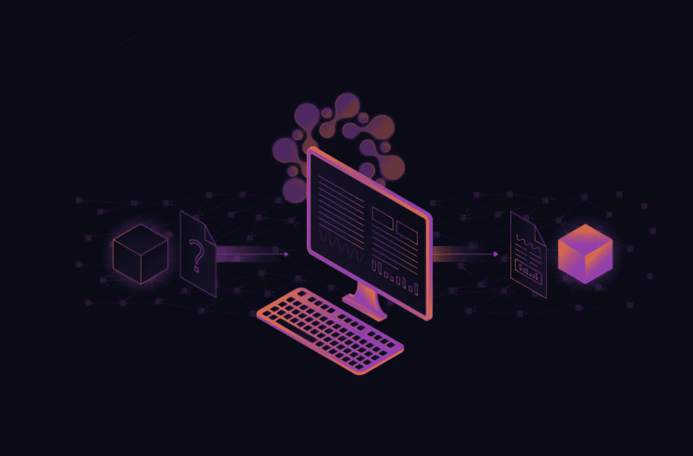
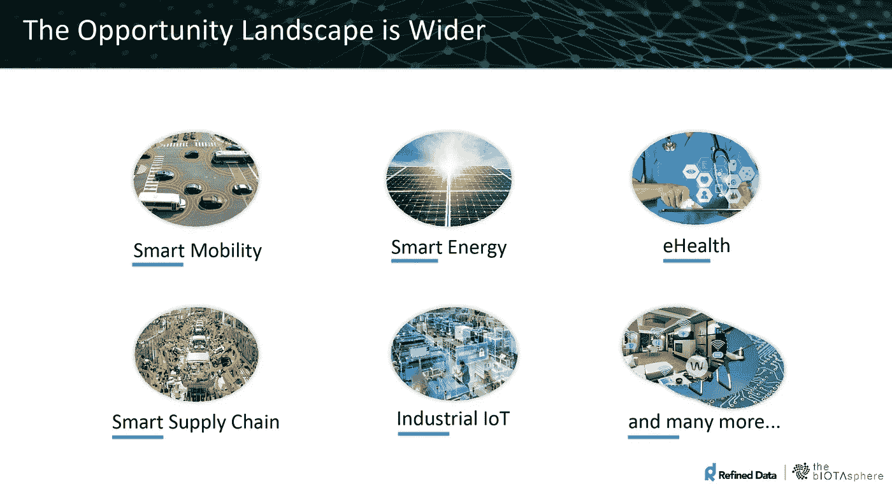

# 一个门外汉的“Q”是什么…

> 原文：<https://medium.com/coinmonks/what-is-q-from-a-laymen-given-barney-style-6387b18267d2?source=collection_archive---------0----------------------->

有点长，但我认为它可能有助于人们了解 Qubic 一点。

我从阅读 Qubic 中学到的两点:(Rev_02)

**拿走一个:**

1.如果你拥有一个“Q 节点”，一个支持 Q 协议(层)的节点，你可以通过以下方式获得回报:提供 PoW(采矿钻机、计算机或你的咖啡壶)，PoS(你持有的 IOTA)，你不使用的带宽(可能与未来的 LIFI 有关，所以这可能是你家里的路由器和灯泡)，以及简单地说，以前为系统运行诚实节点的历史。

以上都可以用来通过“资源测试阶段”。所有这些资源:功率、PoS、Po(带宽)和 Po(诚实度)都被测量和量化。你的资源实际上把你放在了一个等价的资源库中，也就是说，和其他具有相似资源能力的人放在了一起。

然后，您可以从使用 Oracle 系统、智能合同或仅仅是想要计算能力的人那里赚取 IOTA(这是外包物联网行业所绝对需要的，物联网行业肯定是未来的发展方向。

这意味着什么？

之前你记得所有的问题:IOTA 不会工作，因为人们不会运行节点，因为他们不会像传统的区块链那样得到激励。现在他们可以了！！！不仅如此，“Q”考虑了每个密码的各个方面，并将其全部结合在一个…

位置、功率、带宽和诚实度。

更重要的是，如果你有 Asic，你就在 Asic 池中，GPU 池中，你在 GPU 池中，旧的蹩脚计算机(你在旧的蹩脚计算机池中)，你在大量 IOTA 中下注，你在高赌注 IOTA 池中…等等。这是向网络“证明”你的资源的过程。

人们将使用 Qubic 协议购买“资源”。如果他们想要高质量，快速，或极端的计算能力，他们必须支付。

请记住，您作为用户设置了您希望在 IOTA 中获得的资源(经济原则)。如果你每月在电费和设备上花费 1200 美元，你每月只会为你的资源收取超过 1200 美元的费用，没有人会少收。因此，在你的资金池中，每个人最终都会达到收取固定金额的法定人数，因此经济(用户)将为此买单。所以，本质上，资金池越好，你得到的回报就越多(基于社会中的经济原则(就像区块链)。我并不完全理解什么等同于奖励的准确量化衡量(例如区块链的 hash power)，尽管似乎一旦你证明了你的资源，你的机器就会执行在 Qubic 网络上购买的计算。

然而，如果你的咖啡壶有一个 jinn 芯片，它是三进制硬件，具有三进制编程(ABRA)，那么它可以在不制作咖啡时出售其资源，即:证明其资源，然后为买家完成计算。这只是推测，ABRA 三进制语言将能够与二进制接口，并降低能耗，但数量可观。当 ABRA 与 Jinn 之类的三元芯片结合时，能效更高！阻碍技术进步的主要瓶颈或挑战之一是机器内的电池存储量。如果我们不能重新设计电池来储存更多的能量，至少我们可以重新设计机器设备内部的能量消耗。

此外，你的自动驾驶汽车不仅可以提供它的电力，还可以在它不工作或驾驶时，在它的钱包中赌上它不使用的 IOTA 带宽，以及体验/诚信因素(通过证明它的资源，然后出售它的计算能力)，因为它“可能”能够成为自己的节点。此外，通过太阳能或风能充电剩余的电力，它可以通过智能电网卖给邻居或当地企业。你的汽车有“多种”资源，Qubic 网络允许机器向主人提供“所有”资源，而不像区块链那样只有一两种。

量子力学使机械发生了革命性的变化。出售资源的机器。这是机器在“机器经济”中发挥作用的最终愿景的另一个组成部分。

而不是我们设置这一点，以及我们想要收取的费用，最终我们可以创建具有 Qubic 函数的智能合同，然后允许机器谈判并“自己”赚钱，机器将“自己”出售和购买资源，真正创造机器经济，“如果你拥有机器，你就赚到了回报(即:收入，被动收入)。

**拿走两个:**

2.从上面的描述中，这些只是我从阅读量子芯片中得到的一些用例。现实是，在接下来的一年中，社区可能每天都会提出新的用例。目前我们甚至无法想象的用例，但这里是我的第二个要点:

Qubic 协议，这一切都发生在那里。矿工收入，人们赌上他们的 IOTA 和收入(即:“利息”或“被动收入”)，因为他们是 HODLER 的(通过证明他们的资源，他们出售他们的计算能力)，外汇金融公司使用 Qubics 作为法定“ORACLE”数据，智能合同在协议上运行，科学家使用计算能力进行医学研究，大众，富士通和博世使用计算能力进行他们的物联网设备，等等。没完没了。所有这些使用案例，以增强…供电、运行网络，所有这些功能都将在与实时智能合约微支付的纠缠中进行零费用交易。

通过在 Tangle 上发送的事务中发送元数据，整个系统在数据事务(零费用事务)上运行。元数据本质上(我不是一个技术人员)就像是一种语言，它告诉 Q 节点醒来，处理数据，支付，赚取和接收，并本质上运行整个 Q 网络。

所以…这是一个 SHITLOAD 的交易发生！！！！！！目前，三位一体、投机和交易产生的交易量与 Qubic 网络产生的交易量相比，只是沧海一粟。不难理解，Qubic 网络每天将在 Tangle 上运行数百万(如果不是数十亿)的交易，记住，“每个交易确认两个交易”。

所以…这是什么意思？更多的事务意味着更快的混乱，更安全的混乱，无限可扩展的混乱…最重要的是…我们可以让首席运营官(协调者)离线！！！

注意:可能会有多个首席运营官(协调人)或二等兵首席运营官的用例，但那是一个完全不同的领域，我简单地陈述这一点，因为我读到有人写了这样一个例子，这超出了我的理解。

关键是:需要 Q 来移除首席运营官！

所以，就像每个人都说的，“为什么不把发展的重点放在清除(文清除)上”，你可以看到他们正在努力！”。Qubic 网络将支持网络，因为它鼓励人们托管节点并赚取 IOTA！

此外，如果没有人使用量子网络，那么它就不能正常工作？！？因此，建立“企业伙伴”、联合国(非政府组织)附属机构、与银行的伙伴关系，所有这些都是支持 Qubic 网络所需要的。

以下是开发人员愿景的构建模块:

-你需要一个 Tangle(可以发送元数据的零费用交易)

-你需要 IOTA(一种元数据的传输方式和一种可以买卖资源的支付形式(即:PoW、PoS、PoBandwidth 和 PoHonesty)

-你需要量子网络(创造神谕，允许基于群体的计算来驱动神谕。)

-你需要神谕(神谕为智能合同提供动力，这就是全部的 shabang！它将改变社会，改变全球金融)。

-您需要 Qubic 网络(连接网络用户和网络资源提供商，实现机器经济，并为社会提供计算能力和最先进的智能合同)。

-网络用户(我们需要一个社区(IOTA 基金会通过托管 AMA 建立的社区，花时间与社区讨论不和谐的问题，并提供透明度，以便我们都能继续完成他们的愿景)，我们需要全球合作伙伴，如博世、大众、富士通等。我们需要政府和社会，比如台湾、丹麦，也许还有瑞典；我们需要像 DnB 这样的银行，以及像 Elaad 这样的电力公司。我们需要全球整合来实际“使用”Qubic 网络以使其工作(需求驱动经济原则，最终将支付 Q 节点提供商，这将驱动交易，从而扩展网络)。

-最后，你需要消除首席运营官，让网络有机增长。(这只能在前面的步骤完成后进行)。

纠结->IOTA ->Qubic 网络->神谕->合伙人->首席运营官

所以移除首席运营官是最后的步骤之一。移除首席运营官后，网络可以在没有开发人员太多支持或帮助的情况下自行有机增长。然后他们可以在 Qubic 网络上构建应用程序。

这是一项艰巨的任务，需要一步一步来完成，每一部分都是一个大拼图的一部分。至于刚刚发布的 Qubic vision，是这个难题的一大块！！！

这只是表明，所有这一切加起来删除首席运营官。开发人员和国际单项体育联合会所做的一切都是为了实现这个目标！这是一个巨大的结构，而不是不同的部分，所有的东西都联系在一起，量子网络就是其中的一大块。他们唯一的任务是完成拼图，完成愿景，这样首席运营官就可以被移除，而缠结可以通过机器经济真正地改变社会。

这只是我目前非技术人员的理解。我有更多的研究和学习要做，但该死的我喜欢它！很高兴被允许加入这个社区，并享受 IOTA 基金会的旅程。

如果我完全误解了什么，请澄清，并期待听到其他人的理解。最后，写完这篇文章后，我重读了 Qubic 网站。很难理解，但我粗略的理解是 Q 节点和量子可以休眠监听纠结。量子位是事件驱动的，因此当一个量子位启动时，另一个量子位可能需要该法定人数信息来激活，当一个量子位得到它打算计算的结果时，该量子位本身就可以激活。因此，一个量子比特可以启动另一个量子比特，如此类推，就像神经元放电，点亮大脑的一部分，然后激发更多的神经元。这一切都是通过安全数据流、Tangle、Q 节点和量子网络完成的。在某种程度上，它是一个全球生命系统，数据流是它的生命血液，缠结是它的骨骼结构，量子和 Q 节点是它的神经元。据我们所知，在未来，这个全球大众网络可能会成为人工智能的动力，或者它可能会发展成为一个大规模的人工智能资源，可以在许多方面帮助社会。正如我所说的，我不是技术人员。我可能没有发布一点错误信息，因为我没有完全理解这一切。真的，我只是希望点燃好奇心，这样人们可能会受到启发，把一个 2 放入机器经济的新世界。有时也很难看到全局。IOTA 基金会一直致力于一个“A”愿景，一个将改变社会的机器对机器经济，它将 Tangle 作为一个标准协议，它的骨骼结构。事实上，每一个新的发展都是另一个拼图块，或者说是一个基础块，堆叠在其他的上面。最终我们得到了一个整体的拼图，或者一个建立在坚实基础上的伟大结构。

【https://twitter.com/IotanSea 

https://[qubic.iota.org](https://qubic.iota.org)

https://[www.iota.org](https://www.iota.org)/

 [## 极微小

### IOTλ-机器经济 IOTλ是 2015 年推出的开源分布式账本协议，超越了…

www.facebook.com](https://www.facebook.com/groups/iotatangle/) 