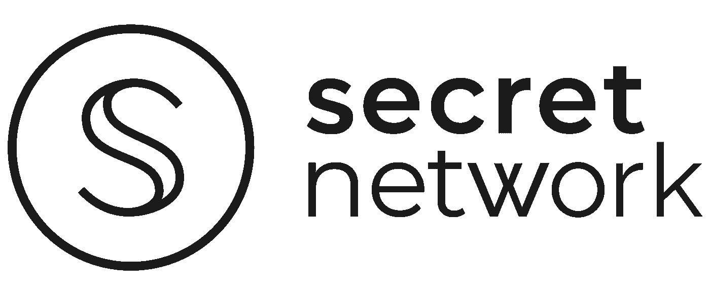

# 什么是秘密网络？

> 原文：<https://medium.com/coinmonks/what-is-secret-network-bad9a233c481?source=collection_archive---------3----------------------->

## 一个为私有的、分散的网络奠定基础的项目。

Source: scrt.network

我认为隐私极其重要，尤其是在互联网上。当您想到可以收集多少数据时，即使是执行看似不重要的任务，也会令人不安。我一直对隐私币很感兴趣，最近我对其中的一些做了一些研究。偶然发现秘密网络改变了我的游戏规则，我无法了解更多。

## **那么什么是秘密网络呢？**

Secret Network 的愿景是创建一个支持智能合同的区块链，重点关注隐私。这包括合同本身和任何 dApps，或者在这种情况下，在链上创建的秘密应用程序。这是与以太坊等大型平台的一个转变，以太坊提供的是链条上发生的交易的完全公开信息。虽然区块链把我们推向了一个去中心化的互联网，但它的隐私目前是不可持续的。随着在现有链条上进行的交易越来越多，风险也在增加。容易获得的数据本身并没有风险，但那些怀有恶意的人可以利用它来寻找目标。

该网络最初名为“谜”。Enigma 作为以太坊的第 2 层扩展解决方案推出，并于 2020 年 5 月更名。秘密网络旨在将隐私放在区块链的每一个方面。数据的输入和输出都是加密的，甚至不会透露给网络上的节点。加密状态智能合约允许创建 dApps，而不会损害隐私。

## **秘密网络是如何实现其隐私目标的？**

区块链是最终成为去中心化网络的伟大基础。但其明显的缺陷是数据在链上是公开的。任何人都可以看到交易，地址，持有等。近来隐私变得尤为重要，区块链缺乏隐私的问题不容忽视。我们期望互联网上的很多东西都有隐私。在安全和隐私方面，银行是有标准的，我们希望我们购物的公司会小心处理我们的个人信息。因此，我们没有理由不期待区块链也能如此。

Secret Network 试图创建一个完全去中心化的互联网，不把隐私放在次要位置。网络支持智能合约，这是第一步。网络上的智能合约能够像在以太坊上一样运行，但不会显示所有数据给所有人看。这是通过可编程的隐私来实现的，它允许选择性的数据量保持秘密，甚至对运行网络的节点也是如此。这些事务都是在可信的执行环境 TEE 中完成的。所有节点看到的只是事务的结果。

分散式金融是可以从这种隐私中获益的明显领域之一。例如，贷款可以安全地发放给用户，而无需公开显示他们的交易数据。关于这个例子的更多信息可以在这里找到。在这一点上与以太坊竞争有点困难，但我认为秘密网络有一个很好的框架集。这就引出了下一个话题，DeFi。

## **仔细看看 SCRT**

区块链的本土标志是 SCRT，用于管理、交换和支付 mainnet 上的费用。值得注意的是，SCRT 并不是默认的隐私标志，它是网络中唯一保持相对公开的部分。

秘密网络 mainnet 提供了一些熟悉的赚钱机会。这是一份委托证明。你既可以经营一个节点，也可以将你的 SCRT 股份委托给一个现有的节点，并获得奖励。在撰写本文时，Keplr 显示估计收益为 28% APY。显然，这两种方式都有各自的风险，尤其是因为它们依赖 SCRT 保值。除此之外，还有我们稍后将讨论的 DeFi 机会。

如同任何类型的投资一样，在投资一个项目之前，做好自己的研究。

对于 SCRT 来说，Keplr 是最容易买到的钱包。如果你正在寻找一个硬件钱包，分类帐目前支持令牌。

## **什么是 SecretSwap？**

SecretSwap 是 Secret Network 对 Uniswap 和 PancakeSwap 等流行的 DeFi 平台的回应。它是一个运行在秘密主网上的跨链分散式交换机。它提供了许多与其他 dex 相同的功能，并且还将提供更多功能。SecretSwap 的费用在 SCRT 支付，这比以太坊目前提供的费用低得多。

一个便利的功能是以太坊桥，它允许以太坊与 SCRT 互换，反之亦然。对其他桥梁的支持也在进行中，包括币安智能链和 Monero 桥。

从那里，你可以进入流动性提供，交换，或赌注。目前只有少数几种可供选择的赌注，每一种都提供 7%到 14%的 APY。一旦你押了一个资产，例如系绳，你就获得 sSCRT 代币，这些代币可以在以后被交换成其他秘密代币。

SEFI 是最近推出的 DeFi 生态系统的治理标志。它提供了通过投票更多地参与资助和平台变更的能力。在撰写本文时，SEFI 也有约 196%的 APY。现在，你可以通过提供流动性来赚取 SEFI。

## **最终想法**

尽管对 NFT 的狂热有所减缓，但他们最近宣布了秘密支持 NFT 的进展。我们应该很快就会看到它们在网络上出现。这只是生态系统的更新之一，其他几个可以在这里找到。

作为一种隐私硬币，它已经有了很多前景，但随着智能合同的真正形成，很难不兴奋。DeFi 从隐私中受益匪浅，所以看到他们在自己的平台上工作，我真的很兴奋。从生态系统更新中很容易看到有多少开发者加入进来，这有助于提高平台的可信度。接下来的几个月将是巨大的，我很兴奋地看到在更多的项目被添加后，网络的土地。

> 加入 Coinmonks [电报集团](https://t.me/joinchat/Trz8jaxd6xEsBI4p)，了解加密交易和投资

## 另外，阅读

*   最好的[密码交易机器人](/coinmonks/crypto-trading-bot-c2ffce8acb2a) | [网格交易](https://blog.coincodecap.com/grid-trading)
*   [加密复制交易平台](/coinmonks/top-10-crypto-copy-trading-platforms-for-beginners-d0c37c7d698c) | [如何在 WazirX 上购买比特币](/coinmonks/buy-bitcoin-on-wazirx-2d12b7989af1)
*   [CoinLoan 审核](/coinmonks/coinloan-review-18128b9badc4)|[Crypto.com 审核](/coinmonks/crypto-com-review-f143dca1f74c) | [火币保证金交易](/coinmonks/huobi-margin-trading-b3b06cdc1519)
*   [尤霍德勒 vs 考尼洛 vs 霍德诺特](/coinmonks/youhodler-vs-coinloan-vs-hodlnaut-b1050acde55a) | [Cryptohopper vs 哈斯博特](https://blog.coincodecap.com/cryptohopper-vs-haasbot)
*   [杠杆代币](/coinmonks/leveraged-token-3f5257808b22) | [最佳密码交易所](/coinmonks/crypto-exchange-dd2f9d6f3769) | [Paxful 点评](/coinmonks/paxful-review-4daf2354ab70)
*   [加密套利](/coinmonks/crypto-arbitrage-guide-how-to-make-money-as-a-beginner-62bfe5c868f6)指南| [如何做空比特币](/coinmonks/how-to-short-bitcoin-568a2d0b4ae5)
*   [如何在印度购买比特币？](/coinmonks/buy-bitcoin-in-india-feb50ddfef94) | [WazirX 评论](/coinmonks/wazirx-review-5c811b074f5b) | [BitMEX 评论](https://blog.coincodecap.com/bitmex-review)
*   [印度比特币交易所](/coinmonks/bitcoin-exchange-in-india-7f1fe79715c9) | [比特币储蓄账户](/coinmonks/bitcoin-savings-account-e65b13f92451)
*   [币安收费](/coinmonks/binance-fees-8588ec17965) | [僵尸加密审查](/coinmonks/botcrypto-review-2021-build-your-own-trading-bot-coincodecap-6b8332d736c7) | [热点审查](/coinmonks/hotbit-review-cd5bec41dafb)
*   [我的密码副本交易经验](/coinmonks/my-experience-with-crypto-copy-trading-d6feb2ce3ac5) | [购买硬币评论](https://blog.coincodecap.com/buycoins-review)
*   [Bybit 融资融券交易](/coinmonks/bybit-margin-trading-e5071676244e) | [币安融资融券交易](/coinmonks/binance-margin-trading-c9eb5e9d2116) | [Overbit 审核](/coinmonks/overbit-review-9446ed4f2188)
*   [加密货币储蓄账户](/coinmonks/cryptocurrency-savings-accounts-be3bc0feffbf) | [YoBit 审核](/coinmonks/yobit-review-175464162c62) | [Bitbns 审核](/coinmonks/bitbns-review-38256a07e161)
*   [Botsfolio vs nap bots vs Mudrex](/coinmonks/botsfolio-vs-napbots-vs-mudrex-c81344970c02)|[gate . io 交流回顾](/coinmonks/gate-io-exchange-review-61bf87b7078f)
*   [最佳比特币保证金交易](/coinmonks/bitcoin-margin-trading-exchange-bcbfcbf7b8e3) | [萝莉点评](/coinmonks/lolli-review-e6ddc7895ad8) | [比特币保证金交易](https://blog.coincodecap.com/bityard-margin-trading)
*   [创造并出售你的第一个 NFT](https://blog.coincodecap.com/create-nft) | [本地比特币评论](/coinmonks/localbitcoins-review-6cc001c6ed56)
*   [加密保证金交易交易所](/coinmonks/crypto-margin-trading-exchanges-428b1f7ad108) | [赚取比特币](/coinmonks/earn-bitcoin-6e8bd3c592d9) | [Mudrex 投资](https://blog.coincodecap.com/mudrex-invest-review-the-best-way-to-invest-in-crypto)
*   [如何在印度购买以太坊？](https://blog.coincodecap.com/buy-ethereum-in-india) | [如何在币安购买比特币](https://blog.coincodecap.com/buy-bitcoin-binance)
*   [顶级付费加密货币和区块链课程](https://blog.coincodecap.com/blockchain-courses)
*   [MXC 交易所评论](/coinmonks/mxc-exchange-review-3af0ec1cba8c) | [Pionex vs 币安](https://blog.coincodecap.com/pionex-vs-binance)