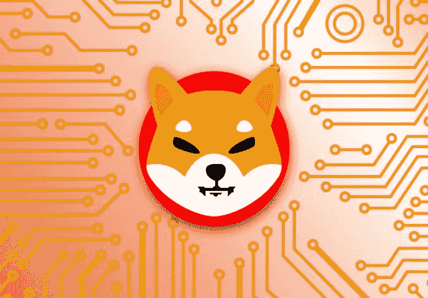
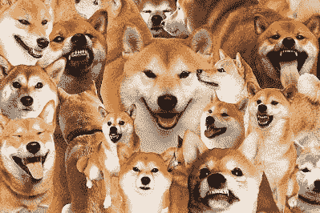

# 什么是柴犬，什么时候会涨到 1 美元？用简单的方式解释

> 原文：<https://medium.com/coinmonks/what-is-shiba-inu-and-when-it-would-go-1-explained-in-simple-way-a128d6475e4e?source=collection_archive---------0----------------------->

Shiba Inu by google

柴犬最初是一个为社区创造的笑话硬币，但很快变成了一个数十亿美元的项目，可能属于投机类别。然而，这篇文章的重点是提供不带偏见或谣言的事实和观点，所以我会尽可能地将我的观点排除在外，让您根据我在这篇文章中所能提供的尽可能多的真实、事实和完整的信息来做出决定。

柴犬币 vs 代币

首先，让我们确保你理解硬币和代币之间的区别。我假设你知道什么是区块链，你应该知道有许多不同的区块链。以太坊是一个，币安智能链是另一个，Polygon 有一个区块链，连 Dogecoin 都有一个区块链！每个区块链都有自己的硬币，这就是我们得到以太币、BNB 币、马蒂奇币等等的原因。然而，在一些区块链上，你可以创造不是硬币的代币，因为它们不帮助运行区块链，但是它们充当硬币，它们被称为代币。他们利用主区块链的力量、安全和维护，所以他们不必关注他们自己的区块链，就像主硬币一样，但他们不是。柴犬是以太坊网络上的一个令牌，意味着它不是自己的区块链，它运行在以太坊上。这意味着没有柴犬币这种东西…它在技术上是柴犬币。我已经看到很多新来的人对此感到困惑，我想澄清一下。SHIB 是以太坊网络上的一个象征，而 Dogecoin 则是一个完全属于自己的真实的区块链。

既然我们已经区分过了，那就让我们来看看为什么柴犬被称为黑仔狗。

# Dogecoin 是什么？

Dogecoin 是一种 meme coin，很久以前开始嘲笑比特币，并表明任何人都可以通过一些改变来复制它。在过去的几年里，它的发展速度越来越快，仅在去年一年，它就变得越来越受欢迎。由于 Dogecoin 有自己的区块链，有点像比特币的翻版，它并没有以太坊那样的超酷升级，即智能合约。智能合约允许人们在区块链网络上做更多的事情，而不仅仅是来回汇款。例如，智能合约允许用户创建新的代币…你不能在比特币或 Dogecoin 上这样做。智能合约还允许用户创建应用程序，比如分散式交易所，在那里你可以交换你的代币。我们已经跑题了，所以如果你想了解更多关于 Defi、智能合约以及分散式应用程序如何工作的知识，请关注，这样新文章出现时你会第一个得到通知。

无论如何，因为柴犬令牌可以利用智能合约，你可以用它做你在 Dogecoin 上不能做的事情，比如借出它，或者在你收费的时候让其他人用它交易。这就是为什么他们自称是 Dogecoin 杀手。

他们是怎么开始的？嗯，在 2020 年 8 月，一个名叫 Ryoshi 的假名开发者开始了这个项目，作为一个社区治理的实验，这意味着一个社区如何决定改变的测试。一位匿名朋友帮助 Ryoshi 设置了智能合约令牌，并在 uniswap 上的以太坊和 SHIB 对中投资了 10 以太坊。这意味着人们可以给 Uniswap 一些以太坊，并购买 SHIB。

大约在 2021 年 3 月中旬，埃隆·马斯克(Elon Musk)发了一条关于获得一只柴犬的推特，导致价格上涨了 300%。

柴犬开发者做的一件有趣的事情是把几乎所有的柴犬令牌都给了以太坊的创始人 Vitalik Buterin。他们知道他的钱包地址，实际上只是给他发送了一吨 SHIB 代币，许多人说这是为了广告目的去“嘿，看，维塔利科拥有我们的一些代币，这意味着他相信它！”。最终，维塔利科拿走了一些 SHIB 代币，卖掉了，把钱捐给了慈善机构。剩下的，大约 90%给他的东西，他都烧掉了。焚烧代币是一个短语，当一个人将代币发送到一个没有人可以访问的钱包时，意味着它们永远消失了。维塔利克烧掉了大约 67 亿美元的 SHIB 代币。

由于 SHIB 是一个以太币，我们可以做的一件独特的事情就是为持有人用它做某些事情提供奖励。例如，Shibaswap 实际上对向特定的柴犬对提供流动性的人给予奖励。这种呼吁提供流动性“挖掘”。当你提供代币给交易者使用时，Uniswap 必须给你一些东西来证明你拥有这个流动性池。他们称之为流动性池代币。Shibaswap 实际上奖励那些拿走他们的流动性池代币并锁定它们的用户，这样我们就知道流动性会存在一段时间。

从技术上来说，你可以随时收回你锁定的代币，所以我不确定他们为什么不奖励所有的流动性提供者，也许你可以在下面的评论中回答。当你持有或锁定你的流动性提供者代币时，他们称之为“埋葬”。当你埋掉 LP 代币，你就开始赚骨头了。Bones 只是另一个以太坊令牌，它是 Shibaswap 的治理令牌。这意味着如果你持有 1 块骨头，你就可以对项目发生的变化投 1 票。大多数人赚了就卖，但也有人买了就持有。你也可以埋掉这些骨头。事实是，它们在开始时是通货膨胀的，所以任何经济学学生都知道这对价格意味着什么:它正在下降。不过，这不是财务建议。

我会告诉你一个关于提供流动性的小秘密。如果你创建了一个项目，你的硬币价格大幅上涨，而你仍然持有一些该项目的硬币……你可能会想“哇，我们可以套现了”。问题是，如果你用 Uniswap 交易代币时流动性很低，你会让价格暴跌。除非你让其他人提供流动性，那么当你抛售一批代币时，价格不会暴跌太多，这样你就可以以更高的价格出售更多的代币。如果你对向 SHIB 提供流动性感兴趣，请记住这一点。

# SHIB NFTs？

在这篇文章中，我还想谈一些其他的事情。

shiba inu by pexels

市值解释

让我们来谈谈那些说“如果 SHIB 变成 1 美分会怎么样”或者更大胆地说“如果 SHIB 变成 1 美元会怎么样”的文章。我在这里并不是说这不会发生，但我在这里是为了澄清这需要什么。首先，MarketCap 是一个用来比较加密货币资产的术语，一般用来描述每枚硬币的平均价格。现在，柴犬令牌价值约 0.00005000 美元，市值为 210 亿美元。如果价格涨到 1 便士，这意味着总市值将达到 4 万亿美元，超过包括比特币在内的所有加密货币的总和。如果总额达到 1 美元，那就意味着 400 万亿美元，远远超过美国所有房屋的总和。同样，我不是说这是不可能的，但我会给你事实，让你决定。

当历史高点出现时，每个人都在获利

接下来我想说的是历史新高，因为 SHIB 最近一直在打 ATHs。你知道吗，当一枚硬币或代币达到历史新高时，就意味着持有这枚硬币的所有人都在获利。想想看，这意味着你假设每个人都愿意持有他们的盈利资产，甚至那些今天可能需要钱来支付账单的人。无论如何，很难像 SHIB 那样持续创出历史新高，所以要确保如果你投资是出于一个好的理由，因为我个人知道一些朋友投资只是因为他们认为价格会上涨。太多的人在没有真正创造价值的情况下试图赚钱，这通常会导致大崩盘，但我并不是说这将会发生，只是重申历史上发生的事情。

心理学 0.01 到 0.02

我想与你分享的最后一件事是一个小小的心理问题，许多开发商会制造大量的代币，所以价格非常低，即使里面有很多钱。柴犬有 210 亿美元在里面，它仍然是一便士的几分之一。不要被这些技巧所迷惑，从 0.01 到 0.02 的百分比变化和从 100 到 200 一样困难，尽管你的大脑认为这更困难，因为数字更大。柴犬可能永远不会触及 1 美元，如果它触及 1 美分，我们可以肯定它会在新闻中，因为它的市值将高于特斯拉，后者刚刚触及 1 万亿美元。

# 结论

我不是专家，这是我在网上搜索到的，在这里读到和写下的，所以请随意研究，然后再做决定。

> 加入 Coinmonks [电报频道](https://t.me/coincodecap)和 [Youtube 频道](https://www.youtube.com/c/coinmonks/videos)了解加密交易和投资

## 也阅读

 [## 最佳加密交易所| 2021 年十大加密货币交易所

### 编辑描述

blog.coincodecap.com](https://blog.coincodecap.com/crypto-exchange)  [## 2021 年最佳加密借贷平台| 6 大比特币借贷平台

### 获得比特币和其他加密货币的最佳贷款利率

medium.com](/coinmonks/top-5-crypto-lending-platforms-in-2020-that-you-need-to-know-a1b675cec3fa)  [## 2021 年最佳免费加密交易机器人

### 2021 年币安、比特币基地、库币和其他密码交易所的最佳密码交易机器人。四进制，位间隙…

medium.com](/coinmonks/crypto-trading-bot-c2ffce8acb2a)  [## 最佳 4 个加密交易信号电报通道

### 这是乏味的找到正确的加密交易信号提供商。因此，在本文中，我们将讨论最好的…

medium.com](/coinmonks/best-crypto-signals-telegram-5785cdbc4b2b)  [## 5 个最佳社交交易平台[2021] | CoinCodeCap

### 编辑描述

blog.coincodecap.com](https://blog.coincodecap.com/best-social-trading-platforms)  [## BlockFi 评论 2021:利弊和利率| CoinCodeCap

### 编辑描述

blog.coincodecap.com](https://blog.coincodecap.com/blockfi-review)  [## 如何在印度购买比特币？2021 年购买比特币的 7 款最佳应用[手机版]

### 如何使用移动应用程序购买比特币印度

medium.com](/coinmonks/buy-bitcoin-in-india-feb50ddfef94)  [## 加密税务软件——五大最佳比特币税务计算器[2021]

### 不管你是刚接触加密还是已经在这个领域呆了一段时间，你都需要交税。

medium.com](/coinmonks/best-crypto-tax-tool-for-my-money-72d4b430816b)  [## 存储比特币的最佳加密硬件钱包[2021] | CoinCodeCap

### 编辑描述

blog.coincodecap.com](https://blog.coincodecap.com/best-hardware-wallet-bitcoin)  [## Pionex 评论 2021 |免费加密交易机器人和交换

### Pionex 是为交易自动化提供工具的后起之秀。Pionex 上提供了 9 个加密交易机器人…

medium.com](/coinmonks/pionex-review-exchange-with-crypto-trading-bot-1e459d0191ea)