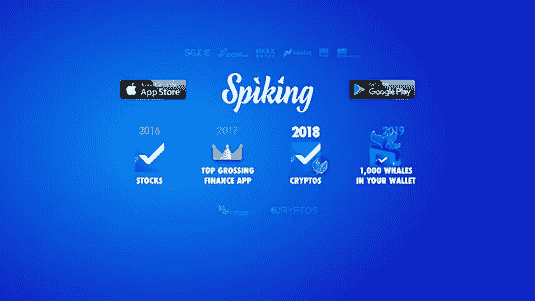

# 什么是社交交易，它的好处和顶级社交交易平台

> 原文：<https://medium.com/coinmonks/what-is-social-trading-its-benefits-and-top-social-trading-platforms-63f817e244d2?source=collection_archive---------1----------------------->

投资股票、外汇和加密货币等金融市场需要丰富的知识和经验。你需要了解影响商业世界的最新新闻事件，还需要有阅读图表、分析报告和理解趋势的能力。

> **也可阅读:** [**最佳加密交易机器人**](/coinmonks/crypto-trading-bot-c2ffce8acb2a)

如果你缺乏这种能力，你可能会在市场上失去你的钱。不幸的是，许多人继续在金融市场上失去他们辛苦赚来的钱，仅仅是因为他们不知道如何以及何时投资。社交交易在解决这类挑战时很方便。

## 那么，什么是社交交易呢？

> 社交交易或多或少有点像社交网络。唯一的区别是，在交易网络上，人们分享的不是自拍或午餐照片，而是交易想法。在这里，交易者相互交流，观看其他专业人士的交易结果，并就实时市场形势进行头脑风暴。

作为投资者或经验较少的交易者，在社交交易中，你的金融交易决策是基于其他熟练投资者从各种可靠平台收集的金融内容。换句话说，一旦你发现了一个成功的交易者，并且喜欢他们的交易策略，你就可以开始跟踪他们，复制他们的交易。

## 社交交易有什么好处？

社交交易的一些好处包括:

***快速获取可靠的交易信息***

社交交易平台通过提供来自世界各地专业交易者的大量信息，减少了搜索可靠交易信息的过程。你还可以在一对一辅导这样的平台上与熟练的交易者互动。

***快速把握交易行情***

社交交易平台可以让你快速有效地向经验丰富的投资者学习，从而减少成为专业投资者的时间和成本。

***边学边赚***

社交交易平台允许你向有经验的投资者学习，在那里你知道如何在交易市场中导航，并通过模仿他们的交易赚取一些钱。因此，你不必等到你掌握了所有必要的知识才开始赚钱。

***打造投资者交易共同体***

社交交易平台建立了一个投资者社区，在这里你可以与其他投资者互动并分享信息，同时还可以在不同的项目上进行合作。作为一个在线平台，只要你有互联网，你就可以在世界任何地方快速方便地获取交易信息。

# 流行的社交交易平台

既然你已经知道了什么是社交交易以及它的一些好处，不如你来了解一下你可以用来进行社交交易的平台。

在本帖中，我们将探索传统社交交易平台以及现代/加密社交交易平台:

## 1.[扣球](http://bit.ly/2lNRXrB)

[www.spiking.io](http://bit.ly/2lNRXrB)

[斯派克](http://bit.ly/2lNRXrB)拥有第一个技术**交易应用**，旨在帮助普通投资者了解交易市场的本质。经验证的实时更新帮助投资者确定交易市场中峰值的原因。它帮助普通交易者跟踪像沃伦·巴菲特这样的大投资者，因为他们在股票市场上交易，帮助投资者做出明智的决定，而不是依靠直觉。它现在有大约 17 万老练的投资者。

*现有 app 可在*[*Google Play*](http://bit.ly/2lNS5az)*和*[*App Store*](https://apple.co/2NfkFxO)*下载。*

**这款应用的主要特点包括:**

查看纳斯达克、道琼斯、纽约证券交易所、美国证券交易所、标准普尔和其他交易所的活跃股票

所有美国股票市场价格更新、新闻和价格警报

当朋友买卖股票期权时获得通知

实时跟踪老练的投资者

[Spiking](http://bit.ly/2lNRXrB) 是一个使用区块链 Spike 协议的管理系统，允许你作为一个交易者，定位并跟踪市场鲸鱼，目的是与它们学习或合作。在这里，鲸鱼指的是经验丰富的交易员、加密货币代币的大股东、矿池或拥有加密货币代币的公司的关键高管。

Spiking 将与领先的 whales 合作，为交易者提供认证智能交易者(CST)计划，让您了解加密货币的交易和投资。你也可以收集和验证关于鲸鱼的信息。通过其 Spike 协议，它将能够验证所有的交易交易，以确保没有伪造的信息。

它还将使用尖峰令牌作为奖励激励，并用于协议上的所有交易。作为一名交易者，你可以用道钉代币支付 CST 项目。此外，如果你以优等生的身份从该项目毕业，或者在 CST 项目中被选为最佳讲师，你将获得代币奖励。代币本质上将允许用户访问尖峰平台及其服务。

## 2.

****

**[Coinmatics.com](https://coinmatics.com/?utm_source=medium&utm_medium=post_medium&utm_campaign=coinmonks_what_is_social_trading)**

**Coinmatics 是一个复制交易和分析平台，于 2018 年推出。这项服务使得从加密市场获利变得轻而易举。它连接交易者和投资者，并促进复制交易策略的自动执行。Coinmatics 提供 2 种类型的复制交易:自动和手动。**

***coin matics 的职业交易员*从订阅他们的策略并自动复制它们的投资者那里获利(自动复制交易)，或者从订阅 Telegram alerts 的人那里获得报酬(手动复制交易)。**

**Coinmatics 的复制交易员/投资者订阅专业人士提交的策略，根据自己的喜好自动或手动复制交易。**

**此外，该服务为有经验的交易者提供有用的工具:投资组合、加密套利、分析工具等。**

**目前，这项服务是一个测试版本，对交易者和复制交易者都是完全免费的。**

> ****阅读** [**数学复习**](/coinmonks/coinmatics-review-a-simple-crypto-copy-trading-app-for-everyone-35d74ee3272b)**

## **3. [eToro](http://bit.ly/2Ks8fFn)**

****

**[https://www.etoro.com](http://bit.ly/2Ks8fFn)**

**eToro 是一个允许用户共享和访问彼此信息和交易活动的平台，就像在社交网络上一样。**

**该平台为用户提供新闻订阅、副本交易和模拟账户等功能。新闻提要功能允许用户监控和手动复制他们喜欢的交易者，而复制交易功能自动为用户处理。该模拟账户对用户来说是完全免费和无限制的，他们可以尝试所有的 eToro 交易和社交功能。**

## **4.[交易视图](http://bit.ly/2IFsslb)**

****

**[https://www.tradingview.com/](http://bit.ly/2IFsslb)**

**TradingView 是一个基于云计算和网络的期货和外汇交易平台。它为新手和高级交易者提供了难以置信的图表工具和社交组件来查看和分享交易想法。**

**通过论坛设置，该平台使用户能够关注、复制以及与其他志同道合的交易者交流想法。交易者向他们的同行和更高级的交易者咨询当前的市场情况。对话是实时的。**

**交易者发布他们的交易想法，他们从交易相同工具的其他交易者那里得到反馈或评论。这里的目标是通过分享想法和观察其他投资者在做什么来支持彼此成为繁荣的交易者。**

## **5.[传送](http://bit.ly/2Kxx5mb)**

****

**[https://covesting.io/](http://bit.ly/2Kxx5mb)**

**[Covesting](http://bit.ly/2Kxx5mb) 是一个基于区块链和智能合约的平台，允许新手投资者与熟练的交易者联系，在加密市场中赚取利润。在这里，作为一个投资者，你可以通过简单地自动复制熟练交易者的交易策略，在加密市场中赚取利润。你可以根据交易者的策略和交易技巧水平来选择交易者。**

**在该平台上，作为投资者，你可以根据他们的交易策略来查看和挑选熟练的加密货币交易者，这与你的利润目标相匹配。在你选择一个熟练的交易者之前，你要了解每个熟练交易者的策略，阅读他们的交易策略评论，访问他们实时交易策略的历史。因此，在选择之前，你能够知道最熟练的交易者来匹配你的利润目标。而且因为熟练的交易者很多，你可以选择订阅任意多的专业交易者。**

**但受益于该平台的不仅仅是初级投资者；专业交易者也从投资者的利润分享中获益。**

## **一锤定音**

**总而言之，我们已经了解到，社交交易能够实现信息的自由流动和获取，通过利用社区的力量来帮助个人做出明智的投资决策。**

**社交交易平台为新手提供了在密码市场轻松有效交易的途径，而不用担心新手失败。当然，它们不能完全根除失败，但是它们将失败的可能性降到了最低。**

**由于社交交易平台既适合新手，也适合专业人士，它们创造了一个可靠的交易社区，让你在学习的过程中赚取利润。试试社交交易[这里](http://bit.ly/2lNRXrB)，在下面的评论区和我们分享你的经验。**

**渴望了解更多关于 FundYourselfNow 的信息吗？在我们的 [*电报*](https://t.me/fundyourselfnow) *群上加入我们的众筹革命对话，或者在* [*推特上关注我们。*](https://twitter.com/fundyourselfnow)**

## ****同样，阅读****

*   **[最佳加密交易机器人](/coinmonks/crypto-trading-bot-c2ffce8acb2a)**
*   **最好的比特币[硬件钱包](/coinmonks/the-best-cryptocurrency-hardware-wallets-of-2020-e28b1c124069?source=friends_link&sk=324dd9ff8556ab578d71e7ad7658ad7c)**
*   **最好的[加密税务软件](/coinmonks/best-crypto-tax-tool-for-my-money-72d4b430816b)**
*   **[最佳加密交易平台](/coinmonks/the-best-crypto-trading-platforms-in-2020-the-definitive-guide-updated-c72f8b874555)**
*   **Bitsgap 评论——一个轻松赚钱的加密交易机器人**
*   **为专业人士设计的加密交易机器人**
*   **Bitmex 的[保证金交易指南](/coinmonks/the-idiots-guide-to-margin-trading-on-bitmex-dbbd7742c6fc?source=friends_link&sk=7bfa99d2a181142510c8442c8ddb0786)**
*   **加密摇摆交易的权威指南**
*   **[加密套利](/coinmonks/crypto-arbitrage-guide-how-to-make-money-as-a-beginner-62bfe5c868f6)指南:新手如何赚钱**

> **[直接在您的收件箱中获得最佳软件交易](https://coincodecap.com?utm_source=coinmonks)**

****