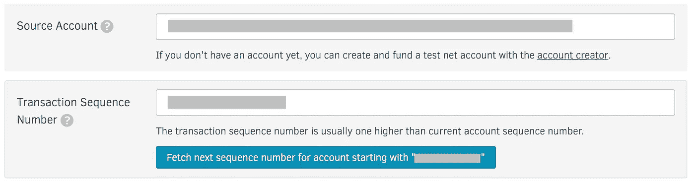
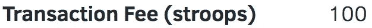

# 什么是恒星，你如何声称通货膨胀？

> 原文：<https://medium.com/coinmonks/what-is-stellar-and-how-do-you-claim-inflation-a92e178fde7b?source=collection_archive---------6----------------------->

在为曼彻斯特区块链做研究期间，我对恒星区块链产生了兴趣，并得出结论，它已经确立了自己的强势地位，未来可能会做得很好。

[恒星](https://www.stellar.org)是一个区块链平台，其原生货币叫做[流明](https://www.stellar.org/lumens/)或 XLM

 [## 恒星(XLM)价格、图表、市值和其他指标

### 获得一流的价格、图表和其他加密货币信息

coinmarketcap.com](https://coinmarketcap.com/currencies/stellar/) 

Stellar 的目标是建立一个全球支付平台——没有影响目前最大的基于加密的支付网络的问题和分歧:比特币。

Stellar 正在为自己定位，以利用和占领比特币失去的部分市场份额。

以下是我认为 Stellar 可能表现出色的一些原因:

*   在我看来，这是任何区块链的必备产品。
*   全面的文档和工具——在我看来，拥有一个强大的 API 和以开发者为中心的平台对任何区块链来说都是一个巨大的好处，查看他们的[官方网站](http://www.stellar.org)。
*   多种主流语言[官方 SDK](https://www.stellar.org/developers/)如 Java、JS、。Net，Go，Python & Ruby。降低进入门槛，尤其是对企业客户。
*   与 IBM 建立了牢固的合作伙伴关系——目前在世界各地托管许多验证节点，并与 Stellar 一起测试跨境支付。参见[dashboard.stellar.org](https://dashboard.stellar.org)
*   内置支持[分散式交换](https://www.stellar.org/developers/guides/concepts/exchange.html)和定制的菲亚特挂钩令牌。[恒星术语](http://stellarterm.com)，已经直播。[另一个去中心化的交易所 FairX](https://twitter.com/fairxio) 将于 2018 年推出，据传它也将使用恒星碱基对，旨在帮助金融机构解决全球跨境支付的流程。
*   一些 ico 计划在 2018 年使用 Stellar，还有一些[已经有了](https://www.coindesk.com/why-a-39-million-ico-chose-stellar-over-ethereum/)。有关使用 stellar 作为 Ico 平台的更多详细信息，请参见[‘使用 Stellar 进行 Ico’](http://stellar.org/blog/using-stellar-for-ico/)。
*   快速的交易时间和低廉的费用——我们的初步测试验证了这种说法，但随着网络的发展，这种规模必须扩大。同样在 Stellar 的[网站](http://stellar.org/blog/using-stellar-for-ico)上，它对比了以太坊的成本和交易时间，然而这些看起来有点夸张。如果你正在寻找纯粹的支付处理这个区块链，它肯定应该被考虑。
*   强大的协议级功能，如[信任线](https://www.stellar.org/developers/guides/concepts/assets.html#trustlines)。信用额度是一项内置功能，这意味着用户和资产发行者可以控制谁可以持有分布式资产。增加控制力度，吸引更多将在该领域经营的企业。

对于 Stellar 来说，现在还为时尚早，但如果他们能够继续像以前一样提供服务，并且交易时间和成本保持在较低水平，那么他们就有望成为领先的区块链支付处理和 ICO 平台。

## 恒星暴胀是如何工作的

Stellar 不使用[股权证明](https://en.wikipedia.org/wiki/Proof-of-stake) (PoS)像 [Qtum](https://qtum.org/en/) 或以太坊即将发布的 [Casper PoS 实现](https://github.com/ethereum/wiki/wiki/Proof-of-Stake-FAQ)或[工作证明](https://en.wikipedia.org/wiki/Proof-of-work_system)像[比特币](https://en.bitcoin.it/wiki/Proof_of_work) &以太坊目前使用的方式。它也不使用股息奖励系统，如 [Neo 的气体发电](https://hackernoon.com/what-is-neo-and-what-is-gas-5b9828a1aa65)。所以你问你如何获得奖励，答案是通货膨胀。

 [## 通货膨胀|明星开发商

### 恒星分布式网络有一个内置的，固定的，名义上的膨胀机制。网络中增加了新的流明…

www.stellar.org](https://www.stellar.org/developers/guides/concepts/inflation.html) 

> 恒星分布式网络有一个内置的、固定的、标称的[膨胀](https://www.stellar.org/developers/guides/concepts/inflation.html#inflation)机制。新的流明以每年 1%的速度增加到网络中。每周，该协议将这些流明分配给任何从网络中其他帐户获得超过 0.05%的“投票”的帐户。

基本上每周，一旦你被设置为接受通货膨胀奖励，你的账户将被记入 XLM 的借方。通货膨胀和网络上使用的任何费用的分配是基于你拥有的投票权，票数是基于你拥有的流明数，XLM。你需要投票的最低金额是现有所有流明的 0.05%，这对于大多数 XLM 所有者来说意味着加入一个池，许多人也将向你收取特权，例如任何奖励的 10%。

> 这是现有流明的 0.05%，是获得膨胀池任何部分所需的最低票数。

有几个流行的通货膨胀池，但我不打算认可任何特定的池，但确保你总是做你的研究，永远不要给你的私人钥匙！

许多人会认为这种分配机制是消极的，称之为一种集权形式，即富人越来越富，但这不是本文的主题，如果人们感兴趣，我们可以在后面的文章中讨论。接下来，我将介绍如何真正加入一个池，并声称通货膨胀。

## 如何获得丰厚的奖励

*   首先，你必须将你的 XLM 从兑换处转移到钱包中。我使用[基本官方恒星网络钱包](https://www.stellar.org/account-viewer/#!/)
*   一旦移动，访问[恒星实验室](https://www.stellar.org/laboratory/)，确保你在公共网络上——选择“ ***事务生成器*** ”
*   输入您的公共 stellar 地址，即您的公共 Stellar 钱包地址。
*   输入后，单击“ ***获取以“——”***”开头的帐户的下一个序列号。如果失败，请确保您在公共网络上。序列号用作每周计划机制的一部分，如果它是错误的，将会失败。

*   接下来从“ ***操作类型*** ”中选择“ ***设置选项***”——这将为您呈现签名操作的完整配置选项。
*   几乎所有选项都可以忽略，但您需要输入您正在加入的池的“ ***膨胀目的地*** ”。通常可以在泳池的登录页面上找到。
*   输入池地址后，您必须发送并签署该交易，方法是点击“ ***登录交易签署人*** ”例如

*   在此之后，您将看到一个屏幕，要么连接到您的分类帐，要么输入您的密钥—这是您在此过程中唯一需要输入密钥的时间。**没有哪个通胀池会向你要秘钥！**
*   您还将看到交易的概述，并注意到提交交易的小额费用，这些费用作为每周通货膨胀分配流程的一部分进行分配。

A “stroop” is the smallest amount unit. It is one ten-millionth: `1/10000000` or `0.0000001 XLM`

*   点击“ ***提交*** ”然后将你的交易发布到网络上，你就加入了一个通胀池。
*   在查看您的账户时，您应该能够看到提交的交易，例如[stellarchain.io/address/](https://stellarchain.io/address/)【您的公共地址】

这就是你需要做的一切，通过 XLM 通货膨胀池获得通货膨胀奖励。

几周后查看你的账户，你会希望在你的账户余额上看到一些额外的 XLM。如果你有 XLM，那么没有理由不这样做，除非你计划日内交易或花 XLM。

**希望这能帮到你，如果是这样，请为我鼓掌！**

如需了解更多信息，请在[媒体](https://medium.com/blockchain-manchester)上关注我，或在[@区块链 _ 曼斯](https://twitter.com/blockchain_manc)查看推特信息。

*免责声明:我不是理财顾问。这篇文章不应该被用作财务建议。*