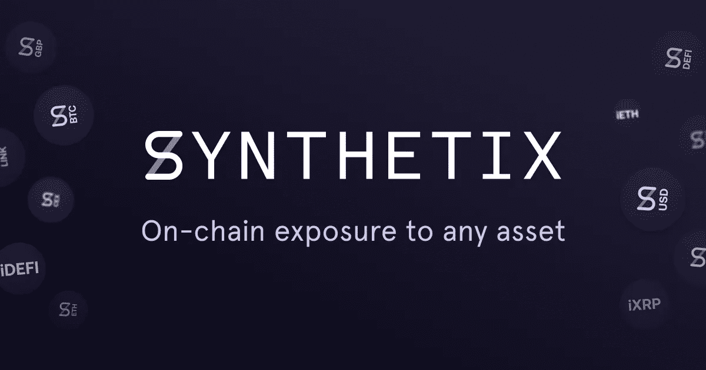

# 什么是 Synthetix，为什么有风险？

> 原文：<https://medium.com/coinmonks/what-is-synthetix-and-why-is-it-risky-34488e97b017?source=collection_archive---------1----------------------->

*最初为私人时事通讯发布，由我撰写并归我所有*

[Image credit to the Synthetix Team](http://synthetix.io)

# **什么是加密货币衍生品，为什么它们有风险？:Synthetix**

又一周过去了，DeFi，很大程度上是由化合物和 Synthetix 推动的[，继续推动整个加密领域的大部分增长。](https://defipulse.com/)

虽然[复合](https://compound.finance/)相当直观，但对于许多加密货币投资者来说，合成及其带来的风险仍然难以把握。

如果你还不知道的话， [Synthetix 是](https://www.synthetix.io/uploads/synthetix_litepaper.pdf)一个协议和平台，用于在以太坊网络上启动所谓的合成资产。在密码世界之外，合成资产是跟踪更有形的基础资产价格的组合衍生品。在这里，我们所说的组合衍生品是指期货、期权以及介于两者之间的任何东西。因此，也可以将合成资产视为两种或两种以上的衍生产品，它们被放在一起形成另一种资产(如股票或商品)的某种指数。

在加密世界中，这些合成资产是加密货币代币，其价格跟随股票、商品、债券甚至另一种加密货币(理论上也包括所有其他资产类别)的价格。上面提到的生态系统 Synthetix 在实践中最好地证明了这一点，它允许任何人存放[SNX 令牌](https://www.synthetix.io/uploads/synthetix_litepaper.pdf)来交换所谓的[synthes](https://www.synthetix.io/uploads/synthetix_litepaper.pdf)

## **什么是 synths？**

理解 Synthetix 需要理解 synths 是什么，以及它们是如何被创造和购买的。

“合成器”是位于区块链的合成资产。

因此，就像传统的合成资产一样，它们可以跟踪任何真实世界资产的价格，包括商品和指数。因此，“synths”可能代表了 crypto 将遗留金融系统的其余部分放在区块链上的最佳机会，前提是 Synthetix 系统能够支撑住。

## synths 是如何发布的？

任何持有 Synthetix 平台原生加密货币 [SNX](https://coinmarketcap.com/currencies/synthetix-network-token/) 的人，都可以使用[的 Mintr DApp](https://mintr.synthetix.io/) 创造或“铸造”synths。这种铸造指的是将 SNX 存放在托管中，以获得向 Synthetix 交易所发行受支持的合成器的责任。目前，每 8 个 SNXs，1 个 synth 可以发送出去。

截至今年，如果交易商选择[入股乙醚而不是 SNX](https://blog.synthetix.io/ether-collateral/#:~:text=Adding%20Ether%20as%20collateral%20also,diluting%20the%20value%20of%20SNX.) ，他们只需满足 150%的抵押率，这意味着他们将能够为每 5 个乙醚发行一个合成气。

即便如此，以太股东也没有得到 SNX 股东所得到的额外利益，即 Synthetix 交易所的交易费和 SNX 的应计利息。

总的来说，概念化 synth 铸造系统的最简单方法是将其视为加密货币衍生品的 [MakerDAO](https://www.reddit.com/r/MakerDAO/comments/8sn7qo/why_use_a_cdp/) ，因为 MakerDAO 以相同的方式工作。

因此，发行的合成器实际上只是贷款。

这些贷款目前仅提供给 Synthetix 交易所，为其流动性提供资金，但随着时间的推移，Synthetix 开发团队希望其他团体将选择使用其基础协议创建新的交易所。

## **怎样才能买到 synths？**

购买 synths 远比成为他们的流动性提供者简单。

最简单的方法是将你的钱包连接到这里的 Uniswap，并为交易对最多的 synths 传送以太网，它们分别是 sETH 和 sUSD。

## **我为什么要交易 synths？**

一般来说，Synthetix 交易所和 synths 允许任何人建立任何受支持资产的多头和空头头寸，而无需经历任何 KYC 或随时放弃对所涉资产的监管。

这是因为 Synthetix 是一个[去中心化的交易所](https://cointelegraph.com/explained/dex-explained) (DEX)或加密货币交易所，只在智能合约上运行，中间没有实际业务的不断干扰。

此外，现在普通交易员可以持有各种头寸，这些头寸过去一直是为场外交易柜台和对冲基金等大型参与者保留的。

虽然 Synthetix 现在主要支持 synths，但它最近也推出了对二元期权和普通期货合约的支持，二元期权是对一种资产未来价格的预测，这种资产要么盈利[要么不盈利](https://www.businessinsider.com/how-binary-options-work-2017-5)，这表明它的目标是取代 BitMex 等 crypto 衍生品的领导者，至少在基于以太坊的衍生品方面。

## **“合成器”有什么风险:2008 年危机和债务违约威胁**

一般来说，合成公司的风险与任何一类衍生产品的风险相同。如果我们回顾 2008 年的金融危机，我们可以说这些风险最容易被总结为“与杠杆相关”。如果你不熟悉这个术语，在这里，杠杆指的是借用你没有的东西。

2008 年之前，衍生品变得越来越受欢迎，监管越来越少。最典型的例子是[债务抵押债券](https://sites.google.com/site/sparemoments/my-articles/cdos---their-role-in-the-financial-crisis) (CDO)，在这种情况下，它是一种合成资产，通常代表一系列抵押贷款。导致 2008 年全球市场崩盘的关键问题是，CDO 被视为被动收入的担保工具。

事实与真相相去甚远。

CDO 是基于美国房地产市场永远不会停止增长的假设。像雷曼兄弟、美国国际集团和贝尔斯登这样的大银行在他们确信有能力偿还的借贷资本上持有大量的债务抵押债券。

这些贷款有时高达数十亿美元，因为 CDO 充当了债券的角色，提供长期固定利息。

我们许多人都知道，一旦美国房地产市场崩盘，许多人开始拖欠抵押贷款，CDO 和持有 CDO 的银行也会跟着违约。

这导致了大规模的崩溃，我们大多数人仍然记忆犹新。

2008 年的金融危机与“合成器”有什么关系

Synths 和所有其他与它们类似的产品，如 MakerDAO 的 CDPs 和 Compound 的贷款，都有同样的基本风险，尽管目前规模小得多。

如果我们以今年的 [BZx 交易所](https://cointelegraph.com/news/are-the-bzx-flash-loan-attacks-signaling-the-end-of-defi)攻击作为我们的主要例子，就很容易看出为什么。

今年 2 月，一名黑客利用 dYdX 交易所的一笔贷款来玩 [DeFi](https://blog.coincodecap.com/the-ultimate-guide-to-defi-decentralized-finance) 系统的游戏。在这样做的时候，他们从所谓的快速贷款开始。一般来说，快速贷款与通过 Synthetix 或 Compound 的贷款相同，只是[不需要抵押品](https://news.bitcoin.com/defi-flash-loans/#:~:text=%E2%80%94%20bZx%20(%40bzxHQ)%20February%2018,of%20losing%20funds%20during%20execution.)，并且必须在一笔交易[后偿还](https://arxiv.org/pdf/2003.03810.pdf)。

通过 dYdX 使用这一功能，黑客取出了 10，ETH，然后在 dYdX、Compound 和 BZx 之间建立了几个头寸，最终导致 WBTC stablecoin 的短缺，BZx 的一笔未偿贷款和 1，193 ETH 的利润，然后他们用这些钱[向 dYdX](https://cointelegraph.com/news/are-the-bzx-flash-loan-attacks-signaling-the-end-of-defi) 结算了他们的初始贷款。

所有这些都是用复杂的代码完成的，这些代码允许每个动作作为一个事务来完成。此外，攻击者的利润基本上来自所有相关的贷款人，这表明像上述所有这些指数远非完美。

仅仅几天后，一个新的黑客攻击出现了，它短暂地抬高了 synth 的价格。然而，幸运的是，这一攻击被一个事实所阻止，即一个保险基金已经到位来覆盖所有相关的损失。

Synthetix 和所有其他 DeFi 相关服务仍然容易受到这些攻击，因为它们通过设计[相互连接](https://our.status.im/whats-with-defi-and-money-legos/#:~:text=The%20term%20money%20legos%20references,base%20layer%20of%20the%20blockchain.)，并且通常不需要注册程序即可使用。如果发生足够大的闪贷攻击，它可能会让 Synthetix 这样的系统资不抵债，尤其是如果它的目标是 SNX 的话。

最后，Synthetix 易于使用，但由于其贷款系统，风险很大。既然它看起来已经准备好成为以太坊网络上的加密未来[领导者，那么看看它的开发者计划如何随着时间的推移解决这一风险将会很有趣。](https://cointelegraph.com/news/synthetix-exchange-may-soon-offer-derivatives-trading-on-ethereum)

如果你喜欢我的内容，请联系下面的[或点击这里的](https://twitter.com/ExpatCrypto3)。最后，我的大部分空闲时间都花在了我的时事通讯上，这是完全免费的，关注的是元宇宙的崛起如何改善每个人的生活。[此处短接](https://www.getrevue.co/profile/blockdemiclab)。

*免责声明:这些都不是财务建议。自 2016 年以来，我一直在研究和工作 crypto，我的目标只是教育人们各种项目的利弊。此外，我是一名学生，就像我们所有人一样。因此，随着我对项目了解的越来越多，我对项目的想法也会随着时间自然发展。*

> [直接在您的收件箱中获得最佳软件交易](https://coincodecap.com/?utm_source=coinmonks)

