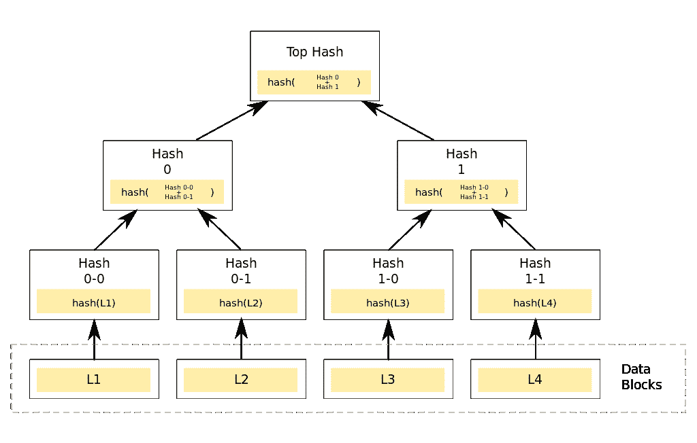

# 私链的实际用途是什么？

> 原文：<https://medium.com/coinmonks/what-is-the-actual-use-of-private-chain-abf4b0e2ab14?source=collection_archive---------9----------------------->

私有链的增值是应用方面的，而公有链的增值是政治方面的(例如，不受政府或权威机构的阻碍)。

与其拿私有链和公有链做比较，不如拿私有链和传统数据库做比较。或者更具体地说，**我们可以将私有链视为数据库的一个特例，它是为满足银行间交易的需求而设计的。因此被用于完成具有相似底层结构的其他任务。例如供应链、保险和医疗保健。**

 [## 科达|工业

### 金融、供应链、贸易融资、医疗保健和政府等不同行业可以使用 Corda 来简化…

www.corda.net](https://www.corda.net/discover/industry.html) 

# 私有链的特征

*   隐私
*   交易终结
*   合法确定的当事人
*   (不可变的)可审计的跟踪

# 隐私

只有授权的实体才能查看或添加新交易。规格可以定做。

而在公链和 IPFS，所有的交易和数据都是公开的。对于业务应用程序来说，这显然不是一个理想的特性。

# 定局

在交易完成时，各方必须保证交易是最终的，没有歧义，不能撤销。

# 可识别的参与者

为了防止不可抵赖的情况(协议或交易的任何一方有能力在以后声称他们没有签订协议)，必须将操作与唯一的、可识别的实体联系起来。

# 可定制的

业务用例有其特定的、复杂的需求集。因此，系统中的规则不应被严格定义。允许有很大的自由度。例如系统访问级别、一致性算法和网络结构。

 [## 公证人- R3 Corda V3.0 文档

### 在评估这种权衡时，还需要记住几个要点。在非验证的情况下…

docs.corda.net](https://docs.corda.net/key-concepts-notaries.html) 

# (不可变的)可审计的跟踪

只有当一组预先定义的实体同意一起进行变更时，不变性才是可能的。例如，一家医院的程序将大量错误的数据集写入链中。在所有六家医院的一致同意下，节点可以倒回。

就像其他版本控制系统一样，Merkle tree 用于验证任何事务的踪迹，以便可以审计活动。

 [## 交易撕下- R3 Corda 最新文档

### 我们平台中的一个基本数据结构是事务。它可以被传来传去进行签名和验证…

docs.corda.net](https://docs.corda.net/releases/release-M8.2/merkle-trees.html) 

私有链可以被看作是数据库和区块链的一种特殊形式，它是为商业银行间使用而设计的，其中底层结构是上面提到的特征。