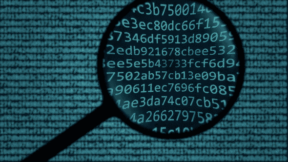

# 加密资产的基本价值是什么

> 原文：<https://medium.com/coinmonks/what-is-the-fundamental-value-of-cryptoassets-6af43df6231f?source=collection_archive---------3----------------------->

## **什么是加密资产？**

类比是解释新概念的最简单的方法之一。如果我们在加密资产和电子设备之间做一个类比，它会是这样的:

> 比特币~ iPhone
> 
> 加密货币~手机
> 
> 加密资产~电子设备

比特币是第一种加密货币。在比特币之前，我们有一个数字世界，所有的数据都可以被复制，几乎没有成本。在你的计算机中复制 0 和 1(位)是可能的。如果你有一个图像，你可以复制和粘贴该图像，并有两个图像很少或没有成本。如果你有一个比特币，你不能简单地复制和粘贴它，并有两个比特币。事实上，比特币和整个加密资产有两个属性，使其区别于互联网上的其他形式的媒体:*比特币是不可复制的* *和不可摧毁的* *数字资产*。这两个特性允许它作为一种可替代的市场货币。

**比特币之前有没有不可替代的数字资产？**

在比特币出现之前，只有一个行业值得确保数字资产在转移过程中不会被复制或破坏。在金融领域，92%的货币都是数字形式的。这是可能的，因为有一组部分手动操作，如[执行、清除和结算](https://thismatter.com/money/stocks/settlement-and-clearing.htm)。然而，这些操作太昂贵，不能用于除金融系统之外的其他用例。

比特币的使用带来的是一种廉价的方法。由于在金融领域使用这样的技术最有意义，因此加密资产的第一个应用程序是货币(或加密货币)。

**所以，比特币是数字货币但更便宜。为什么重要？**

记住比特币背后的技术——区块链——实际上允许不可复制和不可摧毁的数字资产。以前，拥有这样的资产类别太过昂贵。有了区块链，成本如此低廉，我们现在可以拥有以前没有意义的应用程序。

最简单的用例是物理资产。物理资产不能像加密资产一样被复制。现在有了一种在数字世界中表现实物资产的方法。数字资产具有易分割、低转移成本等特性。一个实物资产，比如一栋房子，现在可以分成 100 份，其中一份可以非常便宜地转让给世界另一端的一个人。有了更多的机械师，拥有来自世界各地的 10 所房子中的 5 所并获得总租金的 5%是可能的。这些类型的资产被称为[证券](https://en.wikipedia.org/wiki/Security_(finance))。

不过，证券并不是有趣的部分。我从互联网类比开始。在互联网出现之前，人们可以发送传统的邮件，这是很昂贵的，因为邮件必须亲自运送。互联网提供了一种非常便宜的传输文本(0 和 1)的方式。互联网上的第一个应用是电子邮件。然后出现了其他明显的用例，如公告栏和论坛。如果我们快进到现在，互联网上有这么多很酷的应用程序，如网飞、Spotify、亚马逊、谷歌地图、维基百科、贝宝……所有这些应用程序的共同之处在于，它们通过互联网发送文本，尽管它们提供了如此多样的使用案例。

说比特币是数字现金，就相当于说互联网只是电子邮件。就像互联网一样，将有可能出现许多不同的用例。互联网自下而上地改变了我们的社会，加密资产也会有类似的未来。我们还有很多东西要发现。

如果你喜欢这篇文章，你可以在推特上关注我或者在 thellimist.com 的 T2 联系我。

比特币是可以复制的，但要实现它需要花费数十亿美元([双倍支出攻击](https://en.bitcoin.it/wiki/Irreversible_Transactions))

可以添加使加密资产不可用的功能，但是数据不能丢失。对于要丢失的数据，网络的所有参与者都应该放弃。

互联网最大的用例是[电子邮件](https://www.infoplease.com/science-health/internet-statistics-and-resources/most-popular-internet-activities)。我认为加密资产最大的使用案例将是数字现金。

> [直接在您的收件箱中获得最佳软件交易](https://coincodecap.com/?utm_source=coinmonks)

