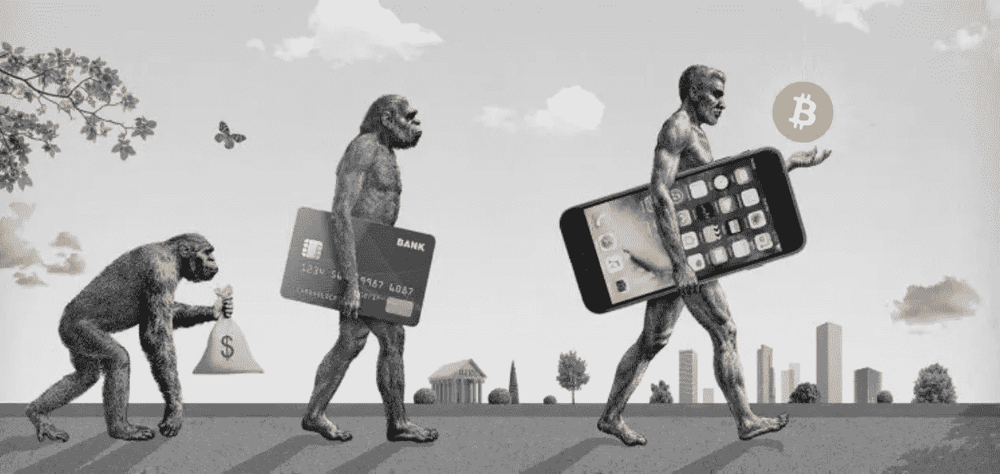
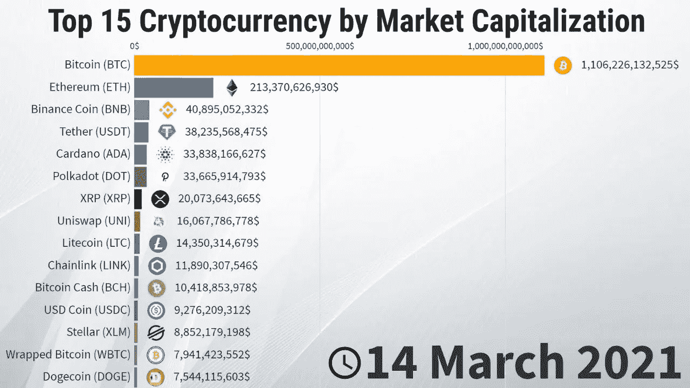
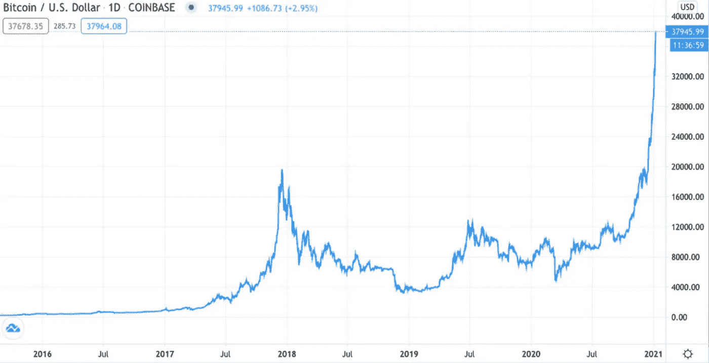
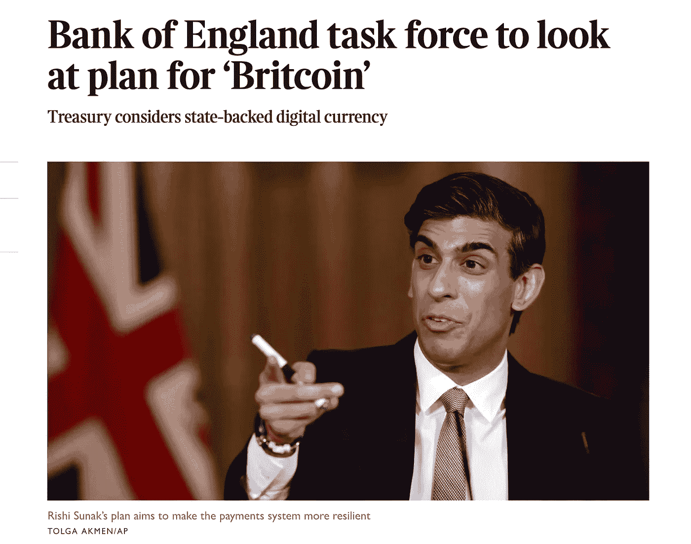

# 钱的未来是什么？

> 原文：<https://medium.com/coinmonks/what-is-the-future-of-money-1df0df79ea66?source=collection_archive---------7----------------------->

## 探索采用加密货币作为交易媒介。

Source — Daily Fintech

加密技术像潮水般涌向零售交易领域。

便利支付的金融系统效率低下。自 2008 年以来，传统中介笼罩在不信任之中，通过它们进行的交易成本高昂。

从短期来看，像杰克·多西广场这样的公司已经利用这一优势，创造了一种更具竞争力的交易费产品，以应对银行收取的高昂费用。

但是区块链技术提供了一个巨大的飞跃。对等、透明和完全安全交易的可能性，无需集中的中介。

即使在我的电子商务业务中，我们也在头脑风暴如何接受各种加密资产作为商品付款。

问题不在于加密货币是否会在未来演变成一种合理的交易媒介。这是不可避免的。

但比特币会是答案吗？

从表面上看，这似乎是可能的。

它是第一种也是最大的加密货币。截至 2021 年 Q1，BTC 拥有 1 万亿美元的市值，超过整个加密货币市场的一半。随着其规模的不断扩大，它已成为迄今为止所有区块链相关资产中流动性最强的一种，这一趋势只会随着全球最大的加密交易所——比特币基地——上周的公开上市而加速。可靠的流动性是交易媒介的一个重要特征。

除了流动性，还有广泛采用的问题，这也是有效交换方法的一个重要特征。

为了让某样东西作为一种支付方式有用，我们每个人都必须集体相信它是有用的。毕竟，法定货币仅仅是印刷的纸张，而且自从金本位制结束以来，它没有任何有形的东西作为支撑。它的集体价值在于，我们每个人都相信它是一个可靠的财富储存库，进而可以用来支付。

中本聪在最初的白皮书中对比特币的描述清楚地表明，比特币是作为一种数字货币而产生的；

> “(将成为)…电子现金的点对点版本，允许在线支付直接从一方发送到另一方，而不通过金融机构”。

自那以后，作为一种支付工具，它在某种程度上一直有着良好的记录。过去，由于其独特的去中心化性质，它被用于犯罪活动以避免被发现。今天，它的用途正在进一步扩大。

2021 年 3 月 24 日，特斯拉宣布计划开始接受比特币作为其车辆的支付方式。他们并不孤单，许多其他公司也以不同的身份效仿，如微软、星巴克和可口可乐。

我们可以看到，比特币作为一种购买商品和服务的方法，其背后的动力正在形成。问题是，这在多大程度上是对比特币作为可接受货币的认可，而不是表明加密空间总体上已经为主流做好了准备。

在我看来，在这些加密资产的价格稳定下来之前，主流采用仍然没有意义。

有了这个想法，就有了程序员 Laszlo Hanyecz 臭名昭著的轶事，他在 2010 年夏天用 10，000 个比特币换了两个棒约翰的披萨后，在密码圈内变得很出名。

这些比特币今天价值约 6 亿美元。

一项资产要成为成功的交易媒介，就需要有一定的长期稳定性，否则商品的实际价值每天都会大幅波动。即使是现在，每天 15-20%的大幅震荡也并不少见。

由于这种波动性随着时间的推移急剧上升，尽管比特币最初被视为一种支付方式，但在过去几年里，人们越来越多地购买加密资产作为价值储存手段。

Price of Bitcoin over time.

人们买它是希望它会升值。

对于希望成为零售市场交易媒介的资产来说，这不是一个好兆头。想象一下，人们购买美元，并预期该货币的价值将在下一年升值 100%。

什么都不会花掉——经济会慢慢陷入停滞。

正是因为这个原因，随着时间的推移，比特币被认为是一种通过交换媒介来储存价值的手段。

数字黄金而不是数字货币。

最后，要使资产成为有效的交易媒介，它需要具有可伸缩性。它需要能够处理大量的交易。

现金是直接的交易媒介。像 Visa 这样的信用卡公司每秒能够处理 25000 笔支付。
比特币每秒只能处理 7 笔交易。

比特币交易缓慢和可扩展性差的原因是，比特币区块链(即区块)上的交易记录在大小和频率上是有限的。创建一个新块的平均时间为 10 分钟，每个块的最大大小为 1 兆字节。

想象一下这种尴尬，用比特币支付晚餐，却要等一个小时才能付款。

一个潜在的解决方案可能是闪电网络，这是建立在比特币区块链之上的第二层，有助于更快的支付。但是这项技术仍处于萌芽状态，未经验证。

因此，一项资产要成为合适的交易媒介，至少需要具备 4 个特征:

**1。供应的流动性
2。广泛采用
3。价格的稳定性
4。使用的可扩展性**

截至目前，比特币不符合这些标准。

然而，这并不意味着 Crypto 作为一个整体不会扰乱电子商务的世界。

一个潜在的解决方案是稳定硬币的承诺。这些是与非加密资产的价值挂钩的加密资产。

一个例子是 USDC，它与美元 1:1
挂钩；另一个例子是脸书的天秤，它与一篮子法定货币和一些更多的资产挂钩。

上周，中国人民银行和英国银行都提出了由各自中央银行支持的稳定货币。

April 20th, 2021 — The Times Newspaper.

有了这些大型机构的支持，并与稳定资产挂钩，Crypto Stablecoins 可能是我们最初问题的解决方案。

它们可以提供去中心化系统固有的所有好处，而无需解决围绕比特币这一特定交易媒介的问题。

它们将具有流动性、稳定性，并有可能在央行等机构的支持下被广泛采用。这并不难想象，毕竟我们信任英国央行，而美联储如今支持法定货币。

此外，它们可以设计为可扩展的，允许通过在各自的区块链内增加块大小和创建速度来管理越来越多的事务。

这些稳定的硬币可能是电子商务和零售交易的未来。
它们可能被证明是数字支付的加密解决方案。

因此，也许这就是未来的发展方向，比特币将成为数字黄金，一种分散的价值储存手段。另一方面，由中央银行和科技公司创造的稳定收入可能是电子商务和零售交易的未来。

如果你对这篇文章感兴趣，请登录我的博客，关注区块链技术在商业领域的应用，网址是:

【https://dhinil.substack.com/】

> *加入 Coinmonks [Telegram group](https://t.me/joinchat/PmKOYQ9NNKZlZGNl) 并了解加密交易和投资*

## *另外，阅读*

*   *最好的[加密交易机器人](/coinmonks/crypto-trading-bot-c2ffce8acb2a) | [网格交易机器人](https://blog.coincodecap.com/grid-trading)*
*   *[加密复制交易平台](/coinmonks/top-10-crypto-copy-trading-platforms-for-beginners-d0c37c7d698c) | [如何在 WazirX 上购买比特币](/coinmonks/buy-bitcoin-on-wazirx-2d12b7989af1)*
*   *[CoinLoan 点评](/coinmonks/coinloan-review-18128b9badc4)|[Crypto.com 点评](/coinmonks/crypto-com-review-f143dca1f74c) | [火币保证金交易](/coinmonks/huobi-margin-trading-b3b06cdc1519)*
*   *[尤霍德勒 vs 考尼洛 vs 霍德诺特](/coinmonks/youhodler-vs-coinloan-vs-hodlnaut-b1050acde55a) | [Cryptohopper vs 哈斯博特](https://blog.coincodecap.com/cryptohopper-vs-haasbot)*
*   *[杠杆代币](/coinmonks/leveraged-token-3f5257808b22) | [最佳密码交易所](/coinmonks/crypto-exchange-dd2f9d6f3769) | [Paxful 点评](/coinmonks/paxful-review-4daf2354ab70)*
*   *[如何在印度购买比特币？](/coinmonks/buy-bitcoin-in-india-feb50ddfef94) | [WazirX 审核](/coinmonks/wazirx-review-5c811b074f5b) | [BitMEX 审核](https://blog.coincodecap.com/bitmex-review)*
*   *[双子座 vs 比特币基地](https://blog.coincodecap.com/gemini-vs-coinbase) | [比特币基地 vs 北海巨妖](https://blog.coincodecap.com/kraken-vs-coinbase) | [硬币罐 vs 硬币点](https://blog.coincodecap.com/coinspot-vs-coinjar)*
*   *[币安 vs 北海巨妖](https://blog.coincodecap.com/binance-vs-kraken) | [美元成本平均交易机器人](https://blog.coincodecap.com/pionex-dca-bot)*
*   *[印度比特币交易所](/coinmonks/bitcoin-exchange-in-india-7f1fe79715c9) | [比特币储蓄账户](/coinmonks/bitcoin-savings-account-e65b13f92451)*
*   *[币安收费](/coinmonks/binance-fees-8588ec17965) | [Botcrypto 审查](/coinmonks/botcrypto-review-2021-build-your-own-trading-bot-coincodecap-6b8332d736c7) | [Hotbit 审查](/coinmonks/hotbit-review-cd5bec41dafb) | [KuCoin 审查](https://blog.coincodecap.com/kucoin-review)*
*   *[我的密码副本交易经验](/coinmonks/my-experience-with-crypto-copy-trading-d6feb2ce3ac5) | [购买硬币评论](https://blog.coincodecap.com/buycoins-review)*
*   *[加密货币储蓄账户](/coinmonks/cryptocurrency-savings-accounts-be3bc0feffbf) | [YoBit 审查](/coinmonks/yobit-review-175464162c62) | [Bitbns 审查](/coinmonks/bitbns-review-38256a07e161)*
*   *[最佳比特币保证金交易](/coinmonks/bitcoin-margin-trading-exchange-bcbfcbf7b8e3) | [萝莉点评](/coinmonks/lolli-review-e6ddc7895ad8) | [比特币保证金交易](https://blog.coincodecap.com/bityard-margin-trading)*
*   *[加密保证金交易交易所](/coinmonks/crypto-margin-trading-exchanges-428b1f7ad108) | [赚取比特币](/coinmonks/earn-bitcoin-6e8bd3c592d9) | [Mudrex 投资](https://blog.coincodecap.com/mudrex-invest-review-the-best-way-to-invest-in-crypto)*
*   *[如何在印度购买以太坊？](https://blog.coincodecap.com/buy-ethereum-in-india) | [如何在币安购买比特币](https://blog.coincodecap.com/buy-bitcoin-binance)*
*   *[顶级付费加密货币和区块链课程](https://blog.coincodecap.com/blockchain-courses) | [币安评论](/coinmonks/binance-review-ee10d3bf3b6e)*
*   *[MXC 交易所评论](/coinmonks/mxc-exchange-review-3af0ec1cba8c) | [Pionex vs 币安](https://blog.coincodecap.com/pionex-vs-binance) | [Pionex 套利机器人](https://blog.coincodecap.com/pionex-arbitrage-bot)*
*   *[在美国如何使用 BitMEX？](https://blog.coincodecap.com/use-bitmex-in-usa) | [BitMEX 回顾](https://blog.coincodecap.com/bitmex-review) | [币安 vs Bittrex](https://blog.coincodecap.com/binance-vs-bittrex)*