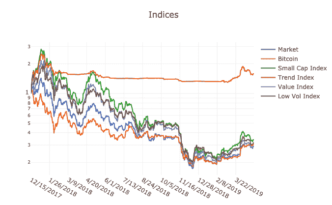

# 区块链资产的最优敞口是多少？

> 原文：<https://medium.com/coinmonks/what-is-the-optimal-exposure-to-blockchain-assets-914eb68bdd9c?source=collection_archive---------1----------------------->

在第一天开盘(2017 年 12 月比特币价格创历史新高的前一天)购买并持有的 10，000 美元比特币在今天将价值约 2800 美元(截至 2019 年 5 月)。

如果你把同样的 1 万美元投入到 Protos 的最佳交易策略趋势指数中，这是我们的量化策略，随着区块链前 40 名资产的价值上升或下降而做多或做空，你今天的 1 万美元将是 14，800 美元(截至 2019 年 5 月)。

基金 1 在熊市期间交易了六种不同的量化策略，结果各不相同。我们的整体基金回报将意味着在比特币高点今天达到 6100 美元(截至 2019 年 5 月)后的第二天投资 10，000 美元，这远远超过了简单的比特币投资。

这篇文章中描述的策略吸取了我们的经验，旨在结合趋势跟踪和一套绝对回报策略，作为对市场的最佳投资。

在熊市期间，一些表现出色的加密基金获得了与 Protos 类似的回报。我们都听说过交易者在上一个市场周期的顶部卖掉 100%资产的故事。本文提出的策略，将提供最佳的风险调整后的回报，超过多年期的上升和下降周期。趋势跟踪提供了一个简单的机制来选择市场周期的顶部和底部，并且被证明是有效的，但是当然不是完美的。

我们认为，购买比特币并仅仅持有并不是接触加密的最佳方式。不是每个人都可以通过活跃交易的量化基金来管理他们的基金，但是每个人都可以阅读交易策略。我们认为[这本](https://www.amazon.com/gp/product/0691166196/ref=dbs_a_def_rwt_bibl_vppi_i0)是关于交易策略的最好的书。

什么是最优？

完美最佳暴露“OE”是理论上的最佳结果情景，我们可以将其作为目标。目前的最佳“CO”是我们认为今天可能得到的，并且一直在改进。

# 最佳曝光

1.  捕捉所有收益，避免所有损失
2.  赚取“市场中性”回报，这是你的资产价格增值之外的回报
3.  你的资产由银行保管

**1。捕捉所有收益，避免所有损失**

过去一年，Protos 部署了六种策略来应对加密货币市场。我们在这里公开分享了它们[。](/protos-fund/introducing-cryptocurrency-investment-styles-69601f92a30d)

我们确定了我们的领先策略，趋势指数，并且会在未来大量交易它。

趋势跟踪指数旨在参与牛市，同时大幅减少熊市的下跌。它可以应用于任何数量的资产，只要这些资产具有流动性，并且可以开立长/空头头寸。

*Protos 系统加密交易策略:*

趋势指数源于趋势跟踪策略，被认为是最大的对冲基金类别商品交易顾问(CTA)的主要策略之一。最初 CTA 来源于商品交易。趋势使用时间序列动量，这是一种简单的趋势跟踪策略，当市场在某个回望时间范围内获得正超额回报时，做多市场，否则做空市场。

趋势让你在避免亏损的同时，更接近于获得收益，这让你对市场的长期趋势有一个近乎最佳的投资。

CTA 还应用了另一个有趣的特性来管理他们的现金。由于市场通常使用期货交易，该基金坐拥 100%的现金或现金抵押品。这些现金通常投资于债券市场，以产生无风险回报。

加密货币市场已经发展到很容易复制策略的地步，比如利用期货进行趋势跟踪。因为你只需要支付实际交易的 10 %- 20 %(保证金要求),你该如何处理这些现金？你可以通过以下方式增加投资收益。

**2。赚取“市场中性”回报，这是你的资产价格增值之外的回报**

很可能你想把你的闲钱投资到无风险或套利型的策略中。套利策略很有趣，因为它们产生无风险回报。由于加密货币市场效率低下，套利机会比传统市场多得多。套利机会也有更高的收益。

套利机会

套利策略旨在产生独立于加密货币市场价格的绝对回报。因此，这些策略旨在从金融摩擦中获取收益，方法是在加密货币中建立多头头寸，这可能会产生收益，同时在未来市场中建立空头头寸，对该资产的风险敞口相等。

加密货币市场出现了大量新的套利机会。以下是四个有吸引力的选项:

*   *挖矿套利:*通过构造比特币挖矿收益来收取收益率
*   *交易所套利:*利用同一资产在不同交易所之间的价格差异来获取收益
*   *借贷套利:*从事加密货币借贷收取收益
*   *风险挖掘:*通过在 POS 网络上进行赌注和管理来收集收益

采矿-套利:采矿是一种方式，区块链支付参与者，以保持其记录和完整性。矿工们的服务是用区块链自己的货币支付的。高效率的挖矿者能以低于交易所交易价格的价格生产加密货币。mining-套利旨在通过对冲个别加密货币的市场风险来获得超额回报(每月约 5%)。

借贷套利:加密货币借贷平台的工作原理是将加密资产的借款人与平台上注册的贷款人网络连接起来。借出加密资产可以产生一定收益(每月约 2%)，从而提供流动性。借贷-套利通过对冲相关资产的市场风险隔离该收益率。

风险挖掘:风险挖掘是一种获取加密货币的新方法。这些网络不是提供硬件来维护网络，而是奖励对系统的实际参与。参与者会因为维护加密货币网络内的记录和完整性而获得费用(每月约 3%)。该费用以加密货币支付，必须通过交易所出售。由于有关策略并无维持市场风险，故毋须进行对冲。

汇兑套利:汇兑套利是利用不同交易所之间加密货币的价格差异。差价可以通过同时在廉价交易所购买加密货币和在昂贵的交易所出售来收取(每月约 4%)。对于这种交易，法定货币和加密货币必须在不同的交易所进行转让和维护，并且对整体市场风险进行对冲。

**3 .你的资产由银行保管**

从一开始，Protos 就使用银行等外部托管人(当时许多基金“内部”托管客户的资产)。通过外部托管，Protos 本身并不持有任何加密资产，但银行或经纪人会为我们保管这些资产。使用托管人的不利之处在于成本。虽然成本在过去要高得多(>每年 1%)，但朝着传统银行托管的方向正在快速下降(<0.1 per year).

# **概要**

趋势跟踪战略在管理加密货币市场的抛售方面非常成功，并积极参与了最近的复苏。该策略旨在参与牛市，但大幅降低下行风险。

这种趋势跟踪策略可以通过使用最大加密货币的期货市场来复制。因此，趋势跟踪还有一个优势，那就是在投资组合中主要持有现金。

这些现金可以投资于美国国债等无风险资产，也可以投资于加密货币市场的套利机会。我们已经确定了至少四个年收益率在 20-40%之间的套利机会。为了在加密货币中复制 CTA 的最初想法，结合套利机会来管理现金并使用趋势跟踪策略来管理加密货币市场的风险似乎是合乎逻辑的。

我们相信这些策略会很好地为我们服务，不管是在好的时候还是像过去的一年，甚至是坏的时候。

**关于 Protos** : Protos 是一家系统化的对冲基金管理公司，交易总部位于瑞士的区块链资产的投资组合。Protos 由 Thomas Kineshanko、Philipp Kallerhoff 博士和 Matthew Shaw 创建，他们自 2013 年以来一直积极投资和交易加密资产，并在银行和量化资产管理领域拥有丰富的职业生涯。【www.protosmanagment.com】T2。

> [在您的收件箱中直接获得最佳软件交易](https://coincodecap.com/?utm_source=coinmonks)

