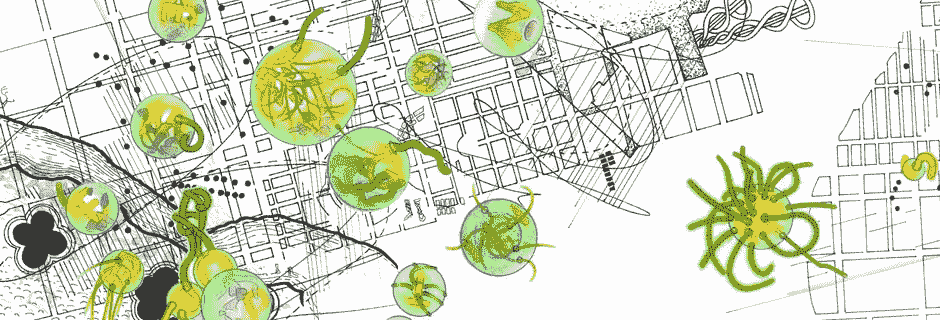

# 甲骨文问题是什么？

> 原文：<https://medium.com/coinmonks/what-is-the-oracle-problem-f9d0aec12eda?source=collection_archive---------6----------------------->

[Hatch](https://tammylu.net/2012/01/27/hatch/) by [Tammy Lu](https://tammylu.net/)

有人在 [API3 电报频道](https://t.me/API3DAO)问了这个问题:

> 我还是不太明白为什么智能合约需要 oracles，为什么智能合约不能像普通应用那样查询 API？是不是纯粹因为智能合约对数据完全是反应式的，它们不能像运行在服务器上的常规应用程序一样自己出去进行 API 调用？

以下是我的回答，现在以介质形式写下来供将来参考:

为了更新区块链的状态(即让网络“做点什么”)，您需要处理一个事务。由于网络是分散的，网络中的每个节点都必须能够验证交易。*验证交易*意味着，例如，检查爱丽丝的账户中有足够的 BTC 发送给鲍勃。的确，这都是比特币网络中的验证手段。对于以太坊和其他“通用”区块链来说，由于交易更加通用(例如调用智能合约函数)，所以要复杂一些，但基本原理仍然适用。这意味着每个节点必须能够访问相同的数据。

区块链节点旨在相互通信，而不是与“外部世界”通信。你*可以*设计一个区块链，在协议层面实现类似 API 查询的东西，但是如果你稍微思考一下，你就会明白为什么这是个坏主意。

本质上，即使网络中的所有节点都能够以某种方式验证一个 API 调用(不管这意味着什么……)，对一个 API 的单个 GET 请求也可能产生一个恶意的结果——如果该 API 出于某种原因出现故障的话——并搞乱区块链事务。你的区块链网络之外的计算机将能够干扰你的区块链网络及其[共识](https://en.wikipedia.org/wiki/Consensus_(computer_science))机制。

因此，区块链无法与“外部世界”通信(默认情况下)不是一个疏忽，而是一个安全特性。这种无法与外界(如其他计算机网络)通信的情况被称为“oracle 问题”。

附注[本文](/api3/the-api-connectivity-problem-bd7fa0420636)探讨了为什么“oracle 问题”是一个[不适定问题](https://twitter.com/API3DAO/status/1374898602477187075?s=20)以及为什么 [API3](https://medium.com/api3) 关注 API 连接性问题——可以说是“oracle 问题”的一个子集。