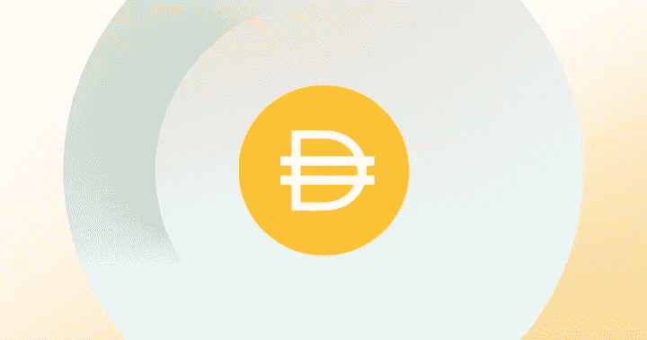

# DeFi 中的 PEG 是什么？

> 原文：<https://medium.com/coinmonks/what-is-the-peg-in-defi-4c1afe4cd4d0?source=collection_archive---------1----------------------->

## 让我们来看看在货币贬值的世界里，货币的挂钩是什么？让我们特别关注道的稳定货币戴

正如我们所知，所谓的稳定硬币是 DeFi 现象的基础，即数字硬币具有固定的名义价值，锚定于基础价值，在大多数情况下是美元。有几个稳定的…