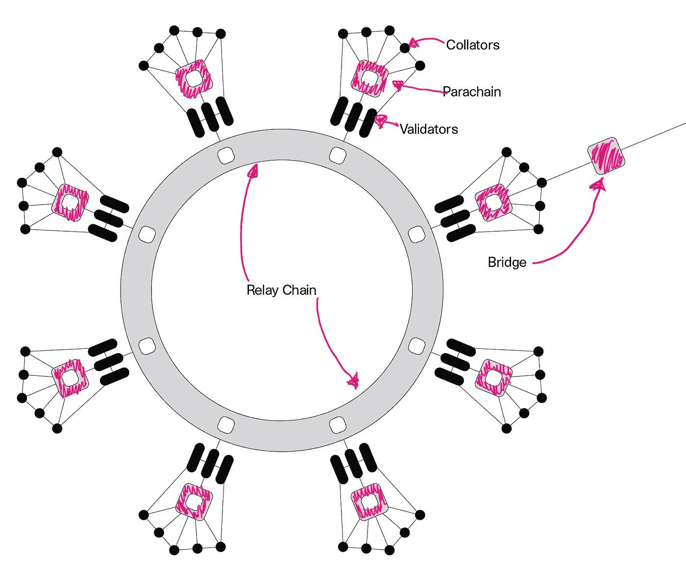

# 什么是波尔卡多特网络？

> 原文：<https://medium.com/coinmonks/what-is-the-polkadot-network-208968642db9?source=collection_archive---------0----------------------->

## 面向下一代网络的可扩展、可互操作且安全的网络协议

Polkadot 是一个 T2 网络协议，适用于 T4 的 Web 3.0，一个去中心化和公平的互联网，用户可以控制他们自己的数据、身份和命运。网络协议是一组既定的规则，用于确定网络中不同设备之间的数据传输方式。综上所述，Polkadot 是一种语言或一套规则，未来的软件应用程序将使用它来连接用户，而无需集中服务的“帮助”。

今天每个人都使用的网络协议的一个例子是 HTTP 或 TCP/IP。当你浏览这篇文章的时候，你的计算机正在使用这两种协议，而你却不知道。Polkadot 可能成为未来分散式 web 应用程序使用的网络协议。

> "波尔卡多特的任务是从中央机关安全地保护我们的身份和数据."

脸书等传统社交媒体平台对其服务进行了集中控制。脸书不把它的社交网络作为产品来卖；产品是从该网络收集的数据，用于销售广告。因此，用户就是产品。

然而，建立在 Polkadot 基础上的脸书的未来竞争对手可能恰恰相反:社交媒体平台是一种服务，人们付费与之互动。用户可以选择出售自己的个人数据来访问该平台，或者保留自己的个人数据并付费使用该服务。在 Polkadot 上构建的应用程序可以实现这一点。

# 如果 Polkadot 是一个网络协议，那么 dot 是什么？

DOT 是 Polkadot 网络的数字令牌。它有三个不同的目的:对网络的治理，赌注和债券。

## **治理**

Polkadot 令牌持有者可以完全控制协议，包括管理异常事件，如协议升级和修复。DOT 所有者将投票部署由核心 Polkadot 开发者编码的升级。这些 Polkadot 开发者是软件工程师的松散联盟，他们的共同目标是推进网络。

## **打桩**

网络中的参与者可以使用 DOT 来保护网络。本质上，DOT 可以被抵押给诚实地验证网络交易的“验证者”。博弈论激励验证交易的点持有者以诚实的方式行事。好的参与者通过这种机制得到回报，而坏的参与者将失去他们在网络中的股份。这确保了网络的安全。

## **粘合**

波尔卡多特本质上是一个网络的网络。核心网络称为中继链。构建在中继链之上的应用程序称为副链。为了在中继链上托管应用程序，副链必须保证或“绑定”DOT 到网络。就像交押金租公寓一样。通过移除结合的令牌来移除过时的或无用的副链。这是保护网络的另一种形式。

# 这是一个真实的例子，展示了 Polkadot 如何被用来革新保险行业。

保险是一个价值数万亿美元的全球性行业，由企业和个人管理风险的需求驱动。保险业受到信息不对称的困扰，当交易中的一方(投保人)比其对手(保险人)拥有更好的信息时，就会出现这种情况。信息不对称导致保险单的定价和价值不平衡。此外，保险公司受到欺诈性索赔的轰炸，这进一步抬高了保险成本。

未来，保险合同将是写入区块链的“智能合同”。智能合同是在分散式基础设施(如 Polkadot)上运行的数字合同，根据 if/then 参数自动执行，如“如果 x 发生，执行 y”。它们用高度可信、透明和防篡改的数据驱动的策略仲裁取代了传统保险协议的索赔处理部分，任何一方都无法利用或操纵该仲裁。

此外，保险公司将从物联网设备收集实时数据，以便根据智能合同中概述的实际发生的特定事件对风险进行适当定价并做出赔付。例如:

*   汽车保险智能合同可以使用物联网传感器来监控驾驶活动、碰撞动态和路况，以确定折扣率和事故索赔。
*   配有内部传感器的大型设备可以监控系统故障，并触发一系列缺陷保修或发出自动维护请求。
*   智能家电数据可以根据火灾、洪水、气体排放或任何其他内部损坏的确定来解决索赔。
*   物联网可穿戴设备和其他生物技术传感器可以连接到健康保险合同，以触发检查并根据锻炼习惯、体重和心率计算折扣。

# 我如何评价 DOT？

现在，你不能。任何提供价格预测的人都是一派胡言。作为投资者购买 DOT 就像对一项新技术进行风险投资。要么归零，要么上月球。风险资本家通常会下几笔较小的赌注来分散风险，因为他们知道很多投资会彻底失败。

我觉得买 DOT 就像 30 年前投资 TCP/IP 一样。当时，没有任何机制可以将 TCP/IP 货币化，所以它是开源的。但是今天，世界上的每台计算机都使用 TCP/IP 相互通信。你能想象拥有一个每分钟收费 0.01 美元的 TCP/IP 吗？它将价值数万亿。

因此，购买 DOT 是对分散式网络协议的投机性投资，该协议通过治理、赌注和绑定来获取价值。它具有高度的投机性，面临着激烈的竞争。投资者应该准备好持有他们的投资，尽管价格波动，他们应该准备好失去他们所有的钱。不要买超过你准备损失的点数。然而，Polkadot 成为主流 Web 3.0 协议的可能性很小。那样的话，多特可能会值一大笔钱。你要价多少？只有时间能证明一切。

# 是什么让波尔卡多特与众不同或不同于其他区块链？

## 互用性

Polkadot 支持在网络上构建的不同应用程序之间传输数据、资产或令牌。连接到 Polkadot 使软件开发人员能够与 Polkadot 网络中的各种应用程序进行互操作。Polkadot 可以在公共的、开放的、未经许可的区块链以及私人的、经许可的区块链之间传输数据。

这使得构建从私有区块链获取许可数据并在公共区块链上使用该数据的应用程序成为可能。例如，一所学校的私人许可学术记录链可以向公共链上的学位验证智能合同发送证明。

## 经济和交易可扩展性

Polkadot 通过启用一组通用的验证器来保护多个应用程序，提供了前所未有的经济可伸缩性。Polkadot 通过将事务分散到多个并行应用程序中来提供事务可伸缩性。

## 易区块链创新

软件开发人员可以使用[底层](https://www.substrate.io/)框架在几分钟内创建一个定制的区块链。这可以节省开发人员几个月的编码时间，并从第一天起就考虑到互操作性和安全性。这种开发的简易性将有助于快速发展 Polkadot 的网络。

## 无分叉且经得起未来考验

“Polkadot 可以在没有硬分叉的情况下升级，以集成新功能或修复 bug。这种能力使 Polkadot 能够轻松适应变化，并随着更好的技术的出现而自我升级。”

## 人人安全

“Polkadot 新颖的数据可用性和有效性方案允许应用程序以有意义的方式相互交互。应用程序在治理方面保持独立，但在安全性方面保持一致。”

## 用户驱动的网络治理

Polkadot 有一个复杂的管理系统，所有利益相关者(点所有者)都有发言权。网络升级在链上协调并自主制定，确保 Polkadot 的发展反映社区的价值观并避免停滞。DOT 所有者将对关键的机构群体决策拥有类似董事会的投票权。

# 波尔卡多特网络是什么样子的？

## 继电器链:

Polkadot 的心脏，负责网络的共享安全、共识和跨链互操作性。

## 副链:

主权区块链可以拥有自己的令牌，并针对特定用例优化其功能。

## 并行线程:

类似于 parachains，但采用现收现付模式。这对于不需要持续连接网络的区块链来说更经济。

## 桥梁:

允许副链和副线程与以太坊和比特币等外部网络连接和通信。

## 验证者:

通过标记点、验证校对者的证明以及与其他验证者达成共识来保护接力链。

## 排序器:

通过从用户那里收集碎片事务并为 validator 提供证据来维护碎片。

# 波尔卡多特和以太坊相比如何？

以太坊是一个部署智能合约的平台，智能合约是控制以太坊链上本地资产移动的逻辑。相比之下，Polkadot 的目标是提供一个构建你自己的区块链的框架，以及将不同的区块链相互连接起来的能力。尽管存在这些差异，但这两个平台都是为开发人员构建分散式应用程序而设计的。

## 它们有什么相似之处？

这两种技术都旨在为开发人员提供一个创建分散应用程序的空间。这两个平台都包含智能合约功能，并且都在寻求基于并行执行的扩展策略。

## 它们有什么不同？

最大的区别之一是设计目标。以太坊的目标是成为分布式金融和智能合同执行的平台，而 Polkadot 的愿景是帮助人们建设整个区块链，并将这些区块链相互集成。以太坊的治理是离线处理的，而波尔卡多特是在线的。以太坊是按交易收费的，而 Polkadot 收取应用程序连接费，但不收取持续使用费。

# 该不该买 DOT？

我热爱科技，也喜欢思考科技如何改变世界。我个人拥有 DOT，并希望在研究他们的技术时增加更多的平台投资。我不认为 DOT 是比特币那样的价值储存手段。它是一个在今天已经不被重视的网络协议。点的价格根据流量而变化。供需驱动价格，与有意义的估值模型没有联系。

对 Polkadot 来说，真正的挑战是获得足够的牵引力，建立足够的生态系统和开发者社区，让他们的架构的网络效应开始发挥作用。只有这么多的开发人员，目前有更多的开发人员平台，而不是有更多的开发人员来支持和构建它们。

波尔卡多特似乎拥有更先进的技术，并且正在用今天的区块链技术解决许多问题。然而，这并不意味着他们会赢。开发者需要在 Polkadot 上构建应用来增加价值。

购买 DOT 具有很高的投机性，但我做出了决定，这也是我写这篇文章的原因。Polkadot 的美丽和强大在于用户控制。我与朋友分享我的投资想法，我写这篇文章是为了更容易向他们解释我为什么买 DOT。投机快乐！

# 引文

[1]: Polkadot 保险案例分析。 [*智能合同如何减少信息不对称，建立信任，并彻底改变保险业*](https://blog.chain.link/how-smart-contracts-can-decrease-information-asymmetry-build-trust-and-revolutionize-the-insurance-industry/)

[2]:以太坊 vs 波尔卡多特。 [*选择平台:以太坊 vs 波尔卡多特*](https://www.purestake.com/blog/ethereum-vs-polkadot/) 对比

[3]网络词汇。[https://polkadot . network/technology/](https://polkadot.network/technology/)

## 另外，阅读

*   最好的[加密交易机器人](/coinmonks/crypto-trading-bot-c2ffce8acb2a)
*   [3 商业评论](/coinmonks/3commas-review-an-excellent-crypto-trading-bot-2020-1313a58bec92)
*   [Pionex 审查](/coinmonks/pionex-review-exchange-with-crypto-trading-bot-1e459d0191ea)
*   [AAX 交易所评论](/coinmonks/aax-exchange-review-2021-67c5ea09330c) |推荐代码、交易费用、利弊
*   [Deribit 审查](/coinmonks/deribit-review-options-fees-apis-and-testnet-2ca16c4bbdb2) |选项、费用、API 和 Testnet
*   FTX 密码交易所评论
*   [n 零审核](/coinmonks/ngrave-zero-review-c465cf8307fc)
*   [Bybit 交换审查](/coinmonks/bybit-exchange-review-dbd570019b71)
*   [3Commas vs Cryptohopper](/coinmonks/cryptohopper-vs-3commas-vs-shrimpy-a2c16095b8fe)
*   最好的比特币[硬件钱包](/coinmonks/the-best-cryptocurrency-hardware-wallets-of-2020-e28b1c124069?source=friends_link&sk=324dd9ff8556ab578d71e7ad7658ad7c)
*   [密码本交易平台](/coinmonks/top-10-crypto-copy-trading-platforms-for-beginners-d0c37c7d698c)
*   最佳 [monero 钱包](https://blog.coincodecap.com/best-monero-wallets)
*   [莱杰 nano s vs x](https://blog.coincodecap.com/ledger-nano-s-vs-x)
*   [Bitsgap vs 3 commas vs quad ency](https://blog.coincodecap.com/bitsgap-3commas-quadency)
*   最好的[加密税务软件](/coinmonks/best-crypto-tax-tool-for-my-money-72d4b430816b)
*   [最佳加密交易平台](/coinmonks/the-best-crypto-trading-platforms-in-2020-the-definitive-guide-updated-c72f8b874555)
*   最佳[加密贷款平台](/coinmonks/top-5-crypto-lending-platforms-in-2020-that-you-need-to-know-a1b675cec3fa)
*   [莱杰纳米 S vs 特雷佐 one vs 特雷佐 T vs 莱杰纳米 X](https://blog.coincodecap.com/ledger-nano-s-vs-trezor-one-ledger-nano-x-trezor-t)
*   [block fi vs Celsius](/coinmonks/blockfi-vs-celsius-vs-hodlnaut-8a1cc8c26630)vs Hodlnaut
*   [bits gap review](/coinmonks/bitsgap-review-a-crypto-trading-bot-that-makes-easy-money-a5d88a336df2)——一个轻松赚钱的加密交易机器人
*   为专业人士设计的加密交易机器人
*   [PrimeXBT 审查](/coinmonks/primexbt-review-88e0815be858) |杠杆交易、费用和交易
*   [alt ready 审查](https://blog.coincodecap.com/altrady-reivew)
*   [埃利帕尔泰坦评论](/coinmonks/ellipal-titan-review-85e9071dd029)
*   [赛克斯石评论](https://blog.coincodecap.com/secux-stone-hardware-wallet-review)
*   [BlockFi 评论](/coinmonks/blockfi-review-53096053c097) |赚取高达 8.6%的加密利息
*   [共同规则审查](https://blog.coincodecap.com/coinrule-review-a-perfect-trading-bot)
*   [最佳区块链分析工具](https://bitquery.io/blog/best-blockchain-analysis-tools-and-software)
*   [加密套利](/coinmonks/crypto-arbitrage-guide-how-to-make-money-as-a-beginner-62bfe5c868f6)指南:新手如何赚钱
*   最佳[加密制图工具](/coinmonks/what-are-the-best-charting-platforms-for-cryptocurrency-trading-85aade584d80)
*   了解比特币的[最佳书籍有哪些？](/coinmonks/what-are-the-best-books-to-learn-bitcoin-409aeb9aff4b)

> [在您的收件箱中直接获得最佳软件交易](/coinmonks/newsletters/coinmonks)

