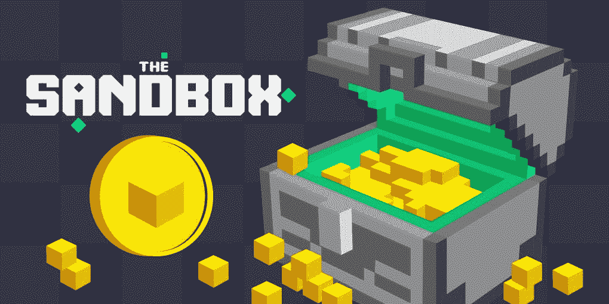
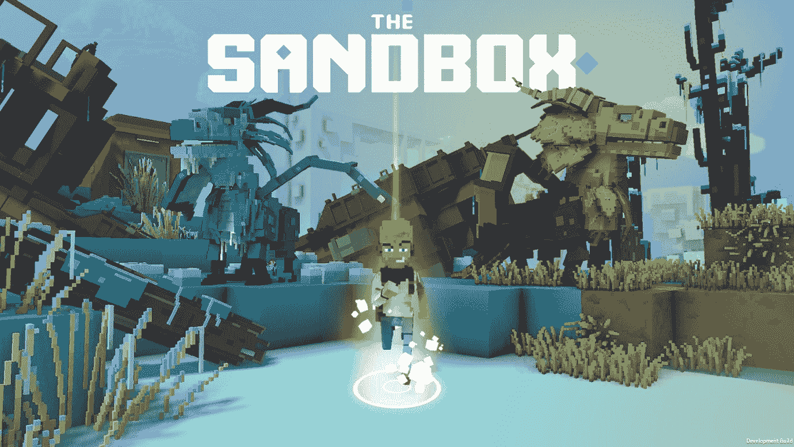
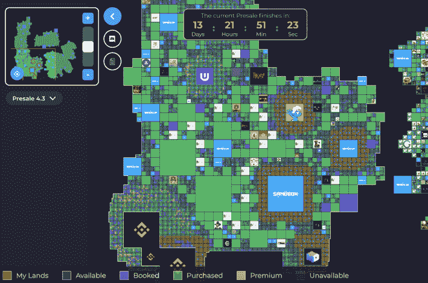

# 什么是沙盒 NFT 游戏，它如何帮助筹集资金？

> 原文：<https://medium.com/coinmonks/what-is-the-sandbox-nft-game-and-how-does-it-help-raise-money-2d3e962b365c?source=collection_archive---------0----------------------->

基于区块链的游戏是加密货币发展最快的领域之一。还记得 CryptoKitties 吗，这是一款饲养猫的游戏，在 2017 年引发了以太坊创纪录的天然气费？这是最早利用 NFT 格式的网站之一。从那以后，出现了许多 NFT 游戏，但具有更先进的功能、游戏机制和令牌组学。

在游戏历史上前所未有的是，今天，玩家可以在数字世界中用密码证明土地和游戏物品的所有权。拥有一个 NFT 可以保证你拥有一个物品，没有人可以欺骗和攫取它，包括游戏的开发团队。这给了用户独特的所有权体验，使他们为没有有形“现实世界”价值的数字土地支付数百万美元。

沙盒就是这样一种游戏。让我们看看它是什么，以及用户如何将他们的游戏“财产”货币化。

# 什么是沙盒？

沙盒是一个建立在以太坊上的区块链数字世界(或者所谓的元宇宙)。在这里，玩家可以创造他们自己的物品，将它们铸造成 NFT，并从中获利——沙盒中有一个 NFT 市场。

沙盒的生态系统中有三个主要元素。VoxEdit 允许建立 3D 模型和设计游戏项目；Marketplace 使交易这些项目成为可能，Game Maker 界面允许用户使用脚本模板等无代码解决方案在沙盒中构建自己的游戏场景。

沙盒经济基于 SAND——一种 ERC 20 实用令牌，用于进入游戏、与其他玩家交换物品等。沙子的总供应量是 30 亿。此外，它是一个治理令牌，很快，用户就可以用它来赢取奖励。

除了沙子，沙盒生态系统中还有一些资产——土地、地产、资产、催化剂和宝石令牌。有了土地，你可以购买一处房产，并进一步合并，获得地产代币。催化剂和宝石赋予游戏流程中与土地一起使用的资产独特的特征。

# 沙盒的路线图是什么？

沙盒有一个相当广泛的 2021 年，2022 年和 2023 年的路线图。今年，沙盒计划推出基金会道与沙盒投票创作者基金管理；继续定期卖地，启用多人模式，让游戏可以在不同类型的设备上使用。

到 2022 年，沙盒计划确保游戏可在控制台上使用，将引入新的优质 NFT，在元宇宙提供超过 1000 款游戏，激活 Game Maker 的新功能，等等。在他们的官方网站上找到沙盒完整路线图。

# 用沙子怎么赚？

今年，SAND 举办了一场[采矿活动](/sandbox-game/the-sandbox-liquidity-mining-phase-4-bc6220c58a07)，于 7 月结束；赌沙换奖励只是介绍一下。然而，现在有一个有趣的沙盒选择。

正如我们已经提到的，沙盒生态系统中有一个土地令牌，它代表你在游戏中可以拥有的土地。问题是它很稀缺:在沙盒元宇宙中永远不会有超过 16.6 万块的土地，而人们对这个游戏的兴趣却在不断增长。一些狂热爱好者[认为](https://hackernoon.com/why-owning-land-on-the-sandbox-could-make-you-rich)现在购买土地是一项不错的投资——然后，当对土地的需求激增时，你可以将这块土地租给希望在这块土地上开发游戏的游戏设计师；你可以在可能的时候用木桩支撑土地；让人们在你的土地上经营他们的商店或画廊，等等。

但是，不要把这当成投资建议。谁也不知道未来地价何去何从，这笔投资有多赚钱。做自己的研究，做出有风险意识的权衡决策。

# 2021 年沙价预测如何？

仅在一年之内，沙子代币就从 0.06 美元增长到 0.6 美元，增长了十倍。2021 年 1 月，代币价格为 0.43 美元。这种资产在投资者中很受欢迎，因为它代表了新兴的新一代游戏，玩家可以自由拥有元宇宙，并拥有方便的工具来构建它。

围绕 NFTs 的炒作和游戏中的赚钱机会只会增加它的价值。[钱包投资人](https://walletinvestor.com/forecast/the-sandbox-prediction)价格预测平台一年给沙子 1.23 美元。trading beats 预计，到 2021 年 9 月，代币将达到 0.77 美元，到 2022 年将达到 0.88 美元。

# 怎样才能买到沙子？

虽然沙盒有内置的 marketplace，但是你只能在游戏之外购买沙盒令牌。币安、火币和 Uniswap 是允许购买沙子的主要交易所。您还可以在 [ChangeNOW](https://changenow.io/?from=btc&to=sand) 上获得 200 多种加密货币，无需注册和 KYC。这个 4 步的过程只需要 5 分钟，即使你以前从未使用过这项服务。

我们还建议关注沙盒的官方媒体:他们经常举办空投、竞赛和大使计划，提供免费获得沙子的机会。

# 沙子的钱包有哪些？

任何以太坊钱包都可以。为了充分利用沙盒，你需要一个完全支持包括 NFT 在内的所有基于以太坊的令牌类型的钱包，所以我们建议设置[元掩码](https://metamask.io)。该钱包适用于 Android、iOS 和 Chrome。

# 摘要

沙盒已经吸引了成千上万的用户，其近乎上瘾的游戏机制，在元宇宙内建设的无障碍工具，以及盈利的机会。该游戏在疫情期间获得了特别多的关注:一些用户将他们的整个锁定期都花在了沙盒世界上。拥有感和创造的自由是让游戏如此有价值的东西，而里面土地的稀缺性暗示着沙子的价格只会增长。

> 加入 [Coinmonks 电报频道](https://t.me/coincodecap)，了解加密交易和投资

## 另外，阅读

*   [尤霍德勒 vs 科恩洛安 vs 霍德诺特](/coinmonks/youhodler-vs-coinloan-vs-hodlnaut-b1050acde55a) | [Cryptohopper vs 哈斯博特](https://blog.coincodecap.com/cryptohopper-vs-haasbot)
*   [币安 vs 北海巨妖](https://blog.coincodecap.com/binance-vs-kraken) | [美元成本平均交易机器人](https://blog.coincodecap.com/pionex-dca-bot)
*   [如何在印度购买比特币？](/coinmonks/buy-bitcoin-in-india-feb50ddfef94) | [WazirX 审核](/coinmonks/wazirx-review-5c811b074f5b) | [BitMEX 审核](https://blog.coincodecap.com/bitmex-review)
*   [比特币主根](https://blog.coincodecap.com/bitcoin-taproot) | [Bitso 评论](https://blog.coincodecap.com/bitso-review) | [排名前 6 的比特币信用卡](/coinmonks/bitcoin-credit-card-bc8ab6f377c6)
*   [双子座 vs 比特币基地](https://blog.coincodecap.com/gemini-vs-coinbase) | [比特币基地 vs 北海巨妖](https://blog.coincodecap.com/kraken-vs-coinbase) | [硬币罐 vs 硬币点](https://blog.coincodecap.com/coinspot-vs-coinjar)
*   [印度密码交易所](/coinmonks/bitcoin-exchange-in-india-7f1fe79715c9) | [比特币储蓄账户](/coinmonks/bitcoin-savings-account-e65b13f92451) | [Paxful 审核](/coinmonks/paxful-review-4daf2354ab70)
*   [杠杆令牌](/coinmonks/leveraged-token-3f5257808b22) | [最佳加密交易所](/coinmonks/crypto-exchange-dd2f9d6f3769) | [AscendEX 评论](/coinmonks/ascendex-review-53e829cf75fa)
*   [Godex.io 审核](/coinmonks/godex-io-review-7366086519fb) | [邀请审核](/coinmonks/invity-review-70f3030c0502) | [BitForex 审核](https://blog.coincodecap.com/bitforex-review) | [HitBTC 审核](/coinmonks/hitbtc-review-c5143c5d53c2)
*   [Crypto.com 费用](/coinmonks/binance-fees-8588ec17965) | [僵尸密码审查](/coinmonks/botcrypto-review-2021-build-your-own-trading-bot-coincodecap-6b8332d736c7) | [替代品](https://blog.coincodecap.com/crypto-com-alternatives)
*   [MXC 交易所评论](/coinmonks/mxc-exchange-review-3af0ec1cba8c) | [Pionex vs 币安](https://blog.coincodecap.com/pionex-vs-binance) | [Pionex 套利机器人](https://blog.coincodecap.com/pionex-arbitrage-bot)
*   [我的密码交易经验](/coinmonks/my-experience-with-crypto-copy-trading-d6feb2ce3ac5) | [比特币基地评论](/coinmonks/coinbase-review-6ef4e0f56064)
*   [CoinFLEX 评论](https://blog.coincodecap.com/coinflex-review) | [AEX 交易所评论](https://blog.coincodecap.com/aex-exchange-review) | [UPbit 评论](https://blog.coincodecap.com/upbit-review)
*   [AscendEx 保证金交易](https://blog.coincodecap.com/ascendex-margin-trading) | [Bitfinex 赌注](https://blog.coincodecap.com/bitfinex-staking) | [bitFlyer 点评](https://blog.coincodecap.com/bitflyer-review)
*   [麻雀交易所评论](https://blog.coincodecap.com/sparrow-exchange-review) | [纳什交易所评论](https://blog.coincodecap.com/nash-exchange-review) | [普罗比特评论](https://blog.coincodecap.com/probit-review)
*   [加密货币储蓄账户](/coinmonks/cryptocurrency-savings-accounts-be3bc0feffbf) | [赌注加密](https://blog.coincodecap.com/staking-crypto) | [StealthEX Review](/coinmonks/stealthex-review-396c67309988)
*   [BigONE 交易所评论](/coinmonks/bigone-exchange-review-64705d85a1d4) | [CEX。IO 审查](https://blog.coincodecap.com/cex-io-review) | [交换区审查](/coinmonks/swapzone-review-crypto-exchange-data-aggregator-e0ad78e55ed7)
*   [最佳比特币保证金交易](/coinmonks/bitcoin-margin-trading-exchange-bcbfcbf7b8e3) | [Bityard 保证金交易](https://blog.coincodecap.com/bityard-margin-trading) | [Prokey 点评](/coinmonks/prokey-review-26611173c13c)
*   [加密保证金交易交易所](/coinmonks/crypto-margin-trading-exchanges-428b1f7ad108) | [赚取比特币](/coinmonks/earn-bitcoin-6e8bd3c592d9) | [Mudrex 投资](https://blog.coincodecap.com/mudrex-invest-review-the-best-way-to-invest-in-crypto)
*   [WazirX vs coin dcx vs bit bns](/coinmonks/wazirx-vs-coindcx-vs-bitbns-149f4f19a2f1)|[block fi vs coin loan vs Nexo](/coinmonks/blockfi-vs-coinloan-vs-nexo-cb624635230d)
*   [BlockFi 信用卡](https://blog.coincodecap.com/blockfi-credit-card) | [如何在币安购买比特币](https://blog.coincodecap.com/buy-bitcoin-binance)
*   [火币交易机器人](https://blog.coincodecap.com/huobi-trading-bot) | [如何购买 ADA](https://blog.coincodecap.com/buy-ada-cardano) | [Geco？一次审查](https://blog.coincodecap.com/geco-one-review)