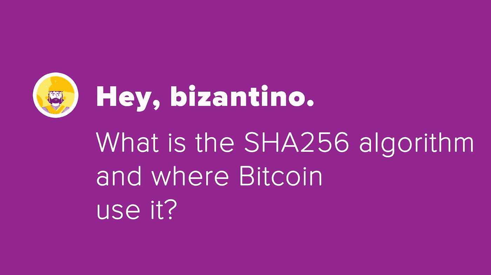

# SHA256 是什么算法？

> 原文：<https://medium.com/coinmonks/what-is-the-sha256-bitcoin-8b6e5b147629?source=collection_archive---------2----------------------->



嗨！

经常在我们上比特币课程的时候收到这类问题:SHA256 是什么算法，比特币用在什么地方？

比特币在多种情况下使用 SHA256 算法，例如在地址生成、交易 id 生成或挖掘(工作证明)过程中

SHA 代表**安全哈希算法，**将任意长度的字符串(明文)转换为另一个固定长度的字符串，在这种情况下是 256 位，因为我们使用的是 SHA256。

这是一个**单向**算法，这意味着不可能从 SHA256 的结果中检索明文，称为摘要或哈希。检索明文这件事非常复杂，就像在宇宙中寻找一个原子一样，为此我们可以说“不可能”

为了更好地理解我要解释的内容，我们将用一个例子来说明。

> 在活动

首先，从明文创建一个摘要，例如 bitcoininaction

```
$ printf bitcoininaction | openssl dgst -sha256(stdin)= b76b7041106a75de9fa4fbf880b3886cc114cbfd570e1a17adb58b937afee351
```

无法理解《文摘》中的明文是什么。

如果我重复同样的动作会发生什么？

如果你的答案是:我得到同样的结果，你就对了！

```
$ printf bitcoininaction | openssl dgst -sha256(stdin)= b76b7041106a75de9fa4fbf880b3886cc114cbfd570e1a17adb58b937afee351
```

如果我稍微改变一下明文会怎么样？比如我用 bitcoininaction.com 代替比特币？

```
$ printf bitcoininaction.com | openssl dgst -sha256(stdin)= 41dbcc447756ddd2c32ac99c76ef6f090fa0a63da5a6ecfda3311936f85daa85
```

我得到了完全不同的摘要！因此，如果我有明确的信息，很容易检查摘要。

好吧，很有意思，但是我更想看看关于比特币的东西！

我们从之前的视频“波索·斯克里维尔·内拉·区块链？”中获得哈希

为了实现我们的结果，我们需要使用 SHA256 两次，并获得小端表示。简而言之，大端和小端是一个关于字节顺序的话题。

之前视频的交易有 txid:[edee 419 f 93521 f 43259 b 763 FFB 42 E4 b 882504534494381 b7e 18057015 a 27 c 548](https://tbtc.bitaps.com/edee419f93521f43259b763ffb42e4b882504534494381b7e18057015a27c548)

我们可以使用 **getrawtransaction** 命令检索事务。

```
**$** bitcoin-cli getrawtransaction edee419f93521f43259b763ffb42e4b882504534494381b7e18057015a27c548 2{“txid”: “edee419f93521f43259b763ffb42e4b882504534494381b7e18057015a27c548”,“hash”: “12cf1e132b1d775f5403a875592b447a825f493c0eecdf6bbaa8f5e759c1c71d”,...“hex”: “020000000001019a8bb2699fc92968c62d2197649c7d70a6a71d7d8ffb2d70cab8f138d666cec50100000000ffffffff02b88201000000000017a914ffd0dbb44402d5f8f12d9ba5b484a2c1bb47da42870000000000000000236a21636f72736f636f6d706c65746f2e626974636f696e696e616374696f6e2e636f6d0247304402205688399cb5a230f050330e2bc6d04d9864d459f85fec48a0118ca31be9239d530220228d7c04fe9e6eea3690033c01ed222284efaa01b28a9a7cae809bdb32d7ce7a0121020d12775323bbdaf0cb6e9a2b44ae7a591ef5872364e80e363a93d283c10b9e4f00000000”,...}
```

哈希是**12 cf 1e 132 B1 d 775 f 5403 a 875592 b 447 a 825 f 493 c 0 EEC df 6 bbaa 8 f 5 e 759 C1 c 71d**，我们必须使用 SHA256 来获取它。

我们得到了第一份文摘。

```
$ printf 020000000001019a8bb2699fc92968c62d2197649c7d70a6a71d7d8ffb2d70cab8f138d666cec50100000000ffffffff02b88201000000000017a914ffd0dbb44402d5f8f12d9ba5b484a2c1bb47da42870000000000000000236a21636f72736f636f6d706c65746f2e626974636f696e696e616374696f6e2e636f6d0247304402205688399cb5a230f050330e2bc6d04d9864d459f85fec48a0118ca31be9239d530220228d7c04fe9e6eea3690033c01ed222284efaa01b28a9a7cae809bdb32d7ce7a0121020d12775323bbdaf0cb6e9a2b44ae7a591ef5872364e80e363a93d283c10b9e4f00000000 | xxd -r -p | sha256sum -b33bf8e3e54327c84758e3442ccea54cfef3621ee4d7276cc1bdcde301d4c4796
```

我们需要在摘要上再次应用 SHA256。

```
$ printf 33bf8e3e54327c84758e3442ccea54cfef3621ee4d7276cc1bdcde301d4c4796 | xxd -r -p | sha256sum -b1dc7c159e7f5a8ba6bdfec0e3c495f827a442b5975a803545f771d2b131ecf12
```

最后一步是获得小端表示

```
**$** printf 1dc7c159e7f5a8ba6bdfec0e3c495f827a442b5975a803545f771d2b131ecf12 | tac -rs ..12cf1e132b1d775f5403a875592b447a825f493c0eecdf6bbaa8f5e759c1c71d
```

超级！结果是正确的！

这只是关于 SHA256 和比特币协议的一个例子，但可能还有更多。比特币使用几种算法，例如在生成地址时使用 RIPEMD160。您可以在我们的 GitHub 资源库中找到源代码！

再见！

🎥[YouTube 频道——比特币在行动](https://www.youtube.com/BitcoinInAction)

🐙GitHub:[https://bit.ly/2Lj3yeY](https://bit.ly/2Lj3yeY)

— –

↓↓比特币图书 dalla teoria alla pratica (亚马逊): [https://amzn.to/2Ldym0F](https://amzn.to/2Ldym0F)

↓↓比特币图书 dalla teoria alla pratica (pagamento in bitcoin): [http://bit.ly/2ADHUN1](http://bit.ly/2ADHUN1)

— –

↓↓Video Corso Bitcoin dalla teoria alla pratica: [https://bit.ly/3cUJDyZ](https://bit.ly/3cUJDyZ)

— –

↓↓Tascabile 比特币 199 问题 (亚马逊): [https://amzn.to/3ckIkJj](https://amzn.to/3ckIkJj)

↓↓Tascabile Bitcoin 199 问题(付款比特币): [https://bit.ly/3cmz07W](https://bit.ly/3cmz07W)

— –

↓↓口袋比特币 199 问题(亚马逊): [https://amzn.to/3fB4Kbs](https://amzn.to/3fB4Kbs)

↓↓Pocket Bitcoin 199 问题 (pagamento in bitcoin): [https://bit.ly/2SUNzYz](https://bit.ly/2SUNzYz)

— –

► 官方网站: [https://www.corsobitcoin.com/](https://www.corsobitcoin.com/)

► 推特: [https://twitter.com/satoshiwantsyou](https://twitter.com/satoshiwantsyou)

► Facebook: [https://www.facebook.com/satoshiwantsyou](https://www.facebook.com/satoshiwantsyou)

► Linkedin: [https://www.linkedin.com/company/bitcoin-dalla-teoria-alla-pratica](https://www.linkedin.com/company/bitcoin-dalla-teoria-alla-pratica)

► Medium: [https://medium.com/@satoshiwantsyou](/@satoshiwantsyou)

► Instagram: [https://www.instagram.com/satoshiwantsyou](https://www.instagram.com/satoshiwantsyou)

在加密我们信任