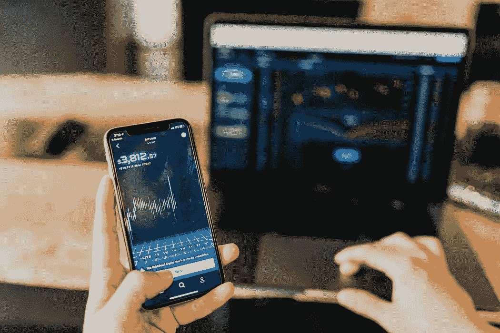
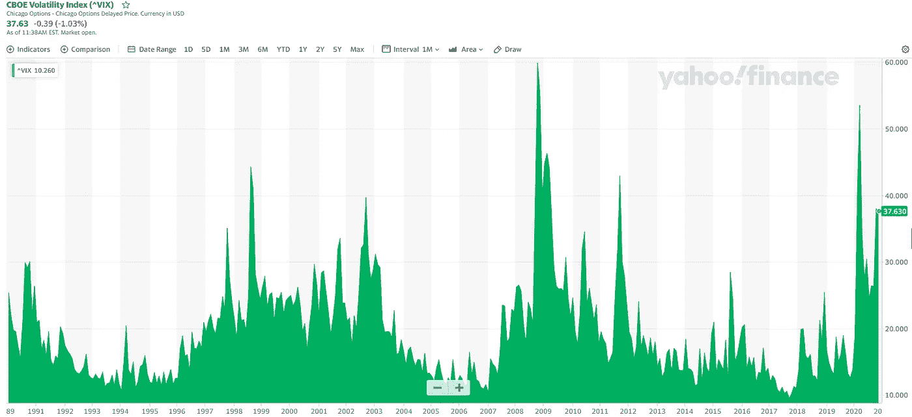
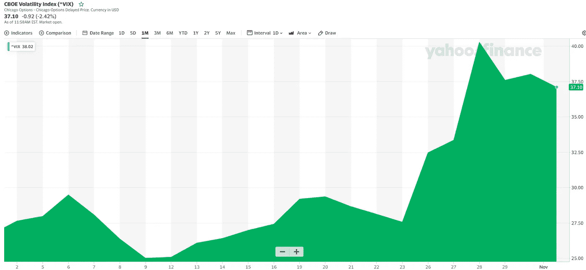
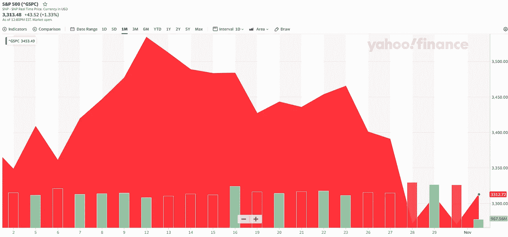
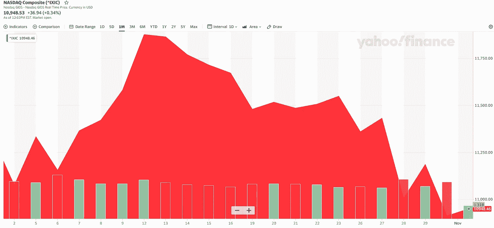
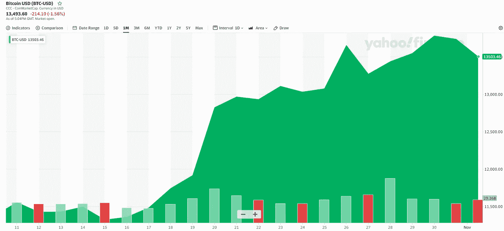

# 什么是 VIX，它对比特币有什么看法？

> 原文：<https://medium.com/coinmonks/what-is-the-vix-and-whats-it-saying-about-bitcoin-a383453e2583?source=collection_archive---------5----------------------->

全球有 35 亿人拥有智能手机，因此可以随时获取信息。然而，在一个以信息(和虚假信息)过度丰富为特征的数字时代，我们仔细审查谁是我们消费的内容，谁是我们扔进垃圾桶的内容是至关重要的。

我的一般经验是这样的:

基于可证实的事实创造客观公正内容的记者是好记者。“说到做到”(像我一样)的博客作者和独立创作者，或者是某个特定主题的公认专家也很不错。然而，我们需要谨慎的是那些没有任何“利益关系”的人，他们对自己一无所知的主题发表意见，只是因为他们有这样做的平台，或者因为他们想要观点和喜欢。

或者如纳西姆·塔勒布所说:

> 不要告诉我你“想什么”，只要告诉我你的投资组合里有什么。

也就是说，还有比记者、主题专家和那些把钱花在嘴上的人更高的层次:

*市场。*

市场可能是获取信息的最佳去处。在这里，你可以实时看到人们愿意(和不愿意)为什么而冒险。从工作日的上午 9:30 到下午 4:00，你可以看到来自真实伤疤的人、内幕消息和几十年游戏经验的信仰聚合。

现在，市场告诉我们两件事:(1)我们对未来感到非常害怕和不确定，以及(2)我们认为[比特币](https://blog.coincodecap.com/a-candid-explanation-of-bitcoin)是一项不错的投资…

同时。

这是巨大的。让我解释一下原因:

## 市场情绪

当经济表现良好时，投资者愿意承担更多风险，以获得更高的回报。在这段时期，公共股本、私人股本、房地产和风险投资都表现出色。

当经济在流血和/或未来充满不透明时，投资者逃离以消除风险，从而保护他们的财富。就像电影院失火一样，他们会尽快跑到门口，将高风险的投资组合转换成现金。然后，一旦他们的需求得到满足，在这些时候胜出的资产类别通常是政府债券、大宗商品和防御性股票。

换句话说，在动荡时期，人们试图降低波动性和交易对手风险。

## 我们如何衡量金融的波动性

在金融和投资领域，我们有两种主要的方法来衡量波动性(又名“风险”)。

首先，我们通过标准差和均值等指标来观察历史波动性。这只是简单地分析一项资产在过去 12 个月的波动性，并假设未来 12 个月也是如此。但是因为过去的表现从来不会决定未来的表现，所以这不是最可靠的方法。

其次，我们来看看所谓的“隐含波动率”隐含波动率是一种基于当前期权价格预测未来情况的方法。期权只是对资产未来波动性的押注——如果未来的波动性比我们预测的更大，那么期权的买家就赢了；如果未来的波动比我们预测的要小，那么期权的卖方就赢了。有点像拉斯维加斯。

现在，隐含波动率并不是终极目标。毕竟，没有人有能力百分之百确定地预测未来。

也就是说，这些预测是由*实际上*有利害关系的人做出的。因此，隐含波动率是我们拥有的最佳衡量指标之一。

## 那么 VIX 到底是什么？

VIX 指数是一个基准，它综合了标准普尔 500 所有 500 家公司的隐含波动率。

这是一个实时市场指数——通常被称为“恐惧指数”——反映了市场*认为未来 30 天*会有多不稳定。

这可能是捕捉市场情绪的最佳方式。

当预测 VIX 的波动性较低时，经济会很舒适，失业率通常较低，人们会花钱，投资者会承担很大的风险，因为他们相信他们会产生异常的回报。

当预测 VIX 的波动性很高时，经济前景不确定，人们通常对未来感到怀疑，有时甚至害怕。由于账单仍需支付，未来仍需填饱嘴巴，投资者倾向于出售投资以满足眼前的现金需求。

Historical price chart of (^VIX) provided by Yahoo Finance

历史上，VIX 大部分时间都在 10-20 区间徘徊。但每隔 7-10 年，它似乎会非常猛烈地飙升。

例如，1998 年，由于俄罗斯未来的政治和经济不确定性，该指数飙升至 44.28。2008 年金融危机时，VIX 接近 60。2020 年 3 月，在冠状病毒歇斯底里期间，该指数升至 54，可以说，如果没有如此高的刺激计划，该指数可能会更高。而现在，2020 年 11 月 2 日，VIX 接近 40——这是六个月来的最高值。

当然，我们还有一天就要迎来美国历史上最两极分化的选举了，而且我们正在输掉与一个看不见的敌人的战斗。当然，随着美国和欧洲的病例急剧增加，很可能会有一个黑暗的冬天。当然，国会无法就一项刺激方案达成一致，以帮助流血的经济。

因此，在过去的一个月里，VIX(恐惧)上涨了 50%

Historical price chart of (^VIX)) for previous month provided by Yahoo Finance

标准普尔 500 关闭了…

Historical price chart of S&P 500 for previous month provided by Yahoo Finance

纳斯达克指数进一步下跌…

Historical price chart of Nasdaq for previous month provided by Yahoo Finance

而比特币正在风起云涌。

Historical price chart of Bitcoin-USD for previous month provided by Yahoo Finance

## 外卖

一方面，VIX 在过去一个月里上涨了 50%。换句话说，市场变得更加不确定，对未来更加恐惧。

而另一方面，比特币已经攀升了 25%。这意味着，它不仅与公共股票脱钩，而且在所有这些混乱和不确定性中，人们越来越将比特币视为一种安全的投资。

让我再说一遍:*人们很害怕，他们越来越信任比特币。*

如果这对你来说还不够乐观，在过去的几个月里，我们已经看到 MicroStrategy 和 Square 宣布，他们正在将大部分资金转换成比特币。此外，富达(Fidelity)和摩根大通(J.P. Morgan Chase)也公开支持比特币，向投资者推荐 1-5%的投资组合配置。

此外，标准普尔 500 指数成份股公司的大量短期投资正接近到期。你认为他们会考虑少量投资比特币吗？

机构——也被称为“聪明的”钱——正在加入这个派对。

但是底线是:

*市场是我们最好的信息来源，他们正在对比特币进行漫长而艰难的思考。*

也许你也应该。

## 另外，阅读

*   最好的[密码交易机器人](/coinmonks/crypto-trading-bot-c2ffce8acb2a)
*   [密码本交易平台](/coinmonks/top-10-crypto-copy-trading-platforms-for-beginners-d0c37c7d698c)
*   最好的[加密税务软件](/coinmonks/best-crypto-tax-tool-for-my-money-72d4b430816b)
*   [最佳加密交易平台](/coinmonks/the-best-crypto-trading-platforms-in-2020-the-definitive-guide-updated-c72f8b874555)
*   最佳[加密贷款平台](/coinmonks/top-5-crypto-lending-platforms-in-2020-that-you-need-to-know-a1b675cec3fa)
*   [最佳区块链分析工具](https://bitquery.io/blog/best-blockchain-analysis-tools-and-software)
*   [加密套利](/coinmonks/crypto-arbitrage-guide-how-to-make-money-as-a-beginner-62bfe5c868f6)指南:新手如何赚钱
*   最佳[加密制图工具](/coinmonks/what-are-the-best-charting-platforms-for-cryptocurrency-trading-85aade584d80)
*   莱杰 vs 特雷佐
*   了解比特币的[最佳书籍有哪些？](/coinmonks/what-are-the-best-books-to-learn-bitcoin-409aeb9aff4b)
*   [3 商业评论](/coinmonks/3commas-review-an-excellent-crypto-trading-bot-2020-1313a58bec92)
*   [AAX 交易所审核](/coinmonks/aax-exchange-review-2021-67c5ea09330c) |推荐代码、交易费用、利弊
*   [德里比特评论](/coinmonks/deribit-review-options-fees-apis-and-testnet-2ca16c4bbdb2) |选项、费用、API 和 Testnet
*   [FTX 密码交易所评论](/coinmonks/ftx-crypto-exchange-review-53664ac1198f)
*   [n 零审核](/coinmonks/ngrave-zero-review-c465cf8307fc)
*   [Bybit 交换审查](/coinmonks/bybit-exchange-review-dbd570019b71)
*   [3Commas vs Cryptohopper](/coinmonks/cryptohopper-vs-3commas-vs-shrimpy-a2c16095b8fe)
*   最好的比特币[硬件钱包](/coinmonks/the-best-cryptocurrency-hardware-wallets-of-2020-e28b1c124069?source=friends_link&sk=324dd9ff8556ab578d71e7ad7658ad7c)
*   最佳 [monero 钱包](https://blog.coincodecap.com/best-monero-wallets)
*   [莱杰 nano s vs x](https://blog.coincodecap.com/ledger-nano-s-vs-x)
*   [Bitsgap vs 3 commas vs quad ency](https://blog.coincodecap.com/bitsgap-3commas-quadency)
*   [莱杰纳米 S vs 特雷佐 one vs 特雷佐 T vs 莱杰纳米 X](https://blog.coincodecap.com/ledger-nano-s-vs-trezor-one-ledger-nano-x-trezor-t)
*   [block fi vs Celsius](/coinmonks/blockfi-vs-celsius-vs-hodlnaut-8a1cc8c26630)vs Hodlnaut
*   Bitsgap 评论——一个轻松赚钱的加密交易机器人
*   为专业人士设计的加密交易机器人
*   [PrimeXBT 审查](/coinmonks/primexbt-review-88e0815be858) |杠杆交易、费用和交易
*   [埃利帕尔泰坦评论](/coinmonks/ellipal-titan-review-85e9071dd029)
*   [SecuX Stone 评论](https://blog.coincodecap.com/secux-stone-hardware-wallet-review)
*   [BlockFi 评论](/coinmonks/blockfi-review-53096053c097) |从您的密码中赚取高达 8.6%的利息