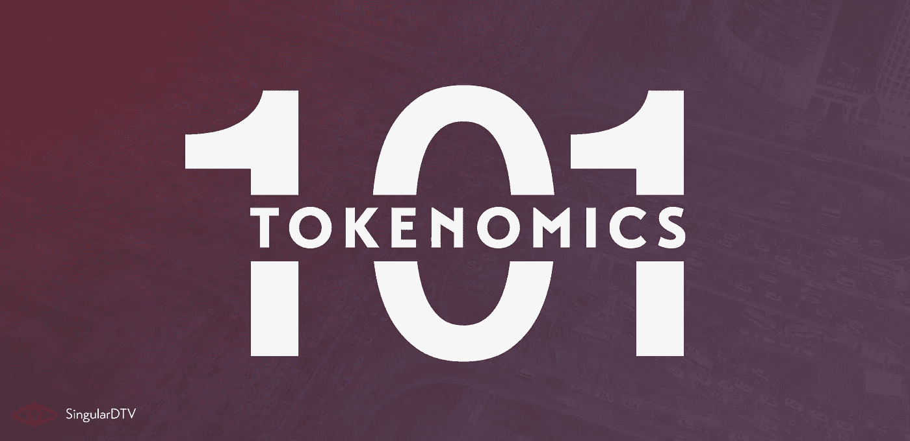
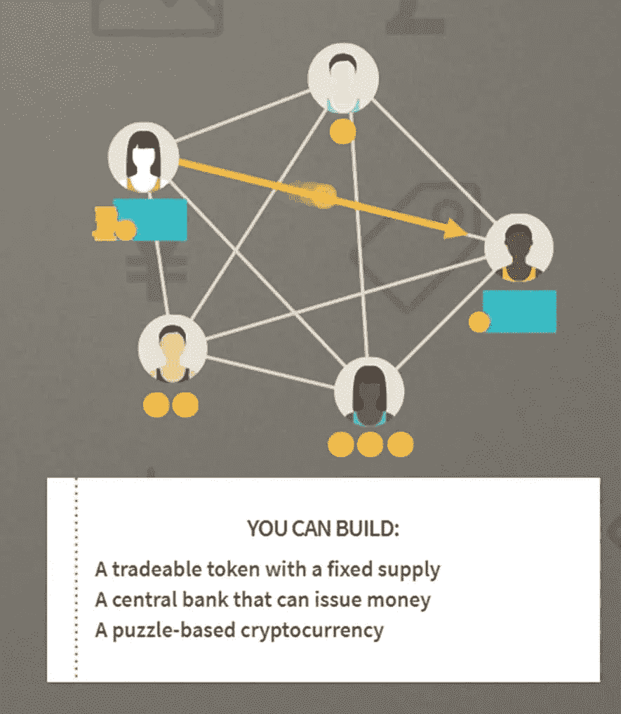
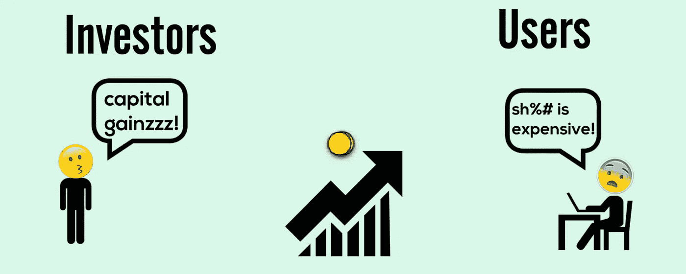
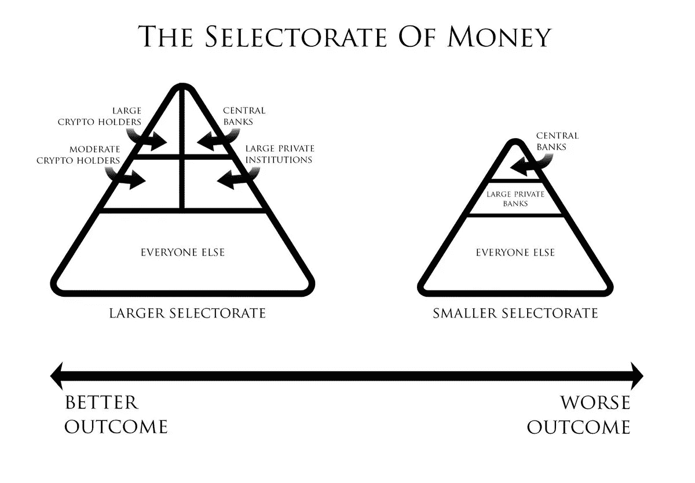
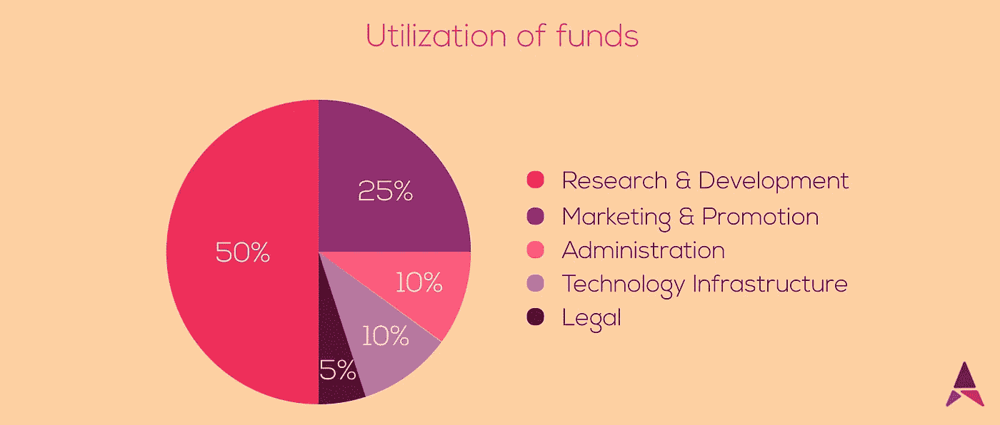

# 什么是记号组学，它如何成就或破坏你的记号

> 原文：<https://medium.com/coinmonks/what-is-tokenomics-and-how-it-can-make-or-break-your-ico-52484c861663?source=collection_archive---------3----------------------->

Source: Medium.com

想象你是一个小国的统治者。你们国家的所有居民都使用物物交换系统来交易商品和服务。现在你发现易货是一个繁琐的过程，原因如下:

● **需求的双重重合** —如果公民 A 想买布，但生产小麦，那么 A 需要找一个做的正好相反的人。这种寻找对应方的需求被称为想要的双重重合。这对你这个统治者来说是不可取的，因为这会减缓贸易。

> [发现并回顾最佳区块链软件](https://coincodecap.com)

● **货物证明**——除非 A 带着他的小麦袋去市场，否则他无法用它们来交换成包的布。这也是不可取的，因为它造成了不必要的市场混乱，并阻碍了贸易。

> 那么，你会怎么做？

要是有一种象征物能起到展示某种特殊价值的作用就好了。

# 幸运的是，你是统治者，你颁布法令，你将发行不同大小的“硬币”,代表不同的价值。

现在，A 只需用相应价值的硬币付款就能买到布料。但问题来了，你如何着手给你的臣民分发硬币。

Source: Chipin

你突然想到让你的臣民为你挖掘运河，作为交换，你会给他们硬币。一旦足够数量的硬币到达人们手中，他们开始回到他们早期的职业，使用硬币进行交易。你甚至可以给他们一些硬币来帮助他们开始交易。

> 这本质上是**记号经济学**。

## 如何和为什么在一个生态系统中实施代币，使得人们可以使用它在该生态系统中交换商品和服务，这被称为“代币组学”。

来到秘密世界，代币是生态系统的“硬币”。每一家构建基于区块链的产品的公司也构建了一个令牌，可用于促进其生态系统边界内的交易。

# 什么是好的代币

以一种激励人们使用令牌的方式来构建令牌，与实施 ICO 本身一样重要。除此之外，下面列举的几个其他因素也需要正确实施，以实现围绕令牌的使用开发生态系统的目标。

> 精心设计的令牌:

●在生态系统中具有效用

●抵御通胀压力

●可扩展/教派化

●是价值储存手段

●可替代

●被大多数人接受

●在交易所交易

●必须激励其使用

那么，我们如何着手为我们的 ICO 构建一个令牌呢？

# 为什么过度思考可能不是一件坏事

构建令牌的第一步是找出将由令牌交换促进的交易。例如，如果我们正在构建一个视频流解决方案，我们有两个选择。我们可以**标记化**登录结构，用户支付标记来登录平台，或者我们可以标记使用，用户支付标记来观看内容。

Source: HackerNoon

现在，标记登录结构看起来似乎是一种简单的方法，但是它阻碍了那些比其他上传者获得更多交互的上传者。因此，在这种情况下，**将用法**标记化是正确的做法。

> 甚至 YouTube 也根据观看内容的用户数量向上传者付费。

其次，由于代币代表生态系统的总价值，因此建议保留一定比例的代币，用于系统维护、法律费用和支付平台顾问的费用。

Source: ThreadReader App

这需要一个**微妙的平衡**就好像你保留了太多的代币，可能就没有足够的代币来帮助建立一个繁荣的生态系统。这可以通过一个真实世界的例子来理解。

> 如果政府征收过高的税，公民将没有足够的资金来购买他们的需求，工业将没有人有能力购买。

第三，这些代币基本上是一串字符，比重新印刷纸币更容易复制。因此，如果代币的开发者不对将要出现的代币的数量保持一个具体限定的上限，他们将面临通货膨胀随着时间的推移而侵蚀代币价值的困境。

> 对代币数量的硬性限制也有助于随着使用量的增加而提高代币的价值。

第四，有多个利益相关者参与代币的开发，他们都需要激励。在所有给定的水平上，目标是激励交易而不是囤积代币。由于代币经济学是基于一个永久的通货紧缩周期，代币有被那些期待其升值的人囤积的风险。

> 当大量囤积时，这些代币就无法用于交易，经济就会崩溃。

第五，衡量代币实力的一个很好的基准是其在多个加密货币交易所的上市情况。一些最常见的加密货币交易所是 bittrex、币安、coinbase 和 bitfinex。

> 当一个代币在多个交易所上市时，它就向人们发出了一个信号，即代币是以其公平的市场价格估值的，而不是作为一个肮脏的浮动进行管理。

# 行业衍生标准

鉴于加密领域普遍缺乏监管标准，社区本身已经基于严格的试错机制提出了几个**自我强加的标准**。对一家公司有效的方法不一定对所有公司都有效，因为一般来说，一刀切的方法是密码领域所反对的。这意味着这些标准更像是在大部分时间里经过试验和测试并取得积极成果的指导方针。

Source: BitcoinTalk

> 这些准则是:

●**1 亿代币的总限额** —人们已经看到，代币数量保持过高会增加通胀压力，而保持过低则会增加通缩压力。尽管这一想法是为了让经济保持轻微通缩，但任何超出足够水平的举措都会开始刺激囤积而非交易。我们希望令牌以这样一种方式实现，即一般用户最好使用这些令牌，而不是持有和推测它们。

● **为创始人保留 15-20%的代币**——因为创始人做了所有的艰苦工作来创建代币并实现它，所以他们被授予一部分代币作为汗水权益是公平的。它还有另一个鲜为人知的目的。它向所有人传达了一个信息。当创始人为自己保留一部分代币时，他们将自己的财富与代币在市场上的表现联系在一起。这给用户灌输了信心，创始人将继续在 ICO 之外的项目上工作。此外，为创始人保留的代币也不允许在 ICO 日期后的 2-5 年内出售。

● **预留 5%的代币用于法律费用等。**——在大多数司法管辖区，加密空间基本上不受监管。这意味着立法监督正在进行中，最好请律师并尽可能保持法律的清晰性。它还为一般用户提供了一种建立信任的机制，确保他们所投资的项目得到法律支持。

● **保留 10-15%用于平台的维护** —所有开发者都面临着在最低可行产品和追求完美之间做出选择的困境。因此，所有的产品，不仅仅是密码领域的产品，都需要持续的维护活动和定期的升级。它还需要及时的错误修复和补丁，这可能会使用户处于危险之中。

● **为奖金项目预留 5%**—尽管打造了最好的产品，但推动销售和消费者参与的是营销。外联范围越广，受众就越广。因此，赏金计划旨在将**股份**授予媒体影响者，以换取对产品的转发、在 BitcoinTalk 等主要出版物上对产品的评论，甚至将白皮书翻译成不同语言。奖金计划也是奖励利益相关者的一个来源，就像我们描述的例子中国王要求他的臣民挖运河一样。

● **待售的 50-60%代币分批出售，而不是一次性出售**——这是任何代币组学中最重要的部分。这里的目的是通过各种机构和个人筹集资金。拥有更多持有较少代币的投资者比拥有较少持有较多代币的投资者更好。这是因为较高的贸易量是象征性健康的重要标志。为此，tokensales 被交错成更小的块。有一个私人销售部分，代币只提供给经过预先审查的投资者。另一块是预售部分，以折扣价发售代币来吸引更多投资者。最后，进行实际的令牌销售(在某些管辖区称为 ICO ),这也被分解为更小的可管理的块，在一个月的时间内交错进行。

● **更喜欢做一个 ERC20 令牌**——‘T8’ERC 代表“**以太坊征求意见**”。这是一个提议改进以太网的官方协议。“20”是唯一的提案 ID 号。ERC20 基本上是一种协议，表示令牌可以在以太坊上进行交换。遵循 ERC20 结构允许令牌是唯一的，也是标准化的。

Source: Tutellus

# 结论

令牌的令牌组学设计基于**用途、可用性和价值**三方面。如何在这三个组件之间分配效用是令牌开发者的特权。虽然人们可以以牺牲其他方面为代价来优先考虑三个方面中的一个方面，但应该是严格的商业知识和经验来指导分配。

