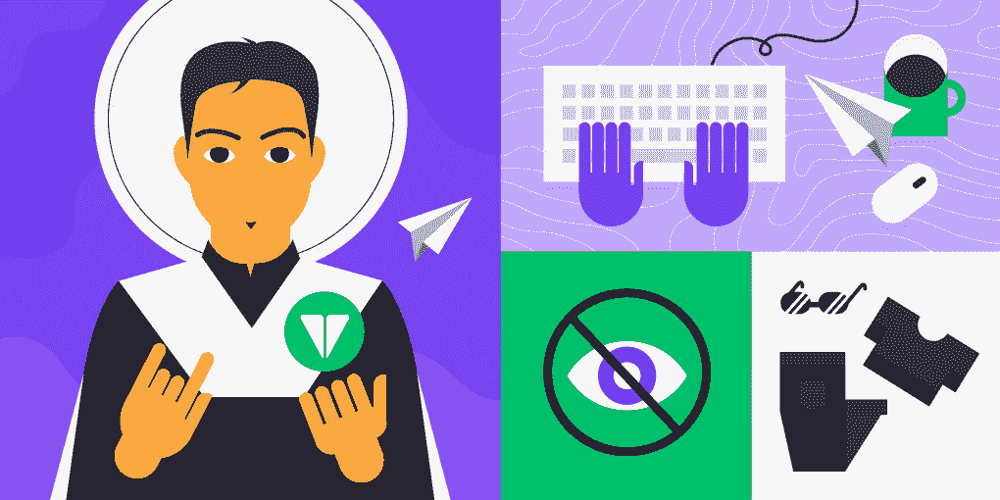
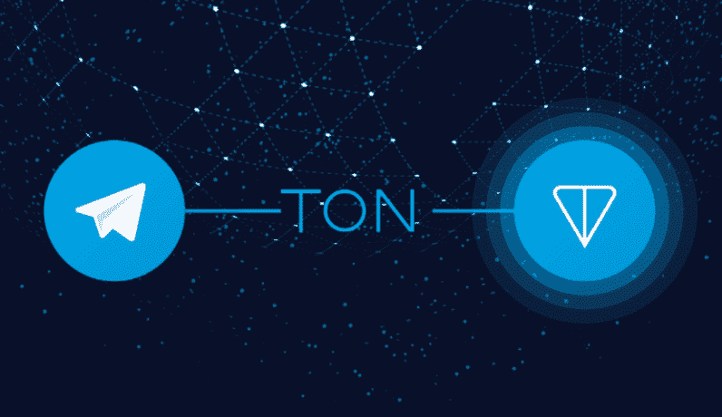
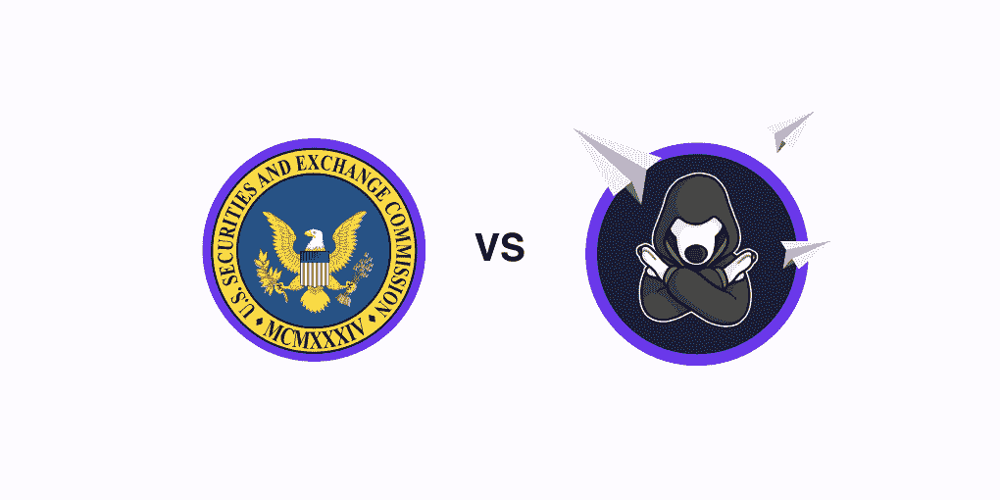

# 什么是吨，现在在哪里？电报开放网络及其创始人的故事

> 原文：<https://medium.com/coinmonks/what-is-ton-and-where-is-it-now-the-story-of-telegram-open-network-and-its-founder-59242d5028b?source=collection_archive---------4----------------------->

还记得 2020 年最雄心勃勃的区块链项目之一 TON 吗？由拥有 5 亿用户的信使 Telegram 的创始人帕维尔·杜罗夫发起的那个？在与 SEC 发生冲突后，该项目陷入了困境，独立的 Free TON 启动了，此后没有太多消息出现。托尼今天怎么了？我们将看看它，回忆一下 TON 的故事，并讨论帕维尔·杜罗夫是谁，是什么心态使他产生了创建一个独立于国家的消息传递和价值交换平台的想法。

# 互联网图腾

帕维尔·杜罗夫是俄罗斯商人、开发商和梦想家。2006 年，他推出了 VK——俄罗斯最大的社交网络，有时被称为“俄罗斯的脸书”，并在 10 年内创建了 Telegram——一个每月活跃用户超过 5 亿的私人信使。

正如杜罗夫曾经说过的，他很幸运，很年轻就变得富有。然而，这并不是一条容易的路——当警察在 2014 年的抗议活动中敲他的门时，杜罗夫不得不逃离这个国家，放弃 VK，继续从事 Telegram 的工作。优秀的 messenger 用户群来自圣基茨和尼维斯，这个国家的公民身份在俄罗斯人中很受欢迎，因为它允许无需签证就可以去世界上几乎任何地方。

当杜罗夫在学校毕业时被问及他想成为谁时，他说:“我想成为一个互联网图腾。”当时没人想到这个主意，但这就是它最终的结局。

# 尼奥的早期

杜罗夫 1984 年出生在列宁格勒(当时圣彼得堡就是这么叫的)。Pavel 在 11 岁时开始创作他的第一个游戏——那时他意识到自己对编程的兴趣。

在俄罗斯国内外各名校就读后，进入圣彼得堡国立大学英语语言文字与翻译系。在那里，杜罗夫展示了高度的智慧和领导素质。

你可能不知道，还有一个杜罗夫。帕维尔的哥哥尼古拉更注重隐私，但有些人认为他更聪明。Nikolay 过去和现在都负责 VK、Telegram 和 TON 的核心技术基础设施(直到 2020 年)。

俄罗斯使用最多的社交媒体 VK 成立于 2006 年。从概念上讲，它源于 durov.com——一个学生备考数据库。那里的每个人都躲在昵称后面。当杜罗夫的一个朋友从美国回来，告诉帕维尔关于脸书的事情时，图腾意识到这是一个机会——VK 就是这样出现的，一个在当时被认为具有革命性的实名平台。它最初因与脸书相似而受到批评；然而，许多年后，VK 展示了一个比美国同类产品更轻便和直观的界面。截至 2021 年，脸书的受欢迎程度是 VK 的两倍。

自始至终，杜罗夫都在从大众文化中汲取灵感。“黑客帝国”电影已经成为他的标志性作品——尼奥在数字世界中对抗系统，并保持头脑的纯净。看起来他们只是外表相似——然而，当我们了解接下来发生的事情时，我们会意识到“自由战士”不仅仅是一个隐喻。

# 逃离俄罗斯。电报创作

2011 年，俄罗斯爆发了抗议运动，有一天，杜罗夫发现武装人员在他的门前要求关闭一个反对派领导人的账户。帕维尔拒绝了，并向公众报告了这一案件，随后 VK 获得了大众的支持。

2014 年，乌克兰爆发抗议活动后，警察再次敲他的门。他们的要求是一样的，但这一次，杜罗夫的强烈抗议无济于事，他最终不得不卖掉他在 VK 的股份，逃离这个国家。

到那时，他确实有新的工作要做。作为 VK 的首席执行官，杜罗夫创建了数字堡垒公司，位于布法罗的服务器可以容纳 VK 所有的⅓流量。2013 年，帕维尔披露了它们的用途——私人信使电报。

Telegram 因其用户友好性和遵守隐私承诺，在没有任何积极营销的情况下迅速风靡全球。在这次成功之后，该团队宣布了另一个世界规模的雄心勃勃的项目，TON。

# TON，数字自由主义的平台

TON 是一个区块链平台，本应建立在 Telegram 之上。它的目的是让它的 4 亿用户能够在没有任何政府影响的情况下通过 Gram token 进行价值交换。TON 将允许每秒一百万次交易；包括帕维尔在 VK 的老朋友在内的世界顶尖工程师都在为此而努力。在审查严格的国家，TON 允许自由的价值和内容交换。

2018 年，TON 从投资者那里筹集了令人震惊的 17 亿美元。它的 mainnet 本应在 2019 年推出，而这正是团队开始推迟它的时候。首先是由于“发展的创新性”，但最终很明显，这个梦想是不会实现的。

# 吨与秒

当 TON devs 正在制定计划时，SEC 没有睡觉。它在看，他们不喜欢他们所看到的。2019 年 10 月，对出售克代币实施紧急限制令。

“我们声称，被告未能向投资者提供证券法要求的有关 Grams and Telegram 的业务运营、财务状况、风险因素和管理的信息。”SEC 说。换句话说，当局声称克不应该作为代币出售，而是作为证券出售，所以 TON 欺骗了投资者。

2020 年 5 月 12 日，杜罗夫关闭了该项目。他解释了为什么这个决定是荒谬的，指出了全世界对美国法院判决的依赖(Gram 在全球范围内被禁止)。杜罗夫祝所有为分散世界而战的人好运。

# 现在怎么办？

TON 关闭了，但是围绕这个项目的开发人员社区已经形成了。他们在 2020 年 5 月推出了 Free TON，强调该项目独立于其初衷。然而，Free TON 是基于相同的代码构建的:它的交易时间不到一秒，支持智能合约、治理和赌注。具有主链、工作链和共享链的多级结构在测试中显示了每秒数万次交易的能力，理论上高达一百万次。实现了分散的文件存储。

然而，所有这些都无法与 5 亿电报用户群相结合，而这正是 TON 的关键理念。Free TON 没有显示出投资者的兴趣，目前，克水晶令牌在 Coinmarketcap 的列表中排名第三千位。

帕维尔·杜罗夫继续他的电报工作。最近，他通过出售债券筹集了 10 亿美元，用于 Telegram 的发展和偿还 TON 投资者，其中一些投资者[在 2021 年 5 月对 Telegram 提起了](https://www.coindesk.com/investors-in-failed-ton-project-sue-telegram)诉讼。

# 电讯报。秘密党员

TON 从未推出，但 crypto 以加密机器人的形式在 Telegram 中找到了自己的位置。他们中的一些人是这样做的:

*   [Bitzlato](https://t.me/bitzlato) —一个用于 BTC、瑞士联邦理工学院、USDT、BCH、LTC 和 DASH 的加密交换机器人。
*   [Tracktxbot](https://t.me/tracktxbot) 追踪你以太坊地址上的交易，并在新的代币进入你的钱包时通知你。
*   在 ChangeNOW，我们也抓住了这个机会，创造了我们的 [ChangeNOW 官方机器人](https://t.me/ChangeNOW_officialbot)。在这里，你可以直接从口袋里兑换 200 多种加密货币，甚至不用访问 ChangeNOW 网站。欢迎点击了解更多[。](https://changenow.io/blog/exchange-messengers)

# 数字神童

2020 年 5 月，许多密码爱好者在得知 TON 无法成功后，感到他们的梦想破灭了。对许多认识杜罗夫的人来说，尼奥似乎在与体制的斗争中投降了。但这对我们来说应该是一个很好的教训:除了技术上的东西，在每一个风险中也有一个强大的法律方面，它可能会毁了这一切。这就是为什么当推出任何东西时，我们都应该事先想好。ChangeNOW 希望不会有更多雄心勃勃的加密项目在这样的事情上失败，能够与任何国家的当局找到共同点。

> 加入 [Coinmonks 电报频道](https://t.me/coincodecap)，了解加密交易和投资

## 另外，阅读

*   [尤霍德勒 vs 考尼洛 vs 霍德诺特](/coinmonks/youhodler-vs-coinloan-vs-hodlnaut-b1050acde55a) | [Cryptohopper vs 哈斯博特](https://blog.coincodecap.com/cryptohopper-vs-haasbot)
*   [币安 vs 北海巨妖](https://blog.coincodecap.com/binance-vs-kraken) | [美元成本平均交易机器人](https://blog.coincodecap.com/pionex-dca-bot)
*   [如何在印度购买比特币？](/coinmonks/buy-bitcoin-in-india-feb50ddfef94) | [WazirX 评论](/coinmonks/wazirx-review-5c811b074f5b) | [BitMEX 评论](https://blog.coincodecap.com/bitmex-review)
*   [比特币主根](https://blog.coincodecap.com/bitcoin-taproot) | [Bitso 点评](https://blog.coincodecap.com/bitso-review) | [排名前 6 的比特币信用卡](/coinmonks/bitcoin-credit-card-bc8ab6f377c6)
*   [双子座 vs 比特币基地](https://blog.coincodecap.com/gemini-vs-coinbase) | [比特币基地 vs 北海巨妖](https://blog.coincodecap.com/kraken-vs-coinbase) | [硬币罐 vs 硬币点](https://blog.coincodecap.com/coinspot-vs-coinjar)
*   [印度比特币交易所](/coinmonks/bitcoin-exchange-in-india-7f1fe79715c9) | [比特币储蓄账户](/coinmonks/bitcoin-savings-account-e65b13f92451) | [Paxful 点评](/coinmonks/paxful-review-4daf2354ab70)
*   [杠杆令牌](/coinmonks/leveraged-token-3f5257808b22) | [最佳密码交易所](/coinmonks/crypto-exchange-dd2f9d6f3769) | [密码交易机器人](https://blog.coincodecap.com/best-crypto-trading-bots)
*   [Godex.io 审核](/coinmonks/godex-io-review-7366086519fb) | [邀请审核](/coinmonks/invity-review-70f3030c0502) | [BitForex 审核](/coinmonks/bitforex-review-c4bb28d9e271) | [HitBTC 审核](/coinmonks/hitbtc-review-c5143c5d53c2)
*   [Crypto.com 费用](/coinmonks/binance-fees-8588ec17965) | [Botcrypto 审查](/coinmonks/botcrypto-review-2021-build-your-own-trading-bot-coincodecap-6b8332d736c7) | [替代方案](https://blog.coincodecap.com/crypto-com-alternatives)
*   [MXC 交易所评论](/coinmonks/mxc-exchange-review-3af0ec1cba8c) | [Pionex vs 币安](https://blog.coincodecap.com/pionex-vs-binance) | [Pionex 套利机器人](https://blog.coincodecap.com/pionex-arbitrage-bot)
*   [我的密码交易经验](/coinmonks/my-experience-with-crypto-copy-trading-d6feb2ce3ac5) | [比特币基地评论](/coinmonks/coinbase-review-6ef4e0f56064)
*   [加密货币储蓄账户](/coinmonks/cryptocurrency-savings-accounts-be3bc0feffbf) | [赌注加密](https://blog.coincodecap.com/staking-crypto)
*   [BigONE 交易所评论](/coinmonks/bigone-exchange-review-64705d85a1d4) | [CEX。IO 审查](https://blog.coincodecap.com/cex-io-review)
*   [最佳比特币保证金交易](/coinmonks/bitcoin-margin-trading-exchange-bcbfcbf7b8e3) | [Bityard 保证金交易](https://blog.coincodecap.com/bityard-margin-trading) | [Prokey 点评](/coinmonks/prokey-review-26611173c13c)
*   [加密保证金交易交易所](/coinmonks/crypto-margin-trading-exchanges-428b1f7ad108) | [赚取比特币](/coinmonks/earn-bitcoin-6e8bd3c592d9) | [Mudrex 投资](https://blog.coincodecap.com/mudrex-invest-review-the-best-way-to-invest-in-crypto)
*   [WazirX vs CoinDCX vs bit bns](/coinmonks/wazirx-vs-coindcx-vs-bitbns-149f4f19a2f1)|[block fi vs coin loan vs Nexo](/coinmonks/blockfi-vs-coinloan-vs-nexo-cb624635230d)
*   [BlockFi 信用卡](https://blog.coincodecap.com/blockfi-credit-card) | [如何在币安购买比特币](https://blog.coincodecap.com/buy-bitcoin-binance) | [网格交易机器人](https://blog.coincodecap.com/grid-trading)
*   [加密复制交易平台](/coinmonks/top-10-crypto-copy-trading-platforms-for-beginners-d0c37c7d698c) | [五大 BlockFi 替代品](https://blog.coincodecap.com/blockfi-alternatives)
*   【Crypto.com 评论】|[|](/coinmonks/crypto-com-review-f143dca1f74c)|[信用交易](/coinmonks/huobi-margin-trading-b3b06cdc1519)
*   [顶级付费加密货币和区块链课程](https://blog.coincodecap.com/blockchain-courses) | [币安评论](/coinmonks/binance-review-ee10d3bf3b6e)
*   [在美国如何使用 BitMEX？](https://blog.coincodecap.com/use-bitmex-in-usa) | [BitMEX 回顾](https://blog.coincodecap.com/bitmex-review) | [币安 vs Bittrex](https://blog.coincodecap.com/binance-vs-bittrex)
*   [最佳免费加密信号](https://blog.coincodecap.com/free-crypto-signals) | [YoBit 评论](/coinmonks/yobit-review-175464162c62) | [Bitbns 评论](/coinmonks/bitbns-review-38256a07e161) | [OKEx 评论](/coinmonks/okex-review-6b369304110f)
*   [比特币基地赌注](https://blog.coincodecap.com/coinbase-staking) | [热点评论](/coinmonks/hotbit-review-cd5bec41dafb) | [库币评论](https://blog.coincodecap.com/kucoin-review) | [期货交易机器人](/coinmonks/futures-trading-bots-5a282ccee3f5)
*   [最佳加密交易信号电报](/coinmonks/best-crypto-signals-telegram-5785cdbc4b2b) | [MoonXBT 评论](/coinmonks/moonxbt-review-6e4ab26d037)