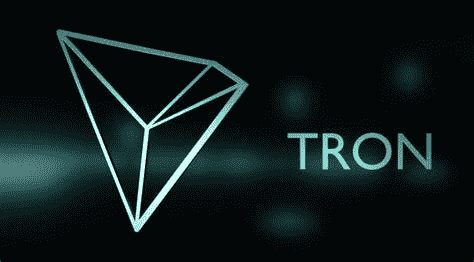

# 创是什么——一种虚拟货币，还是有更多的含义？

> 原文：<https://medium.com/coinmonks/what-is-tron-a-virtual-currency-or-is-there-more-to-it-1bfc64bd7c93?source=collection_archive---------2----------------------->

Tron 是一个基于区块链的操作系统，允许你创建分散的应用程序和共享媒体内容。TRX 令牌本身用于访问操作软件的某些功能。因此，令牌的主要目的是在 TRON 网络中使用。然而，它仍然是一种价值储存手段，可以在交易所交易，这就是为什么 TRX 也可以…