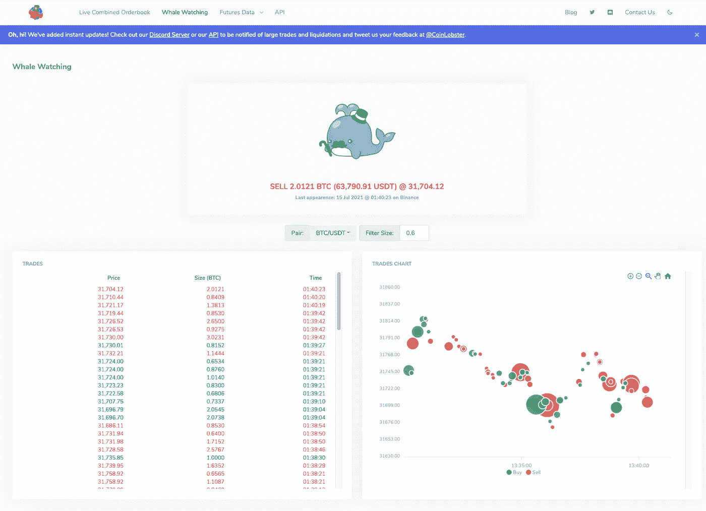

# 什么是观鲸，2021 年如何追踪比特币鲸鱼

> 原文：<https://medium.com/coinmonks/what-is-whale-watching-and-how-to-track-bitcoin-whales-in-2021-199b5ddc8c4?source=collection_archive---------0----------------------->

# **什么是比特币或加密货币鲸鱼？**

鲸鱼是指任何拥有足够资金和权力来直接影响加密货币或股票价格的个人或公司，通常是以负面方式。想想鲸鱼和它们庞大的身躯。大型加密货币持有者被称为鲸鱼，因为他们的运动扰乱了小鱼游泳的水域。

> 根据[每日电讯报](https://www.telegraph.co.uk/technology/2021/01/22/weird-world-bitcoin-whales-2500-people-control-40pc-market/)的行业数据，约 13%的比特币，或约 800 亿美元，存在 100 多个个人账户中。

它补充说，所有比特币的前 40%(约 2400 亿美元)由总共约 1 亿个账户中不到 2500 个已知账户持有。

及早发现鲸鱼可以让小交易者顺其自然，和鲸鱼一起获利，也可以避免被鲸鱼压死，蒙受损失。

## **要识别鲸鱼，可以**

1.  监控最大持有者以及交易所钱包的钱包地址，以保持对加密货币任何重大变化的警惕。
2.  监控订单簿。如果你突然看到大于正常的购买订单，可能有一只鲸鱼在玩。当然，比平常更大的卖单也是如此。
3.  监控与任何重大项目公告或影响市场的新闻无关的特定加密货币的市值变化。
4.  监控交易所的交易。

## 订单簿移动如此之快，我该如何观察？

传统上，你必须去主要的交易所，如币安、比特墨西哥、北海巨妖、比特币基地等。查看最近大宗交易的交易记录。任何过大的订单都可能告诉你市场如何变化的信息。

不断检查页面是一个非常乏味和困难的过程，因为有时交易发生得如此之快，以至于你无法用眼睛看到。大多数交易所也不允许你过滤实时交易信息。

CoinLobster 以一种简单的方式给出了一些关于聪明的钱在做什么的答案！

# **用龙虾成功观鲸的无压力方式**

我们想帮助小的零售交易者对抗鲸鱼和杂乱信息的世界。所以我们为你做了一个简单的网站来监控重要的信息。

我们的 [CoinLobster 鲸鱼观察仪表盘](https://coinlobster.com/whale-watch)可以让你看到主要现货交易所大宗交易的实时数据。**默认情况下，过滤器的设置是平均交易规模的一个大倍数，这样你就可以随时知道鲸鱼何时买入或卖出。**

## [CoinLobster 观鲸仪表盘](https://coinlobster.com/whale-watch)

[https://coinlobster.com/whale-watch](https://coinlobster.com/whale-watch)

## 实时订单簿

[CoinLobster 的](https://coinlobster.com/whale-watch)低延迟组合实时订单簿显示了所有的鲸鱼交易。你也可以在订单簿中看到历史上的大宗交易。

我们很想听听您对我们如何做得更好的想法！请快速回复此邮件或通过 [Twitter](https://twitter.com/@CoinLobster) 和 Discord 联系我们，让我们知道您的想法。

永远是你的，
你值得信赖的隐形甲壳动物
CoinLobster

## 什么是 CoinLobster？

CoinLobster 是一个实时的组合订单簿，交易和清算，显示比特币、以太坊和 DOGE 的交易量，跨 10 个现货和永久期货交易所。

你可以去 www.CoinLobster.com[拜访我们](http://www.CoinLobster.com)

> 加入 [Coinmonks 电报频道](https://t.me/coincodecap)，了解加密交易和投资

 [## 最佳加密交易所| 2021 年十大加密货币交易所

### 加密货币交易所的加密交易需要了解市场，这可以帮助你获得利润…

blog.coincodecap.com](https://blog.coincodecap.com/crypto-exchange)  [## 2021 年 9 大最佳加密借贷平台

### 当谈到加密货币贷款时，大量因素等同于良好的收入状况。此外，借款的一部分…

blog.coincodecap.com](https://blog.coincodecap.com/crypto-lending)  [## 2021 年最佳加密交易机器人(免费和付费)

### 2021 年币安、比特币基地、库币和其他密码交易所的最佳密码交易机器人。四进制，位间隙…

medium.com](/coinmonks/crypto-trading-bot-c2ffce8acb2a)